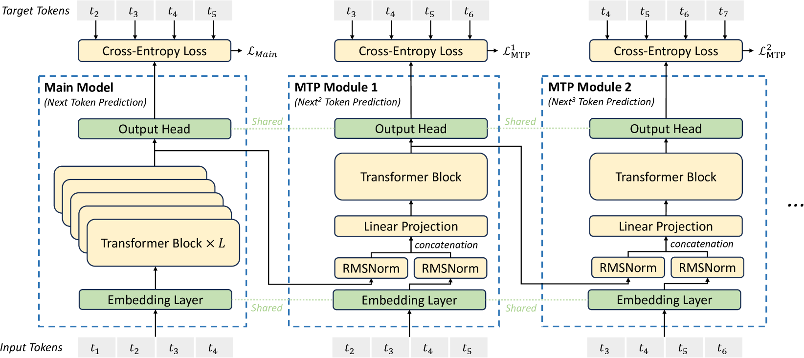

# DeepSeek

Generally speaking,

* DeepSeek V2 proposed most tech and algo innovations
* DeepSeek V3 pioneered some engineering implementations to utilize efficient GPU efficiently
* DeepSeek R1 added reasoning capability.

References:

* DeepSeek V2: https://arxiv.org/pdf/2405.04434
* DeepSeek V3: https://arxiv.org/pdf/2412.19437
* DeepSeek R1: https://arxiv.org/pdf/2501.12948

## DeepSeek V2

DeepSeek V2 major innovation contributions:

* Multi-Head Latent Attention (MLA)
* DeepSeekMoE Architecture

### Multi-Head Latent Attention (MLA)

Multi-Head Latent Attention (MLA) proposes low-rank key-value joint compression to reduce KV Cache memory.
DeepSeekV2 and DeepSeekV3 uses MLA.

Notice $K$ and $V$ memory consumption grows as context length grows.
The MLA attempts to compress the cached $K$ and $V$ with a low-rank joint compression matrix $C$.

#### Derive the compression matrix $C$

Let $\bold{h}_t\in\mathbb{R}^{d}$ be the input to an attention layer, where $d=n_h\times d_h$ is the embedding dimension in which $n_h$ is the number of attention heads, and $d_h$ is the dimension per head.

##### Preliminaries: Standard Multi-Head Attention

For standard multi-head attention, $\bold{q}_t, \bold{k}, \bold{v}_t$ are computed by linear projection from $\bold{h}_t$, and sliced into $n_h$ heads/blocks.

$$
\begin{align*}
    [\bold{q}_{t,1};\bold{q}_{t,2};...;\bold{q}_{t,n_h}]=\bold{q}_t=W^{Q}\bold{h}_t \\
    [\bold{k}_{t,1};\bold{k}_{t,2};...;\bold{k}_{t,n_h}]=\bold{k}_t=W^{K}\bold{h}_t \\
    [\bold{v}_{t,1};\bold{v}_{t,2};...;\bold{v}_{t,n_h}]=\bold{v}_t=W^{V}\bold{h}_t \\
\end{align*}
$$

The sliced $\bold{q}_t, \bold{k}, \bold{v}_t$ are used for the multi-head attention computation.

$$
\begin{align*}
    \bold{o}_{t,i} &= \sum_{j=1}^{t} \text{softmax}_j\Big(\frac{\bold{q}^{\top}_{t,i}\bold{k}_{j,i}}{\sqrt{d_h}}\Big)\bold{v}_{j,i} \\
    \bold{o}_{t} &= W^{O}[\bold{o}_{t,1};\bold{o}_{t,2};...;\bold{o}_{t,n_h}]
\end{align*}
$$

where $[...]$ is a concatenation operator.

##### Add Compression Cache Matrices

Add a down-projection matrix $W^{\text{Down-}KV}$ to generate the KV cache $\bold{c}_t^{KV}$, by which add two up-projection matrices to restore $K$ by $W^{\text{up-}K}$ and $V$ by $W^{\text{up-}V}$ to full multi-head dimension: $\bold{k}_t^{C},\bold{v}_t^{C}\in\mathbb{R}^{n_h d_h}$.

During inference, MLA only needs to cache $\bold{c}_t^{KV}$.

$$
\begin{align*}
    \bold{c}_t^{KV} &= W^{\text{Down-}KV}\bold{h}_t \\
    \bold{k}_t^{C} &= W^{\text{Up-}K}\bold{c}_t^{KV} \\
    \bold{v}_t^{C} &= W^{\text{Up-}V}\bold{c}_t^{KV} \\
\end{align*}
$$

where $\bold{c}_t^{KV}\in\mathbb{R}^{d_c}$ is the compressed latent vector for keys and values such that $d_c\ll d_h n_h$.
This shows that the token cache $\bold{c}_t^{KV}$ compresses the token's multi-head vectors into a small encoding.

$W^{\text{Up-}K}, W^{\text{Up-}V} \in\mathbb{R}^{d_h n_h \times d_c}$ restore the key $K$ and value $V$ to full dimension $d=d_h \times n_h$.

Also perform low-rank compression for the queries (this is for training):

$$
\begin{align*}
    \bold{c}_t^{Q} &= W^{\text{Down-}Q}\bold{h}_t \\
    \bold{q}_t^{C} &= W^{\text{Up-}Q}\bold{c}_t^{Q} \\
\end{align*}
$$

#### Decoupled Rotary Position Embedding (RoPE) for KV Restoration

Empirical study by DeepSeek found high importance of positional info, considered $\text{RoPE}$ be introduced.

RoPE is position-sensitive for both keys and queries, that only $Q$ and $K$ are applied RoPE.

$$
\begin{align*}
    [\bold{q}_{t,1}^{\text{Ro}};\bold{q}_{t,2}^{\text{Ro}};...;\bold{q}_{t,n_h}^{\text{Ro}}]=\bold{q}_{t}^{\text{Ro}}=\text{RoPE}(W^{\text{Ro-}Q}\bold{c}_t^Q) \\
    \bold{k}_{t}^{\text{Ro}}=\text{RoPE}(W^{\text{Ro-}K}\bold{h}_t) \\
\end{align*}
$$

Accordingly, the $Q$ and $K$ are

$$
\begin{align*}
    \bold{q}_{t,i}=[\bold{q}_{t,i}^{\text{C}};\bold{q}_{t,i}^{\text{Ro}}] \\
    \bold{k}_{t,i}=[\bold{k}_{t,i}^{\text{C}};\bold{k}_{t}^{\text{Ro}}] \\
\end{align*}
$$

Notice here $\bold{k}_{t,i}=[\bold{k}_{t,i}^{\text{C}};\bold{k}_{t}^{\text{Ro}}]$ for each token key head $\bold{k}_{t,i}$ share the same key $\bold{k}_{t}^{\text{Ro}}$.

##### Motivation: The non-commutative RoPE

Recall the $QK^{\top}$ definition that for the attention score of the token $t$, it can be decomposed into $\Big(W^{Q}\bold{h}_t\Big)\Big(W^{K}\bold{h}_t\Big)^{\top}$.

Then introduce compression, there is $\Big(W^{Q}\bold{h}_t\Big)\Big(W^{\text{Up-}KV}W^{\text{Down-}KV}\bold{h}_t\Big)^{\top}$.
Recall that $\bold{c}_t^{KV}=W^{\text{Down-}KV}\bold{h}_t\in\mathbb{R}^{d_c}$ is quite small in dimension length compared to the full dimension multiplication $W^{\text{Up-}KV}W^{\text{Down-}KV}\bold{h}_t\in\mathbb{R}^{d}$, it can be arranged that $W^{Q}{(W^{\text{Up-}KV})}^{\top}\bold{h}_t$ be absorbed together in matrix multiplication to reduce memory footprint.

$$
\underbrace{\Big(W^{Q}\bold{h}_t\Big)}_{\bold{q}_t\in\mathbb{R}^{d}}\Big(W^{\text{Up-}KV}W^{\text{Down-}KV}\bold{h}_t\Big)^{\top}
\quad\Rightarrow\quad \underbrace{\Big(W^{Q}{(W^{\text{Up-}KV})}^{\top}\bold{h}_t\Big)}_{\bold{q}_t\in\mathbb{R}^{d_c}} \Big(W^{\text{Down-}KV}\bold{h}_t\Big)^{\top}
$$

However, if added RoPE, the above linear matrix multiplication does not hold for matrix multiplication does not follow commutative rules.

Introduce RoPE to keys: $\Big(W^{Q}\bold{h}_t\Big)\Big(\text{RoPE}\big(W^{\text{Up-}KV}W^{\text{Down-}KV}\bold{h}_t\big)\Big)^{\top}$.

But RoPE cannot commute with $W^{\text{Up-}KV}$:

$$
\Big(W^{Q}\bold{h}_t\Big)\Big(\text{RoPE}\big(W^{\text{Up-}KV}...\big)\Big)^{\top}
\quad\not\Rightarrow\quad \Big(W^{Q}\big(\text{RoPE} \cdot W^{\text{Up-}KV}\big)^{\top}\bold{h}_t\Big)\Big(...\Big)^{\top}
$$

##### Solution: Decoupled RoPE to query and key

The solution is to decouple RoPE by adding additional multi-head queries $\bold{q}_{t,i}^{\text{Ro}}\in\mathbb{R}^{d^{\text{Ro}}_h}$ and a shared key $\bold{k}_{t}^{\text{Ro}}\in\mathbb{R}^{d^{\text{Ro}}_h}$ to carry RoPE.

Introduce $W^{\text{Ro-}Q}\in\mathbb{R}^{d^{\text{Ro}}_hn_h\times d_c^Q}$ and $W^{\text{Ro-}K}\in\mathbb{R}^{d^{\text{Ro}}_h\times d}$

$$
\begin{align*}
    [\bold{q}_{t,1}^{\text{Ro}};\bold{q}_{t,2}^{\text{Ro}};...;\bold{q}_{t,n_h}^{\text{Ro}}]=\bold{q}_{t}^{\text{Ro}}=\text{RoPE}(W^{\text{Ro-}Q}\bold{c}_t^Q) \\
    \bold{k}_{t}^{\text{Ro}}=\text{RoPE}(W^{\text{Ro-}K}\bold{h}_t) \\
\end{align*}
$$

Accordingly, the $Q$ and $K$ are

$$
\begin{align*}
    \bold{q}_{t,i}=[\bold{q}_{t,i}^{\text{C}};\bold{q}_{t,i}^{\text{Ro}}] \\
    \bold{k}_{t,i}=[\bold{k}_{t,i}^{\text{C}};\bold{k}_{t}^{\text{Ro}}] \\
\end{align*}
$$

Let $l$ be history output token number, MLA requires a total KV cache containing $(d_c+d^{\text{Ro}}_h)l$ elements.

#### Final: Combine the Cache and RoPE

For each token, the attention is

$$
\begin{align*}
    \bold{q}_{t,i} &=[\bold{q}_{t,i}^{\text{C}};\bold{q}_{t,i}^{\text{Ro}}] \\
    \bold{k}_{t,i} &=[\bold{k}_{t,i}^{\text{C}};\bold{k}_{t}^{\text{Ro}}] \\
    \bold{o}_{t,i} &= \sum_{j=1}^{t} \text{softmax}_j\Big(\frac{\bold{q}^{\top}_{t,i}\bold{k}_{j,i}}{\sqrt{d_h+d^{\text{Ro}}_h}}\Big)\bold{v}_{j,i}^C \\
    \bold{o}_{t} &= W^{O}[\bold{o}_{t,1};\bold{o}_{t,2};...;\bold{o}_{t,n_h}]
\end{align*}
$$

DeepSeek sets

* number of attention heads $n_h=128$
* per-head dimension $d_h=128$
* KV compression dimension $\bold{c}_t^{KV}\in\mathbb{R}^{512}$, or $d_c=4d_h$
* query compression dimension $\bold{c}_t^{Q}\in\mathbb{R}^{1536}$
* decoupled query and key  per-head dimension $\bold{q}_{t,i}^{\text{Ro}},\bold{k}_{t,i}^{\text{Ro}}\in\mathbb{R}^{64}$, or $d^{\text{Ro}}_h=\frac{1}{2}d_h$

### DeepSeekMoE Architecture

In comparison to traditional MoEs,
DeepSeek employs two types of experts: shared $\text{FNN}_i^{(s)}$ and routed experts $\text{FNN}_i^{(r)}$,
where the routed experts are chosen by $g_{i,t}$ that is decided by top-K most-similar input $\bold{u}_t$ to the expert representative vector/centroid $\bold{e}_i$.

Let $\bold{u}_t$ be the $L$-th layer input, the next layer output $\bold{h}_t^{(L+1)}$ is computed by below:
residual + $N_s$ shared experts and $N_r$ routed experts.

$$
\begin{align*}
    \bold{h}_t^{(L+1)} &= \bold{u}_t+\sum^{N_s}_{i=1} \text{FNN}_i^{(s)}(\bold{u}_t)+\sum^{N_r}_ig_{i,t} \text{FNN}_i^{(r)}(\bold{u}_t) \\
    g_{i,t} &= \begin{cases}
        s_{i,t} & s_{i,t} \in \text{TopK}\big(\{s_{j,t} | 1 \le j \le N_r\}, K_r \big) \\
        0 & \text{otherwise}
    \end{cases} \\
    s_{i,t} &= \text{Softmax}_i(\bold{u}_t^{\top} \bold{e}_i)
\end{align*}
$$

where $K_r$ is the number of activated routed experts that $s_{i,t}$ could retain non-zero values only if they are top $K_r$ by $\text{Softmax}_i(\bold{u}_t^{\top} \bold{e}_i)$.
$\bold{e}_i$ is the learned centroid of the $i$-th routed expert in this $L$ layer.

DeepSeek V2 sets

* $\text{FFN}_i$ has a hidden dimension of $1536$.
* each MoE layer consisted of $2$ shared experts and $160$ routed experts

#### Device-Limited Routing

DeepSeekMoE ensures that the target experts of each token will be distributed on at most $M$ devices,
and the top-K selections happen only among experts on these $M$ devices.

Empirical study by DeepSeek said $M\ge 3$ is enough to give good results.
There are $D=8$ devices/groups $\{\mathcal{E}_1, \mathcal{E}_2, ..., \mathcal{E}_D\}$ for each layer, and the routed experts are uniformly deployed.

#### Auxiliary Loss for Expert/Device Load Balance

DeepSeek V2 proposes three kinds of auxiliary loss to learn routing strategies (how expert $\bold{e}_i$ be learned):

$$
\min_{\bold{e}_i} \big(
\mathcal{L}_{\text{expert-balance}}+\mathcal{L}_{\text{device-balance}}+\mathcal{L}_{\text{communication-balance}} \big)
$$

Let $\alpha_1, \alpha_2, \alpha_3$ be loss coefficients, $T$ be the number of tokens in a sequence.
DeepSeek-V2 sets $\alpha_1=0.003, \alpha_2=0.05, \alpha_3=0.02$.

##### Motivation: Load Imbalance

In traditional MoE models, homogeneous expert sizes can lead to skewed routing, where popular experts are overloaded.

A general remediation solution is penalizing experts overly received the routed tokens.
Recall Cauchy-Schwarz inequality that $\mathcal{L}_{\text{balance}}$ reaches it minimum when the two random variables $f_i$ and $p_i$ are equally distributed, indicating that each expert $\bold{e}_i$ has the same probability receiving the same number of tokens.

$$
\mathcal{L}_{\text{balance}}=\alpha\sum_{i=1}^{N_r} \big(f_i \cdot p_i \big)
$$

where

* $f_i$ Fraction of tokens routed to expert $\bold{e}_i$
* $p_i$ Average router probability for expert $\bold{e}_i$
* $\alpha$ Hyperparameter controlling the penalty strength

DeepSeek V2 applies/extends this concept to expert, device and communication levels.

##### Expert-Level Balance Loss

$\mathcal{L}_{\text{expert-balance}}$ ensures that each expert $\bold{e}_i$ receives the same amount of tokens.

$$
\mathcal{L}_{\text{expert-balance}}=
\alpha_1\sum_{i=1}^{N_r}\Big(
    \underbrace{\frac{N_r}{K_r T} \sum_{t=1}^{T}\mathcal{1}(t\text{ if selected expert } \bold{e}_i)}_{f_i}\Big) \cdot \Big(
    \underbrace{\frac{1}{T}\sum_{t=1}^{T}s_{i,t}}_{p_i} \Big)
$$

where $\mathcal{1}(\text{condition})=\begin{cases} 1 & \text{condition is true} \\ 0 & \text{condition is false} \end{cases}$ denotes the indicator function.

$\mathcal{1}(t\text{ if selected expert } \bold{e}_i)$ means that for an expert $\bold{e}_i$,
if it has equal opportunity as other experts to be selected, given the select action is from $N_r$ to pick up top $K_r$ experts,
this expert $\bold{e}_i$ as well as other experts have an even pick-up probability of
$\mu\big(\mathcal{1}(t\text{ if selected expert } \bold{e}_i)\big)\approx\frac{K_r}{N_r}$, where $\mu(...)$ is the mean of the argument.

Over a $T$ sequence of tokens, for each token there is $1\approx f_i=\frac{K_r}{N_r}\mathcal{1}(...)$.
If each expert has different opportunities of receiving tokens, then $f_i<1$.

$p_i$ is the mean attention score of input $\bold{u}_i$ vs expert $\bold{e}_i$.

##### Device-Level Balance Loss

$\mathcal{L}_{\text{device-balance}}$ ensures balanced computation across different devices.

To reach the goal, DeepSeek V2 partitions all routed experts into $D$ groups $\{\mathcal{E}_1, \mathcal{E}_2, ..., \mathcal{E}_D\}$, and each group is assigned a computation device.
$\frac{1}{|\mathcal{E}_i|}\sum_{j\in\mathcal{E}_i} (.)$ is the average group/device load.

$$
\mathcal{L}_{\text{device-balance}}=
\alpha_2\sum_{i=1}^{D}\Big(\frac{1}{|\mathcal{E}_i|}\sum_{j\in\mathcal{E}_i}f_i \Big)
\cdot \Big( \frac{1}{|\mathcal{E}_i|}\sum_{j\in\mathcal{E}_i} p_i \Big)
$$

##### Communication Balance Loss

$\mathcal{L}_{\text{communication-balance}}$ added $\mathcal{1}(t\text{ if selected device }\mathcal{E}_i)$ that encourages equally-spread computation across different devices $\mathcal{E}_i$.

$$
\mathcal{L}_{\text{communication-balance}}=
\alpha_3\sum_{i=1}^{D}\Big(
    \frac{D}{M T} \sum_{t=1}^{T}\mathcal{1}(t\text{ if selected device }\mathcal{E}_i)\Big) \cdot \Big(
    \sum_{j\in\mathcal{E}_i} p_i \Big)
$$

### Training Aggrangment

#### Data Preparation and Tokenization

DeepSeek V2 uses Byte-level Byte-Pair Encoding (BBPE) algorithm and has a vocabulary size of 100K.
The tokenized pretraining corpus contains 8.1T tokens, where Chinese tokens are approximately $12\%$ more than English ones.

#### Model Hyper-Parameters

* Number of Transformer Layers: $60$
* Transformer FFN Dimension: $5120$

#### Model Training Config

* AdamW optimizer: $\beta_1=0.9$ and $\beta_2=0.95$
* learning rate scheduling: warmup-and-step-decay strategy
* Batch size: adaptively set between $2304$ and $9216$
* Maximum sequence length: 4K

##### Warmup-and-Step-Decay strategy in Detail

1. Learning rate from $0$ to the maximum value $=2.4\times 10^{-4}$ during the first 2K steps
2. Keep the maximum learning rate till having trained $60\%$ of tokens
3. The learning rate is multiplied by $0.316$ after training about $60\%$ of tokens
4. The learning rate is again multiplied by $0.316$ after training about $90\%$ of tokens

#### Supervised Fine-Tuning (SFT) for Human Preference Alignment

To align to human preference, DeepSeek-V2 SFT includes

* 1.2M instances for helpfulness and 0.3M instances for safety
* SFT by 2 epochs
* Small learning of $5\times 10^{-6}$

### DeepSeek Reinforcement Learning and Reasoning

#### Reinforcement Learning Formulation

An agent's action selection is modeled as a map called *policy* $\pi$ to a probability $0 \le \pi(a,s) \le 1$ given a state $s$ and action $a$.

$$
\begin{align*}
\pi(a,s) = P(A_t = a | S_t = s)
\end{align*}
$$

The action-value ("Q-value", Quality) of a state-action pair is

$$
Q_{\pi}(s,a) = \mathbb{E}_{\pi}(G_t | \underbrace{S_{t} = s, A_{t} = a}_{\pi} )
$$

The state-value of a state $s$ is the expected return ("Value Function"), that is the "average result given different actions".

$$
\begin{align*}
V_{\pi}(s) &= \mathbb{E}_{\pi}(G_t | S_{t} = s) \\
      &= \sum_{a \in A} Q_{\pi}(s,a) \pi(a|s)
\end{align*}
$$

Set $\theta$ as the parameters that influence policy $\pi$, together denoted as $\pi_{\theta}(a|s)$.
The reward function to be maximized is defined as

$$
\mathcal{J}(\theta) = \sum_{s \in S} d_{\pi_{\theta}}(s) V_{\pi_{\theta}}(s)= \sum_{s \in S} d_{\pi_{\theta}}(s) \sum_{a \in A} Q_{\pi_{\theta}}(s,a) \pi_{\theta}(a|s)
$$

where $d_{\pi_{\theta}}(s) = \lim_{t \rightarrow \infty} \big(P(S_t=s | S_0, \pi_{\theta}) \big)^t$ is state stationary probability distribution.
$P$ is Markov chain transition probability matrix.

Markov Decision Processes: stationed on $S_t$ and take action $A_t$ generate a reward $R_t$ such that $\underbrace{S_1, A_1}_{\Rightarrow R_1} \rightarrow \underbrace{S_2, A_2}_{\Rightarrow R_2} \rightarrow ...$.
The goal is to $\max \mathcal{J}(\theta)$.

#### Proximal Policy Optimization (PPO)

PPO proposed two important ideas

* Advantage function $A(s,a)$ that focuses on action reward by taking away state info
* Ratio of policy $\gamma_t(\theta)$ to assign higher weights to good policy (old vs current)

Define an advantage function such that $A(s,a)=Q(s,a)-V(s)$. It can be considered as another version of Q-value with lower variance by taking the state-value off as the baseline.

Define $\gamma_t(\theta)=\frac{\pi_{\theta}(a_t|s_t)}{\pi_{\theta_{\text{old}}}(a_t|s_t)}$ is the ratio controlling the probability under the new and old policies, respectively.

* $\gamma_t(\theta)>1$: action $a_t$ at $s_t$ is more likely to stay in the current policy than the old one
* $1 \ge \gamma_t(\theta) > 0$: action $a_t$ at $s_t$ prefers the old policy than the current one

Finally, the PPO objective is defined as

$$
\mathcal{J}_{\text{clip}}(\theta) =
\mathbb{E}\Big( \min\big( \gamma_t(\theta)  A_t,
\underbrace{\text{clip}(\gamma_t(\theta), 1-\epsilon, 1+\epsilon)}_{\in [1-\epsilon, 1+\epsilon]}
A_t \big) \Big)
$$

By (typically) $\epsilon=0.1$ or $\epsilon=0.2$, the ratio is contained to $\gamma_t(\theta) \in [1-\epsilon, 1+\epsilon]$, so that both old and current policies have influences on the objective $\mathcal{J}_{\text{clip}}(\theta)$.

Minimization with Clipping: The use of the $\min$ function ensures that if the probability ratio goes outside the allowed range, the clipped value is used instead. This prevents the update from being too large, maintaining a "proximal" update.

#### Group Relative Policy Optimization (GRPO) in DeepSeek-V2

Group Relative Policy Optimization (GRPO) is adopted by DeepSeek-V2 that
for each question $\text{quest}$, GRPO samples a group of outputs $\{o_1, o_2, ..., o_G\}$ from the old policy $\pi_{\theta_{old}}$ and then optimizes the policy model $\pi_{\theta}$ by maximizing the following objective:

$$
\begin{align*}
    \max\mathcal{J}(\theta) =& \mathbb{E}\big(\text{quest}\sim P(\text{Quest}), \{o_i\}^G_{i=1}\sim \pi_{\theta_{old}}(O|\text{quest})\big) \\
    =&\frac{1}{G}\sum^G_{i=1}\bigg(\min\bigg(
        \frac{\pi_{\theta}(o_i|\text{quest})}{\pi_{\theta_{old}}(o_i|\text{quest})}A_i,
        \text{clip}\bigg(\frac{\pi_{\theta}(o_i|\text{quest})}{\pi_{\theta_{old}}(o_i|\text{quest})}, 1-\epsilon, 1+\epsilon\bigg)A_i
        \bigg)-\beta D_{KL}(\pi_{\theta}||\pi_{\theta_{ref}}) \bigg)
\end{align*}
$$

where the ratio $\frac{\pi_{\theta}(o_i|\text{quest})}{\pi_{\theta_{old}}(o_i|\text{quest})}$ indicates how much more (or less) likely the new policy is to produce $o_i$ compared to the old policy.
A ratio $>1$ indicates that the policy is more likely to stay in the current policy than the old one

Clipping Mechanism $\text{clip}(...)$: To ensure stable updates (similar to what is done in PPO), the ratio is clipped between $1-\epsilon$ and $1+\epsilon$.
This avoids overly aggressive changes.

$\beta$ is a hyper parameter
that controls $D_{KL}(\pi_{\theta}||\pi_{\theta_{ref}})$
which describes the probability distribution difference between $\pi_{\theta}$ vs $\pi_{\theta_{ref}}$ such that

$$
D_{KL}(\pi_{\theta}||\pi_{\theta_{ref}})=
\frac{\pi_{\theta_{ref}}(o_i|\text{quest})}{\pi_{\theta}(o_i|\text{quest})}-
\log \frac{\pi_{\theta_{ref}}(o_i|\text{quest})}{\pi_{\theta}(o_i|\text{quest})}-1
$$

$D_{KL}(\pi_{\theta}||\pi_{\theta_{ref}})$ acts as a regularizer.
It penalizes the new policy for deviating too far from a reference policy $\pi_{\theta_{ref}}$, which can be thought of as a stable baseline.

$A_i$ is the advantage, computed using a group of reward $\{r_1, r_2, ..., r_G\}$ corresponding to the outputs within each group

$$
A_i=\frac{r_i-\mu(\{r_1, r_2, ..., r_G\})}{\sigma(\{r_1, r_2, ..., r_G\})}
$$

where $\mu(...)$ and $\sigma(...)$ are mean and standard deviation over the group of reward.

##### The Reward in DeepSeek-V2 Reinforcement Learning

DeepSeek-V2 employs a two-stage RL training strategy, which first performs reasoning alignment, and then performs human preference alignment.

1. Reasoning: $r_i=RM_{\text{reasoning}}(o_i)$
2. Human Preference (helpfulness + safety + rule): $r_i=c_1 RM_{\text{helpfulness}}(o_i)+c_2 RM_{\text{safety}}(o_i)+c_3 RM_{\text{rule}}(o_i)$

where $RM(...)$ is a reward model that is tailored to different tasks, and  $c_1, c_2, c_3$ are coefficients.

The $RM(...)$ are SFT DeepSeek-V2 fine-tuned on specific datasets, e.g., 1.2M instances for helpfulness and 0.3M instances for safety.

Quotes from DeepSeek-V2:

```txt
For reward model training, we initialize the reward models with DeepSeek-V2 Chat (SFT) and train them with either a point-wise or a pair-wise loss.
```

##### Group Relative Policy Optimization (GRPO) Example by A Multi-Choice Question

Given the multi-choice question, there are

* $\text{quest}$: The question
* $\{o_i\}^{G=4}_{i=1}$: The 4 candidate choices
* $\pi_{\theta}(o_i|\text{quest})$: assigns a probability to each candidate answer for the given question

```txt
Question: A sample in a cylindrical container has a cylindrical shape and a
fixed volume. The state of matter of the sample _
A. must be solid
B. could be either solid or liquid
C. must be liquid
D. could be either liquid or gas
Answer: B
```

## DeepSeek-V3

DeepSeek-V3 employs most of the DeepSeek-V2 algorithmic innovations and pioneers a few engineering implementations focusing on training and inference efficiency.

|Training Costs|Pre-Training|Context Extension|Post-Training|Total|
|-|-|-|-|-|
|in H800 GPU Hours|2664K|119K|5K|2788K|
|in USD|\$5.328M|\$0.238M|\$0.01M|\$5.576M|

where the cost assumes the rental price of the H800 GPU is $2 per GPU hour.

### Novel Expert Load Balancing Strategy

In DeepSeek-V2, there are three types of load balancing loss that hold too much influence in training that deviates from learning token semantics.
Model performance drops in this scenario since such losses are irrelevant to token semantics.

$$
\mathcal{L}_{\text{expert-balance}}+\mathcal{L}_{\text{device-balance}}+\mathcal{L}_{\text{communication-balance}}
$$

DeepSeek-V3 attempts to reduce such influence while preserving comparable balancing effects.

#### Auxiliary-Loss-Free Load Balancing

To achieve a better trade-off between load balance and model performance, DeepSeek-V3 pioneered an auxiliary-loss-free load balancing strategy by simply including a bias term $b_i$.

Same as in DeepSeek-V2, given input token $\bold{u}_t$ and an expert $\bold{e}_i$, the inner product $s_{i,t}$ represents the attention score of $\bold{u}_t$ vs $\bold{e}_i$.

$$
s_{i,t} = \text{Softmax}_i(\bold{u}_t^{\top} \bold{e}_i)
$$

The attention score $s_{i,t}$ is gated by $g'_{i,t}$ to turn on only if it is high enough to be in $\text{TopK}\big(\{s_{j,t}+b_i\}\big)$.

The number of experts $\text{TopK}\big(\{s_{j,t}+b_i\}\big)$ is learned rather than set static, that $b_i$ bias term is added (only used for routing).

$$
g'_{i,t} = \begin{cases}
    s_{i,t} & s_{i,t}+b_i \in \text{TopK}\big(\{s_{j,t}+b_i | 1 \le j \le N_r\}, K_r \big) \\
    0 & \text{otherwise}
\end{cases}
$$

At the end of each parameter update step, the bias $b_i$ is decreased by $\gamma$ if its corresponding expert is overloaded,
and increased by $\gamma$ if its corresponding expert is underloaded,
where $\gamma$ is a hyper-parameter called bias update speed.

#### Complementary Sequence-Wise Auxiliary Loss

To prevent extreme imbalance within any single sequence (the bias term $b_i$ is more for a general use scenario), DeepSeek-V3 employed a complementary sequence-wise balance loss.

The complementary balance loss $\mathcal{L}_{\text{compl-bal}}$ is tuned to a very small amount via the coefficient $\alpha$ that is intentionally set trivial.

$$
\mathcal{L}_{\text{compl-bal}}=
\alpha\sum_{i=1}^{N_r}\Big(
    \underbrace{\frac{N_r}{K_r T} \sum_{t=1}^{T}\mathcal{1}\big(s_{i,t} \in \text{TopK}\big(\{s_{j,t} | 1 \le j \le N_r\}, K_r \big)\big)}_{f_i}\Big) \cdot \Big(
    \underbrace{\frac{1}{T}\sum_{t=1}^{T}\underbrace{\frac{s_{i,t}}{\sum_{j=1}^{N_r}s_{j,t}}}_{s'_{i,t}}}_{p_i} \Big)
$$

where $\mathcal{1}(\text{condition})=\begin{cases} 1 & \text{condition is true} \\ 0 & \text{condition is false} \end{cases}$ denotes the indicator function.

Same as in DeepSeek-V2, $K_r$ is the number of activated routed experts that $s_{i,t}$ could retain non-zero values only if they are top $K_r$ selects.
$f_i$ represents the fraction of tokens an expert can receive,
and $p_i$ is the mean attention score of input $\bold{u}_i$ vs expert $\bold{e}_i$.

Recall Cauchy-Schwarz inequality that $\mathcal{L}_{\text{compl-bal}}$ reaches it minimum when the two random variables $f_i$ and $p_i$ are equally distributed, indicating that each expert $\bold{e}_i$ has the same probability receiving the same number of tokens.

### DeepSeek-V3 Multi-Token Prediction in Training

DeepSeek-V3 employs Multi-Token Prediction (MTP) in training (only in training, removed in inference) as illustrated below.

<div style="display: flex; justify-content: center;">
    
</div>
</br>

Let $i$ be the token index and $k$ be the MTP module index, the previous module input is $\bold{h}_{i}^{k-1}$ and this MTP module input is $\text{Emb}(t_{i+k})$.
For both two inputs are $\in\mathbb{R}^{d}$, the merge matrix is $M_k\in\mathbb{d\times 2d}$.

$$
\bold{h}_i'^{k}=M_k[\text{RMSNorm}(\bold{h}_{i}^{k-1});\text{RMSNorm}\big(\text{Emb}(t_{i+k})\big)]
$$

where $[.;.]$ is vector concatenation.

Each MTP module contains a $\text{Transformer}_k$.

$$
\bold{h}_{1:T-k}^{k}=\text{Transformer}_k(\bold{h}_{1:T-k}'^{k})
$$

Then, the output head $\text{OutHead}(.)$ linearly maps the representation to logits and subsequently applies the $\text{softmax}(.)$ function to compute the prediction probabilities of the $k$-th additional token.

$$
P^{k}_{i+k+1}=\text{OutHead}(\bold{h}_i^k)=
\frac{\exp({W_h\bold{h}_i^k})}{\sum^V_{v=1}\exp({W_h\bold{h}_i^k})}
$$

where $P^{k}_{i+k+1}\in\mathbb{R}^V$ is the prediction token given a vocabulary size $V$.

For each MTP output, the training object is

$$
\mathcal{L}_{\text{MTP}^k}=
\text{CrossEntropy}(P^{k}_{i+k+1}, t_{i+k+1})
=-\frac{1}{T}\sum^{T+1}_{i=2+k} \log P_i^k[t_i]
$$

where $t_i$ denotes the ground-truth token at the $i$-th position,
and $P_i^k[t_i]$ denotes the corresponding prediction probability of $t_i$.

For cross entropy to work, remember the log monotonicity $\log P_i^k[t_i]=0$ when $P_i^k[t_i]=1$; and $\log P_i^k[t_i]\rightarrow-\infty$ when $P_i^k[t_i]\rightarrow 0$.

### Engineering for Efficient GPU Utilization

### Post-Training: Knowledge Distillation from DeepSeek-R1

