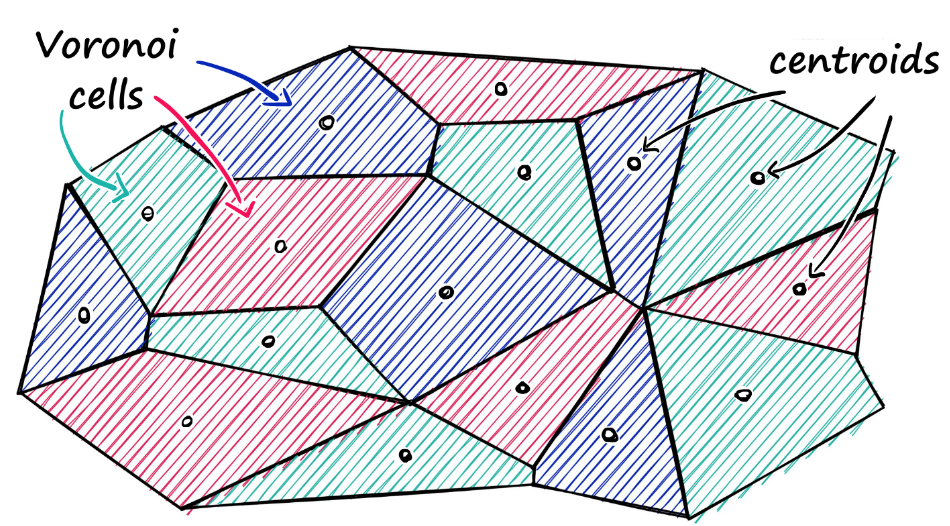

# LangChain Agent Implementation

A good AI agent should consider the below aspects:

* Ecosystem by plugins and fine-tuned base models
* Manage chat history (store/read/delete a chain of history chats)
* Provide rich prompt templates
* RAG (Retrieval Augmented Generation)
* Interaction with SQL/NoSQL DB
* Online search for the latest info
* OCR (Optical Character Recognition)

## Ecosystem by plugins and fine-tuned base models

Users are asked to choose a plugin and a base model prior to starting a query.

Fine-tuned base models target particular domain knowledge areas.

Plugins provide dedicated instruction execution to business logics and load RAG for relevant document search.

```python
from Flask import Flask, request

class ChatbotConfigManager:
    def __init__(self):
        self.plugins["stock"] = stock_market_handler
        self.plugins["bond"] = bond_market_handler
        self.plugins["gold"] = gold_market_handler
        self.plugins["silver"] = silver_market_handler
        self.base_models["stock"] = finetuned_stock_model
        self.base_models["bond"] = finetuned_bond_model
        self.base_models["precious_metal"] = finetuned_precious_metal_model

    def get_plugin(self, plugin_name:str):
        return self.plugins[plugin_name]

    def get_model(self, model_name:str):
        return self.base_models[model_name]

chatbotConfigManager = ChatbotConfigManager()

@app.route(rule="user_config", methods=["POST"])
def config_chatbot():
    config_input = request.json
    plugin = chatbotConfigManager.get_plugin(config_input["plugin_name"])
    base_model = chatbotConfigManager.get_model(config_input["model_name"])
```

## Manage chat history

* `ConversationalRetrievalChain`

This chain takes in chat history (a list of messages) and new questions, and then returns an answer to that question.

* `ConversationalBufferMemory` and `ConversationalBufferWindowMemory`

This memory allows for storing messages and then extracts the messages in a variable.
The buffer window means only retaining a limited number of chats.

```python
from langchain.memory import ConversationBufferMemory

memory = ConversationBufferMemory()
memory.save_context({"input": "hi"}, {"output": "whats up"})

memory.load_memory_variables({})
# {'history': 'Human: hi\nAI: whats up'}
```

Together, they are as below.
`from_llm` is a convenience method to load chain from LLM and retriever.


```python
mem = ConversationalBufferMemory(
    memory_key="chat_history",
    return_message=True,
    output_key="answer"
)

conv_qa_chain = ConversationalRetrievalChain.from_llm(
    llm=base_model,
    retriever=retriever,
    memory=mem,
    get_chat_history=lambda h: h,
    return_source_documents=True
)

answer = conv_qa_chain({"question": query})
```

## Provide rich prompt templates

An agent should provide prompt templates for different tasks.
Users' inputs/queries are embedded into prompts that are treated as the final total input to LLM.

```python
from langchain.prompts import PromptTemplate

class PromptManager:

    def __init__(self):
        self.summary_prompt = """Please use the document and summarize the content.
        content: {doc}
        """

        self.sensitivity_test_prompt = """Please use the document and analyze the content to check if the content contains any sensitive information.
        The sensitive information includes politics, military, sexism, race, hate.
        content: {doc}
        """

    def generate_query_for_summary(self, doc:str):
        return self.summary_prompt.format(doc=doc)

    def generate_query_for_sensitivity_test(self, doc: str):
        return self.sensitivity_test_prompt.format(doc=doc)
```

## RAG

### Knowledge DB: Indexing and Retriever

```python
from langchain.text_splitter import CharacterTextSplitter
from langchain.vectorstores import FAISS
from langchain.document_loaders import TextLoader, Doc2txtLoader
from langchain_core.retrievers import BaseRetriever
from langchain_core.callbacks import CallbackManagerForRetrieverRun
from langchain_core.documents import Document
from langchain_openai import OpenAIEmbeddings

from typing import List


class CustomRetriever(BaseRetriever):
    
    # implementation of `get_relevant_documents`
    def _get_relevant_documents(
        self, query: str, *, run_manager: CallbackManagerForRetrieverRun
    ) -> List[Document]:
        return [Document(page_content=query)]


class KnowledgeBaseManager(CustomRetriever):

    # embedding_name: embedding_name
    # kb_path: knowledge base vector db
    def __init__(self, embedding_name: str, kb_path="/path/to/vector/db"):
        embeddings = OpenAIEmbeddings()
        self.db = FAISS.load_local(kb_path, embeddings)
        self.doc_size = doc_size
        self.splitter = CharacterTextSplitter(separator=["\n", "\n\n", ""], chunk_size=1000, chunk_overlap=100)
        self.retriever = CustomRetriever()
        retriever = db.as_retriever(search_kwargs={"k": 1})

    def store_doc_file(self, file_path:str):
        loader = loader = DirectoryLoader(file_path, glob="**/*.pdf", loader_cls=TextLoader)
        doc_ls = loader.load()
        for doc in doc_ls:
            self.store_doc_txt(doc.page_content)

    def store_doc_txt(self, txt):
        source_chunks = []
        for chunk in self.splitter.split_text(txt):
            source_chunks.append(chunk)
        self.db.add_document(source_chunks)

    def retrieve_doc(self, query):
        return retriever.get_relevant_documents(query)
```

### `FAISS`

*Facebook AI Similarity Search* (Faiss) is a library for efficient similarity search and clustering of dense vectors.

#### Embeddings


#### Similarity Search and Optimization

Example: given $\text{Sentences} \in \mathbb{R}^{14504 \times 100}$ of the size $\text{numSentences} \times \text{numTokensPerSentence}$.

```python
print(sentences)
# [['Jack', 'is', 'play', '##ing', 'with', 'his', 'cat', '[PAD]', '[PAD]', ...],
#  ['Jason', 'is', 'driv', '##ing', 'his', 'toy', 'car', '[PAD]', '[PAD]', ...],
#  ['Margret', 'is', 'dress', '##ing', 'up', 'her', 'Barbie', 'toy', 'girl', '[PAD]', ...],
#  ...]
```

First provide embeddings as "compressed" representations of sentences by sentence transformer.
For example, a BERT-base gives $\text{SentenceEmbeddings} \in \mathbb{R}^{14504 \times 768}$.

```python
from sentence_transformers import SentenceTransformer

# initialize sentence transformer model
model = SentenceTransformer('bert-base-nli-mean-tokens')

# create sentence embeddings
sentence_embeddings = model.encode(sentences)
sentence_embeddings.shape
# [14504, 768]
```

* $\mathcal{L}_2$ by `IndexFlatL2`: for every $\bold{v}_i \in \mathbb{R}$

$$
d = \sum\left(\bold{v}_i-\bold{v}_j\right)^2
$$

```python
dim = sentence_embeddings.shape[1] # 768
index = faiss.IndexFlatL2(dim)     # init indexing that each vec is of 768 length
index.add(sentence_embeddings)   # add all 14504 sentence embeddings
k = 2                            # top k search
xq = model.encode(["Someone is driving a car"])
doc, idx_sentence = index.search(xq, k)  # do search, `idx_sentence` is the idx of the most similar vectors
```

* Optimization by `IndexIVFFlat` (Inverted File (IVF)) and multiple probes

`IndexIVFFlat` refers to indexing with partitioned areas (*Voronoi cells*), where most similar vectors are clustered into one cell.
The similarity is measured by typical vector distance measurements such as $\mathcal{L}_2$ and Cosine.

The search starts at finding the most similar centroid then exhaustively searching all vectors in the centroid-corresponding cell.

<div style="display: flex; justify-content: center;">
      
</div>

`index.nprobe` is the number of Voronoi cells to search.
For example, `index.nprobe=10` means the search will be conducted in the current cell and the 9 neighbor/nearest cells.

```python
nlist = 50                          # how many Voronoi cells/partition areas in a cluster,
                                    # where search will be confined in that partition area
dim = sentence_embeddings.shape[1]  # 768
index_FlatL2 = faiss.IndexFlatL2(dim) # distance measurement
index = faiss.IndexIVFFlat(index_FlatL2, dim, nlist)
index.nprobe = 10

index.train(sentence_embeddings)    # vector clustering
index.is_trained                    # check if index is now trained

index.add(sentence_embeddings)   # add all 14504 sentence embeddings

xq = model.encode(["Someone is driving a car"])
doc, idx_sentence = index.search(xq, k)  # do search, `idx_sentence` is the idx of the most similar vectors
```

* Optimization by `IndexIVFPQ` (Product Quantization (PQ))

*Product Quantization* (PQ) is a quantization method of `IndexIVF` splitting vectors into sub-vectors then do clustering and replacing full precision centroids with quantized ones.

```python
m = 8  # number of centroid IDs in final compressed vectors
bits = 8 # number of bits in each centroid
dim = sentence_embeddings.shape[1]  # 768
index_FlatL2 = faiss.IndexFlatL2(dim)  # we keep the same L2 distance flat index
index = faiss.IndexIVFPQ(index_FlatL2, dim, nlist, m, bits)

index.train(sentence_embeddings)    # vector clustering
index.is_trained                    # check if index is now trained

index.add(sentence_embeddings)   # add all 14504 sentence embeddings
```

## Interaction with SQL/NoSQL DB

## Online search for the latest info

## OCR (Optical Character Recognition)
