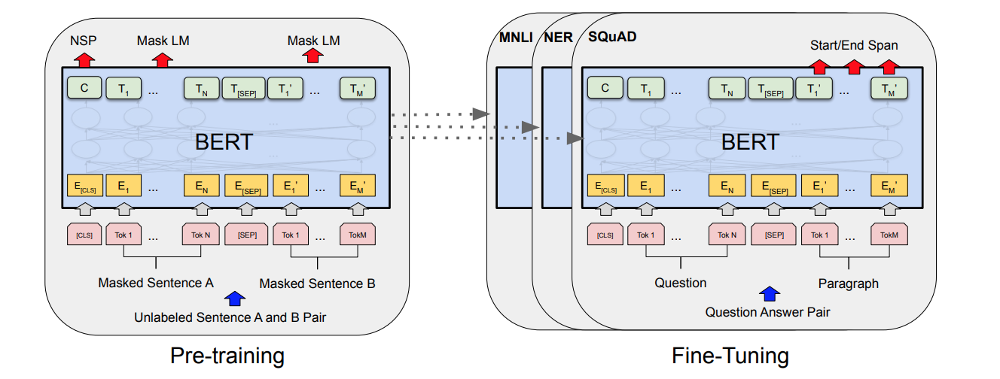

# LLM (Large Language Model)

A large language model (LLM) is a language model characterized by its large size.

State-of-art LLMs use transformers/attention designs.

||Smallest Size*|Largest Size*|Structure|Training|Use|Developer|
|-|-|-|-|-|-|-|
|Bidirectional Encoder Representations from Transformers (BERT)|bert-base: 110 m|bert-large: 340 m|encoder stack, bidirectional|$15\%$ Masked language modeling (MLM)|learning representations of words taking context on both sides/bidirectional, predict `[MASK]` words|Google|
|RoBERTa|||||||
|Large Language Model Meta AI (LLAMA)|llama-2: 7 b|llama-2: 130 b||||Facebook/Meta|
|Text-to-Text Transfer Transformer (T5)|t5-small: ||encoder-decoder|consecutive masked tokens are replaced with a single token as a new vocab, ||Google|
|Bidirectional and Auto-Regressive Transformers (BART)|||bidirectional encoder + auto-regressive decoder|pre-training used $30\%$ masked tokens and sentence permutation|||Google|
|GPT (Generative Pre-Training)|GPT-1: 117 m|GPT-4: 1.8 t|left-to-right auto-regressive decoder|||OpenAI|
|BLOOM|||decoder-only||||

where * means by the time of year 2023, and size is measured in param num that m: million, b: billion, t: trillion.

* Encoder-Only vs Decoder-Only

encoder-only, bidirectional model (such as BERT) vs typical auto-regressive (AR), decoder-only, left-to-right model (such as GPT)

<div style="display: flex; justify-content: center;">
      
</div>
</br>


## Common Language Modeling (LM): Causal Language Modeling (CLM), Masked Language Modeling (MLM), and Sequence-to-Sequence (Seq2Seq)

* Causal Language Modeling (CLM)

CLM is trained to predict the next token in a sequence only given the previous tokens.

Architecture: autoregressive models like GPT; given that the previous tokens are received by the decoder itself, no need of an encoder.

CLM is well-suited for tasks such as text generation and summarization. 
However, CLM models have unidirectional context (only consider past texts as input).

* Masked Language Modeling (MLM)

Some tokens in the input sequence are masked by `[MASK]`. MLM has the advantage of learning from bidirectional context (`[MASK]` is at somewhere in the middle of a sentence, so that tokens preceding and succeeding this `[MASK]` are contextual info, hence it is a bidirectional task).

Architecture: encoder such as BERT

MLM is useful in text classification, sentiment analysis, and named entity recognition.

* Seq2Seq

Seq2Seq models consist of an encoder-decoder architecture (e.g., T5, BART), where the encoder processes the input sequence and the decoder generates the output sequence.

It is useful in machine translation, summarization, and question-answering.

## Bidirectional Encoder Representations from Transformers (BERT)

BERT is bidirectional, meaning that it can predict words by looking back (word sequence BEFORE a placeholder word) as well as looking ahead  (word sequence AFTER a placeholder word).

For example, to predict `[MASK]` in this sentence: `Jason is playing football on a [MASK] with his football coach Jack.`.
BERT can do/train prediction bidirectionally `Jason is playing football on a [MASK]` and `[MASK] with his football coach Jack` (answer is `[MASK] = "playground"`).

This requires dataset containing sequential info but not necessarily orderly (such as in LSTM prediction for chronologically ordered data).

BERT is mainly constructed by stacking transformers.

||Transformer Layers|Hidden Size|Attention Heads|Parameters|Memory|
|-|-|-|-|-|-|
|BERT Base|12|768|12|110M|450 MB|
|BERT Large|24|1024|16|340M|1.2 GB|

### BERT-Base Model Breakdown

```py
bert_base_model = get_model(
    token_num=30522,
    head_num=12,
    transformer_num=12,
    embed_dim=768,
    feed_forward_dim=3072,
    seq_len=512,
    pos_num=512,
    dropout_rate=0.05,
)
```

The total of 110m (to be precise: 109,482,240) parameter breakdown is shown as below (for a typical Q&A task BERT encoder).

||Components|Shape|Count|Comments|
|-|-|-|-|-|
|Input Embeddings|embeddings.word_embeddings.weight|$30522 \times 768$|$23,440,896$|vocab size $\times$ wordpiece embedding|
||embeddings.position_embeddings.weight|$512 \times 768$|$393,216$|context sequence length $\times$ wordpiece embedding|
||embeddings.token_type_embeddings.weight|$2 \times 768$|$1536$| In tasks like Q&A that feeds two sentences: first as passage and second for question (0’s for first segment and 1’s for second segment)|
||embedding layer normalization (weight and bias)|$768 + 768$|$1536$|embedding layer normalization weight $+$ bias|
|Transformer $\times$ 12|encoder.layer.i.attention.self.query (weight and bias)|$(768 \times 768 + 768) \times 12$|$7,087,104$|query $Q$'s weight and bias|
||encoder.layer.i.attention.self.key (weight and bias)|$(768 \times 768 + 768) \times 12$|$7,087,104$|key $K$'s weight and bias|
||encoder.layer.i.attention.self.value (weight and bias)|$(768 \times 768 + 768) \times 12$|$7,087,104$|value $V$'s weight and bias|
||encoder.layer.i.attention.self.dense (weight and bias)|$(768 \times 768 + 768) \times 12$|$7,087,104$|dense output (weight and bias)|
||encoder.layer.i.attention normalization (weight and bias)|$(768 + 768) \times 12$|$18,432$|dense normalization (weight and bias)|
||encoder.layer.i.intermediate (feed-forward) input (weight and bias)|$(3072 \times 768 + 3072) \times 12$|$28,348,416$|feed-forward input (weight and bias)|
||encoder.layer.i.intermediate (feed-forward) output (weight and bias)|$(768 \times 3072 + 768) \times 12$|$28,320,768$|feed-forward output (weight and bias)|
||encoder layer normalization (weight and bias)|$(768 + 768) \times 12$|$18,432$|encoder layer normalization weight $+$ bias|
|Pooler|pooler.dense (weight and bias)|$768 \times 768 + 768$|$7,087,104$|pooler layer's weight and bias|

Shown as below, the $12 \times$ encoder produces `last_hidden_state` that is a context-aware token embedding of the size `(batch_size, seq_len, embedding_size_of_one_token)`.

The pooler output is of size $1 \times 768$ that serves as input to classification problem.

<div style="display: flex; justify-content: center;">
      
</div>
</br>

Other BERT models for different tasks may have different structures, such as no `token_type_embeddings`, nor `Pooler` for Seq2Seq model, which needs `last_hidden_state` from encoder to decoder rather than the "collective pooler representation" of `pooler_output`.

#### Output: `last_hidden_state` vs `pooler_output`

`last_hidden_state` contains the hidden representations for each token in each sequence of the batch. So the size is `(batch_size, seq_len, hidden_size)`.

`pooler_output` contains a "representation" of each sequence in the batch, and is of size `(batch_size, hidden_size)`

The pooler_layer is a $\text{tanh}$-applied activation on the output from the last hidden layer (the last layer of encoder): $\bold{y}_{p}=\text{tanh}(W_p\bold{x}_h+\bold{b}_p)$.
The pooler layer's output $\bold{y}_{p} \in \mathbb{R}^{1 \times 768}$ can be considered as a "compressed" representation of the sequence of the last encoder's tokens $\bold{x}_{h} \in \mathbb{R}^{n_{seq} \times 768}$, where $n_{seq}$ is `sql_len`.

$\bold{y}_{p}$ can be further used in tasks such as classification, while $\bold{x}_{h}$ can be used for token representation.

#### Decoder

A typical BERT decoder is simply the encoder version with inserted cross-attention.

```txt
BertGenerationDecoder(
  (bert): BertGenerationEncoder(
    (embeddings): BertGenerationEmbeddings(
      (word_embeddings): Embedding(30522, 768, padding_idx=0)
      (position_embeddings): Embedding(512, 768)
      (LayerNorm): LayerNorm((768,), eps=1e-12, elementwise_affine=True)
      (dropout): Dropout(p=0.1, inplace=False)
    )
    (encoder): BertEncoder(
      (layer): ModuleList(
        (0-11): 12 x BertGenerationLayer(
          (attention): BertGenerationAttention(
            (self): BertGenerationSelfAttention(
              (query): Linear(in_features=768, out_features=768, bias=True)
              (key): Linear(in_features=768, out_features=768, bias=True)
              (value): Linear(in_features=768, out_features=768, bias=True)
              (dropout): Dropout(p=0.1, inplace=False)
            )
            (output): BertGenerationSelfOutput(
              (dense): Linear(in_features=768, out_features=768, bias=True)
              (LayerNorm): LayerNorm((768,), eps=1e-12, elementwise_affine=True)
              (dropout): Dropout(p=0.1, inplace=False)
            )
          )
          (crossattention): BertGenerationAttention(
            (self): BertGenerationSelfAttention(
              (query): Linear(in_features=768, out_features=768, bias=True)
              (key): Linear(in_features=768, out_features=768, bias=True)
              (value): Linear(in_features=768, out_features=768, bias=True)
              (dropout): Dropout(p=0.1, inplace=False)
            )
            (output): BertGenerationSelfOutput(
              (dense): Linear(in_features=768, out_features=768, bias=True)
              (LayerNorm): LayerNorm((768,), eps=1e-12, elementwise_affine=True)
              (dropout): Dropout(p=0.1, inplace=False)
            )
          )
          (intermediate): BertGenerationIntermediate(
            (dense): Linear(in_features=768, out_features=3072, bias=True)
            (intermediate_act_fn): GELUActivation()
          )
          (output): BertGenerationOutput(
            (dense): Linear(in_features=3072, out_features=768, bias=True)
            (LayerNorm): LayerNorm((768,), eps=1e-12, elementwise_affine=True)
            (dropout): Dropout(p=0.1, inplace=False)
          )
        )
      )
    )
  )
  (lm_head): BertGenerationOnlyLMHead(
    (decoder): Linear(in_features=768, out_features=30522, bias=True)
  )
)
```

### Source Input

Token Embeddings: a Matrix of size $30522 \times 768$. Here, $30000$ is the vocabulary length after wordpiece tokenization, and $768$ is dimension of each token.

Positional embeddings: positions of words in a sequence (often it is a sentence, large model may consider article).

Segment/document embeddings: positions of words' sentences in a context. For example, sentence index of a discussion (discussion serves as a context).

Total input: Token Embeddings (768 per vocabulary) + Segment Embeddings + Position Embeddings

#### Data for Training

* BooksCorpus (800M words)
* English Wikipedia (2,500M words)

#### Data for Fine-Tuning by Tasks

* Q & A: Stanford Question Answering Dataset (SQuAD)
* Next Sentence Prediction (NSP): Situations With Adversarial Generations (SWAG)
* Ablation (Masked language modeling (MLM)): no particular dataset, just randomly remove some words (replaced with an empty placeholder) and make prediction on these placeholder.

#### Data Preparation/Augmentation

* Full text prediction
* $15\%$ partial word masking (replaced with empty value)
* $15\%$ partial word random substitution (replaced with random work)
* Mixed: $7.5\%$ partial word masking and $7.5\%$ random word substitution

The above augmentation can build model resilience learning the right grammar and semantics.

### Training

BERT training first undergoes a normal training (pre-training) by BooksCorpus (800M words) and English Wikipedia (2,500M words), then fine-tunes on different tasks such as Q & A on Stanford Question Answering Dataset (SQuAD) and Next Sentence Prediction (NSP) on Situations With Adversarial Generations (SWAG).

<div style="display: flex; justify-content: center;">
      
</div>
</br>

#### Hyper-parameters

Training hyper-parameters:

```json
{
  "per_gpu_batch_size": [16, 32],
  "learning_rate": [2e-5, 3e-5, 5e-5],
  "num_epochs": [2, 3, 4]
}
```

* Motivations:

*Catastrophic Forgetting* or *Catastrophic Interference*:
when feeding new information, neural network "forgets" the previous tasks it was trained for.

In other words, it totally forgets previous knowledge.

The problem only happens with sequential learning, when new information disrupts what the network has previously learned.

* Remediation of catastrophic forgetting

Train a new neural network with all the old data to relearn the forgotten knowledge.

Use small learning rates

### BERT For Question and Answering

The `BertForQuestionAnswering` is basically a BERT base model plus a linear output for token classification.

The model produces predicted logits for tokens' start position and end position in reference to the context texts (in other words, answers must be from context texts).

Cross entropy of the start and end positions is used for loss.

```python
class BertForQuestionAnswering(BertPreTrainedModel):
   
  def __init__(self, config):
      super(BertForQuestionAnswering, self).__init__(config)
      self.num_labels = config.num_labels

      self.bert = BertModel(config)
      self.qa_outputs = nn.Linear(config.hidden_size, config.num_labels)

      self.init_weights()

      ...

  def forward(self, input_ids=None, attention_mask=None, token_type_ids=None, position_ids=None, head_mask=None, 
              inputs_embeds=None, start_positions=None, end_positions=None):

      ...

      outputs = self.bert(
          input_ids,
          attention_mask=attention_mask,
          token_type_ids=token_type_ids,
          position_ids=position_ids,
          head_mask=head_mask,
          inputs_embeds=inputs_embeds,
          output_attentions=output_attentions,
          output_hidden_states=output_hidden_states,
          return_dict=return_dict,
      )

      sequence_output = outputs[0]

      sequence_output = self.dropout(sequence_output)
      logits = self.classifier(sequence_output)

      ...

      loss_fct = CrossEntropyLoss(ignore_index=ignored_index)
      start_loss = loss_fct(start_logits, start_positions)
      end_loss = loss_fct(end_logits, end_positions)
      total_loss = (start_loss + end_loss) / 2

      return TokenClassifierOutput(
            loss=loss,
            logits=logits,
            hidden_states=outputs.hidden_states,
            attentions=outputs.attentions,
      )
```


## LLaMa

LLaMA (Large Language Model Meta AI) 

### Alpaca

Alpaca is a fine-tuned model of LLaMA's 7B version.

## OpenAI GPT2

```txt
GPT2Model(
  (wte): Embedding(40478, 768)
  (wpe): Embedding(512, 768)
  (drop): Dropout(p=0.1, inplace=False)
  (h): ModuleList(
    (0-11): 12 x GPT2Block(
      (ln_1): LayerNorm((768,), eps=1e-05, elementwise_affine=True)
      (attn): GPT2Attention(
        (c_attn): Conv1D()
        (c_proj): Conv1D()
        (attn_dropout): Dropout(p=0.1, inplace=False)
        (resid_dropout): Dropout(p=0.1, inplace=False)
      )
      (ln_2): LayerNorm((768,), eps=1e-05, elementwise_affine=True)
      (mlp): GPT2MLP(
        (c_fc): Conv1D()
        (c_proj): Conv1D()
        (act): NewGELUActivation()
        (dropout): Dropout(p=0.1, inplace=False)
      )
    )
  )
  (ln_f): LayerNorm((768,), eps=1e-05, elementwise_affine=True)
)
```

