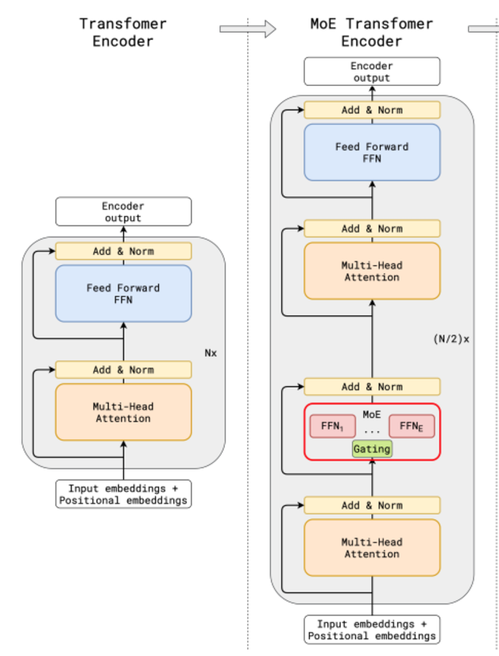

# Mixture of Experts (MoEs)

Reference:

* https://huggingface.co/blog/moe

Mixture-of-Experts models enhance transformers by replacing the original FFNs (Fully Connected Networks) with $N$ **parallel FFNs** combined with a **router**.

In training, input $\mathbf{x}$ is assigned to only a subset of FFNs by router.

      

 

* These $N$ FFNs are also called experts (denoted as $E_n$ for $n \in [1,N]$).
* By top-$k$ selection, a router can be modeled as $g(\mathbf{x}; \mathbf{G}, k) \in \mathbb{R}^N$, where $\mathbf{G}$ is a parameter matrix that takes in input $\mathbf{x}$ and assigns it to the corresponding top-$k$ experts. The router in a typical setup is a softmax gated function $g_{\sigma}=\text{softmax}(\mathbf{x} \cdot W_g)$

Together, MoEs can be formulated as

$$
\mathbf{y} = \sum_{n\in N} g_n(\mathbf{x}; \mathbf{G},k) E_n(\mathbf{x})
$$

For not-selected FFNs for the input $\mathbf{x}$, there is $g_n=0$, thereby saved compute.

Consider that there are $N$ FFNs but only a subset of $k$ FFNs participated in computation for an input $\mathbf{x}$, this is called *sparsity*.

## Enhancements to MoEs

* Why Sparsity

For one FFN to learn long context input, it is expected that this FNN should be of big size, and for every single input token be computed by this large FNN, it is expensive.
As mentioned, sparsity allows only run input $\mathbf{x}$ on some parts of the whole system (many FNNs), hence each expert/FNN can be small.

Reference: GShard: Scaling Giant Models with Conditional Computation and Automatic Sharding https://arxiv.org/abs/2006.16668 

* Novel Training on Expert Capacity

Traditionally by top-$k$ expert sampling, some experts might receive far more input tokens than others.
This leads to insufficient training on some less select experts.

This paper proposes using a token ratio that sets up a max limit beyond which an expert shall no longer take new inputs.

$$
\text{ExpertCapacity}=\frac{\text{TokensPerBatch}}{\text{NumberOfExperts}} \times \text{CapacityFactor}
$$

If $\text{CapacityFactor}>1$, more than 1 experts process one token.

Reference: Switch Transformers: Scaling to Trillion Parameter Models with Simple and Efficient Sparsity https://arxiv.org/abs/2101.03961

* What experts have learned

On the lower layers of MoEs model, there are found experts with specialty only handling tokens of similar nature.

|Expert specialization|Expert position|Routed tokens|
|-|-|-|
|Sentinel tokens|Layer 1|been <extra id 4><extra id 7>floral to<extra id 10><extra id 12><extra id 15><extra id 17><extra id 18><extra id 19>...|
|Punctuation|Layer 2|, , , , , , , , , - , , , , , ). )|
|Conjunctions and articles|Layer 3 |The the the the the the the the the The the the the the the The the the the|
|Verbs|Layer 1|died falling identified fell closed left posted lost felt left said read miss place struggling falling signed died|
|Visual descriptions|Layer 0|her over her know dark upper dark outer|
|Proper names|Layer 1|A Mart Gr Mart Kent Med Cor Tri Ca Mart|
|Counting and numbers|Layer 1|after 37 19. 6. 27 I I Seven 25 4, 54 I two dead we|

Reference: ST-MOE: DESIGNING STABLE AND TRANSFERABLE SPARSE EXPERT MODELS https://arxiv.org/pdf/2202.08906 