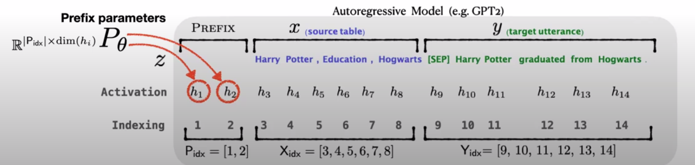

# Parameter-Efficient Fine Tuning (PEFT)

## LoRA: Low-Rank Adaptation of Large Language Models

For input $\mathbf{x} \in \mathbb{R}^{n \times d}$, where $d$ is for dimensionality, to fine tune an pretrained model, LoRA proposes below idea.

* $W_0 \in \mathbb{R}^{d \times d}$ is the pretrained parameters. 
* $A \sim N(0, \sigma^2) \in \mathbb{R}^{d \times r}$ is a weight matrix to be learned; it parameters are init by Gaussian distribution. $A$'s output reduces dimension to $r$
* $B = \mathbf{0} \in \mathbb{R}^{r \times d}$ is another weight matrix init to zeros. $B$'s output reset the dimension to $d$.

The training goes as below, that $W_0$ is kept unchanged/frozen; $B^{\top} A^{\top}$ are trainable parameter matrices. 

$r \ll d$ is referred to as *low-rank*.
$r=8$ or $r=16$ are typical implementations.
A small $r$ can help reduce computation maintaining small sizes for $A$ and $B$.

<div style="display: flex; justify-content: center;">
      
</div>
</br>

The new hidden layer matrix is computed as below.

$$
\mathbf{h} = W^{\top}_0\mathbf{x} + \underbrace{B^{\top} A^{\top}}\_{W_{\Delta}} \mathbf{x}
$$

For intrinsic dimension (intrinsic dimension for a data set can be thought of as the number of variables needed in a minimal representation of the data), the number of neurons is small $r \ll d$ but can produce good approximation results.

In practice in training, there defines additional hyper-parameter $\alpha$,
that the ratio to $r$ is dynamically affecting learning rate $\eta$ such that, there is $\frac{\alpha}{r} \eta$,
where $\frac{\alpha}{r} \rightarrow 1$ as iteration num grows.

In the below implementation, `lora_A` and `lora_B` with $r=16$ are inserted as parallel into the query $Q$ and value $V$.
The $768$ is the num of dimensions of BERT-base.

```txt
PeftModelForSequenceClassification(
  (base_model): LoraModel(
    (model): BertForSequenceClassification(
      (bert): BertModel(
        (embeddings): BertEmbeddings(
          ...
        )
        (encoder): BertEncoder(
          (layer): ModuleList(
            (0-11): 12 x BertLayer(
              (attention): BertAttention(
                (self): BertSelfAttention(
                  (query): Linear(
                    in_features=768, out_features=768, bias=True
                    (lora_dropout): ModuleDict(
                      (default): Dropout(p=0.05, inplace=False)
                    )
                    (lora_A): ModuleDict(
                      (default): Linear(in_features=768, out_features=16, bias=False)
                    )
                    (lora_B): ModuleDict(
                      (default): Linear(in_features=16, out_features=768, bias=False)
                    )
                    (lora_embedding_A): ParameterDict()
                    (lora_embedding_B): ParameterDict()
                  )
                  (key): Linear(in_features=768, out_features=768, bias=True)
                  (value): Linear(
                    in_features=768, out_features=768, bias=True
                    (lora_dropout): ModuleDict(
                      (default): Dropout(p=0.05, inplace=False)
                    )
                    (lora_A): ModuleDict(
                      (default): Linear(in_features=768, out_features=16, bias=False)
                    )
                    (lora_B): ModuleDict(
                      (default): Linear(in_features=16, out_features=768, bias=False)
                    )
                    (lora_embedding_A): ParameterDict()
                    (lora_embedding_B): ParameterDict()
                  )
                  (dropout): Dropout(p=0.1, inplace=False)
                )
                (output): BertSelfOutput(
                  (dense): Linear(in_features=768, out_features=768, bias=True)
                  (LayerNorm): LayerNorm((768,), eps=1e-12, elementwise_affine=True)
                  (dropout): Dropout(p=0.1, inplace=False)
                )
              )
              (intermediate): BertIntermediate(
                (dense): Linear(in_features=768, out_features=3072, bias=True)
                (intermediate_act_fn): GELUActivation()
              )
              (output): BertOutput(
                (dense): Linear(in_features=3072, out_features=768, bias=True)
                (LayerNorm): LayerNorm((768,), eps=1e-12, elementwise_affine=True)
                (dropout): Dropout(p=0.1, inplace=False)
              )
            )
          )
        )
        (pooler): BertPooler(
          (dense): Linear(in_features=768, out_features=768, bias=True)
          (activation): Tanh()
        )
      )
      (dropout): Dropout(p=0.1, inplace=False)
      (classifier): ModulesToSaveWrapper(
        ...
      )
    )
  )
)
```

### AdaLoRA (Adaptive LoRA)

LoRA overlooks the varying importance of different weight parameters, and $A$ and $B$ could be co-dependent (indicating $A$ and $B$ are redundant in info representation of $W_{\Delta}$ and there is room to prune $A$ and $B$).
In other words, $A \in \mathbb{R}^{d \times r}$ and $B \in \mathbb{R}^{r \times d}$ should dynamically change sizes according to $W_{\Delta}=AB$ retained info.

AdaLoRA proposes weight updates by their importance scores rather than treating them indiscriminately.
In particular, AdaLoRA parameterizes the incremental updates in the form of singular value decomposition (SVD).
In other words, $W_{\Delta}=AB$ retained info is measured by singular values, and accordingly $W_{\Delta}$'s size is adapted.

AdaLoRA takes SVD on the added weight matrix such that $W_{\Delta}=P \Lambda Q$.

$$
\begin{align*}
    \mathbf{h} &= W^{\top}_0\mathbf{x} + \underbrace{B^{\top} A^{\top}}\_{W_{\Delta}} \mathbf{x} \\\\
    &= W^{\top}_0\mathbf{x} + P \Lambda Q \mathbf{x}
\end{align*}
$$

To train $W_{\Delta}=P \Lambda Q$, in contrast to primitive LoRA that just trains $A$ and $B$, AdaLoRA trains $P \in \mathbb{R}^{d_P \times r}$ and $Q \in \mathbb{R}^{r \times d_Q}$.
At the beginning of training $t=0$, $W_{\Delta}$ uses random Gaussian initialization to $P$ and $Q$ to ensure $W_{\Delta}=\mathbf{0}$.

To enforce the orthogonality of $P$ and $Q$, i.e., $P^{\top}P=I$ and $Q^{\top}Q=I$, use the below regularizer:

$$
\text{regularizer}(P,Q) =
||P^{\top}P-I||^2_{F} + ||Q^{\top}Q-I||^2_{F}
$$

$\text{regularizer}(P,Q)$ is required for that SVD sets orthogonal bases for decomposition; a valid SVD should the orthogonality of $P$ and $Q$.
However, directly compute SVD for every $W_{\Delta}$ is impractical for extremely high computation cost, and AdaLoRA only wants to approximate SVD via iterative method.

Define $\text{Cost}(P, \Lambda, Q)$ as the cost, the total loss is the sum of cost and regularization. Here $\gamma$ is a regularization controlling coefficient.

$$
\mathcal{L}(P, \Lambda, Q) = \text{Cost}(P, \Lambda, Q) + \gamma\space \text{regularizer}(P,Q)
$$

$\Lambda$ is iteratively pruned to adjust $\text{rank}(W_{\Delta})$ after each gradient decent step.
AdaLoRA proposes using *importance-aware rank allocation* scheme.

#### Importance-Aware Rank Allocation

Generally speaking, *importance score* is consisted of singular value magnitude and sensitivity measurement (magnitude of the gradient-weight product), and is used to determine what singular values are to be retained.

Define a triplet $\mathbf{w}\_{\Delta, i} = \{ P_{i}, \lambda_i, Q_{i} \}$, where $i$ denotes the index of the $i$-th singular value $\lambda_i$.
When setting $\lambda_i=0$, the corresponding triplets $\mathbf{w}\_{\Delta, i}$ are set to $\mathbf{0}$ as well, thereby removing the less-importance dimensions of $W_{\Delta}=P \Lambda Q$.

The update of $\Lambda_t$ at the training step $t$ is shown as below. Here $\eta$ is learning rate.

$$
\hat{\Lambda}_t = \Lambda_t - \eta \nabla_{\Lambda_t} \mathcal{L}(P, \Lambda, Q)
$$

Then, only significant $\Lambda_t$ with high importance score $S_t$ are retained.

$$
\Lambda_{t+1} = \text{prune}(\hat{\Lambda}_t, S_t) =
\left\{
    \begin{matrix}
        \hat{\Lambda}_t & S_t \text{ is among top in all } \mathbf{S}_t \\\\
        0 & \text{otherwise}
    \end{matrix}
\right.
$$

where $\mathbf{S}_t$ refers to the set of importance scores of all LoRA additional weight matrices in an LLM.

Importance score $S_t$ is computed with two considerations

* Magnitude of singular value: large $|\lambda_i|$ indicates high importance of its corresponding triplet $\mathbf{w}\_{\Delta, i} = \{ P_{i}, \lambda_i, Q_{i} \}$
* Sensitivity-based importance: if the removal of a parameter, e.g., $\lambda_i$, has a large influence, then the model is sensitive to it and the triplet $\mathbf{w}\_{\Delta, i} = \{ P_{i}, \lambda_i, Q_{i} \}$ should be retained

In summary, $S_t$ is computed as below.

$$
S_t = s(\lambda_{t,i}) + \frac{1}{d_P} \sum_{j=1}^{d_P} s(P_{t,ji}) + \frac{1}{d_Q} \sum_{i=1}^{d_Q} s(Q_{t,ij})
$$

where a naive estimate of the score is $\hat{s}(w_{ij})=|w_{ij} \nabla_{w_{ij}} \mathcal{L}|$, defined as the magnitude of the gradient-weight product.
However, such a score $\hat{s}_t$ is estimated on sampled mini batches. The stochastic sampling and complicated training dynamics incur high variability and large uncertainty.

To address this issue, here proposes $\overline{s}(w_{ij})$ as a smoothed sensitivity by exponential moving average, and $\overline{u}(w_{ij})$ as the uncertainty term quantified by the local variation between $\hat{s}(w_{ij})$ and $\overline{s}(w_{ij})$.
That is

$$
s(w_{ij}) = \overline{s}(w_{ij}) \cdot \overline{u}(w_{ij})
$$

where, with the help of coefficients $0 < \beta_1, \beta_2 < 1$, there are

$$
\begin{align*}
    \overline{s}\_{t}(w_{ij}) &= \beta_1 \overline{s}\_{t-1}(w_{ij}) + (1-\beta_1)\hat{s}\_{t}(w_{ij}) \\\\
    \overline{u}\_{t}(w_{ij}) &= \beta_2 \overline{u}\_{t-1}(w_{ij}) + (1-\beta_2)\Big| \hat{s}\_{t}(w_{ij}) - \overline{s}\_{t}(w_{ij}) \Big|
\end{align*}
$$

#### Further Explanation

A naive inspiration would be just performing SVD such that $W_{\Delta}=P \Lambda Q$, then remove triplets $\mathbf{w}\_{\Delta, i} = \{ P_{i}, \lambda_i, Q_{i} \}$ with small $\lambda_i$, and increase $d_P$ and $d_Q$ for even smallest $\lambda_i$ remains large.
However, at each training step $t$, performing once SVD would be very computation-expensive.
AdaLoRA proposes turning $P$, $\Lambda$ and $Q$ into trainable matrices, thereby approximating $W_{\Delta}=AB$.

SVD's orthogonality property is guaranteed by regularization $\text{regularizer}(P,Q)$.

Pruning of $\Lambda$ is by $\lambda_i$'s relative importance score $S_t$ in $\mathbf{S}_t$.
A further explanation of score $\hat{s}(w_{ij})=|w_{ij} \nabla_{w_{ij}} \mathcal{L}|$ is that, it is proportional to the gradient $\nabla_{w_{ij}} \mathcal{L}$ that score is high when weight update $\Delta w_{ij}$ sees steep loss descent.

$s(w_{ij}) = \overline{s}(w_{ij}) \cdot \overline{u}(w_{ij})$ is to smooth scores preventing large variances when training on batches.

#### HuggingFace Implementation

By default, AdaLoRA adds $W_{\Delta}$ to all transformer weights: key $W_{\Delta, K}$, query $W_{\Delta, Q}$, value $W_{\Delta, V}$ and fully connected layer $W_{\Delta, F}$.
Sometimes only query $W_{\Delta, Q}$ and value $W_{\Delta, V}$ are set to training without much LLM performance drop.

```py
from transformers import AutoModelForSeq2SeqLM, LoraConfig
from peft import AdaLoraModel, AdaLoraConfig
config = AdaLoraConfig(
    peft_type="ADALORA", task_type="SEQ_2_SEQ_LM", r=8,
    lora_alpha=32, target_modules=["q", "v"], lora_dropout=0.01,
)
model = AutoModelForSeq2SeqLM.from_pretrained("t5-base")
model = AdaLoraModel(model, config, "default")
```

## Adapter: Parameter-Efficient Transfer Learning for NLP

Adapter adds new modules (called *adapter*) between layers of pre-trained transformer network.

Compared to LoRA, the adapter's Feed-forward down-project matrix is comparable to $A$, the up-project is comparable to $B$.
$m$ serves the same purposes as $r$'s reducing dimensions.

Adapter adds non-linearity between $A$ and $B$.

<div style="display: flex; justify-content: center;">
      
</div>
</br>

### Improvement: Adapter Fusion

Adapter fusion adds attentions (value, key and query) that take adapter's output as value and key, and query from adapter's input.

Define the below parameter groups:

* Pretrained parameters $W_0$
* Adapter parameters $\Psi$
* Adapter Fusion parameters $\Phi$

The adapter fusion training goes as below:

1. fixed $W_0$, just train $\Psi$: there are multiple modules of adapters learning different knowledge
2. fixed $W_0$ and $\Psi$, train $\Phi$: attention serves as a filter that only task-specific knowledge is stored.

<div style="display: flex; justify-content: center;">
      
</div>
</br>

## Prompt Tuning

Intuition of prompt tuning is user providing initial texts that serve as a topic covering training data of what area to be trained for, so that model will likely be contained in this topic in training.

Parameters of the base model are frozen, only a small weight matrix for the prompt/topic tokens are trained in prompt tuning.

For example, in Hugging Face implementation, set these to `petf_config`: `"prompt_tuning_init": "PromptTuningInit.TEXT"` and `"prompt_tuning_init_text": "Classify if this text's sentiment is a complaint or not:"`.
The value of `prompt_tuning_init_text` is the topic.

```python
from transformers import AutoModelForSequenceClassification
from peft import PeftModelForSequenceClassification, get_peft_config

config = {
    "peft_type": "PROMPT_TUNING",
    "task_type": "SEQ_CLS",
    "inference_mode": False,
    "num_virtual_tokens": 20,
    "prompt_tuning_init": "PromptTuningInit.TEXT",
    "prompt_tuning_init_text": "Classify if this text's sentiment is a complaint or not:",
    "token_dim": 768,
    "num_transformer_submodules": 1,
    "num_attention_heads": 12,
    "num_layers": 12,
}

peft_config = get_peft_config(config)
model = AutoModelForSequenceClassification.from_pretrained("bert-base-uncased")
peft_model_prompt = PeftModelForSequenceClassification(model, peft_config)
```

The topic `"Classify if this text's sentiment is a complaint or not:"` is passed in `(embedding): Embedding(20, 768)`, where $20$ is the number of the topic's tokens (named *virtual tokens* in terminology), zero padding is used for prompt texts too short of length, and $768$ is the num of token dimensions used in BERT-base.

```txt
PeftModelForSequenceClassification(
  (base_model): BertForSequenceClassification(
    (bert): BertModel(
      ...
    )
    (dropout): Dropout(p=0.1, inplace=False)
    (classifier): ModulesToSaveWrapper(
      ...
    )
  )
  (prompt_encoder): ModuleDict(
    (default): PromptEmbedding(
      (embedding): Embedding(20, 768)
    )
  )
  (word_embeddings): Embedding(30522, 768, padding_idx=0)
)
```

In prompt tuning, there is a small weight matrix to be trained `torch.nn.Embedding(total_virtual_tokens, config.token_dim)`

```python
class PromptEmbedding(torch.nn.Module):
    def __init__(self, config, word_embeddings):
        super().__init__()

        total_virtual_tokens = config.num_virtual_tokens * config.num_transformer_submodules
        self.embedding = torch.nn.Embedding(total_virtual_tokens, config.token_dim)
        if config.prompt_tuning_init == PromptTuningInit.TEXT:
            from transformers import AutoTokenizer

            tokenizer_kwargs = config.tokenizer_kwargs or {}
            tokenizer = AutoTokenizer.from_pretrained(config.tokenizer_name_or_path, **tokenizer_kwargs)
            init_text = config.prompt_tuning_init_text
            init_token_ids = tokenizer(init_text)["input_ids"]
            # Trim or iterate until num_text_tokens matches total_virtual_tokens
            ...

            word_embedding_weights = word_embeddings(init_token_ids).detach().clone()
        prompt_embeddings = self.embedding(indices)
        return prompt_embeddings

class PeftModel(PushToHubMixin, torch.nn.Module):
    def get_prompt(self, batch_size: int, task_ids: Optional[torch.Tensor] = None):
        peft_config = self.active_peft_config
        prompt_encoder = self.prompt_encoder[self.active_adapter] # PromptEmbedding
        ... # some reshape of `prompt_tokens`
        prompt_tokens = prompt_tokens[:, : peft_config.num_virtual_tokens]
        past_key_values = prompt_encoder(prompt_tokens) # run by PromptEmbedding's forward
        return past_key_values
```

The prompt tokens are added as `past_key_values` to the base model, where they are concatenated to key `key_layer = torch.cat([past_key_value[0], key_layer], dim=2)` and value `value_layer = torch.cat([past_key_value[1], value_layer], dim=2)` in transformer attention.

```python
class BertSelfAttention(nn.Module):
    def forward(...):
         ...
         key_layer = self.transpose_for_scores(self.key(hidden_states))
         value_layer = self.transpose_for_scores(self.value(hidden_states))
         key_layer = torch.cat([past_key_value[0], key_layer], dim=2)
         value_layer = torch.cat([past_key_values = self.get_prompt(batch_size)
      return self.base_model(
          input_ids=input_ids, inputs_embeds=inputs_embeds, past_key_values=past_key_values, **kwargs
      )ast_key_value[1], value_layer], dim=2)
         query_layer = self.transpose_for_scores(mixed_query_layer)
         ...

class PeftModelForCausalLM(PeftModel):
   def forward(...):
      ...
      past_key_values = self.get_prompt(batch_size)
      return self.base_model(
          input_ids=input_ids, inputs_embeds=inputs_embeds, past_key_values=past_key_values, **kwargs
      )
      ...
```

## Prefix-tuning

Motivation is that, given a sequence of tokens, the first few tokens of this sequence should contain rich info about predicting next remaining tokens,
so that by only training a small network on these first few tokens, this small network's output should see high attention scores when passed to transformers predicting next remaining tokens.

Construct the input $\mathbf{z} = \{ \text{PREFIX}, \mathbf{x}, \mathbf{y} \}$, whose activation values $h_i$ are shown as below.
$\{ \text{PREFIX}, \mathbf{x} \}$ are concatenated as new keys $K$ and values $V$ to transformers for predicting result tokens $\mathbf{y}$.

Define a small network $P_\theta$ to be trained on the $\text{PREFIX}$ virtual tokens. 
Other parameters of the underlying base model are frozen.

<div style="display: flex; justify-content: center;">
      
</div>
</br>

The $P_\theta$ is basically a Multi-Layer Perception (MLP) model defined as below in PyTorch.

```python
torch.nn.Sequential(
    torch.nn.Linear(token_dim, encoder_hidden_size),
    torch.nn.Tanh(),
    torch.nn.Linear(encoder_hidden_size, num_layers * 2 * token_dim),
)
```

For instance, in BERT-base, the below prefix tuning `embedding(20, 18432)` adds $20$ virtual tokens of $18432=2 \times 12 \times 768$ dimensions,
where $768$ is the num of dimensions for BERT-base consisting of $12$ transformers, that there should be $1$ dimension for key $K$ and $1$ for value $V$.

This design means each transformer gets unique key and value from prefix tuning's embeddings.
This is different/innovative compared to that of prompt tuning.

```txt
PeftModelForSequenceClassification(
  (base_model): BertForSequenceClassification(
    (bert): BertModel(
        ...
    )
    (dropout): Dropout(p=0.1, inplace=False)
    (classifier): ModulesToSaveWrapper(
      ...
    )
  )
  (prompt_encoder): ModuleDict(
    (default): PrefixEncoder(
      (embedding): Embedding(20, 18432)
    )
  )
  (word_embeddings): Embedding(30522, 768, padding_idx=0)
)
```

Full code shows as below, that `past_key_values = prompt_encoder(prompt_tokens)` is returned from `get_prompt(...)` that will be used in base model.

```python
class PrefixEncoder(torch.nn.Module):

    def __init__(self, config):
        super().__init__()
        self.prefix_projection = config.prefix_projection
        token_dim = config.token_dim
        num_layers = config.num_layers
        encoder_hidden_size = config.encoder_hidden_size
        num_virtual_tokens = config.num_virtual_tokens
        if self.prefix_projection and not config.inference_mode:
            # Use a two-layer MLP to encode the prefix
            self.embedding = torch.nn.Embedding(num_virtual_tokens, token_dim)
            self.transform = torch.nn.Sequential(
                torch.nn.Linear(token_dim, encoder_hidden_size),
                torch.nn.Tanh(),
                torch.nn.Linear(encoder_hidden_size, num_layers * 2 * token_dim),
            )
        else:
            self.embedding = torch.nn.Embedding(num_virtual_tokens, num_layers * 2 * token_dim)

    def forward(self, prefix: torch.Tensor):
        if self.prefix_projection:
            prefix_tokens = self.embedding(prefix)
            past_key_values = self.transform(prefix_tokens)
        else:
            past_key_values = self.embedding(prefix)
        return past_key_values

class PeftModel(PushToHubMixin, torch.nn.Module):
    def get_prompt(self, batch_size: int, task_ids: Optional[torch.Tensor] = None):
        peft_config = self.active_peft_config
        prompt_encoder = self.prompt_encoder[self.active_adapter] # PrefixEncoder
        prompt_tokens = prompt_tokens[:, : peft_config.num_virtual_tokens]
        ... # some reshape of `prompt_tokens`
        past_key_values = prompt_encoder(prompt_tokens) # run by PrefixEncoder's forward
        return past_key_values
```

The prefix tokens are added as `past_key_values` to the base model, where they are concatenated to key `key_layer = torch.cat([past_key_value[0], key_layer], dim=2)` and value `value_layer = torch.cat([past_key_value[1], value_layer], dim=2)` in transformer attention.

```python
class BertSelfAttention(nn.Module):
    def forward(...):
         ...
         key_layer = self.transpose_for_scores(self.key(hidden_states))
         value_layer = self.transpose_for_scores(self.value(hidden_states))
         key_layer = torch.cat([past_key_value[0], key_layer], dim=2)
         value_layer = torch.cat([past_key_value[1], value_layer], dim=2)
         query_layer = self.transpose_for_scores(mixed_query_layer)
         ...

class PeftModelForCausalLM(PeftModel):
   def forward(...):
      ...
      if peft_config.peft_type == PeftType.PREFIX_TUNING:
         past_key_values = self.get_prompt(batch_size)
         return self.base_model(
             input_ids=input_ids, inputs_embeds=inputs_embeds, past_key_values=past_key_values, **kwargs
         )
      ...
```

### Prefix-Tuning vs Prompt-Tuning

Hard prompting: hardcoded prompts as input to guide model prediction.
The most popular example is human input (a sequence of tokens of chatting) to ChatGPT.

## P-Tuning

P-tuning is similar to Prompt-tuning except that P-tuning implements slightly more complex prompt-encoders such as MLP and LSTM.

* LSTM Encoder

```txt
PeftModelForSequenceClassification(
  (base_model): BertForSequenceClassification(
    (bert): BertModel(
        ...
    )
    (dropout): Dropout(p=0.1, inplace=False)
    (classifier): ModulesToSaveWrapper(
      ...
    )
  )
  (prompt_encoder): ModuleDict(
    (default): PromptEncoder(
      (embedding): Embedding(20, 768)
      (lstm_head): LSTM(768, 768, num_layers=2, batch_first=True, bidirectional=True)
      (mlp_head): Sequential(
        (0): Linear(in_features=1536, out_features=1536, bias=True)
        (1): ReLU()
        (2): Linear(in_features=1536, out_features=768, bias=True)
      )
    )
  )
  (word_embeddings): Embedding(30522, 768, padding_idx=0)
)
```

* MLP Encoder


```txt
PeftModelForSequenceClassification(
  (base_model): BertForSequenceClassification(
    (bert): BertModel(
        ...
    )
    (dropout): Dropout(p=0.1, inplace=False)
    (classifier): ModulesToSaveWrapper(
      ...
    )
  )
  (prompt_encoder): ModuleDict(
    (default): PromptEncoder(
      (embedding): Embedding(20, 768)
      (mlp_head): Sequential(
        (0): Linear(in_features=768, out_features=768, bias=True)
        (1): ReLU()
        (2): Linear(in_features=768, out_features=768, bias=True)
        (3): ReLU()
        (4): Linear(in_features=768, out_features=768, bias=True)
      )
    )
  )
  (word_embeddings): Embedding(30522, 768, padding_idx=0)
)
```

Source code implementation in Hugging Face.

```python
class PromptEncoder(torch.nn.Module):

    def __init__(self, config):
        super().__init__()
        self.token_dim = config.token_dim
        self.input_size = self.token_dim
        self.output_size = self.token_dim
        self.hidden_size = config.encoder_hidden_size
        self.total_virtual_tokens = config.num_virtual_tokens * config.num_transformer_submodules
        self.encoder_type = config.encoder_reparameterization_type

        # embedding
        self.embedding = torch.nn.Embedding(self.total_virtual_tokens, self.token_dim)
        if not config.inference_mode:
            if self.encoder_type == PromptEncoderReparameterizationType.LSTM:
                lstm_dropout = config.encoder_dropout
                num_layers = config.encoder_num_layers
                # LSTM
                self.lstm_head = torch.nn.LSTM(
                    input_size=self.input_size,
                    hidden_size=self.hidden_size,
                    num_layers=num_layers,
                    dropout=lstm_dropout,
                    bidirectional=True,
                    batch_first=True,
                )

                self.mlp_head = torch.nn.Sequential(
                    torch.nn.Linear(self.hidden_size * 2, self.hidden_size * 2),
                    torch.nn.ReLU(),
                    torch.nn.Linear(self.hidden_size * 2, self.output_size),
                )

            elif self.encoder_type == PromptEncoderReparameterizationType.MLP:
                encoder_num_layers_default = PromptEncoderConfig.encoder_num_layers
                if config.encoder_num_layers != encoder_num_layers_default:
                    warnings.warn(
                        f"for {self.encoder_type.value}, the argument `encoder_num_layers` is ignored. "
                        f"Exactly {encoder_num_layers_default} MLP layers are used."
                    )
                layers = [
                    torch.nn.Linear(self.input_size, self.hidden_size),
                    torch.nn.ReLU(),
                    torch.nn.Linear(self.hidden_size, self.hidden_size),
                    torch.nn.ReLU(),
                    torch.nn.Linear(self.hidden_size, self.output_size),
                ]
                self.mlp_head = torch.nn.Sequential(*layers)

            else:
                raise ValueError("Prompt encoder type not recognized. Please use one of MLP (recommended) or LSTM.")

    def forward(self, indices):
        input_embeds = self.embedding(indices)
        if self.encoder_type == PromptEncoderReparameterizationType.LSTM:
            output_embeds = self.mlp_head(self.lstm_head(input_embeds)[0])
        elif self.encoder_type == PromptEncoderReparameterizationType.MLP:
            output_embeds = self.mlp_head(input_embeds)
        else:
            raise ValueError("Prompt encoder type not recognized. Please use one of MLP (recommended) or LSTM.")

        return output_embeds

```
