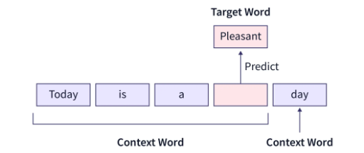
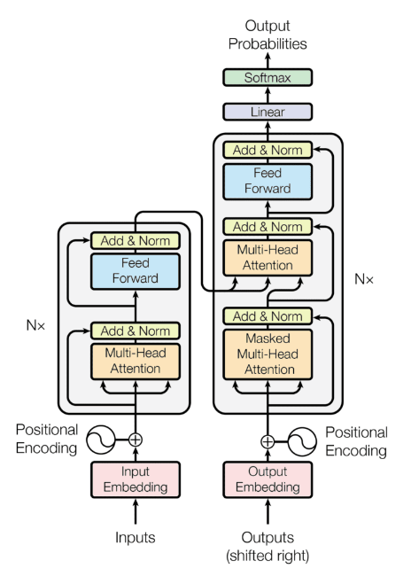
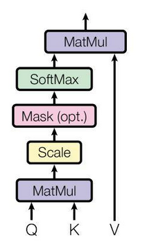
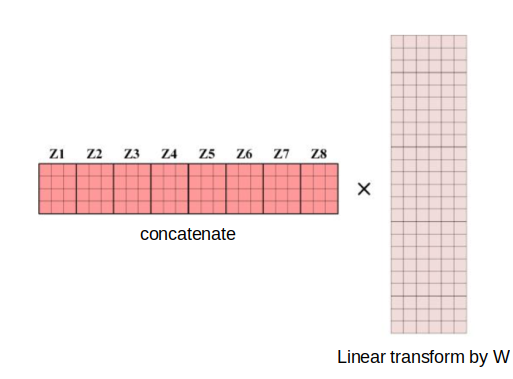
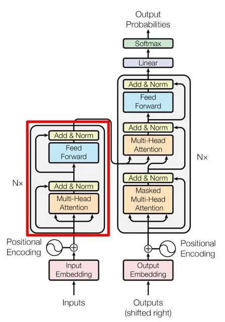
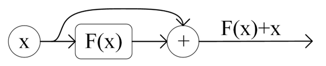
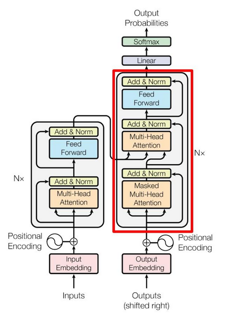

# Natural Language Processing (NLP)

## Tokenization

Tokenization is used in natural language processing (NLP) to split paragraphs and sentences into smaller units that can be more easily assigned semantics.   

For example, in English, the sentence
```txt
What restaurants are nearby?
```
is tokenized to `What`, `restaurants`, `are` and `nearby`.
Some tokenization strategies would consider punctuation marks such as in this sentence the question mark `?` is considered a token as well.

In Chinese, splitting directly by individual Chinese characters is a bad approach.
Instead, need Chinese corpus to assist extracting semantic words rather than individual Chinese characters.

Given the below Chinese sentence for example, splitting character by character for "林行止" (this is a person name) into three tokens `林`, `行` and `止` that translate to "forest", "walking" and "stop" can make trouble for next step semantic processing. 

```txt
談到貿易戰的長遠影響，林行止表示貿易戰促使在中國的工廠搬遷到越南、寮國、印度、台灣甚至是馬來西亞，以避開關稅。
```

The tokenization should ideally give these results: 
`談到`, `貿易戰`, `的`, `長遠`, `影響`, `，`, `林行止`, `表示`, `貿易戰`, `促使`, `在`, `中國`, `的`, `工廠`, `搬遷`, `到`, `越南`, `、`, `寮國`, `、`, `印度`, `、`, `台灣`, `甚至`, `是`, `馬來西亞`, `，`, `以`, `避開`, `關稅` and `。`.


## Embeddings

Embeddings mean information representation and compression.


Typically, there are two embeddings in NLP:
* Semantics/linguistics
* Position 

### Semantics/Linguistics

For example, the word "restaurants" has the below attributes:
* isNoun: $\{0, 0, 0, 1, 0\}$ for $\{\text{isVerb}, \text{isAdjective}, \text{isPronoun}, \text{isNoun}, \text{isAdverb}\}$
* isPlural: $\{1\}$ for $\{\text{isPlural}\}$  
* synonyms: $\{ 5623, 1850, 2639 \}$ (vocabulary index) for $\{ \text{hotel}, \text{bar}, \text{club} \}$
* antonyms: $\emptyset$
* frequent occurrences under what topics: $\{ 1203, 5358, 1276 \}$ (vocabulary index) for $\{ \text{eating}, \text{outing}, \text{gathering} \}$
* Term frequency-inverse document frequency (TF-IDF): $\{ 0.016, 0.01, 0.0, 0.005 \}$ , formula:
  * $\text{TF-IDF}_j = \text{Term Frequency}_{i,j} \times \text{Inverse Document Frequency}_{i}$, where
  * $\text{Term Frequency}_{i,j} = \frac{\text{Term i frequency in document j}}{\text{Total no. of terms in document j}}$
  * $\text{Inverse Document Frequency}_{i} = \log \frac{\text{Total no. of documents}}{\text{No. of documents containing term i}}$

Given the four sentences/documents,
```txt
There are many popular restaurants nearby this church.
Some restaurants offer breakfasts as early as 6:00 am to provide for prayers.
"The price and taste are all good.", said one prayer who has been a frequent visitor to this church since 1998.
However, Covid-19 has forced some restaurants to shut down for lack of revenue during the pandemic, and many prayers are complained about it.
```

The TF-IDF per sentence/document is computed as below.
|No.|Token|Term count (Doc 1)|Term count (Doc 2)|Term count (Doc 3)|Term count (Doc 4)|Document count|IDF|TF $\times$ IDF (Doc 1)|TF $\times$ IDF (Doc 2)|TF $\times$ IDF (Doc 3)|TF $\times$ IDF (Doc 4)|
|-|-|-|-|-|-|-|-|-|-|-|-|
|1|many|0.125|0|0|0.043478260869565216|2|0.301|0.038|0|0|0.013|
|2|popular|0.125|0|0|0|1|0.602|0.075|0|0|0|
|3|restaurants|0.125|0.07692307692307693|0|0.043478260869565216|3|0.125|0.016|0.01|0|0.005|
|4|nearby|0.125|0|0|0|1|0.602|0.075|0|0|0|
|5|church|0.125|0|0.047619047619047616|0|2|0.301|0.038|0|0.014|0|
|6|offer|0|0.07692307692307693|0|0|1|0.602|0|0.046|0|0|

For compression, one popular approach is encoder/decoder, where dataset is fed to machine learning study.

For example, by placing "restaurants" and "bar" together in a text dataset that only describes food, likely the attribute "topic" might have little information hence neglected (set to zeros) in embeddings.

### Positional Embeddings

Positional embeddings represent the position of a word in a sentence/document.
The order of how vocabularies are arranged in a sentence/document provides rich information in NLP.

Positional embeddings can be derived via machine learning as well as formula.
Transformer uses the below formulas to compute positional embeddings (PE).

$$
\begin{align*}
\text{PE}_{pos, 2i} &= \sin (pos / 10000^{\frac{2i}{d}}) \\
\text{PE}_{pos, 2i+1} &= \cos (pos / 10000^{\frac{2i}{d}})  
\end{align*}
$$
where $pos$ is the position of a word in a sentence/document; $d$ is the vectorized output size/dimension; $2i$ means even number dimensions; $2i+1$ means odd number dimensions.

Recall that $\sin(A+B)=\sin(A)\cos(B)+\cos(A)\sin(B)$ and $\cos(A+B)=\cos(A)\cos(B)-\sin(A)\sin(B)$, for any given word token distance $k$, the corresponding positional embedding $\text{PE}(pos+k)$ can be computed easily by existing $\text{PE}(pos)$.

### Practice

`Word2Vec` is a popular python lib for embeddings
```bash
pip install nltk
pip install gensim
```

Prepare tokenized data into a matrix: each row is a sentence/document; each element in a row is a word.
Then, build the model.

The continuous bag-of-words (CBOW) model is an embedding mechanism trained on predicting a target word given the context of the surrounding words.

<div style="display: flex; justify-content: center;">
      
</div>
</br>

The code goes as below.

```python
from nltk.tokenize import sent_tokenize, word_tokenize
import gensim

with open("articles.txt", "r") as openfile:
    all_docs = openfile.read()

data = []
# iterate through each sentence in the file
for i in sent_tokenize(all_docs):
    temp = []
    # tokenize the sentence into words
    for j in word_tokenize(i):
        temp.append(j.lower())
 
    data.append(temp)

# Create CBOW model:
#    min_count: the min num of words to predict
#    vector_size: the embedding output vector size of one word
#    window: the number of token to look back as the context
cbowModel = gensim.models.Word2Vec(data, min_count = 1,
                              vector_size = 100, window = 8)
```

## Transformer

The transformer building blocks are scaled dot-product attention units.


<div style="display: flex; justify-content: center;">
      
</div>
</br>


### Motivations and Inspirations of Attention

The predecessor LSTM (Long Short Term Memory) and GRU (Gated Recurrent Unit) are capable of learning latent info about sequence but have some disadvantages.
* have many step functions/gates that are not differentiable; this causes swings between on/off states that drop info; attention replaces with differentiable softmax
* long sequence info drops for vanishing gradients over the sequence; attention implements residual addition to amplify errors.
* LSTM has much more parameters to train, hence hard to train and difficult to explain/interpret the model

### Self-Attention and Multi-Head Attention

Given $Q$ for query, $K$ for key, $V$ for value, a simple self-attention can be computed as

$$
\text{attention}(Q,K,V) = \text{softmax} \Big( \frac{Q K^{\top}}{\sqrt{d_k}} \Big) V
$$
where $\text{softmax} (\bold{x}) = \frac{e^{\bold{x}}}{\sum^K_{k=1}e^{\bold{x}}}$ in which $\bold{x}=\frac{Q K^{\top}}{\sqrt{d_k}}$.

* 1st MatMul: $Q K^{\top}$
* Scale: $\sqrt{d_k}$ is a scaling factor for each element of $Q K^{\top}$ 
* Mask: set partial input embeddings to zeros; this is useful in decoder where the predict words by decoder should not be affected by preceding input words.
* SoftMax: $\text{softmax} (\bold{x})$
* 2nd MatMul: $\text{softmax}(\bold{x}) \space V$

<div style="display: flex; justify-content: center;">
      
</div>
</br>

For multi-head attention, 

$$
\text{MultiHeadAttention}(Q,K,V) = \text{concat}(\text{attention}_1, \text{attention}_2, ..., \text{attention}_n) W
$$

Explained as below, denote $Z_i = \text{attention}_i$.
The linear weight matrix $W$ is used for linear transformation.

<div style="display: flex; justify-content: center;">
      
</div>
</br>

### Encoder

<div style="display: flex; justify-content: center;">
      
</div>
</br>

The *Add & Norm* refers to residual addition then normalization.

Residual addition earned its name in ResNet to prevent vanishing in gradient descent.
It is implemented in transformer as well.

$$
\begin{align*}
& \text{LayerNorm} \big( X + \text{MultiHeadAttention}(X) \big) \\
& \text{LayerNorm} \big( X + \text{FeedForward}(X) \big)  
\end{align*}
$$

<div style="display: flex; justify-content: center;">
      
</div>
</br>

The *Feed Forward* layer is a typical neural network layer such as below

$$
\text{FeedForward}(X) = \sigma(W_1^{\top} X + b_1)^{\top} W_2 + b_2
$$
where $\sigma(.)$ is an activation function.
In transformer, ReLU is used.

### Decoder

<div style="display: flex; justify-content: center;">
      
</div>
</br>

* The 1st attention heads: masked $Q K^{\top}$ is used to avoid interference of preceding input embeddings.
* The 2nd attention heads: used encoder's key $K$ and value $V$, used previous layer (attention heads)'s query $Q$ as input

## LLM (Large Language Model)

A large language model (LLM) is a language model characterized by its large size.

The trained corpus data often has sizes greater than 1000GBs.

### Bidirectional Encoder Representations from Transformers (BERT)

### ChatGPT