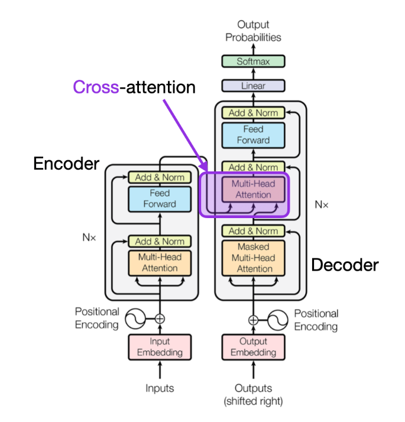

# Natural Language Processing (NLP)

## Tokenization

Tokenization is used in natural language processing (NLP) to split paragraphs and sentences into smaller units that can be more easily assigned semantics.


<div style="display: flex; justify-content: center;">
      
</div>
</br>

where model refers to tokenizer model not LLM/transformer.
Post-processor is tokenizer-added special process such as adding `[CLS]` and `[SPE]` to the start and end of a sentence.

The general rule is that, exhaustively go through all corpus and find most common combinations of letters/characters/symbols that are believed containing rich semantics.

### English Tokenization

In English, tense can provide rich info about action/behavior.
For example, for this sentence "A boy is playing football.", the word "playing" can be tokenized to two words `play` and `##ing`, where the prefix `##` is used to represent special tokenization by tense.

||Representation|
|-|-|
|Simple|do/does|
|Present|am, is, are doing|
||have/has done|
|Past|was, were doing|
||had done|
|Future|will/shall do|
||am/is/are going to do|

Roots and affixes contain rich semantics.

For example, `bidirectional` can be split into `bi` (two-), `direction` and `al` (adjective indicator).

### Chinese Tokenization

In Chinese, splitting directly by individual Chinese characters is a bad approach.
Instead, need Chinese corpus to assist extracting semantic words rather than individual Chinese characters.

Given the below Chinese sentence for example, splitting character by character for "林行止" (this is a person name) into three tokens `林`, `行` and `止` that translate to "forest", "walking" and "stop" can make trouble for next step semantic processing. 

```txt
談到貿易戰的長遠影響，林行止表示貿易戰促使在中國的工廠搬遷到越南、寮國、印度、台灣甚至是馬來西亞，以避開關稅。
```

The tokenization should ideally give these results: 
`談到`, `貿易戰`, `的`, `長遠`, `影響`, `，`, `林行止`, `表示`, `貿易戰`, `促使`, `在`, `中國`, `的`, `工廠`, `搬遷`, `到`, `越南`, `、`, `寮國`, `、`, `印度`, `、`, `台灣`, `甚至`, `是`, `馬來西亞`, `，`, `以`, `避開`, `關稅` and `。`.

### WordPiece Tokenization

Wordpiece tokenizer is a type of subword tokenizer that splits words into subword units called *wordpieces*.

It trains tokenization by word pair combination probability
For example, `playing` by letter tokenization there is `p`, `l`, `a`, `y`, `i`, `n`, `g`;  after training on texts should see tokenization results `play` and `##ing` that are most likely observed letter combinations in corpus.

$$
\max_{\text{letter\_pair}} \text{score} =
\frac{\text{frequency\_of\_pair}}{\text{frequency\_of\_first\_letter} \times \text{frequency\_of\_second\_letter}}
$$

Wordpiece has special symbols (defined in Hugging Face's `transformers.BertTokenizer`):

* `unk_token` (string, optional, defaults to `[UNK]`, token_id = 100) – The unknown token. A token that is not in the vocabulary cannot be converted to an ID and is set to be this token instead.

* `sep_token` (string, optional, defaults to `[SEP]`, token_id = 102) – The separator token, which is used when building a sequence from multiple sequences, e.g. two sequences for sequence classification or for a text and a question for question answering. It is also used as the last token of a sequence built with special tokens.

* `pad_token` (string, optional, defaults to `[PAD]`, token_id = 0) – The token used for padding, for example when batching sequences of different lengths.

* `cls_token` (string, optional, defaults to `[CLS]`, token_id = 101) – The classifier token which is used when doing sequence classification (classification of the whole sequence instead of per-token classification). It is the first token of the sequence when built with special tokens.

* `mask_token` (string, optional, defaults to `[MASK]`, token_id = 103) – The token used for masking values. This is the token used when training this model with masked language modeling. This is the token which the model will try to predict.

Wordpiece is used in BERT covering a total of 30522 tokens.

### Byte Pair Encoding (BPE) Tokenization

Byte pair encoding (BPE): the most common pair of consecutive bytes of data is replaced with a byte that does not occur in that data.
At each iterative step, BPE replaces symbols pair by pair (each substitution only contains two repeated symbols).

#### BPE in English Vocab Tokenization

Similarly, in NLP tokenization, BPE ensures that the most common words are represented in the vocabulary as a single token while the rare words are broken down into two or more sub-word token.

Letter pairs are hashed until all hash representations combinations are unique.

```txt
This is a boy, and that is a toy, and that one is another toy.
```

First do normalization and pre-tokenization

```py
['this', 'is', 'a', 'boy', 'and', 'that', 'is', 'a', 'toy', 'and', 'that', 'one', 'is', 'another', 'toy']
```

Count the letter pair combinations, merge letter pairs with occurrences more than once,
until all combinations are unique, or having covered the whole pre-token length:
$$
\begin{matrix}
      \text{1st round counting} & \text{2nd round counting} & \text{3rd round counting} \\
      (\text{t}, \text{h}): 4 & (\text{th}, \text{is}): 1 & (\text{th}, \text{is}): 1 \\
      (\text{h}, \text{i}): 1 & (\text{th}, \text{at}): 2 & (\text{that}): 2 \\
      (\text{i}, \text{s}): 4 & (\text{is}): 3 & (\text{is}): 2 \\
      (\text{a}): 2      & (\text{a}): 2       & (\text{a}): 2 \\
      (\text{t}, \text{o}): 2 & (\text{to}, \text{y}): 2 & (\text{toy}): 2 \\
      (\text{o}, \text{y}): 3 & (\text{o}, \text{y}): 1 &  (\text{o}, \text{y}): 1 \\
      (\text{a}, \text{n}): 3 & (\text{an}, \text{d}): 2 & (\text{and}): 2 \\
      (\text{n}, \text{d}): 2 & (\text{th}, \text{e}): 1 & (\text{th}, \text{e}): 1 \\
      (\text{h}, \text{a}): 2 & \\
      (\text{a}, \text{t}): 2 & (\text{at}): 2 \\
      (\text{b}, \text{o}): 1 & (\text{b}, \text{o}): 1 & (\text{b}, \text{o}): 1 \\
      (\text{o}, \text{n}): 1 & (\text{o}, \text{n}): 1 & (\text{o}, \text{n}): 1 \\
      (\text{n}, \text{e}): 1 & (\text{n}, \text{e}): 1 & (\text{n}, \text{e}): 1 \\
      (\text{n}, \text{o}): 1 & (\text{n}, \text{o}): 1 & (\text{n}, \text{o}): 1 \\
      (\text{o}, \text{t}): 1 & (\text{o}, \text{t}): 1 & (\text{o}, \text{t}): 1 \\
      (\text{h}, \text{e}): 1 & (\text{h}, \text{e}): 1 & (\text{h}, \text{e}): 1 \\
      (\text{e}, \text{r}): 1 & (\text{e}, \text{r}): 1 & (\text{e}, \text{r}): 1 \\
\end{matrix}
$$

The example text sentence is split into this list.

```python
['that', 'is' 'toy', 'and', 'th', 'e', 'a', 'b', 'o', 'n', 'e', 't', 'h', 'r' ]
```


## Embeddings

Embeddings mean information representation and compression.

Typically, there are two embeddings in NLP:

* Semantics/linguistics
* Position

### Semantics/Linguistics

For example, the word "restaurants" has the below attributes:

* isNoun: $\{0, 0, 0, 1, 0\}$ for $\{\text{isVerb}, \text{isAdjective}, \text{isPronoun}, \text{isNoun}, \text{isAdverb}\}$
* isPlural: $\{1\}$ for $\{\text{isPlural}\}$  
* synonyms: $\{ 5623, 1850, 2639 \}$ (vocabulary index) for $\{ \text{hotel}, \text{bar}, \text{club} \}$
* antonyms: $\emptyset$
* frequent occurrences under what topics: $\{ 1203, 5358, 1276 \}$ (vocabulary index) for $\{ \text{eating}, \text{outing}, \text{gathering} \}$
* Term frequency-inverse document frequency (TF-IDF): $\{ 0.016, 0.01, 0.0, 0.005 \}$ , formula:
  * $\text{TF-IDF}_j = \text{Term Frequency}_{i,j} \times \text{Inverse Document Frequency}_{i}$, where
  * $\text{Term Frequency}_{i,j} = \frac{\text{Term i frequency in document j}}{\text{Total no. of terms in document j}}$
  * $\text{Inverse Document Frequency}_{i} = \log \frac{\text{Total no. of documents}}{\text{No. of documents containing term i}}$

Given the four sentences/documents,

```txt
There are many popular restaurants nearby this church.
Some restaurants offer breakfasts as early as 6:00 am to provide for prayers.
"The price and taste are all good.", said one prayer who has been a frequent visitor to this church since 1998.
However, Covid-19 has forced some restaurants to shut down for lack of revenue during the pandemic, and many prayers are complained about it.
```

The TF-IDF per sentence/document is computed as below.
|No.|Token|Term count (Doc 1)|Term count (Doc 2)|Term count (Doc 3)|Term count (Doc 4)|Document count|IDF|TF $\times$ IDF (Doc 1)|TF $\times$ IDF (Doc 2)|TF $\times$ IDF (Doc 3)|TF $\times$ IDF (Doc 4)|
|-|-|-|-|-|-|-|-|-|-|-|-|
|1|many|0.125|0|0|0.043478260869565216|2|0.301|0.038|0|0|0.013|
|2|popular|0.125|0|0|0|1|0.602|0.075|0|0|0|
|3|restaurants|0.125|0.07692307692307693|0|0.043478260869565216|3|0.125|0.016|0.01|0|0.005|
|4|nearby|0.125|0|0|0|1|0.602|0.075|0|0|0|
|5|church|0.125|0|0.047619047619047616|0|2|0.301|0.038|0|0.014|0|
|6|offer|0|0.07692307692307693|0|0|1|0.602|0|0.046|0|0|

For compression, one popular approach is encoder/decoder, where dataset is fed to machine learning study.

For example, by placing "restaurants" and "bar" together in a text dataset that only describes food, likely the attribute "topic" might have little information hence neglected (set to zeros) in embeddings.

### Positional Embeddings

Positional embeddings represent the position of a word in a sentence/document.
The order of how vocabularies are arranged in a sentence/document provides rich information in NLP.

Positional embeddings can be derived via machine learning as well as formula.
Transformer uses the below formulas to compute positional embeddings (PE).

$$
\begin{align*}
\text{PE}_{pos, 2i} &= \sin (pos / 10000^{\frac{2i}{d}}) \\
\text{PE}_{pos, 2i+1} &= \cos (pos / 10000^{\frac{2i}{d}})  
\end{align*}
$$
where $pos$ is the position of a word in a sentence/document; $d$ is the vectorized output size/dimension; $2i$ means even number dimensions; $2i+1$ means odd number dimensions.

Recall that $\sin(A+B)=\sin(A)\cos(B)+\cos(A)\sin(B)$ and $\cos(A+B)=\cos(A)\cos(B)-\sin(A)\sin(B)$, for any given word token distance $k$, the corresponding positional embedding $\text{PE}(pos+k)$ can be computed easily by existing $\text{PE}(pos)$.

### Practice

`Word2Vec` is a popular python lib for embeddings
```bash
pip install nltk
pip install gensim
```

Prepare tokenized data into a matrix: each row is a sentence/document; each element in a row is a word.
Then, build the model.

The continuous bag-of-words (CBOW) model is an embedding mechanism trained on predicting a target word given the context of the surrounding words.

<div style="display: flex; justify-content: center;">
      
</div>
</br>

The code goes as below.

```python
from nltk.tokenize import sent_tokenize, word_tokenize
import gensim

with open("articles.txt", "r") as openfile:
    all_docs = openfile.read()

data = []
# iterate through each sentence in the file
for i in sent_tokenize(all_docs):
    temp = []
    # tokenize the sentence into words
    for j in word_tokenize(i):
        temp.append(j.lower())
 
    data.append(temp)

# Create CBOW model:
#    min_count: the min num of words to predict
#    vector_size: the embedding output vector size of one word
#    window: the number of token to look back as the context
cbowModel = gensim.models.Word2Vec(data, min_count = 1,
                              vector_size = 100, window = 8)
```

### Embedding by Deep Learning

Above embedding designs contain rich semantics.
However, embeddings can be trained by large corpus such as by BERT base there is embeddings $W_{EmbBertBase} \in \mathbb{R}^{30522 \times 768}$ corresponding to $30522$ tokens.

Tokens are assigned a id such as $2023$ for "This", and it is one-hot encoded.

$$
\bold{t}_{i=2023} = \text{OneHotEncoding}(2023) = 
[\underbrace{0, 0, 0, 0, 0, 0, 0, 0, ..., 0}_{\times 2022}, 1, \underbrace{0, 0, 0, 0, 0, 0, 0, 0, ..., 0}_{\times (30522 - 1 - 2022)}]
$$

By matrix multiplication, the token's embedding is retrieved from $E_{emb}$.

$$
W_{EmbBertBase}^{\top} \bold{t}_i \in \mathbb{R}^{1 \times 768}
$$

<div style="display: flex; justify-content: center;">
      
</div>
</br>

In Hugging face, there is

```python
from transformers import BertTokenizer, BertModel

tokenizer = BertTokenizer.from_pretrained('bert-base-uncased')
model = BertModel.from_pretrained("bert-base-uncased")

embedding_matrix = model.embeddings.word_embeddings.weight
embedding_this = embedding_matrix[2023]
print(embedding_this.size()) # print "torch.Size([768])"
print(embedding_matrix[2023][:10]) # top 10 embs are tensor([-0.0571,  0.0153, -0.0047,  0.0105, -0.0279,  0.0218, -0.0006,  0.0224,
                                   # 0.0225,  0.0135], grad_fn=<SliceBackward0>)
```

### Embedding Vector Similarity: Cosine Similarity

*Cosine similarity* between two vector $\bold{v}_i, \bold{v}_j$ is define as

$$
similarity_{cos}(\bold{v}_i, \bold{v}_j) = \cos(\theta) = \frac{\bold{v}_i \cdot \bold{v}_j}{||\bold{v}_i || \space || \bold{v}_j ||}
$$

There is $\cos(\theta) \in [-1, 1]$, where $-1$ means being exactly opposite, $-1$ means being exactly the same, $0$ means orthogonality (being totally different).

*Cosine distance* is simply $1 - \cos(\theta)$.

Cosine similarity can be used for two embeddings' comparison.
If predicted embeddings are very similar to an existing token's embedding, such embeddings can be said this token's representation.

## Transformer

Transformer is the most popular component in LLM (Large Language Model) for NLP tasks.

The transformer building blocks are scaled dot-product attention units.

<div style="display: flex; justify-content: center;">
      
</div>
</br>


### Self-Attention and Multi-Head Attention

Given $Q$ for query, $K$ for key, $V$ for value, a simple self-attention can be computed as

$$
\text{attention}(Q,K,V) = \text{softmax} \Big( \frac{Q K^{\top}}{\sqrt{d_k}} \Big) V
$$
where $\text{softmax} (\bold{x}) = \frac{e^{\bold{x}}}{\sum^K_{k=1}e^{\bold{x}}}$ in which $\bold{x}=\frac{Q K^{\top}}{\sqrt{d_k}}$.

* 1st MatMul: $Q K^{\top}$
* Scale: $\sqrt{d_k}$ is a scaling factor for each element of $Q K^{\top}$ 
* Mask: set partial input embeddings to zeros; this is useful in decoder where the predict words by decoder should not be affected by preceding input words.
* SoftMax: $\text{softmax} (\bold{x})$
* 2nd MatMul: $\text{softmax}(\bold{x}) \space V$

<div style="display: flex; justify-content: center;">
      
</div>
</br>

For multi-head attention, 

$$
\text{MultiHeadAttention}(Q,K,V) = \text{concat}(\text{attention}_1, \text{attention}_2, ..., \text{attention}_n) W
$$

Explained as below, denote $Z_i = \text{attention}_i$.
The linear weight matrix $W$ is used for linear transformation.

<div style="display: flex; justify-content: center;">
      
</div>
</br>

### Encoder

<div style="display: flex; justify-content: center;">
      
</div>
</br>

The *Add & Norm* refers to residual addition then normalization.

Residual addition earned its name in ResNet to prevent vanishing in gradient descent.
It is implemented in transformer as well.

$$
\begin{align*}
& \text{LayerNorm} \big( X + \text{MultiHeadAttention}(X) \big) \\
& \text{LayerNorm} \big( X + \text{FeedForward}(X) \big)  
\end{align*}
$$

<div style="display: flex; justify-content: center;">
      
</div>
</br>

The *Feed Forward* layer is a typical neural network layer such as below

$$
\text{FeedForward}(X) = \sigma(W_1^{\top} X + b_1)^{\top} W_2 + b_2
$$
where $\sigma(X)$ is an activation function.
In transformer, ReLU is used.

### Decoder

<div style="display: flex; justify-content: center;">
      
</div>
</br>

* The 1st attention heads: masked $Q K^{\top}$ is used to avoid interference of preceding input embeddings.
* The 2nd attention heads: used encoder's key $K$ and value $V$, used previous layer (attention heads)'s query $Q$ as input

### Cross-Attention

In self-attention, transformer works with the same input sequence.
In cross-attention, transformer mixes two different input sequences.

<div style="display: flex; justify-content: center;">
      
</div>
</br>

In hugging face, comparing between encoder vs decoder for BERT, the decoder needs `add_cross_attention=True` as config.

```python
model_enc = BertGenerationEncoder.from_pretrained(model_base_name, 
                                            output_hidden_states=True,
                                            output_attentions=True,
                                            bos_token_id=tokenizer.get_vocab()["[CLS]"], 
                                            eos_token_id=tokenizer.get_vocab()["[SEP]"])
model_dec = BertGenerationDecoder.from_pretrained(model_base_name, 
                                            add_cross_attention=True, 
                                            is_decoder=True, 
                                            output_hidden_states=True,
                                            output_attentions=True,
                                            bos_token_id=tokenizer.get_vocab()["[CLS]"], 
                                            eos_token_id=tokenizer.get_vocab()["[SEP]"])
```

To construct a encoder-decoder architecture, first put data `input_ids=dataInput.input_ids` to encoder, whose outputs serve as query $Q$ and key $K$ to decoder via `encoder_hidden_states=model_enc_outputs.last_hidden_state`.
The value $V$ is `input_ids=dataOutput.input_ids` to decoder.

Finally, `model_dec_outputs.logits` is the result probability distribution of all vocabs.
The corresponding token can be found by softmax `token_id = torch.argmax(torch.softmax(outputs.logits[0][0], dim=0))`.

```python
model_enc_outputs = model_enc(                
                input_ids=dataInput.input_ids,
                attention_mask=dataInput.attention_mask,
                )

model_dec_outputs = model_dec(    
            input_ids=dataOutput.input_ids,
            attention_mask=dataOutput.attention_mask,
            encoder_hidden_states=model_enc_outputs.last_hidden_state,
            encoder_attention_mask=dataInput.attention_mask,
            labels=None,
            )
```


## Outputs

### Logits

*Logits* basically means raw predictions which come out of the last layer of a classification neural network.

If the model is solving a multi-class classification problem (e.g., predict a token from $30522$ candidates), logits typically becomes an input to the softmax function.

```python
print(outputs.logits.size()) # print "torch.Size([1, 7, 30522])" for [batch_size, seq_len, vocab_size]

# convert logits to token representation
token_id = torch.argmax(torch.softmax(outputs.logits[0][0], dim=0))
tokenizer.convert_ids_to_tokens(token_id)
```


## LLM Training Strategies/Tasks in NLP

### Optimizer Considerations

The source input of NLP is tokens from text vocabulary, and some vocabs are frequently used and some are rarely used.

By input embedding layer such as BERT base's wordpiece embedding $\bold{x}: \mathbb{R}^{1 \times 768} \rightarrow \mathbb{R}^{30522 \times 768}$ then by normalization to ${\bold{x}}_{emb-norm} \in \mathbb{R}^{1 \times 768}$ then being fed to transformer, it is 

### Training By NLP Tasks

Models are trained in different tasks to build resilience against various inputs.

* Masked language modeling (MLM)

Randomly remove words (usually $15\%$) from a sentence.
Train this model to predict the missing words.

* Next sentence prediction (NSP)

Train this model to predict a next sentence given a number of context sentences.