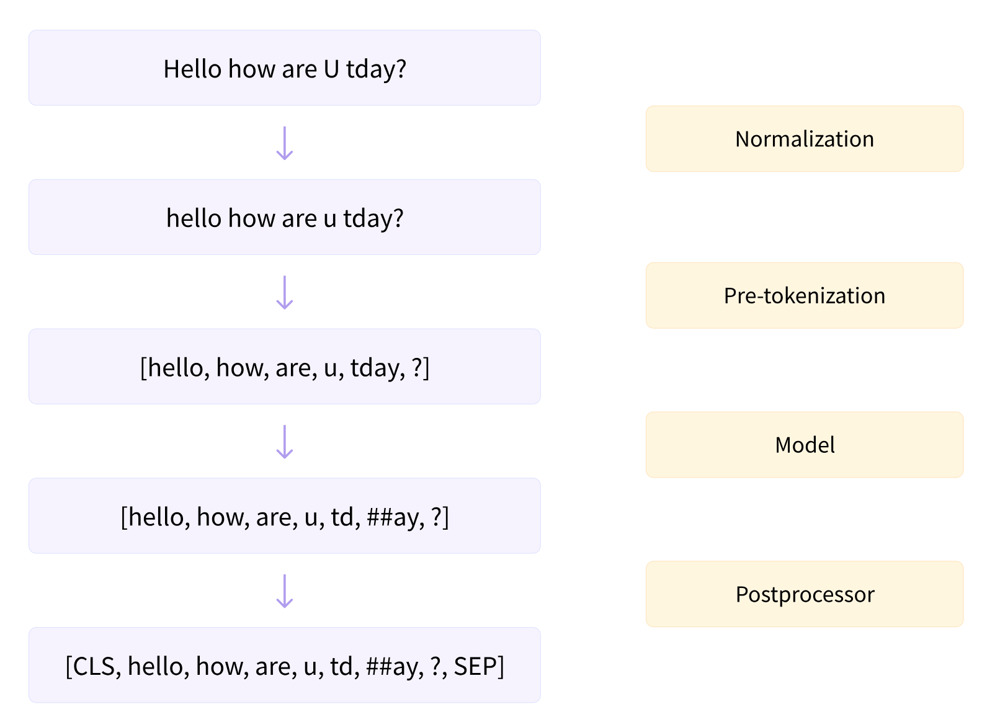
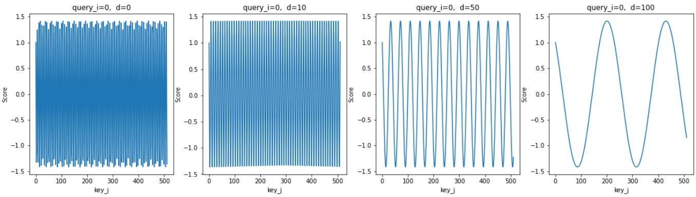
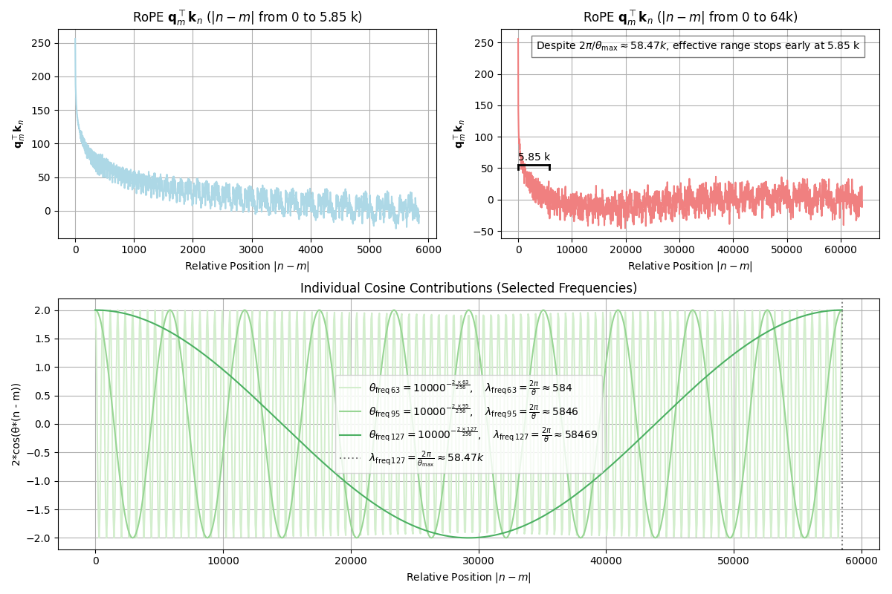
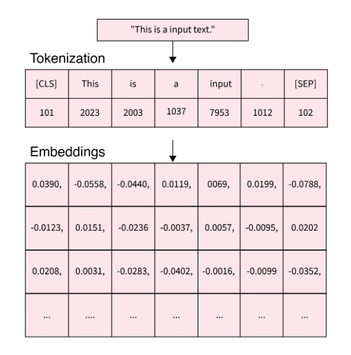

# Tokenization and Embeddings

## Tokenization

Tokenization is used in natural language processing (NLP) to split paragraphs and sentences into smaller units that can be more easily assigned semantics.


<div style="display: flex; justify-content: center;">
      
</div>
</br>

where model refers to tokenizer model not LLM/transformer.
Post-processor is tokenizer-added special process such as adding `[CLS]` and `[SPE]` to the start and end of a sentence.

The general rule is that, exhaustively go through all corpus and find most common combinations of letters/characters/symbols that are believed containing rich semantics.

### English Tokenization

In English, tense can provide rich info about action/behavior.
For example, for this sentence "A boy is playing football.", the word "playing" can be tokenized to two words `play` and `##ing`, where the prefix `##` is used to represent special tokenization by tense.

||Representation|
|-|-|
|Simple|do/does|
|Present|am, is, are doing|
||have/has done|
|Past|was, were doing|
||had done|
|Future|will/shall do|
||am/is/are going to do|

Roots and affixes contain rich semantics.

For example, `bidirectional` can be split into `bi` (two-), `direction` and `al` (adjective indicator).

### Chinese Tokenization

In Chinese, splitting directly by individual Chinese characters is a bad approach.
Instead, need Chinese corpus to assist extracting semantic words rather than individual Chinese characters.

Given the below Chinese sentence for example, splitting character by character for "林行止" (this is a person name) into three tokens `林`, `行` and `止` that translate to "forest", "walking" and "stop" can make trouble for next step semantic processing. 

```txt
談到貿易戰的長遠影響，林行止表示貿易戰促使在中國的工廠搬遷到越南、寮國、印度、台灣甚至是馬來西亞，以避開關稅。
```

The tokenization should ideally give these results: 
`談到`, `貿易戰`, `的`, `長遠`, `影響`, `，`, `林行止`, `表示`, `貿易戰`, `促使`, `在`, `中國`, `的`, `工廠`, `搬遷`, `到`, `越南`, `、`, `寮國`, `、`, `印度`, `、`, `台灣`, `甚至`, `是`, `馬來西亞`, `，`, `以`, `避開`, `關稅` and `。`.

### WordPiece Tokenization

Wordpiece tokenizer is a type of subword tokenizer that splits words into subword units called *wordpieces*.

It trains tokenization by word pair combination probability
For example, `playing` by letter tokenization there is `p`, `l`, `a`, `y`, `i`, `n`, `g`;  after training on texts should see tokenization results `play` and `##ing` that are most likely observed letter combinations in corpus.

$$
\max_{\text{letter\_pair}} \text{score} =
\frac{\text{frequency\_of\_pair}}{\text{frequency\_of\_first\_letter} \times \text{frequency\_of\_second\_letter}}
$$

Wordpiece has special symbols (defined in Hugging Face's `transformers.BertTokenizer`):

* `unk_token` (string, optional, defaults to `[UNK]`, token_id = 100) – The unknown token. A token that is not in the vocabulary cannot be converted to an ID and is set to be this token instead.

* `sep_token` (string, optional, defaults to `[SEP]`, token_id = 102) – The separator token, which is used when building a sequence from multiple sequences, e.g. two sequences for sequence classification or for a text and a question for question answering. It is also used as the last token of a sequence built with special tokens.

* `pad_token` (string, optional, defaults to `[PAD]`, token_id = 0) – The token used for padding, for example when batching sequences of different lengths.

* `cls_token` (string, optional, defaults to `[CLS]`, token_id = 101) – The classifier token which is used when doing sequence classification (classification of the whole sequence instead of per-token classification). It is the first token of the sequence when built with special tokens.

* `mask_token` (string, optional, defaults to `[MASK]`, token_id = 103) – The token used for masking values. This is the token used when training this model with masked language modeling. This is the token which the model will try to predict.

Wordpiece is used in BERT covering a total of 30522 tokens.

### Byte Pair Encoding (BPE) Tokenization

Byte pair encoding (BPE): the most common pair of consecutive bytes of data is replaced with a byte that does not occur in that data.
At each iterative step, BPE replaces symbols pair by pair (each substitution only contains two repeated symbols).

#### BPE in English Vocab Tokenization

Similarly, in NLP tokenization, BPE ensures that the most common words are represented in the vocabulary as a single token while the rare words are broken down into two or more sub-word token.

Letter pairs are hashed until all hash representations combinations are unique.

```txt
This is a boy, and that is a toy, and that one is another toy.
```

First do normalization and pre-tokenization

```py
['this', 'is', 'a', 'boy', 'and', 'that', 'is', 'a', 'toy', 'and', 'that', 'one', 'is', 'another', 'toy']
```

Count the letter pair combinations, merge letter pairs with occurrences more than once,
until all combinations are unique, or having covered the whole pre-token length:
$$
\begin{matrix}
      \text{1st round counting} & \text{2nd round counting} & \text{3rd round counting} \\
      (\text{t}, \text{h}): 4 & (\text{th}, \text{is}): 1 & (\text{th}, \text{is}): 1 \\
      (\text{h}, \text{i}): 1 & (\text{th}, \text{at}): 2 & (\text{that}): 2 \\
      (\text{i}, \text{s}): 4 & (\text{is}): 3 & (\text{is}): 2 \\
      (\text{a}): 2      & (\text{a}): 2       & (\text{a}): 2 \\
      (\text{t}, \text{o}): 2 & (\text{to}, \text{y}): 2 & (\text{toy}): 2 \\
      (\text{o}, \text{y}): 3 & (\text{o}, \text{y}): 1 &  (\text{o}, \text{y}): 1 \\
      (\text{a}, \text{n}): 3 & (\text{an}, \text{d}): 2 & (\text{and}): 2 \\
      (\text{n}, \text{d}): 2 & (\text{th}, \text{e}): 1 & (\text{th}, \text{e}): 1 \\
      (\text{h}, \text{a}): 2 & \\
      (\text{a}, \text{t}): 2 & (\text{at}): 2 \\
      (\text{b}, \text{o}): 1 & (\text{b}, \text{o}): 1 & (\text{b}, \text{o}): 1 \\
      (\text{o}, \text{n}): 1 & (\text{o}, \text{n}): 1 & (\text{o}, \text{n}): 1 \\
      (\text{n}, \text{e}): 1 & (\text{n}, \text{e}): 1 & (\text{n}, \text{e}): 1 \\
      (\text{n}, \text{o}): 1 & (\text{n}, \text{o}): 1 & (\text{n}, \text{o}): 1 \\
      (\text{o}, \text{t}): 1 & (\text{o}, \text{t}): 1 & (\text{o}, \text{t}): 1 \\
      (\text{h}, \text{e}): 1 & (\text{h}, \text{e}): 1 & (\text{h}, \text{e}): 1 \\
      (\text{e}, \text{r}): 1 & (\text{e}, \text{r}): 1 & (\text{e}, \text{r}): 1 \\
\end{matrix}
$$

The example text sentence is split into this list.

```python
['that', 'is' 'toy', 'and', 'th', 'e', 'a', 'b', 'o', 'n', 'e', 't', 'h', 'r' ]
```


## Embeddings

Embeddings mean information representation and compression, representing a token as a vector.

### Semantics/Linguistics

For example, the word "restaurants" has the below attributes:

* isNoun: $\{0, 0, 0, 1, 0\}$ for $\{\text{isVerb}, \text{isAdjective}, \text{isPronoun}, \text{isNoun}, \text{isAdverb}\}$
* isPlural: $\{1\}$ for $\{\text{isPlural}\}$  
* synonyms: $\{ 5623, 1850, 2639 \}$ (vocabulary index) for $\{ \text{hotel}, \text{bar}, \text{club} \}$
* antonyms: $\emptyset$
* frequent occurrences under what topics: $\{ 1203, 5358, 1276 \}$ (vocabulary index) for $\{ \text{eating}, \text{outing}, \text{gathering} \}$
* Term frequency-inverse document frequency (TF-IDF): $\{ 0.016, 0.01, 0.0, 0.005 \}$ , formula:
  * $\text{TF-IDF}_j = \text{Term Frequency}_{i,j} \times \text{Inverse Document Frequency}_{i}$, where
  * $\text{Term Frequency}_{i,j} = \frac{\text{Term i frequency in document j}}{\text{Total no. of terms in document j}}$
  * $\text{Inverse Document Frequency}_{i} = \log \frac{\text{Total no. of documents}}{\text{No. of documents containing term i}}$

Given the four sentences/documents,

```txt
There are many popular restaurants nearby this church.
Some restaurants offer breakfasts as early as 6:00 am to provide for prayers.
"The price and taste are all good.", said one prayer who has been a frequent visitor to this church since 1998.
However, Covid-19 has forced some restaurants to shut down for lack of revenue during the pandemic, and many prayers are complained about it.
```

The TF-IDF per sentence/document is computed as below.
|No.|Token|Term count (Doc 1)|Term count (Doc 2)|Term count (Doc 3)|Term count (Doc 4)|Document count|IDF|TF $\times$ IDF (Doc 1)|TF $\times$ IDF (Doc 2)|TF $\times$ IDF (Doc 3)|TF $\times$ IDF (Doc 4)|
|-|-|-|-|-|-|-|-|-|-|-|-|
|1|many|0.125|0|0|0.043478260869565216|2|0.301|0.038|0|0|0.013|
|2|popular|0.125|0|0|0|1|0.602|0.075|0|0|0|
|3|restaurants|0.125|0.07692307692307693|0|0.043478260869565216|3|0.125|0.016|0.01|0|0.005|
|4|nearby|0.125|0|0|0|1|0.602|0.075|0|0|0|
|5|church|0.125|0|0.047619047619047616|0|2|0.301|0.038|0|0.014|0|
|6|offer|0|0.07692307692307693|0|0|1|0.602|0|0.046|0|0|

For compression, one popular approach is encoder/decoder, where dataset is fed to machine learning study.

For example, by placing "restaurants" and "bar" together in a text dataset that only describes food, likely the attribute "topic" might have little information hence neglected (set to zeros) in embeddings.

### Rotational Positional Embeddings (RoPE)

https://zhuanlan.zhihu.com/p/662790439

Positional embeddings represent the position of a word in a sentence/document.
The order of how vocabularies are arranged in a sentence/document provides rich information in NLP.

Transformer uses the below formulas to compute positional embeddings (PE).

$$
\begin{align*}
\text{PE}(i) &= R (\bold{\theta}_i)
\qquad
\text{where } \bold{\theta}_i = 10000^{-\frac{2i}{\bold{d}}}
\end{align*}
$$

where $\bold{d}=\{ 1,2,...,D \} \in \mathbb{Z}^{+}$ is a vector of dimension indices, then define $\bold{\theta}_i=10000^{-\frac{2i}{\bold{d}}}$, where $\bold{\theta}_i = \{ {\theta}_{i_{1}}, {\theta}_{i_{2}}, ..., {\theta}_{i_{D}} \}$,
and $i \in \mathbb{Z}^{+}$ is the position of a word in a sentence/document.

#### RoPE Derivation

Define a score to be maximized when query $\bold{q}_i$ is positionally "close" to key $\bold{k}_j$.
The $i$ and $j$ individually represent the positions of query and key in a sentence/document, hence $i-j$ represents the relative position gap.

$$
\max \text{score}(\bold{q}_i, \bold{k}_j) =
(\bold{q}_i + \bold{p}_{i-j})^{\top} (\bold{k}_j + \bold{p}_{i-j}) - \bold{p}^{\top}_{i-j} \bold{p}_{i-j}
$$

where $\bold{p}_{i-j}$ serves as a linear relative position gap.

This design's motivation is that in NLP, if a query word is adjacent to a key word, they should be highly semantically related. 
Their multiplication value should be large, otherwise small, so that attention mechanism can easily produce differences during matrix multiplication in this regard.

Here uses sinusoid to represent the relative position gap by a rotation matrix $R_{i-j}$ to replace the above linear position gap $\bold{p}_{i-j}$.
Sinusoid not only decreases fast in $\text{score}(\bold{q}_i, \bold{k}_j)$ as positional gap grows against linear decrease by $\bold{p}_{i-j}$, but also has sinusoidal patterns that recursively see highs and lows in different relative position gaps $|i-j|$ with respects to different dimensions $d$.

Set $\bold{q}_i=R_{i}\bold{q}_1$ and $\bold{k}_j=R_{j}\bold{k}_1$ so that their position info is represented via rotation matrices $R_{i}$ and $R_{j}$, there is

$$
\max \text{score}(\bold{q}_i, \bold{k}_j) =
(R_{i} \bold{q}_1)^{\top} (R_{j} \bold{k}_1) =
\bold{q}_1^{\top} R_{i}^{\top}  R_{j} \bold{k}_1 =
\bold{q}_1^{\top} R_{i-j} \bold{k}_1
$$

Now use and $\theta_i \in (10^{-4}, 1]$ such that $\theta_i=10000^{-\frac{2i}{\bold{d}}}$ to assign discrete values to $R_{i-j}$.

Let $D$ represent the dimension of $\bold{v}_i \in \mathbb{R}^{1 \times D}$.
Let $R(\theta)$ be a rotation matrix for a vector $\bold{v}_i$, there is 

$$
\cos(\theta) = \frac{\bold{v}_i \cdot \bold{v}_j}{||\bold{v}_i || \space || \bold{v}_j ||}
\qquad
R (\theta) = \begin{bmatrix}
      \cos \theta & -\sin \theta \\
      \sin \theta & \cos \theta \\
\end{bmatrix}
$$

Rotation relative info can be computed by $R_{\theta_{i}-\theta_{j}}=R_{\theta_{i}}^{\top}{R_{\theta_{j}}}$, there is

$$
R(\theta) = \begin{bmatrix}
    \cos \theta_1 & -\sin \theta_1 & 0 & 0 & & & 0 & 0 \\
    \sin \theta_1 & \cos \theta_1 & 0 & 0 & & & 0 & 0 \\
    0 & 0 & \cos \theta_2 & -\sin \theta_2 & & & 0 & 0 \\
    0 & 0 & \sin \theta_2 & \cos \theta_2 & & & 0 & 0 \\
    & & & & \ddots & \ddots & & & \\
    & & & & \ddots & \ddots & & & \\
    0 & 0 & 0 & 0 & & & \cos \theta_{D/2} & -\sin \theta_{D/2} \\
    0 & 0 & 0 & 0 & & & \sin \theta_{D/2} & \cos \theta_{D/2} \\
\end{bmatrix}
$$

If $\bold{v} \in \mathbb{R}^{2 \times D}$, there is

$$
\begin{align*}
  R(\theta) \bold{v} &=
  \begin{bmatrix}
      \cos \theta & -\sin \theta \\
      \sin \theta & \cos \theta \\
  \end{bmatrix}
  \begin{bmatrix}
      \bold{v}_1 \\
      \bold{v}_2 \\
  \end{bmatrix}
\\ &=
  \begin{bmatrix}
      \bold{v}_1 \cos \theta - \bold{v}_2 \sin \theta \\
     \bold{v}_1  \sin \theta + \bold{v}_2 \cos \theta \\
  \end{bmatrix}
\\ &=
\begin{bmatrix}
      \bold{v}_1 \\ \bold{v}_2 
\end{bmatrix} \odot
\begin{bmatrix}
      \cos \theta \\ \cos \theta
\end{bmatrix} +
\begin{bmatrix}
      \bold{v}_1 \\ \bold{v}_2
\end{bmatrix} \odot
\begin{bmatrix}
      -\sin \theta \\ \sin \theta
\end{bmatrix}
\end{align*}
$$

where $\odot$ is element-wise multiplication operator.

If $\bold{v} \in \mathbb{R}^{n \times D}$, where $n$ is the num of tokens
Here sets $n=D$, there is

$$
R(\theta) \bold{v} =
\begin{bmatrix}
      \bold{v}_1 \\ \bold{v}_2 \\ \bold{v}_3 \\ \bold{v}_4 \\ \vdots \\ \bold{v}_{D-1} \\ \bold{v}_{D}
\end{bmatrix} \odot
\begin{bmatrix}
      \cos \theta_1 \\ \cos \theta_1  \\ \cos \theta_2 \\ \cos \theta_2 \\ \vdots \\ \cos \theta_{D/2} \\ \cos \theta_{D/2}
\end{bmatrix} +
\begin{bmatrix}
      \bold{v}_1 \\ \bold{v}_2 \\ \bold{v}_3 \\ \bold{v}_4 \\ \vdots \\ \bold{v}_{D-1} \\ \bold{v}_{D}
\end{bmatrix} \odot
\begin{bmatrix}
      -\sin \theta_1 \\ \sin \theta_1  \\ -\sin \theta_2 \\ \sin \theta_2 \\ \vdots \\ -\sin \theta_{D/2} \\ \sin \theta_{D/2}
\end{bmatrix}
$$


For a query token $\bold{q}_{1}$ (set $i=1$ as base position reference index since only relative positional gap is concerned here), plot score $\text{score}(\bold{q}_1, \bold{k}_j)$ for key tokens at growing distances $\bold{k}_{j}$ for $j=1,2,...,512$ and $j=1,2,...,65535$.
These two plots show the scores as a key $\bold{k}_j$'s positional distance ($\text{dist}=|i-j|$) to $\bold{q}_{1}$ grows.

For comparison, both query and key token are set to $\bold{1}$ such that $\bold{q}_i=\{ \underbrace{1,1,1, ..., 1 }_{D=256} \}$ and $\bold{k}_j=\{ \underbrace{1,1,1, ..., 1 }_{D=256} \}$, so that the scores' differences only reflect the rotational positional distance ($\bold{q}_1^{\top} R_{1-j} \bold{k}_j$).

By matrix multiplication, score is the sum of each dimension divided by a normalization term $\sqrt{D}$ such that $\text{score}(\bold{q}_i, \bold{k}_j)=\bold{q}_1^{\top} R_{i-j} \bold{k}_1= \frac{1}{\sqrt{D}} \sum^D_{d=1} q_{1_{d}}^{\top} R_{(1-j)_{d}} {k}_{1_{d}}$.

The individual dimensions' scores for $i=1$ vs $j$ are shown as below.

* for low dimensions, sinusoids see complete cycles for small $|i-j|$;
* for high dimensions, sinusoids see complete cycles for large $|i-j|$.

By this design, each position embedding dimension learns about info regarding different $|i-j|$.

<div style="display: flex; justify-content: center;">
      
</div>
</br>

For summed score over all dimensions $\text{score}(\bold{q}_i, \bold{k}_j)=\frac{1}{\sqrt{D}} \sum^D_{d=1} q_{1_{d}}^{\top} R_{(1-j)_{d}} {k}_{1_{d}}$, 

* when they are close (small values of $|i-j|$), score is high;
* when they are far away (large values of $|i-j|$), score is low.

Figure 1 is the zoomed-in version of figure 2 for $j=1,2,...,512$.

<div style="display: flex; justify-content: center;">
      
</div>
</br>


### Embedding by Deep Learning

Above embedding designs contain rich semantics.
However, embeddings can be trained by large corpus such as by BERT base there is embeddings $W_{EmbBertBase} \in \mathbb{R}^{30522 \times 768}$ corresponding to $30522$ tokens.

Tokens are assigned a id such as $2023$ for "This", and it is one-hot encoded.

$$
\bold{t}_{i=2023} = \text{OneHotEncoding}(2023) = 
[\underbrace{0, 0, 0, 0, 0, 0, 0, 0, ..., 0}_{\times 2022}, 1, \underbrace{0, 0, 0, 0, 0, 0, 0, 0, ..., 0}_{\times (30522 - 1 - 2022)}]
$$

By matrix multiplication, the token's embedding is retrieved from $E_{emb}$.

$$
W_{EmbBertBase}^{\top} \bold{t}_i \in \mathbb{R}^{1 \times 768}
$$

<div style="display: flex; justify-content: center;">
      
</div>
</br>

In Hugging face, there is

```python
from transformers import BertTokenizer, BertModel

tokenizer = BertTokenizer.from_pretrained('bert-base-uncased')
model = BertModel.from_pretrained("bert-base-uncased")

embedding_matrix = model.embeddings.word_embeddings.weight
embedding_this = embedding_matrix[2023]
print(embedding_this.size()) # print "torch.Size([768])"
print(embedding_matrix[2023][:10]) # top 10 embs are tensor([-0.0571,  0.0153, -0.0047,  0.0105, -0.0279,  0.0218, -0.0006,  0.0224,
                                   # 0.0225,  0.0135], grad_fn=<SliceBackward0>)
```

### Embedding Vector Similarity: Cosine Similarity

*Cosine similarity* between two vector $\bold{v}_i, \bold{v}_j$ is define as

$$
similarity_{cos}(\bold{v}_i, \bold{v}_j) = \cos(\theta) = \frac{\bold{v}_i \cdot \bold{v}_j}{||\bold{v}_i || \space || \bold{v}_j ||}
$$

There is $\cos(\theta) \in [-1, 1]$, where $-1$ means being exactly opposite, $-1$ means being exactly the same, $0$ means orthogonality (being totally different).

*Cosine distance* is simply $1 - \cos(\theta)$.

Cosine similarity can be used for two embeddings' comparison.
If predicted embeddings are very similar to an existing token's embedding, such embeddings can be said this token's representation.

## Auto-Regressive (AR) vs Auto-Encoding (AE)

* Auto-Regressive (AR), often used in decoder

AR simply means prediction $x_t$ by previous step input $\{x_1, x_2, ..., x_{t-1}\}$:

$$
\max_{\bold{\theta}} \log P_{\bold{\theta}} (x_1, x_2, ..., x_T) \approx
\sum_{t=1}^T \log P_{\bold{\theta}} (x_t | x_1, x_2, ..., x_{t-1})
$$

where $\bold{\theta}$ is model parameters

* Auto-Encoding (AE), often used in encoder

AE attempts to predict randomly masked tokens $\bold{x}_{\bold{m}}$ by minimizing the below objective.
The input $\bold{x}_{\overline{\bold{m}}}$ (the remaining non-masked tokens) is whole texts in which tokens are partially and randomly masked.

$$
\max_{\bold{\theta}} \log P_{\bold{\theta}} (\bold{x}_{\bold{m}} | \bold{x}_{\overline{\bold{m}}}) \approx
\sum_{t=1}^T m_t \log P_{\bold{\theta}} (x_t | \bold{x}_{\overline{\bold{m}}} )
$$

where $m_t = \left\{ \begin{array}{c} 1 & \text{the } t \text{-th token is masked} \\ 0 & \text{the } t \text{-th token is Not masked}  \end{array} \right.$ so that the log likelihood loss is only concerned with the to-be-predicted masked tokens $\bold{x}_{\bold{m}}$ .

