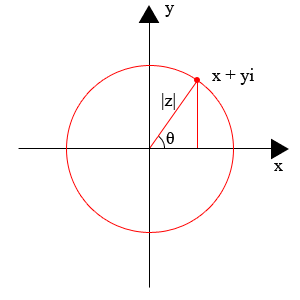
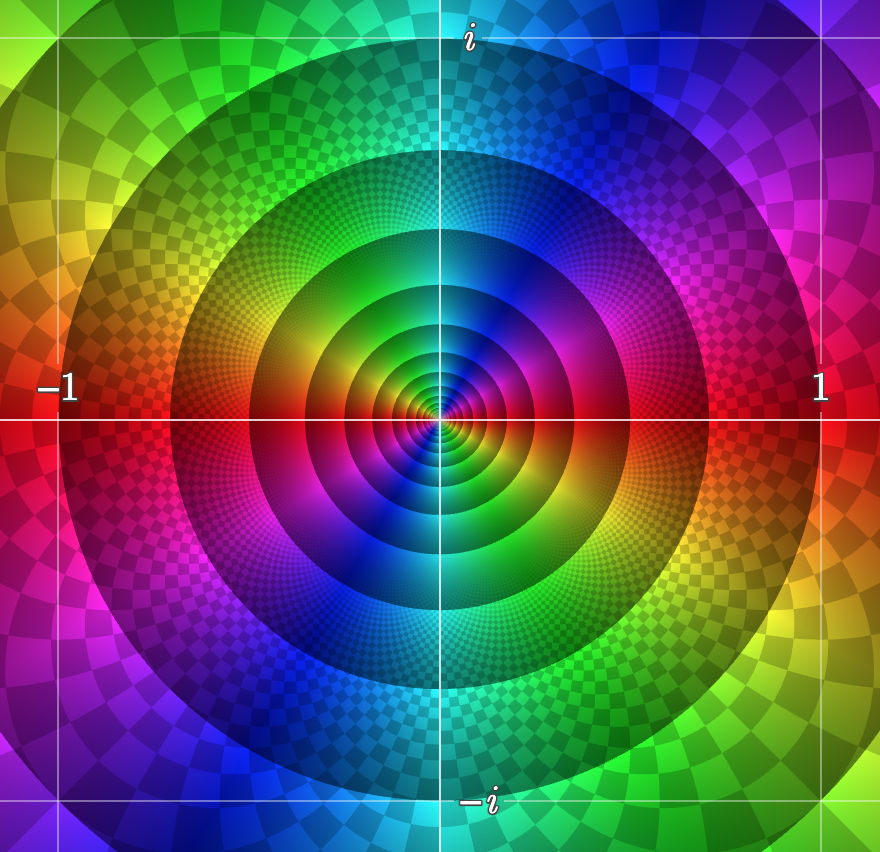
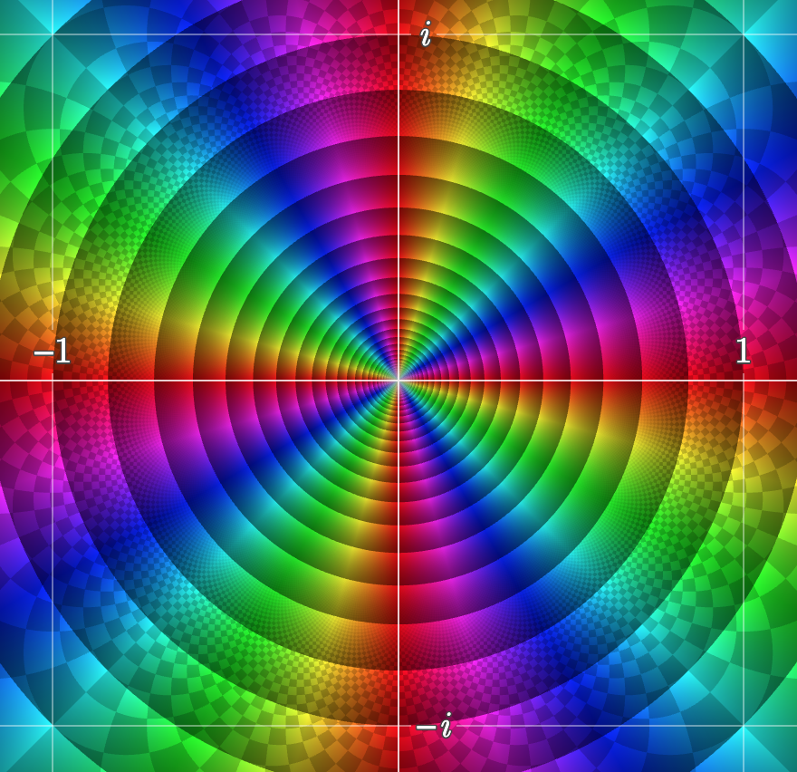

# Complex Analysis

Complex analysis is a study of complex variables.

## Imaginary Number

The imaginary number is defined as $i=\sqrt{-1}$.

### Complex Plane

Given the expansion of $\sin(x)$ and $\cos(x)$, substitute $-1$ with $i^2$, there are

$$
\begin{align*}
\sin(x) &= \sum_{n=0}^{\infty} (-1)^{n} \frac{x^{2n+1}}{(2n+1)!} &&&
\cos(x) &= \sum_{n=0}^{\infty} (-1)^{n} \frac{x^{2n}}{(2n)!} \\\\
&= \sum_{n=0}^{\infty} \big(\sqrt{-1}\big)^{2n} \frac{x^{2n+1}}{(2n+1)!} &&&
&= \sum_{n=0}^{\infty} \big(\sqrt{-1}\big)^{2n} \frac{x^{2n}}{(2n)!} \\\\
&= \sum_{n=0}^{\infty} i^{2n} \frac{x^{2n+1}}{(2n+1)!} &&&
&= \sum_{n=0}^{\infty} i^{2n} \frac{x^{2n}}{(2n)!} \\\\
\end{align*}
$$

Multiply $i$ to $\sin(x)$, there is $i\sum_{n=0}^{\infty} i^{2n+1} \frac{x^{2n+1}}{(2n+1)!}$.

Here derives Euler's formula:

$$
\begin{align*}
e^{\theta} =
& \sum_{n=0}^{\infty} \frac{{\theta}^n}{n!} \\\\
& = \cos(\theta) + i \space \sin(\theta)
\end{align*}
$$

Very convenient is that $e^{\theta} = \cos(\theta) + i \space \sin(\theta)$ can be summarized by the below circle on a complex plane.
By convention, it is often by this notation $e^{i\theta}$ to denote computation on a complex plane, in contrast to $e^x$ that is more about real number.

For example, $e^{i\frac{\pi}{2}}=\cos(\frac{\pi}{2})+i\sin(\frac{\pi}{2})=0+i$.

      

 

Further more, rotating $1$ by $180^{\circ}$ to its opposite $-1$ on a complex complex, there is (the beauty is that this one equation sees the presences of all most often used math symbols)

$$
e^{i\pi} = -1
$$

## Complex Functions

Define a complex plane $\mathbb{C}$, a complex function $f: \mathbb{C} \rightarrow \mathbb{C}$ can be defined as

$$
f(z)=f(x+iy)=u(x,y)+iv(x,y)
$$

where $u: \mathbb{R}^2 \rightarrow \mathbb{R}$ and $v: \mathbb{R}^2 \rightarrow \mathbb{R}$.

In other words, it is decomposed to two real-value function $u$ and $v$ of two real-value variables $x$ and $y$.

### Holomorphic Functions and Differentiability

Complex functions that are differentiable at every point of an open subset $\Omega$ of the complex plane are said to be *holomorphic* on $\Omega$.

$$
f'(z_0)=\lim_{z \rightarrow z_0}
\frac{f(z)-f(z_0)}{z-z_0}
$$

where $z=x+iy$.

For example, $f(z)=z^2$. There is

$$
f(z)=(x+iy)^2=
\underbrace{x^2-y^2}\_{u(x,y)}+
i\underbrace{2xy}\_{v(x,y)}
$$

The partial derivative is

$$
u_{x}'=2x \qquad
u_{y}'=-2y \qquad
v_{x}'=2y \qquad
v_{y}'=2x \qquad
$$

#### Cauchy-Riemann Condition

Cauchy-Riemann condition judges if a complex function $f$ is complex differentiable/holomorphic.

Cauchy-Riemann condition is a system of equations such as below.

$$
\frac{\partial u}{\partial x} = \frac{\partial v}{\partial y}
\qquad
\frac{\partial u}{\partial y} = -\frac{\partial v}{\partial x}
$$

For example, for $f(z)=z^2$, there are $u_{x}'=v_{y}'=2x$ and $u_{y}'=-v_{x}'=-2y$, and it can conclude that $f(z)=z^2$ is holomorphic.

### Meromorphic Functions

If **every point** on an open subset $\Omega$ is differentiable, the complex function is called holomorphic; if there are **finite order poles** that are NOT differentiable on the open subset $\Omega$, the complex function is called meromorphic function.

A pole is a point on complex plane at which the value of a function becomes infinite, e.g., $\frac{1}{z}$ is infinite at $z=0$, and $z=0$ is a pole.
Further more, $\frac{1}{z}$ can be said the first order pole,  $\frac{1}{z^2}$ the second order pole, etc.

For example, poles at $z=2,3,4,5$ make the below function meromorphic on the whole complex plane.

$$
f(z)=\frac{z+z^2+z^3}{(z-2)(z-3)(z-4)(z-5)}
$$

However, there are special cases called *essential singularity*, and these special cases are not considered meromorphic, nor holomorphic.

#### Essential Singularity

If poles are of finite orders, e.g., $\frac{1}{z}, \frac{1}{z^2}, ..., \frac{1}{z^n}$, and $n$ is a finite number, these poles are said to be removable by multiplying with a higher order number, e.g., $\frac{1}{z^2}$ can have its poles removed such as by $z = z^3 \cdot \frac{1}{z^2}$, and $f(z)=z$ is holomorphic.

If poles are not removable, they are called essential singularity points.

For example, $e^{\frac{1}{z}}=\sum_{n=0}^{\infty} \frac{n!}{z^n}$ has an essential singularity at $z=0$ for $n \rightarrow \infty$ is not a finite number, hence the pole $z=0$ is not removable.
$e^{\frac{1}{z}}$ is neither holomorphic, nor meromorphic.

Essential singularities are interesting for they exhibit "bizarre" behavior around the singularities than poles, that essential singularity has "extremely steep" slope/large derivative in contrast to poles'.
For example, below are comparison between $\frac{1}{z^2}$ vs $\frac{1}{z^4}$, that at around $z=0$, the higher negative order $\frac{1}{z^4}$ shows much faster increase of values (very dense contour lines), let alone for $\frac{1}{z^n}$ when $n \rightarrow \infty$.

      
      &nbsp;&nbsp;&nbsp;&nbsp;
      

 
