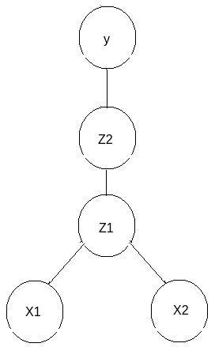
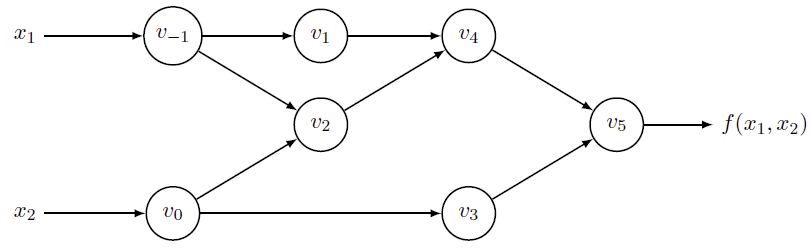

# Some Differential Rules

## Scalar and Vector Rule Table

|$\text{Scalar derivative} \\\\ f(x) \rightarrow \frac{df}{dx}$ | $\text{Vector derivative} \\\\ f(\mathbf{x}) \rightarrow \frac{df}{d\mathbf{x}}$|
|-|-|
|$bx \rightarrow b$|$\mathbf{x}^\mathsf{T} \mathbf{B} \rightarrow \mathbf{B}$|
|$bx \rightarrow b$|$\mathbf{x}^\mathsf{T} \mathbf{b} \rightarrow \mathbf{b}$|
|$x^2 \rightarrow 2x$|$\mathbf{x}^\mathsf{T}  \mathbf{x} \rightarrow 2\mathbf{x}$|
|$bx^2 \rightarrow 2bx$|$\mathbf{x}^\mathsf{T} \mathbf{B}  \mathbf{x} \rightarrow 2\mathbf{B}\mathbf{x}$|

## Chain Rule

$$
f'(x)=\big(g(h(x))\big)'=g'\big(h(x)\big) h'(x)
$$

For example,
$$
\begin{align*}
    && \frac{\partial y}{\partial x_1} &= 
    \frac{\partial y}{\partial z_2}
    \frac{\partial z_2}{\partial x_1}
    & && \frac{\partial y}{\partial x_2} &= 
    \frac{\partial y}{\partial z_2}
    \frac{\partial z_2}{\partial x_2}
    \\\\ && &=
    \frac{\partial y}{\partial z_2}
    \frac{\partial z_2}{\partial z_1}
    \frac{\partial z_1}{\partial x_1}
    & && &=
    \frac{\partial y}{\partial z_2}
    \frac{\partial z_2}{\partial z_1}
    \frac{\partial z_1}{\partial x_2}
\end{align*}
$$

      

 

## L'Hôpital's Rule 洛必达法则

L'Hôpital's rule states that for functions $f(x)$ and $g(x)$ which are differentiable on an open interval $x\in I$, except possibly at a point $c$ contained in $I$, given $\forall x\ne c,\quad  \lim_{x\rightarrow c} f(x)=\lim_{x\rightarrow c} g(x) = 0 \text{ or } +\infty$, and additionally $g'(x)\ne 0$ on $I$, there is

$$
\lim_{x\rightarrow c} \frac{f(x)}{g(x)}=
\lim_{x\rightarrow c} \frac{f'(x)}{g'(x)}
\quad\space\quad\space\quad \text{if } 
\footnotesize{\lim_{x\rightarrow c} \frac{f'(x)}{g'(x)}}
\normalsize{\text{ exists}}
$$

### Example: compute $\frac{\partial\space f(x,y)}{\partial\space x}$ for $f(x,y)=x^2+xy$ when $(x,y)=(1,3)$

$$
\begin{align*}
    && \frac{\partial\space f(x,y)}{\partial\space x} \bigg|_{(x,y)=(1,3)}
     &=
    \lim_{\epsilon \rightarrow 0} \frac{f(x+\Delta x,y)}{\Delta x}
    \\\\ \\\\ \begin{matrix}
        \text{Define an infinitesimal amount} \\\\
        \text{such that } \epsilon=\Delta x
    \end{matrix}
    \Rightarrow && &=
    \lim_{\epsilon \rightarrow 0} \frac{f(x+\epsilon,y)}{\epsilon}
    \\\\ && &=
    \lim_{\epsilon \rightarrow 0} \frac{(x+\epsilon)^2+(x+\epsilon)y}{\epsilon}
    \\\\ && &=
    \lim_{\epsilon \rightarrow 0} \frac{ \underbrace{x^2+xy}\_{=f(x,y)}
    +(2x+y)\epsilon+\epsilon^2}{\underbrace{\epsilon}\_{\frac{d \epsilon}{d \epsilon}=1}}
    \\\\ \begin{matrix}
        \text{By L'Hôpital's rule, there is} \\\\
        \lim_{(x,y)\rightarrow (1,3)} f(x,y)=0
    \end{matrix}
    \Rightarrow && &=
    \lim_{\epsilon \rightarrow 0} \frac{(2x+y)+2\epsilon}{1}
    \\\\ && &=
    2x+y
    \\\\ && &=2+3
    \\\\ && &=5
\end{align*}
$$

## Duals

### Dual Numbers

Dual numbers introduce an *infinitesimal* unit $\epsilon$ that has the property $\epsilon^2=0$ (analogously to imaginary number having the property $i^2=-1$). A dual number $a+v\epsilon$ has two components, the real component $a$ and the infinitesimal component $v$.

This simple change leads to a convenient method for computing exact derivatives without needing to manipulate complicated symbolic expressions.

For example, $f(x+\epsilon)$ can be expressed as

$$
\begin{align*}
    f(x+\epsilon) &=
    f(x) + kf(x)\epsilon + k^2f(x)\frac{\epsilon^2}{2} + k^3f(x)\frac{\epsilon^3}{6}
    \\\\ &=
    f(x) + kf(x)\epsilon 
\end{align*}
$$

### Dual Vectors

Any vector space $V$ has a corresponding dual vector space (or just dual space for short) consisting of all linear forms on $V$.

Define a  Jet: a Jet is a $n$-dimensional dual number: $\mathbf{\epsilon}=[\epsilon_1, \epsilon_2, ..., \epsilon_n]$ with the property $\forall i,j: \epsilon_i \epsilon_j=0$. Then a Jet consists of a real part $a$ and a $n$-dimensional infinitesimal part $\mathbf{v}$, i.e.,
$$
\begin{align*}
x &= a+\sum_{i=1}^{n} v_i \epsilon_i
\\\\ &= a + \mathbf{v}
\end{align*}
$$

Then, using the same Taylor series expansion used above, there is
$$
f(a+\mathbf{v})=f(a)+kf(a)\mathbf{v}
$$

Expand to a multivariate function $f: \mathbb{R}^n \rightarrow \mathbb{R}^m$ evaluated on $x_j=a_j+\mathbf{v}_j$

$$
\begin{align*}
f(\mathbf{x}) &=
f(x_1, x_2, ..., x_n)
\\&=
f(a_1, a_2, ..., a_n) + \sum_{j=1}^{n} k_j f(a_1, a_2, ..., a_n)\mathbf{v}_j
\end{align*}
$$

Set $\mathbf{v}_j=\mathbf{e}_j$ to be a unit vector, there is
$$
f(x_1, x_2, ..., x_n) =
f(a_1, a_2, ..., a_n) + \sum_{j=1}^{n} k_j f(a_1, a_2, ..., a_n)\mathbf{\epsilon}_j
$$

## Automatic Differentiation

Explained by this example: $f(x_1, x_2)=\ln(x_1)+x_1x_2-\sin(x_2)$, whose partial derivatives at $(x_1,x_2)=(2,5)$ are

$$
\begin{align*}
    \frac{\partial f}{\partial x_1} \bigg|_{(x_1,x_2)=(2,5)} &= \frac{1}{2} + 5 = 5.5
    \\\\
    \frac{\partial f}{\partial x_2} \bigg|_{(x_1,x_2)=(2,5)} &= 2 -\cos(5)
\end{align*}
$$

### Numerical Differentiation

Take $\mathbf{x}=(x_1, x_2)$, define a infinitesimal amount $\epsilon$ as a step, consider:

* Forward Differentiation

$$
\frac{\partial f(\mathbf{x})}{\partial x}
\approx
\frac{f(\mathbf{x}+\epsilon)-f(\mathbf{x})}{\epsilon}
$$

* Backward Differentiation

$$
\frac{\partial f(\mathbf{x})}{\partial x}
\approx
\frac{f(\mathbf{x})-f(\mathbf{x}-\epsilon)}{\epsilon}
$$

* Central Differentiation

$$
\frac{\partial f(\mathbf{x})}{\partial x}
\approx
\frac{f(\mathbf{x}+\epsilon)-f(\mathbf{x}-\epsilon)}{2\epsilon}
$$

Numerical differentiation only taking care of the final output is bad since it discards many intermediate steps, especially when the differentiation includes a long chain rule.

For example, compute $\frac{\partial f}{\partial x_1} \bigg|_{(x_1,x_2)=(2,5)}$ by forward differentiation, set $\epsilon=10^{-6}$, there is

$$
\begin{align*}
    \frac{\partial f(\mathbf{x})}{\partial x_1}
    \bigg|_{(x_1,x_2)=(2,5)}
    &\approx
    \frac{f(\mathbf{x}+\epsilon)-f(\mathbf{x})}{\epsilon}
    \\\\ &=
    \frac{\big(\ln(x_1+\epsilon)+(x_1+\epsilon)x_2-\sin(x_2)\big)-\big(\ln(x_1)+x_1x_2-\sin(x_2)\big)}{\epsilon}
    \\\\ &=
    \frac{\big(\ln(2+10^{-6})+(2+10^{-6})5-\sin(5)\big)-\big(\ln(2)+10-\sin(5)\big)}{10^{-6}}
    \\\\ &=
    \frac{\ln(2+10^{-6})-\ln(2)+5\cdot 10^{-6}}{10^{-6}}
    \\\\ &\approx 
    \frac{4.9999988\cdot 10^{-7}+5\cdot 10^{-6}}{10^{-6}}
    \\\\ &=
    0.49999988+5
    \\\\ &=
    5.49999988
\end{align*}
$$

### Automatic Differentiation

Automatic differentiation constructs a directed graph that dissects a chain rule differential into many elementary differentials, then adds them up to produce the final result.

In the example below, set $v_{-1}=x_1$ and $v_{0}=x_2$, so that 

$$
\left\{
    \begin{align*}
        v_1 &=\ln(v_{-1})=\ln(x_1)
        \\\\
        v_2 &=v_0v_{-1}=x_1 x_2
        \\\\
        v_3 &=v_1+v_2=\ln(x_1) + x_1 x_2
        \\\\
        v_4 &=-\sin(v_0)=-\sin(x_2)
        \\\\
        v_5 &=v_3+v_4=\ln(x_1)+x_1x_2-\sin(x_2)
    \end{align*}
\right.
$$

      

 

* Forward Mode

Below only compute partial derivative on $x_1$ noted as $\dot{f}(x_1,x_2)=\frac{\partial f(x_1,x_2)}{\partial x_1}$, hence there are $\dot{v}\_{-1}=\dot{x}_1=1$ and $\dot{v}\_{0}=\dot{x}_2=0$.

The forward mode computes derivatives along side with the primals $f(x_1,x_2)$.

$$
\begin{matrix}
    &\downarrow& v_{-1} &= x_1 && &= 2
    && &\downarrow& \dot{v}\_{-1} &= \dot{x}_1 && &=1
    \\\\
    &\downarrow& v_{0} &= x_2 && &= 5
    && &\downarrow& \dot{v}\_{0} &= \dot{x}_2 && &=0
    \\\\ &\downarrow&---- &----&&&--------&& &\downarrow&
    ----& ----&& &--------\\\\
    &\downarrow&
    v_{1} &= \ln(v_{-1}) && &= \ln(2)
    && &\downarrow& \dot{v}\_{1} &= \frac{\dot{v_{-1}}}{v_{-1}} && &= \frac{1}{2}
    \\\\ &\downarrow&
    v_{2} &= v_{-1} \cdot v_0 && &= 2 \times 5 = 10
    && &\downarrow& \dot{v}\_{2} &= \dot{v}\_{-1} \cdot {v}_0 + v_{-1} \cdot \dot{v}_0 && &= 1 \times 5 + 0 \times 2 = 5
    \\\\ &\downarrow&
    v_{3} &= \sin(v_0) && &= \sin(5)
    && &\downarrow& \dot{v}\_{3} &= \dot{v_0} \times \cos(v_0) && &= 0 \times \cos(5)=0
    \\\\ &\downarrow&
    v_{4} &= v_1+v_2 && &= \ln(2)+10
    && &\downarrow& \dot{v}\_{4} &= \dot{v}_1+\dot{v}_2 && &= \frac{1}{2}+5=5.5
    \\\\ &\downarrow&
    v_{5} &= v_4-v_3 && &= \ln(2)+10-\sin(5)
    && &\downarrow& \dot{v}\_{5} &= \dot{v}_4-\dot{v}_3 && &= 5.5-0=5.5
    \\\\ &\downarrow&---- &----&&&--------&& &\downarrow&
    ----& ----&& &--------\\\\    &\downarrow&
    f(x_1,x_2)&= v_5 && &= \ln(2)+10-\sin(5)
    && &\downarrow& \dot{f}(x_1,x_2) &= \dot{v}_5 && &=5.5
\end{matrix}
$$

Partial derivative on $x_2$ can be computed similarly by setting $\dot{v}\_{-1}=\dot{x}_1=0$ and $\dot{v}\_{0}=\dot{x}_2=1$.

* Backward Mode

Once finished primal computation, backward mode starts from the output setting $\dot{v}_5=\dot{f}(x_1,x_2)=1$, then move towards $\dot{x}_1$ and $\dot{x}_2$ with differentials $\dot{v}_k=\frac{\partial v_k}{\partial f}=\frac{\partial v_k}{\partial v_{k+1}}\frac{\partial v_{k+1}}{\partial v_{k+2}}...\frac{\partial v_{n}}{\partial f}$.
In other words, it reverses the directed graph computing from $v_5$ to $v_{-1}$ and $v_0$.

$$
\begin{matrix}
    &\downarrow& v_{-1} &= x_1 && &= 2
    && &\uparrow& \dot{x}\_{1} &= \dot{v}\_{-1} && &=5.5 \\\\
    &\downarrow& v_{0} &= x_2 && &= 5
    && &\uparrow& \dot{x}\_{2} &= \dot{v}_0 && &=2-\cos(5)
    \\\\ &\downarrow&---- &----&&&--------&& &\uparrow&
    ----& ----&& &--------
    \\&\downarrow&
    v_{1} &= \ln(v_{-1}) && &= \ln(2)
    && &\uparrow&
    \dot{v}\_{-1} &= \dot{v}\_{-1} + \dot{v}\_{1}\frac{\dot{v_{1}}}{v_{-1}}=\dot{v}\_{-1} + \dot{v}\_{1}\frac{1}{v_{-1}} && &= 5 + \frac{1}{2} = 5.5
    \\\\ &\downarrow&
    v_{2} &= v_{-1} \cdot v_0 && &= 2 \times 5 = 10
    && &\uparrow&
    \dot{v}\_{0} &= \dot{v}\_{0} + \dot{v}_2\frac{\partial v_2}{\partial v_0}=\dot{v}_0+\dot{v}_2 \cdot v_{-1} && &= -\cos(5)+1\times 2=2-\cos(5)
    \\\\ &\downarrow& &&&&&& &\uparrow&
    \dot{v}\_{-1} &= \dot{v}_2\frac{\partial v_2}{\partial v_{-1}} = \dot{v}_2 \cdot v_0 && &=1\times 5=5
    \\\\ &\downarrow&
    v_{3} &= \sin(v_0) && &= \sin(5)
    && &\uparrow&
    \dot{v}\_{0} &= \dot{v}_3\frac{\partial v_3}{\partial v_0} = \dot{v}_3 \cdot \cos(v_0)=0 && &= -\cos(5)
    \\\\ &\downarrow&
    v_{4} &= v_1+v_2 && &= \ln(2)+10
    && &\uparrow&
    \dot{v}\_{1} &= \dot{v}_4\frac{\partial v_4}{\partial v_1} = \dot{v}_4 \cdot 1 && &=1
    \\\\ &\downarrow& &&&&&& &\uparrow&
    \dot{v}\_{2} &= \dot{v}_4\frac{\partial v_4}{\partial v_2} = \dot{v}_4 \cdot 1 && &=1
    \\\\ &\downarrow&
    v_{5} &= v_4-v_3 && &= \ln(2)+10-\sin(5)
    && &\uparrow&
    \dot{v}\_{3} &= \dot{v}_5\frac{\partial v_5}{\partial v_3} = \dot{v}_5 \cdot (-1) && &=-1
    \\\\ &\downarrow& &&&&&& &\uparrow&
    \dot{v}\_{4} &= \dot{v}_5\frac{\partial v_5}{\partial v_4} = \dot{v}_5 \cdot 1 && &=1
    \\\\ &\downarrow&---- &----&&&--------&& &\uparrow&
    ----& ----&& &--------
    \\\\ &\downarrow&
    f(x_1,x_2)&= v_5 && &= \ln(2)+10-\sin(5)
    && &\uparrow& \dot{v}_5 &= \dot{f}(x_1,x_2)  && &=1
\end{matrix}
$$

### Discussions

Since forward mode computes partial derivative one by one with respect to each dimension, 