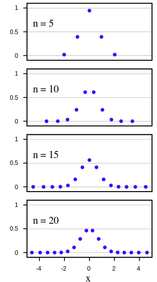

# Gauss–Hermite quadrature

A quadrature rule is an approximation of the definite integral of a function, usually stated as a weighted sum of function values at specified points within the domain of integration. 

$$
\int_a^b f(x) dx
\approx
\sum_{i=1}^n w_i f(x_i)
$$

An $n$-point Gaussian quadrature rule measures polynomials of degree $2n-1$ or less.

## Hermite polynomials

*physicist's Hermite polynomials*:

$$
h_n(x) =
(-1)^n e^{x^2}
\frac{d^n}{dx^n} e^{-x^2}
$$

### Symmetry

$$
h_n(-x) = (-1)^n h_n(x)
$$

### Orthogonality

Orthogonality of two functions is defined as
$$
<f,g>=
\int f(x) g(x) dx = 0
$$

$h_n(x)$ for $n=0,1,2,...$ are orthogonal with respect to the weight function $w(x)=e^{-x^2}$, so that

$$
\int_{-\infty}^{+\infty} 
h_m(x) h_n(x) w(x) dx 
= 0
\quad
\forall \space m \ne n
$$

### Examples

$$
\begin{align*}

h_0(x) &= 1
\\
h_1(x) &= 2x
\\
h_2(x) &= 4x^2-2
\\
h_3(x) &= 8x^3-12x
\\
h_4(x) &= 16x^4-48x^2+12

\end{align*}
$$

##  Gauss–Hermite quadrature definition

Gauss–Hermite quadrature is a form of Gaussian quadrature for approximating the value of integrals of the following kind:
$$
\int_{-\infty}^{+\infty} 
e^{-x^2} f(x) dx
\approx
\sum_{i=1}^n 
w_i f(x_i)
$$
where, given $x_i$ are the roots of physicist's Hermite polynomial $h_{n}(x)$, $w_i$ can be expressed as
$$
w_i =
\frac{
    2^{n-1} n! \sqrt{\pi}
}{
    n^2 \big(
        h_{n-1}(x_i)
        \big)^2
}
$$

## Example

Consider a function $h(y)$, where the variable y is Normally distributed: $y \sim N(\mu, \sigma^2)$. $h$ can be linear or non-linear transformation of the normal distribution input $y$.

Its expectation is
$$
E\big(h(y)\big)
=
\int_{-\infty}^{+\infty}
\frac{1}{\sigma \sqrt{2\pi}}
e^{-\frac{(y-\mu)^2}{2\sigma^2}}
h(y) dy
$$ 

To make the integral compliant with the form of Hermite polynomial by
$$
\begin{align*}
x&=
\frac{y-\mu}{\sqrt{2}\sigma}
\\
y&=
\sqrt{2} \sigma x + \mu
\end{align*}
$$
and if $y=\phi(x)$, then
$$
\int_a^b g(y) dy = 
\int_{\phi^{-1}(a)}^{\phi^{-1}(b)}
g(\phi(x))\phi'(x) dx
$$

Coupled with the integration by substitution,
$$
\begin{align*}

E\big(h(y)\big)
&=
\int_{-\infty}^{+\infty}
\frac{1}{\sigma \sqrt{2\pi}}
e^{-\frac{(y-\mu)^2}{2\sigma^2}}
h(y) dy
\\ &=
\int_{-\infty}^{+\infty}
\frac{1}{\sqrt{\pi}}
e^{-x^2}
h(\sqrt{2} \sigma x + \mu)
dx
\\ &\approx
\frac{1}{\sqrt{\pi}}
\sum_{i=1}^n w_i h(\sqrt{2} \sigma x_i + \mu)

\end{align*}
$$

