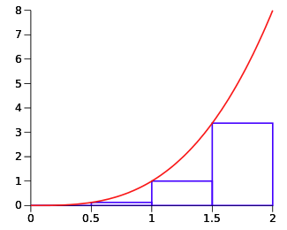

# Riemann sum

A Riemann sum is a certain kind of approximation of an integral by a finite sum.

Let $f:[a,b] \rightarrow \mathbb{R}$ be a function defined on a closed interval $[a,b]$ on real number $\mathbb{R}$, and a set of partitions $P$
$$
\begin{align*}
P &=\{
    [x_0, x_1], [x_1, x_2], ..., [x_{n-1}, x_n]
\}
\\&= \{
    \Delta x_1, \Delta x_2, ..., \Delta x_n, 
\}
\end{align*}
$$

A Riemann sum $S$ is defined as
$$
S=\sum^n\_{i=1} f(x\_i^*) \Delta x\_i
$$
where $x\_i^* \in [x_{i-1}, x\_i]$.

Below is an example of *Left Riemann Sum*, where $x\_i^*=x_{i-1}$ for each partition.

