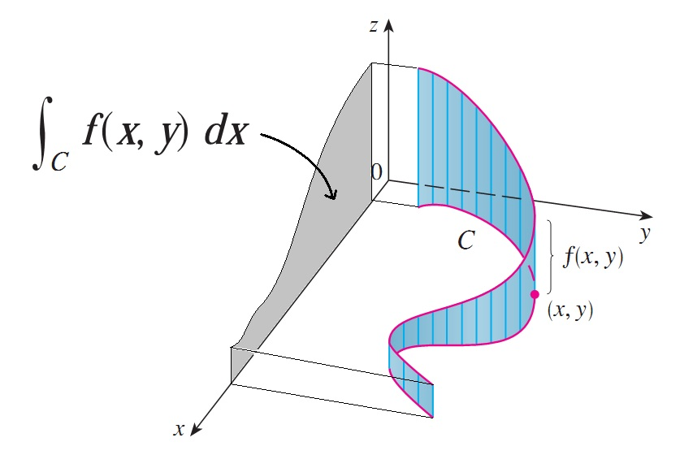

# Some Integral Rules

## Line Integral

Line integral is used for vector field function. Intuitively, line integral works on curve that does not flow along with integral direction, but  takes integral with respect to each integral direction.

      

 

### Example

Define a vector field
$$
\overrightarrow{F}(x,y) = P(x,y)\overrightarrow{i} + Q(x,y)\overrightarrow{j}
$$

Define a curve
$$
\overrightarrow{r}(t) = x(t)\overrightarrow{i} + y(t)\overrightarrow{j}
$$

The line integral of 
$\overrightarrow{F}$ along $C$ is

$$
\int_C \overrightarrow{F} \cdot d \overrightarrow{r}
=
\int^a_b \overrightarrow{F}(\overrightarrow{r}(t)) \cdot \overrightarrow{r}'(t) dt
$$

where
$$
\overrightarrow{F}(\overrightarrow{r}(t)) = \overrightarrow{F}(x(t), y(t))
$$

## Leibniz Integral Rule

Leibniz integral rule describes the derivative rule of an integral with respect to two diff variables.

Given an integral form
$$
\int^{b(x)}_{a(x)} f(x,t) dt
$$

for $-\infty < a(x) < b(x) < +\infty$, its derivative is
$$
\frac{d}{dx} 
\bigg(
    \int^{b(x)}_{a(x)} f(x,t) dt
\bigg)
=
\\
f\big(x,b(x)\big)\cdot \frac{d \space b(x)}{dx}
-
f\big(x,a(x)\big)\cdot \frac{d \space a(x)}{dx}
+
\int^{b(x)}_{a(x)} \frac{\partial}{\partial x} f(x,t) dt
$$

If $a(x)=c_a$ and $b(x)=c_b$, where $c_a, c_b$ are constant, $f\big(x,b(x)\big)\cdot \frac{d \space b(x)}{dx}$ and $f\big(x,a(x)\big)\cdot \frac{d \space a(x)}{dx}$ are zeros, there is
$$
\frac{d}{dx} 
\bigg(
    \int^{c_b}_{c_a} f(x,t) dt
\bigg)
=
\int^{c_b}_{c_a} \frac{\partial}{\partial x} f(x,t) dt
$$
