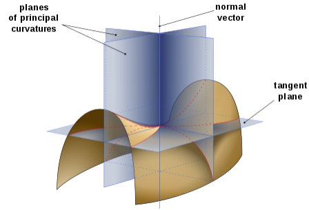

# Principal Curvature

In differential geometry, principal curvature is the curvature of a curve with respect to the curve's dimension. 

Two principal curvatures at a given point of a surface are the maximum and minimum values of the curvature as expressed by the eigenvalues of the shape operator at that point. 

They measure how the surface bends by different amounts in different directions at that point.

      

 

