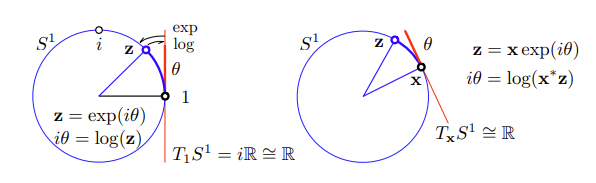
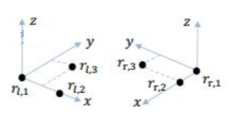

# Lie and Robotics

## Motivation

The three-dimensional rotation
matrix $R$ constitutes the *special orthogonal group* $SO(3)$, and the transformation matrix $t$
constitutes the *special Euclidean group* $SE(3)$.
$$
\begin{align*}
SO(3) &=
\big\{
      R \in \mathbb{R}^{3 \times 3} | RR^\text{T} = I , det(R) = 1 
\big\}
\\
SE(3) &= 
\bigg\{
   T = 
    \begin{bmatrix}
        R & t \\
        0 & 1
    \end{bmatrix}
    \in \mathbb{R}^{4 \times 4}
    |
    R \in SO(3), t \in \mathbb{R}^3
\bigg\}
\end{align*}
$$

Matrix operations on $SO(3)$ and $SE(3)$ should be well defined (the operation result should be contained in $SO(3)$ and $SE(3)$ spaces). 
For example, multiplication is well defined.
$$
\begin{align*}
R_1  R_2 &\in SO(3)
\\
T_1  T_2 &\in SE(3)
\end{align*}
$$

However, there is no definition of matrix addition, such that 
$$
\begin{align*}
R_1 + R_2 &\notin SO(3)
\\
T_1 + T_2 &\notin SE(3)
\end{align*}
$$

Addition is much simpler and faster in computation than multiplication. Better to have them.

Lie group and Lie algebra come in rescue that it uses the tangent of the rotation space to represent local information. The tangent is well defined in addition.

$SO(3)$ and $SE(3)$ are Lie group, whose Lie algebra are denoted as $so(3)$ and $se(3)$.

## Lie Bracket in Rotation

Given a rotation matrix $R$ that changes with time $t$, denoted as $R(t)$, for $R(t) \in SO(3)$, there is 
$$
\begin{align*}
R(t)R(t)^T=I
\\
R(t)R(t)^{-1}=I
\end{align*}
$$

By differential, there are
$$
\dot{R(t)}R(t)^T + R(t)\dot{R(t)^T} = 0 \\
\dot{R(t)}R(t)^T = -(\dot{R(t)}R(t)^T)^T
$$
where $\dot{R(t)}R(t)^T$ is a skew-symmetric matrix.

Remember one property of skew-symmetric matrix:
the space of a skew-symmetric matrices $A_{n \times n}$ has dimensionality $\frac{1}{2} n (n - 1)$, its vector representation is $a^{\wedge}_{\frac{1}{2} n (n - 1)}$, for example, for a $3 \times 3$ matrix, there is

$$
\bold{a}^{\wedge}
=
A =
\begin{bmatrix}
      0 & -a_3 & a_2 \\
      a_3 & 0 & -a_1 \\
      -a_2 & a_1    & 0
\end{bmatrix}
$$

Here uses $\wedge$ to represent a vector space of a skew-symmetric matrix.

Reversely, here defines a vector representation of a skew-symmetric matrix with $\vee$
$$
A = \bold{a}^\vee
$$

Since $\dot{R(t)}R(t)^T$ is a skew-symmetric matrix, here uses $\phi^{\wedge}$ to represent the multiplication result of $\dot{R(t)}R(t)^T$
$$
\phi^{\wedge} = \dot{R(t)}R(t)^T
$$

$$
\phi^{\wedge}R(t) = \dot{R(t)}
$$

First degree Taylor Series of $R$ at the time $t_0=0$ is shown as below.
$$
R(t) \approx R(t_0) + \dot{R(t_0)} (t-t_0)
\\
= I + \phi(t_0)^{\wedge}(t)
$$

Set $t=0$,
the above approximation becomes $R(0) = I$ for $\phi(t_0)^{\wedge}(0) = 0$.

Denote $\phi(t_0)=\phi_0$ for $\phi(t_0)$ is a constant within the vicinity of $t_0$.

Now compute $R(t)$, remember $\dot{R(t)} = \phi_0^{\wedge}R(t)$ is a homogeneous linear differential equation, so that its integral result is
$$
\begin{align*}

\int \dot{R(t)} &= 
\int \phi_0^{\wedge}R(t) dt
\\
R(t) &= 
e^{\phi^{\wedge}_0t}

\end{align*}
$$

Now define $so(3)$ and $se(3)$ (intuitively speaking, they represent translation/rotation vector forms)
$$
\begin{align*}
so(3) &= 
\{
    \phi \in \mathbb{R}^3 \text{or } {\Phi}^\wedge \in \mathbb{R}^{3 \times 3}
\}
\\
se(3) &= 
\bigg\{
    \xi = \begin{bmatrix}
        \rho \\
        \phi
    \end{bmatrix}
    \in \mathbb{R}^6,
    \rho \in \mathbb{R}^3 ,
    \phi \in so(3) ,
    {\Phi}^\wedge = \begin{bmatrix}
        \phi^\wedge & \rho \\
        0 & 0
    \end{bmatrix}
    \in \mathbb{R}^{4 \times 4}
\bigg\}
\end{align*}
$$

whose Lie brackets are
$$
\begin{align*}
[\phi_1, \phi_2] &= 
(\Phi_1 \Phi_2 - \Phi_2 \Phi_1)^\vee
\\
[\xi_1, \xi_2] &= 
(\xi_1^\wedge \xi_2^\wedge - \xi_2^\wedge \xi_1^\wedge)^\vee
\end{align*}
$$

where $\xi^\wedge$ represents $6$-dimensional vector to $4 \times 4$-dimensional matrix transformation, and $\xi^\vee$ refers to the opposite transformation from matrix to vector.

Lie bracket describes two Lie algebras' operations that elaborate local information (the differences between two elements) of corresponding Lie groups.

## Exponential and Logarithmic Mapping

Rotation matrix $R = e^{\phi^{\wedge}}$ is a complex operation. We want to just focus on $\phi^{\wedge}$.

For example, for a 2-dimensional rotation $\bold{z} = \bold{x}e^{i\theta}$, whose Lie algebra is $i\theta$ that sees rotation at a particular point. We can just do derivative on $i\theta$ rather than the difficult $\bold{z}$, that gives approximately the same result, since the changes on tangent and direct derivative on its corresponding group are almost the same.

### Exponential Mapping $so(3) \mapsto SO(3)$

Define a unit vector $\bold{v}$; remember *Rodrigues’s Rotation Formula* that describes the matrix representation over a 3-dimensional angle $\theta$. Here derives the exponential mapping $so(3) \mapsto SO(3)$.
$$
\begin{align*}
R &= e^{\phi^{\wedge}} 
=
e^{\theta \bold{v}^{\wedge}} 
\\ &= 
\sum_{n=0}^{\infty} \frac{{(\theta \bold{v}^{\wedge}})^n}{n!}
\\ &=
cos \theta I + (1 - cos \theta)\bold{v} \bold{v}^\text{T} + sin\theta \bold{v}^{\wedge}
\end{align*}
$$

### Logarithmic Mapping $SO(3) \mapsto so(3)$

Conversely, there is $so(3) \mapsto SO(3)$, and here derives the logarithmic mapping via Taylor series expansion.

Remember $\phi^{\wedge} = \theta \bold{v}^{\wedge}$, and $\bold{v}^{\wedge} \bold{v}^{\wedge} = \bold{v}\bold{v}^\text{T}-I$, $\bold{v}^{\wedge}  \bold{v}^{\wedge} \bold{v}^{\wedge} = -\bold{v}^{\wedge}$
$$
\begin{align*}
    \phi &= ln(R)^\vee 
\\ &=
ln \big(
    e^{\phi^\wedge} 
\big)^\vee
\\ &=
  ln\bigg(
    \sum_{n=0}^{\infty} \frac{{(\phi^\wedge)^n}}{n!}
  \bigg)^\vee
\\ &=
ln\bigg(
    \sum_{n=0}^{\infty} \frac{{(\dot{R}R^\text{T})^n}}{n!}
  \bigg)^\vee
\\ &=
\bigg(
    \sum^{\infty}_{n=0} \frac{(-1)^{n-1}}{n}
    (R-I)^{n}
\bigg)^\vee
\end{align*}
$$

### Exponential Mapping $se(3) \mapsto SE(3)$

$$
\begin{align*}
e^{\xi^\wedge} &= 
\begin{bmatrix}
    \sum_{n=0}^{\infty} \frac{{(\phi^\wedge)^n}}{n!} 
    &
    \sum_{n=0}^{\infty} \frac{{(\phi^\wedge)^n}}{(n+1)!} \bold{\rho}
    \\
    0 & 1
\end{bmatrix}
\\ & \overset{\Delta}{=}
\begin{bmatrix}
    R
    &
    J \bold{\rho}
    \\
    0 & 1
\end{bmatrix}
=
\begin{bmatrix}
    R
    &
    \bold{t}
    \\
    0 & 1
\end{bmatrix}
\\ &= t
\end{align*}
$$
where
$$
\begin{align*}
\sum_{n=0}^{\infty} \frac{{(\phi^\wedge)^n}}{(n+1)!}
&=
I + \frac{1}{2!}\theta \bold{v}^\wedge + \frac{1}{3!}\theta (\bold{v}^\wedge)^2 + ...
\\ &=
\frac{1}{\theta}(\frac{\theta^2}{2!}+\frac{\theta^4}{4!}+...)\bold{v}^\wedge +
\frac{1}{\theta}(\frac{\theta^3}{3!}+\frac{\theta^5}{5!}+...)(\bold{v}^\wedge)^2 +I
\\ &=
\frac{\bold{v}^\wedge}{\theta}(1-cos\theta)+
\frac{\theta-sin\theta}{\theta}(\bold{v}\bold{v}^\text{T}-I)+I
\\&=
\frac{sin\theta}{\theta} I + 
(1-\frac{sin \theta}{\theta})\bold{v}\bold{v}^\text{T} +
\frac{1-cos\theta}{\theta} \bold{v}^\wedge
\\ & \overset{\Delta}{=}
J
\end{align*}
$$

The above expression says the rotation part is just the same as $R$, and the translation part is a Jacobian times the translation vector.

### Logarithmic Mapping $SE(3) \mapsto se(3)$

Simply there is
$$
\begin{align*}
\xi^\wedge &= ln(T)
\\ &=
ln \begin{bmatrix}
    R & \bold{t} \\
    0 & 1
\end{bmatrix}
\\ &=
\begin{bmatrix}
    \phi^\wedge & \rho \\
    0 & 0
\end{bmatrix}
\end{align*}
$$

### Summary

|Lie Group||Conversion||Lie Algebra|
|-|-|-|-|-|
|$SO(3) \\ R=e^{\phi^\wedge} \in \mathbb{R}^{3 \times 3}$|$\rightarrow$|Logarithmic mapping:$\\ \theta = arccos \bigg(\frac{tr(R)-1}{2}\bigg) \\ R\bold{v}=\bold{v}$|$\rightarrow$|$so(3) \\ \phi \in \mathbb{R}^3$|
||$\leftarrow$|Exponential mapping: $e^{\theta \bold{v}^\wedge}$|$\leftarrow$||
|$SE(3) \\ t \in \mathbb{R}^{4 \times 4}$|$\rightarrow$|Logarithmic mapping:$\\ \theta = arccos \bigg(\frac{tr(R)-1}{2}\bigg) \\ R\bold{v}=\bold{v} \\ \bold{t}=J\rho$|$\rightarrow$|$se(3) \\ \xi=[\phi^\wedge \quad \rho] \in \mathbb{R}^6$|
||$\leftarrow$|Exponential mapping: $e^{\xi^\wedge}$|$\leftarrow$||

## Derivative

An important question is about rotation matrix derivative, such as given a 3-d point $\bold{p}$, here to compute
$$
\frac{\partial R\bold{p}}{\partial R}
$$

Given the definition of derivative such that
$$
\frac{\partial R}{\partial \Delta R}
=
lim_{\Delta R \rightarrow 0}
\frac{ (R \oplus \Delta R) - R}{\Delta R}
$$
where $\oplus \Delta R$ denotes the increment amount.
There is neither addition nor subtraction for $R$. Lie algebra can help instantiate $\oplus$.

There are two solutions to this problem.

* Derivative Model: $R$-corresponding Lie algebra $\phi$ adds a $\Delta \phi$, then compute the change rate on the $\Delta \phi$, so that 
$$
\frac{\partial R\bold{p}}{\partial R}
=
lim_{\Delta \phi \rightarrow 0} \frac{e^{(\Delta \phi + \phi)^{\wedge}}\bold{p} - e^{\phi^{\wedge}}\bold{p}}{\Delta \phi}
$$

* Perturbation Model: directly multiplying $\Delta R$ to either the left or the right of $R$ (added a trivial perturbation), then compute the derivative on the Lie algebra of the trivial perturbation $\Delta R$ denoted as $\psi$, so that
$$
\begin{align*}
\frac{\partial R\bold{p}}{\partial R}
& \approx
lim_{ \psi \rightarrow 0} \frac{e^{\psi^{\wedge}}e^{\phi^{\wedge}}\bold{p} - e^{\phi^{\wedge}}\bold{p}}{\psi}
\quad \text{Left Perturbation}
\\ & \approx
lim_{ \psi \rightarrow 0} \frac{e^{\phi^{\wedge}}e^{\psi^{\wedge}}\bold{p} - e^{\phi^{\wedge}}\bold{p}}{\psi}
\quad \text{Right Perturbation}
\end{align*}
$$

In practice, we set $\Delta R = 10^{-6}$. When applied perturbation to $R$, $\frac{\partial R\bold{p}}{\partial R}$ is nearly unaffected and remained the most of the derivative.

### BCH Formula and its Approximation

Recall the *BCH Formula and its Approximation*

$$
\begin{equation*}
ln(exp(\phi^{\wedge}_1)exp(\phi^{\wedge}_2))
\approx
\begin{cases}
          J_l(\phi_2)^{-1}\phi_1 + \phi_2 \quad &\text{if } \phi_1 \text{is sufficiently small} \\
          J_r(\phi_1)^{-1}\phi_2 + \phi_1 \quad &\text{if } \phi_2 \text{is sufficiently small} \\
     \end{cases}
\end{equation*}
$$

where $J_l$ and $J_r$ are 

$$
J_l = \frac{sin\theta}{\theta} I + (1 - \frac{sin\theta}{\theta})\bold{v}\bold{v}^\text{T} + \frac{1-cos\theta}{\theta}\bold{v}^{\wedge}
$$
whose derivative is 
$$
J^{-1}_l = \frac{\theta}{2}cot\frac{\theta}{2}I + (1-\frac{\theta}{2}cot\frac{\theta}{2})\bold{v}\bold{v}^\text{T} - \frac{\theta}{2}\bold{v}^{\wedge}
$$

and for the right multiple
$$
J_r(\phi) = J_l(-\phi)
$$

### Derivative Model

Now a point $p$ is rotated by $R$, hence the new position is $Rp$. To calculate $\frac{\partial Rp}{\partial R}$:
$$\begin{align*}
\frac{\partial R\bold{p}}{\partial R}
 & =
\frac{\partial e^{\phi^{\wedge}}\bold{p}}{\partial e^{\phi}}
\\ & =
lim_{\Delta \phi \rightarrow 0} \frac{e^{(\Delta \phi + \phi)^{\wedge}}\bold{p} - e^{\phi^{\wedge}}\bold{p}}{\Delta \phi}
\\ & =
lim_{\Delta \phi \rightarrow 0} \frac{e^{(J_l \Delta \phi)^{\wedge}}e^{\phi^{\wedge}}\bold{p} - e^{\phi^{\wedge}}\bold{p}}{\Delta \phi}
\\ & \approx
lim_{\Delta \phi \rightarrow 0} \frac{((I+J_l \Delta \phi)^{\wedge})e^{\phi^{\wedge}}\bold{p} - e^{\phi^{\wedge}}\bold{p}}{\Delta \phi}
\\ &=
lim_{\Delta \phi \rightarrow 0} \frac{(J_l \Delta \phi)^{\wedge} e^{\phi^{\wedge}}\bold{p}}{\Delta \phi}
\\ &=
lim_{\Delta \phi \rightarrow 0} \frac{-(e^{\phi^{\wedge}}\bold{p})^\wedge J_l \Delta \phi}{\Delta \phi}
\\ &=
-(e^{\phi^{\wedge}}\bold{p})^\wedge J_l
\\ & =
-(R\bold{p})^{\wedge}J_l
\end{align*}$$

### Perturbation Model

Apply a trivial perturbation $\Delta R$ and take partial derivative over this perturbation to avoid computing the Jacobian $J_l$:
$$\begin{align*}
\frac{\partial R \bold{p}}{\partial \Delta R}
 & =
\frac{\partial e^{\phi^{\wedge}}\bold{p}}{\partial \psi}
\\ & =
lim_{ \psi \rightarrow 0} \frac{e^{\psi^{\wedge}}e^{\phi^{\wedge}}\bold{p} - e^{\phi^{\wedge}}\bold{p}}{\psi}\\ & \approx
lim_{ \psi \rightarrow 0} \frac{(I+\psi^{\wedge})e^{\phi^{\wedge}}\bold{p} - e^{\phi^{\wedge}}\bold{p}}{ \psi}
\\ &=
lim_{ \psi \rightarrow 0} 
\frac{\psi^{\wedge}e^{\phi^{\wedge}}\bold{p} }{\psi}
\\ &=
lim_{ \psi \rightarrow 0} 
\frac{(e^{\phi^{\wedge}}\bold{p})^\wedge \psi }{\psi}
\\ & =
-(Rp)^{\wedge}
\end{align*}$$

### Perturbation Model Considered Both Translation and Rotation

Define $[R|T]$ as the transformation matrix to a point $\bold{p}$ and the perturbation as $\Delta \bold{\xi}$ (this time, both translation $T$'s perturbation $\Delta \bold{\rho}$ and rotation $R$'s perturbation $\Delta \bold{\phi}$ are included, so that $\Delta \bold{\xi} = [\Delta \bold{\rho}, \Delta \bold{\phi}]^\text{T}$), the derivative can be computed as the below

$$
\begin{align*}
    \frac{\partial ([R|T]\bold{p})}{\partial \Delta \bold{\xi}} &= 
    \underset{\Delta \bold{\xi} \rightarrow 0}{lim}
    \frac
    {e^{\Delta \bold{\xi}^{\wedge}}e^{ \bold{\xi}^{\wedge}}\bold{p}-e^{ \bold{\xi}^{\wedge}}\bold{p}}
    {\Delta \bold{\xi}}
    \\ &=
    \underset{\Delta \bold{\xi} \rightarrow 0}{lim}
    \frac
    {(I+{\Delta \bold{\xi}^{\wedge}})e^{ \bold{\xi}^{\wedge}}\bold{p}-e^{ \bold{\xi}^{\wedge}}\bold{p}}
    {\Delta \bold{\xi}}
    \\ &=
    \underset{\Delta \bold{\xi} \rightarrow 0}{lim}
    \frac
    {{\Delta \bold{\xi}^{\wedge}}e^{ \bold{\xi}^{\wedge}}\bold{p}}
    {\Delta \bold{\xi}}
    \\ &=
    \underset{\Delta \bold{\xi} \rightarrow 0}{lim}
    \frac
    {
        \begin{bmatrix}
            \Delta \bold{\phi} & \Delta \bold{\rho} \\
            \bold{0} & \bold{0}
        \end{bmatrix}
        \begin{bmatrix}
            R\bold{p}+T \\
            \bold{1}
        \end{bmatrix}
    }
    {\Delta \bold{\xi}}
    \\ &=
    \underset{[\Delta \bold{\rho}, \Delta \bold{\phi}]^\text{T} \rightarrow 0}{lim}
    \frac
    {
        \begin{bmatrix}
            \Delta \bold{\phi} (R\bold{p}+T) + \Delta \bold{\rho} \\
            \bold{0}
        \end{bmatrix}
    }
    {\begin{bmatrix}
        \Delta \bold{\rho} \\ 
        \Delta \bold{\phi}
    \end{bmatrix}}
    \\ &=
    \begin{bmatrix}
        \frac{\partial (\Delta \bold{\phi} (R\bold{p}+T) + \Delta \bold{\rho})}{\partial \Delta \bold{\rho}} & 
        \frac{\partial (\Delta \bold{\phi} (R\bold{p}+T) + \Delta \bold{\rho})}{\partial \Delta \bold{\phi}} \\
        \frac{\partial \bold{0}}{\partial \Delta \bold{\rho}} & 
        \frac{\partial \bold{0}}{\partial \Delta \bold{\phi}} 
    \end{bmatrix}
    \\ &=
    \begin{bmatrix}
        \bold{I} & R\bold{p}+T \\
        \bold{0} & \bold{0} 
    \end{bmatrix}
\end{align*}
$$

## Similar Transform Group $Sim(3)$ and Its Lie Algebra $sim(3)$

$Sim(3)$ adds scale information for monocular vision.

Define a $3$-d point $\bold{p}$ and its transformation result $\bold{p}'$
$$
\begin{align*}
    \bold{p}' &= \begin{bmatrix}
    s\bold{R} & \bold{t} \\
    \bold{0} & 1
    \end{bmatrix}
    \bold{p}
    \\ &=
    \begin{bmatrix}
    s\bold{R} & \bold{t} \\
    \bold{0} & 1
    \end{bmatrix}
    \begin{bmatrix}
        \bold{p} \\
        \bold{0}
    \end{bmatrix}
    \\ &=
    s\bold{R}\bold{p} + \bold{t}
\end{align*}
$$

Here give the definition to $Sim(3)$ and $sim(3)$. $\bold{\zeta}$ is a 7-dimensional
vector that has the same elements as $se(3)$ plus one scaling factor $\sigma$.
$$
\begin{align*}
Sim(3) &= \bigg\{
    \bold{S} = \begin{bmatrix}
        s\bold{R} & \bold{t} \\
        \bold{0} & 1
    \end{bmatrix}
    \in \mathbb{R}^{4 \times 4}
\bigg\}
\\
sim(3) &= \bigg\{
    \bold{\zeta} = \begin{bmatrix}
        \bold{\rho} \\
        \bold{\phi} \\
        \sigma
    \end{bmatrix}
    \in \mathbb{R}^{7}
    , \quad
    \bold{\zeta}^\wedge =
    \begin{bmatrix}
        \sigma \bold{I}+\bold{\phi}^\wedge & \bold{\rho} \\
        \bold{0} & \bold{0}
    \end{bmatrix}
    \in \mathbb{R}^{4 \times 4}
\bigg\}
\end{align*}
$$

### Solve $Sim(3)$ by Closed-form Solution of Absolute Orientation Using Unit Quaternions

Take three map points from the left hand side camera $\{\bold{r}_{l,1}, \bold{r}_{l,2}, \bold{r}_{l,3}\}$; 
three map points from the right hand side camera $\{\bold{r}_{r,1}, \bold{r}_{r,2}, \bold{r}_{r,3}\}$; 

Take $\bold{r}_{l,1}$ as the origin for the left hand side coordinate, then define the estimates for three dimensions:
* $\hat{\bold{x}}_l = {\bold{x}_l}/{||\bold{x}_l||},\qquad \bold{x}_l = \bold{r}_{l,2}-\bold{r}_{l,1}$
* $\hat{\bold{y}}_l = {\bold{y}_l}/{||\bold{y}_l||},\qquad \bold{y}_l = (\bold{r}_{l,3}-\bold{r}_{l,1}) - \big( (\bold{r}_{l,3}-\bold{r}_{l,1}) \cdot \hat{\bold{x}}_l \big)\hat{\bold{x}}_l$
* $\hat{\bold{z}}_l = {\bold{z}_l}/{||\bold{z}_l||},\qquad \bold{z}_l = \hat{\bold{x}}_l \times \hat{\bold{y}}_l$
where $\big( (\bold{r}_{l,3}-\bold{r}_{l,1}) \cdot \hat{\bold{x}}_l \big)\hat{\bold{x}}_l$ is the projection on the $\hat{\bold{x}}_l$ axis.

Set $M_l = [\hat{\bold{x}}_l, \hat{\bold{y}}_l, \hat{\bold{z}}_l]$ and $M_r = [\hat{\bold{x}}_r, \hat{\bold{y}}_r, \hat{\bold{z}}_r]$

      

 

For any vector on the left hand side coordinate $\bold{r}_l$, assume a transform such that $\bold{r}_r = sR(\bold{r}_l) + \bold{t}$.
The algorithm below attempts to find the optimal $s^*$, $R^*$ and $\bold{t}^*$ given the corresponding points $\bold{r}_l$ and $\bold{r}_r$

* **Find the optimal translation $\bold{t}^*$**

For any vector $\bold{r}_{l,i}$, attempt to find $\hat{\bold{r}}_{r,i} = s R( \bold{r}_{l,i}) + \bold{t}$, where $\bold{t}$ is the translation offset from the left to right coordinate system.
Here $s$ is a scale factor to rotation matrix $R( \bold{r}_{l,i})$ that has $\big|\big| R(\bold{r}_{l,i}) \big|\big|^2 = \big|\big| \bold{r}_{l,i} \big|\big|^2$ preserving the length during rotation operation ($\big|\big| \bold{r}_{l,i} \big|\big|^2=\bold{r}_{l,i} \cdot \bold{r}_{l,i}$).

The residual of the least squared problem to find the optimal $\bold{t}^*$ is defined as below.
$$
\begin{align*}
\bold{t}^* = \argmin_{\bold{t}} \bold{e}_i 
&= 
\bold{r}_{r,i} - \hat{\bold{r}}_{r,i} 
\\ &= 
\bold{r}_{r,i} - s R( \bold{r}_{l,i}) - \bold{t}    
\end{align*}
$$

Now, compute centroids served as offsets.
$$
\overline{\bold{r}}_l = \frac{1}{n} \sum_{i=1}^n \bold{r}_{l,i}
\qquad
\overline{\bold{r}}_r = \frac{1}{n} \sum_{i=1}^n \bold{r}_{r,i}
$$

For any vector $\bold{r}_{l,i}$ or $\bold{r}_{r,i}$, move/offset their coordinates from the origin reference $\bold{r}_{l,1}$ and $\bold{r}_{r,1}$ to the above computed centroid, denote the new origin's vectors as $\bold{r}'_{l,i}$ and $\bold{r}'_{r,i}$.
$$
\bold{r}'_{l,i} = \bold{r}_{l,i} - \overline{\bold{r}}_l
\qquad
\bold{r}'_{r,i} = \bold{r}_{r,i} - \overline{\bold{r}}_r
$$

Apparently, the new centroid reference's vectors' sums should be zeros.
$$
\bold{r}'_{l,o} = \sum_{i=1}^n \bold{r}'_{l,i} = [0 \quad 0 \quad 0]^{\top}
\qquad
\bold{r}'_{r,o} = \sum_{i=1}^n \bold{r}'_{r,i} = [0 \quad 0 \quad 0]^{\top}
$$

Rewrite the residual,
$$
\bold{e}_i = \bold{r}_{r,i}' - s R( \bold{r}_{l,i}') - \bold{t}'
$$
where
$$
\bold{t}' =  \bold{t} - \overline{\bold{r}}_r + sR(\overline{\bold{r}}_l)
$$

So that the least squared problem becomes finding the optimal $\bold{t}'$
$$
\begin{align*}
\min_{\bold{t}'} \sum_{i=1}^n \big|\big| \bold{e}_i \big|\big|^2 
&= 
\sum_{i=1}^n \big|\big| \bold{r}_{r,i}' - s R( \bold{r}_{l,i}') - \bold{t}' \big|\big|^2
\\ &=
\sum_{i=1}^n \big|\big| \bold{r}_{r,i}' - s R( \bold{r}_{l,i}') \big|\big|^2
- \underbrace{2 \bold{t}' \cdot \sum_{i=1}^n \Big( \bold{r}_{r,i}' - s R( \bold{r}_{l,i}') \Big)}_{=\bold{0}}
+ n \big|\big| \bold{t}' \big|\big|^2
\end{align*}
$$

The sum in the middle of this expression is zero since the measurements are referred to the centroid. 

The first term does not depend on $\bold{t}'$, and the last term cannot be negative. 
So that $\sum_{i=1}^n \big|\big| \bold{e}_i \big|\big|^2$ reaches its minimum when $\bold{t}'=\bold{0}$.

Rewrite $\bold{t}' = \bold{0} = \bold{t} - \overline{\bold{r}}_r + sR(\overline{\bold{r}}_l)$, so that the optimal translation $\bold{t}^*$ in $Sim(3)$ is just the difference between $\overline{\bold{r}}_r$ and scaled rotation $sR(\overline{\bold{r}}_l)$.
In other words, if $sR(\overline{\bold{r}}_l)$ is known, the $\bold{t}^*$ can easily computed.
$$
\bold{t}^* =  \overline{\bold{r}}_r - sR(\overline{\bold{r}}_l)
$$

Having said $\bold{t}' = \bold{0}$, the error can be expressed as
$$
\sum_{i=1}^n \big|\big| \bold{e}_i \big|\big|^2 
=
\sum_{i=1}^n \big|\big| \bold{r}_{r,i}' - s R( \bold{r}_{l,i}') \big|\big|^2
$$

* **Find the optimal scale $s^*$**

Expand the error term

$$
\begin{align*}
&&
\sum_{i=1}^n \big|\big| \bold{e}_i \big|\big|^2 
&=
\sum_{i=1}^n \big|\big| \bold{r}_{r,i}' - s R( \bold{r}_{l,i}') \big|\big|^2
\\ && &=
\sum_{i=1}^n \big|\big| \bold{r}_{r,i}' \big|\big|^2 
-2s \sum_{i=1}^n \Big( \bold{r}_{r,i}' \cdot R( \bold{r}_{l,i}')  \Big)
+ \sum_{i=1}^n \underbrace{ \big|\big| R( \bold{r}_{l,i}') \big|\big|^2}_{
    \begin{matrix}
        =\big|\big| \bold{r}_{l,i}' \big|\big|^2  \\
        \text{ for they have} \\
        \text{the same length}
    \end{matrix}
}
\\ \text{Just rewrite the notations}
&& &=
S_r - 2sD + s^2 S_l
\\ && &=
\underbrace{\Big( s\sqrt{S_l} - \frac{S}{\sqrt{S_l}} \Big)^2}_{\ge 0}
+ \frac{S_r S_l - D^2}{S_l}
\end{align*}
$$

The above quadratic term can have the optimal $s^*=\frac{D}{S_l}$ (derived by $\Big( s\sqrt{S_l} - \frac{S}{\sqrt{S_l}} \Big)^2=0$ ):
$$
s^*=\frac{D}{S_l}
=\frac{\sum_{i=1}^n \Big( \bold{r}_{r,i}' \cdot R( \bold{r}_{l,i}')  \Big)}
{\sum_{i=1}^n \big|\big| R( \bold{r}_{l,i}') \big|\big|^2}
$$ 

Now, consider the inverse transform from the right coordinate system to the left one:
$$
s^{-1}=\frac{D^{-1}}{S_l}
=\frac{\sum_{i=1}^n \Big( \bold{r}_{l,i}' \cdot R( \bold{r}_{r,i}')  \Big)}
{\sum_{i=1}^n \big|\big| R( \bold{r}_{r,i}') \big|\big|^2}
\ne \frac{1}{s} \text{ likely for the most of the time}
$$
where $\big|\big| R( \bold{r}_{r,i}') \big|\big|^2=\big|\big| \bold{r}_{l,i}' \big|\big|^2$ is constant.

This expression $s^{*\space -1} \ne \frac{1}{s}$ means that, the error computed with respect to scale $s$ according to transform from the left's to the right's $\bold{e}_{i, l \rightarrow r}=\bold{r}_{r,i}' - s R( \bold{r}_{l,i}')$ does not have the inverse scale $\frac{1}{s}$ when transformed from the right's to the left's.
In other words, the inverse transform error $\bold{e}_{i, r \rightarrow l}$ would see asymmetrical $s^{-1}$.

Unless the left-to-right transform has much more precision than the right-to-left's that $\bold{e}_{i, l \rightarrow r}=\bold{r}_{r,i}' - s R( \bold{r}_{l,i}')$ becomes accurate, otherwise, to formulate the error with respect to the scale $s$, it is better use the below symmetrical error that balances between the left-to-right and right-to-left transforms:
$$
\bold{e}_i = 
\frac{1}{\sqrt{s}}\bold{r}'_{r,i} - \sqrt{s} R (\bold{r}_{l,i})
$$

The least squared problem becomes
$$
\begin{align*}
\sum_{i=1}^n \big|\big| \bold{e}_i \big|\big|^2 
&=
\frac{1}{s}S_r - 2D + s S_l
\\ &= 
\underbrace{\Big( \sqrt{s} {S_l} - \frac{1}{\sqrt{s}} S_r \Big)^2}_{\ge 0}
+ 2(S_l S_r -D)
\end{align*}
$$

The optimal $s^*=\frac{S_r}{S_l}$ can be found when $\Big( \sqrt{s} {S_l} - \frac{1}{\sqrt{s}} S_r \Big)^2=0$:
$$
s^* = \sqrt{
    \frac{ \sum_{i=1}^n \big|\big| {\bold{r}'_{r,i}} \big|\big|^2 }
    { \sum_{i=1}^n \big|\big| {\bold{r}'_{l,i}} \big|\big|^2 }
}
$$
which has a great form where rotation $R$ is removed, that the optimal scale computation only concerns the vectors/map points ${\bold{r}'_{l}}$ and ${\bold{r}'_{r}}$ in the left and right coordinate systems.

The error $\sum_{i=1}^n \big|\big| \bold{e}_i \big|\big|^2 = \underbrace{\Big( \sqrt{s} {S_l} - \frac{1}{\sqrt{s}} S_r \Big)^2}_{\ge 0} + 2(S_l S_r -D)$ reaches its minimum when $D=\sum_{i=1}^n \Big( \bold{r}_{r,i}' \cdot R( \bold{r}_{l,i}')  \Big)$ grows to maximum.

* **Find the optimal rotation $R^*$**

Denote $\mathring{\bold{r}}$ as the quaternion form of $\bold{r}$:
$$
\mathring{\bold{r}} = 
r_0 + \overrightarrow{i}r_x + \overrightarrow{j}r_y + \overrightarrow{k}r_z
$$

Express $R$ in quaternion form: $\bold{r}$ rotation by quaternion $\mathring{\bold{q}}$ can be expressed as
$$
\mathring{\bold{r}}' = \mathring{\bold{q}} \mathring{\bold{r}} \mathring{\bold{q}}^{\dagger}
$$
where the rotation is defined as rotating an angle of $\theta$ about the axis defined by the unit vector $\bold{u}$ such that $\mathring{\bold{q}} = \cos \frac{\theta}{2} + \sin\frac{\theta}{2} \big( \overrightarrow{i}u_x + \overrightarrow{j}u_y + \overrightarrow{k}u_z \big)$.
Here $\mathring{\bold{q}}^{\dagger}$ is the normalization term.

Then, 
$$
M
= \sum_{i=1}^{n} \bold{r}'_{l,i} \bold{r'}_{l,i}^{\top}
= \begin{bmatrix}
    S_{xx} & S_{xy} & S_{xz} \\
    S_{yx} & S_{yy} & S_{yz} \\
    S_{zx} & S_{zy} & S_{zz} \\
\end{bmatrix}
$$
where, for example, $S_{xx}=\sum_{i=1}^{n} x'_{l,i} x'_{r,i}, S_{xy}=\sum_{i=1}^{n} x'_{l,i} y'_{r,i}$.

Recall that $D=\sum_{i=1}^n \Big( \bold{r}_{r,i}' \cdot R( \bold{r}_{l,i}')  \Big)$  needs to grow to maximum for 
$\sum_{i=1}^n \big|\big| \bold{e}_i \big|\big|^2 = \underbrace{\Big( \sqrt{s} {S_l} - \frac{1}{\sqrt{s}} S_r \Big)^2}_{\ge 0} + 2(S_l S_r -D)$ reaching its minimum.
Rewrite $D$'s elements to that $\Big( \mathring{\bold{q}} \mathring{\bold{r}}_{l,i}' \mathring{\bold{q}}^{\dagger} \Big) \cdot \mathring{\bold{r}}_{r,i}' =\Big( \mathring{\bold{q}}\bold{r}_{l,i}' \Big) \cdot \Big(  \mathring{\bold{r}}_{r,i}' \mathring{\bold{q}} \Big)$.

Take $\bold{r}_{l,i}' \rightarrow \mathring{\bold{r'}}_{l,i}$, then by quaternion multiplication, there is
$$
\mathring{\bold{q}} \mathring{\bold{r}}_{l,i}' = 
\begin{bmatrix}
    0 & -x'_{l,i} & -y'_{l,i} & -z'_{l,i} \\
    x'_{l,i} & 0 & z'_{l,i} & -y'_{l,i} \\
    y'_{l,i} & -z'_{l,i} & 0 & x'_{l,i} \\
    z'_{l,i} & y'_{l,i} & -x'_{l,i} & 0 \\
\end{bmatrix}
\mathring{\bold{q}}
=\overline{\mathcal{R}}_{l,i} \mathring{\bold{q}}
$$

Similarly, there is $\mathring{\bold{r}}_{r,i}' \mathring{\bold{q}} = \mathcal{R}_{r,i} \mathring{\bold{q}}$.

So that, $D$ can be expressed as
$$
\begin{align*}
D &=
\sum_{i=1}^{n} \Big( \mathring{\bold{q}}\bold{r}_{r,i}' \Big) \cdot \Big( \mathring{\bold{q}} \mathring{\bold{r}}_{l,i}' \Big)
\\ &=
\sum_{i=1}^{n} \Big( \overline{\mathcal{R}}_{l,i} \mathring{\bold{q}} \Big) \cdot \Big( {\mathcal{R}}_{r,i} \mathring{\bold{q}}  \Big)
\\ &=
\sum_{i=1}^{n} \mathring{\bold{q}}^{\top} 
\underbrace{\overline{\mathcal{R}}_{l,i}^{\top} {\mathcal{R}}_{r,i} }_{=N_i}
\mathring{\bold{q}}
\\ &=
\mathring{\bold{q}}^{\top} \Big( \sum_{i=1}^{n} N_i \Big) \mathring{\bold{q}}
\\ &=
\mathring{\bold{q}}^{\top} N \mathring{\bold{q}}
\end{align*}
$$

The $N$ can be expressed as
$$
N = \begin{bmatrix}
    S_{xx}+S_{yy}+S_{zz} & S_{yz}-S{zy} & S_{zx}-S{xz} & S_{xy}-S{yx} \\
    S_{yz}-S{zy} & S_{xx}-S_{yy}-S_{zz} & S_{xy}+S{yx} & S_{zx}+S{xz} \\
    S_{zx}-S{xz} & S_{xy}+S{yx} & -S_{xx}+S_{yy}-S_{zz} & S_{yz}+S{zy} \\
    S_{xy}-S{yx} & S_{zx}+S{xz} & S_{yz}+S{zy} & -S_{xx}-S_{yy}+S_{zz} \\
\end{bmatrix}
$$

Here $N$ is a real symmetric having $10$ independent elements serving the sums of the $9$ elements of $M$.
The sum of the diagonal of $N$ is zero.
In other words, the trace $tr(N)=0$ takes care of the $10$-th degree of freedom.

To maximize $\mathring{\bold{q}}^{\top} N \mathring{\bold{q}}$ by adjusting rotation $\mathring{\bold{q}}$, here computes $\text{det}(N-\lambda I)=0$, where the largest eigenvalue $\lambda_{max}$ corresponding eigenvector $\bold{v}$ is the optimal quaternion $\mathring{\bold{q}}^*$.

Given $\text{det}(N-\lambda I)=0$, compute all four eigenvalues and eigenvectors $N \bold{v}_i = \lambda_i \bold{v}_i$ for $i \in \{ 1,2,3,4 \}$.
Then, an arbitrary quaternion $\mathring{\bold{q}}$ can be written as a linear combination in the form
$$
\mathring{\bold{q}} = 
\alpha_1 \bold{v}_1 + \alpha_2 \bold{v}_2 + \alpha_3 \bold{v}_3 + \alpha_4 \bold{v}_4
$$

Since the eigenvectors are orthogonal, and for unit quaternion the norm should be $1$, there is
$$
\mathring{\bold{q}} \cdot \mathring{\bold{q}} =
\alpha_1^2 + \alpha_2^2 + \alpha_3^2 + \alpha_4^2 = 1
$$

Then,
$$
N \mathring{\bold{q}} =
\alpha_1 \lambda_1 \bold{v}_1 + \alpha_2 \lambda_2 \bold{v}_2 + \alpha_3 \lambda_3 \bold{v}_3 + \alpha_4 \lambda_4 \bold{v}_4
$$

and
$$
\mathring{\bold{q}}^{\top} N \mathring{\bold{q}} =
\mathring{\bold{q}}^{\top} \cdot \big( N \mathring{\bold{q}} \big) =
\alpha_1^2 \lambda_1 + \alpha_2^2 \lambda_2 + \alpha_3^2 \lambda_3 + \alpha_4^2 \lambda_4
$$

Sort the eigenvalues so that $\lambda_1 \ge \lambda_2 \ge \lambda_3 \ge \lambda_4$.

$\mathring{\bold{q}}^{\top} N \mathring{\bold{q}}$ reaches its maximum when $\alpha_1=1$ and $\alpha_2=\alpha_3=\alpha_4=0$.
$$
\mathring{\bold{q}}^{\top} N \mathring{\bold{q}} \le
\alpha_1^2 \lambda_1 + \alpha_2^2 \lambda_1 + \alpha_3^2 \lambda_1 + \alpha_4^2 \lambda_1
= \lambda_1
$$

This proves that when $\mathring{\bold{q}}=\bold{v}_1$ the error term $\mathring{\bold{q}}^{\top} N \mathring{\bold{q}}$ can reach its maximum.