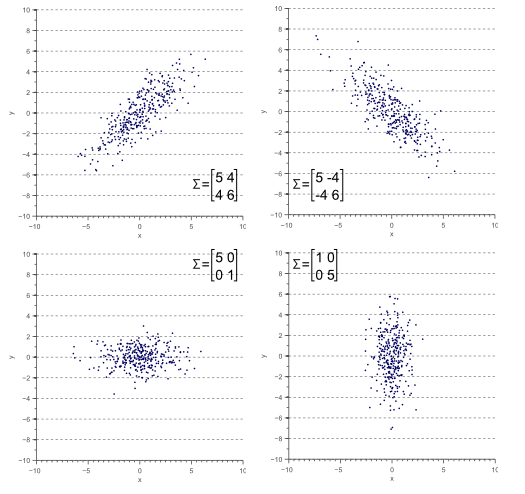

# Some Matrix Types

## Rank

The rank of a matrix is the maximum number of linearly independent rows (or columns) in the matrix.

For example, below $A$'s rank is $\text{rank}(A)=2$ for

$$
A =
\begin{bmatrix}
      1 & 2 & 3 \\
      4 & 5 & 6 \\
      2 & 4 & 6
\end{bmatrix} \underrightarrow{-2 R_1 + R_3}
\begin{bmatrix}
      1 & 2 & 3 \\
      4 & 5 & 6 \\
      0 & 0 & 0
\end{bmatrix}
$$

### Gaussian Elimination

Gaussian elimination, also known as row reduction, does not change column linearity. The above matrix $A$ can be reduced to

$$\begin{align*}
A = 
\begin{bmatrix}
      1 & 4 & 5 \\
      2 & 5 & 7 \\
      3 & 6 & 9
\end{bmatrix}
\underrightarrow{-3 R_1 + R_3}
\begin{bmatrix}
      1 & 4 & 5 \\
      2 & 5 & 7 \\
      0 & -6 & -6
\end{bmatrix}
& \underrightarrow{-2 R_1 + R_2} \\
\begin{bmatrix}
      1 & 4 & 5 \\
      0 & -3 & -3 \\
      0 & -6 & -6
\end{bmatrix}
\underrightarrow{-2 R_2 + R_3} 
\begin{bmatrix}
      1 & 4 & 5 \\
      0 & -3 & -3 \\
      0 & 0 & 0
\end{bmatrix}
& \underrightarrow{-3 R_2} \\
\begin{bmatrix}
      1 & 4 & 5 \\
      0 & 1 & 1 \\
      0 & 0 & 0
\end{bmatrix}
\underrightarrow{-4 R_2 + R_1}
\begin{bmatrix}
      1 & 0 & 1 \\
      0 & 1 & 1 \\
      0 & 0 & 0
\end{bmatrix}
\end{align*}
$$
hence proving rank $2$ for matrix $A$.

## Transpose

$A\in\mathbb{R}^{n \times m}$'s transpose is denoted as $A^{\top}\in\mathbb{R}^{m \times n}$.

### Reverse Order Property

$$
\big(A_1A_2...A_n\big)^{\top}=A^{\top}_n...A^{\top}_2A^{\top}_1
$$

### Gram Matrix

Given a set of vectors $\{\bold{a}_1, \bold{a}_2, ... \bold{a}_n\}$, the Gram matrix $G\in\mathbb{R}^{n \times n}$ has its entries as the inner products of these vectors.

$$
G_{ij}=\langle \bold{a}_i, \bold{a}_j \rangle
$$

If $\{\bold{a}_1, \bold{a}_2, ... \bold{a}_n\}$ are arranged as the columns of a matrix $A$, then

$$
G=A^{\top}A
$$

#### Proof of $A^{\top}A$ Be Symmetric

For

$$
\big(A^{\top}A\big)^{\top}=A^{\top}(A^{\top})^{\top}=A^{\top}A
$$

$A^{\top}A$ is symmetric.

#### Proof of $A^{\top}A$ Be Positive Semi-Definite

For a matrix be positive semi-definite, its quadratic form $\bold{x}\big(A^{\top}A\big)\bold{x} \ge 0$ is non-negative.

$$
\bold{x}\big(A^{\top}A\big)\bold{x}=\big(A\bold{x}\big)^{\top}A\bold{x}=\big|\big|A\bold{x}\big|\big|^2
$$

#### $A^{\top}A$ is Symmetric Hence Orthogonal

Define follows for $i\ne j$

$$
A^{\top}A\bold{v}_i=\sigma_i^2\bold{v}_i \qquad
A^{\top}A\bold{v}_j=\sigma_j^2\bold{v}_j
$$

then multiply by $\bold{v}_j^{\top}$, there is

$$
\begin{align*}
    && \bold{v}_j^{\top}A^{\top}A\bold{v}_i &=
  \bold{v}_j^{\top}\sigma_i^2\bold{v}_i \\
  \Rightarrow && (A^{\top}A\bold{v}_j)^{\top}\bold{v}_i &=
  \bold{v}_j^{\top}\sigma_i^2\bold{v}_i \qquad\text{ for symmetry } \big(A^{\top}A\big)^{\top}=A^{\top}A  \\
  \Rightarrow && \sigma_j^2\bold{v}_j^{\top}\bold{v}_i &=
  \sigma_i^2\bold{v}_j^{\top}\bold{v}_i \\
\end{align*}
$$

For by eigen-decomposition, there is $\sigma_i^2 \ne \sigma_j^2 \ne 0$, there could be only $\bold{v}_j^{\top}\bold{v}_i=0$, hence orthogonal.

##### Spectral Theorem

If $M$ is a real symmetric matrix, then:

* All eigenvalues of $M$ are **real**
* This means the eigenvectors of $M$ can be chosen to **be orthogonal and normalized**.
* $M$ can be can be orthogonally diagonalized $M=Q\Lambda Q^{\top}$, where 1) $\Lambda$ is a diagonal matrix containing the eigenvalues of $M$, 2) the columns of $Q$ are the orthonormal eigenvectors of $M$.

## Triangular Matrix

Either upper or lower area relative the diagonal of a matrix is all zeros:

* Upper Triangular Matrix

$$
A_{\text{upper}} = \begin{bmatrix}
    1 & 2 & 3 \\
    0 & 5 & 6 \\
    0 & 0 & 9
\end{bmatrix}
$$

* Lower Triangular Matrix

$$
A_{\text{lower}} = \begin{bmatrix}
    1 & 0 & 0 \\
    4 & 5 & 0 \\
    7 & 8 & 9
\end{bmatrix}
$$

## Orthogonal matrix

An orthogonal matrix, or orthonormal matrix, is a real square matrix whose columns and rows are orthonormal vectors.

It has the below properties:

$$
Q^\text{T}Q=QQ^\text{T}=I
$$

This leads to
$$
Q^\text{T}=Q^{-1}
$$

The determinant of any orthogonal matrix is either $+1$ or $−1$.

The set of $n \times n$ orthogonal matrices forms a group, $O(n)$, known as the orthogonal group. The subgroup $SO(n)$ consisting of orthogonal matrices with determinant $+1$ is called the *special orthogonal group*, and each of its elements is a *special orthogonal matrix*.

### Disjoint Linear Projection

In vector space $V$ define two linear projection $P$ and $Q$, if they satisfy $PQ=QP=\bold{0}$, it is termed *disjoint linear projection*.

This means that the projections are orthogonal to each other, and their ranges (the subspaces they project onto) do not overlap.

## Determinant

Determinant is a scalar value that is a function of the entries of a square matrix.

Geometrically speaking, determinant is area of the $n \times n$ squared matrix, for example, for a $2 \times 2$ matrix, the area of parallellogram is

$$
|u||v|sin\theta = 
\begin{array}{c}
    \bigg (
    \begin{array}{c}
      -b \\
      a
    \end{array}
    \bigg )
\end{array}
\begin{array}{c}
    \bigg (
    \begin{array}{c}
      c \\
      d
    \end{array}
    \bigg )
\end{array} =
ad-bc
$$

The following shows the calculation of a $3 \times 3$ matrix's determinant:

$$
\bigg |
\begin{array}{ccc}
    \begin{array}{ccc}
      a & b & c \\
      d & e & f \\
      g & h & i
    \end{array}
\end{array}
\bigg | =
a
\big |
\begin{array}{cc}
    \begin{array}{cc}
      e & f \\
      h & i 
    \end{array}
\end{array}
\big | -
d
\big |
\begin{array}{cc}
    \begin{array}{cc}
      b & c \\
      h & i 
    \end{array}
\end{array}
\big | +
g
\big |
\begin{array}{cc}
    \begin{array}{cc}
      b & c \\
      e & f 
    \end{array}
\end{array}
\big |
$$

further,

$$
\bigg |
\begin{array}{ccc}
    \begin{array}{ccc}
      a & b & c \\
      d & e & f \\
      g & h & i
    \end{array}
\end{array}
\bigg | =
a(ei-fh)-d(bi-hc)+g(bf-ec)
$$

which give the volume of a parallelotope.

### Input Vector Updates With Different Determinants

Given an input vector $\bold{x}$ and linear transform $A$, the result vector $A\bold{x}$ is a combination of scaling, rotation, and shearing, depending on the structure of $A$.

#### $\text{det}(A)>1$ Expansion

$$
A\bold{x}=\begin{bmatrix}
    1 & 2 \\
    3 & 4
\end{bmatrix} \begin{bmatrix}
    1 \\ 1
\end{bmatrix} = \begin{bmatrix}
    3 \\ 7
\end{bmatrix}
$$

#### $\text{det}(A)<1$ Contraction

$$
A\bold{x}=\begin{bmatrix}
    0.1 & 0.2 \\
    0.3 & 0.4
\end{bmatrix} \begin{bmatrix}
    1 \\ 1
\end{bmatrix} = \begin{bmatrix}
    0.3 \\ 0.7
\end{bmatrix}
$$

#### $\text{det}(A)=1$ Volume Preservation/Pure Rotation

$$
A\bold{x}=\begin{bmatrix}
    0 & -1 \\
    1 & 0
\end{bmatrix} \begin{bmatrix}
    1 \\ 1
\end{bmatrix} = \begin{bmatrix}
    -1 \\ 1
\end{bmatrix}
$$

The vector $\bold{x}$ is rotated by $90$ degrees counterclockwise.

#### $\text{det}(A)=0$ Collapse

$\text{det}(A)=0$ happens when $\text{rank}(A)$ is not full.

$$
A\bold{x}_1=\begin{bmatrix}
    1 & 1 \\
    1 & 1
\end{bmatrix} \begin{bmatrix}
    1 \\ 1
\end{bmatrix} = \begin{bmatrix}
    2 \\ 2
\end{bmatrix} \\
A\bold{x}_2=\begin{bmatrix}
    1 & 1 \\
    1 & 1
\end{bmatrix} \begin{bmatrix}
    1 \\ 2
\end{bmatrix} = \begin{bmatrix}
    3 \\ 3
\end{bmatrix} \\
A\bold{x}_3=\begin{bmatrix}
    1 & 1 \\
    1 & 1
\end{bmatrix} \begin{bmatrix}
    2 \\ 1
\end{bmatrix} = \begin{bmatrix}
    3 \\ 3
\end{bmatrix}
$$

All $\bold{x}_i$ are collapsed into the line $0=x_2-x_1$.

### Derivation

#### Adjugate Matrix

Adjugate, adjunct or classical adjoint of a square matrix $Adj(A)$ is the transpose of its cofactor matrix $C$.

$$
Adj(A) = C^\text{T}
$$

where

$$
C = \big( (-1)^{i+j} M_{i,j} \big)_{1\leq i,j \leq n}
$$

where $M_{i,j}$ is the determinant of the $(i,j)$-th element of a square matrix $A$ .

For example, given

$$
A =
\begin{bmatrix}
      a & b & c \\
      d & e & f \\
      g & h & i
\end{bmatrix}
$$

the $(1,2)$-th element is $b$, whose determinant can be expressed as

$$
M_{1,2} = -
\bigg |
\begin{array}{cc}
    \begin{array}{cc}
      d & f \\
      g & i
    \end{array}
\end{array}
\bigg |= -(di-fg)
$$

Cofactor matirx $C$:

$$
C =
\begin{bmatrix}
      M_{1,1} & M_{1,2} & M_{1,3} \\
      M_{1,2} & M_{2,2} & M_{2,3} \\
      M_{1,3} & M_{3,2} & M_{3,3}
\end{bmatrix}
$$

Finding classical adjoint of a matrix is same as applying a linear transformation which brings the coordinates of $i$ and $j$ to a square of area equal to the determinant of that matrix.

#### Laplace Expansion (Cofactor Expansion)

## Adjoint of A Matrix (Hermitian Adjoint)

The adjoint of a matrix (Hermitian Adjoint) and classical adjoint are two different things, do not confuse.

Consider a linear map $A: H_1 \rightarrow H_2$ between Hilbert spaces, the adjoint operator is the linear operator $A^\dag: H_2 \rightarrow H_1$ satisfying

$$
\langle A h_1, h_2 \rangle_{H_2} =
\langle h_1, A^\dag h_2 \rangle_{H_1}
$$

where $\langle \space . \space, \space . \space \rangle_{H_i}$ is the inner product in the Hilbert space $H_i$, and $\space^\dag$ is the notation for Hermitian/conjugate transpose.

### Self-Adjoint Matrix

A matrix $A$ is self-adjoint if it equals its adjoint $A = A^\dag$.
For real matrices, this means that the matrix is symmetric: it equals its transpose $A = A^\top$.

Eigen-decomposition of a real self-adjoint matrix is $A = V\Sigma V^{-1}$ where $\Sigma$ is a diagonal matrix whose diagonal elements are real eigenvalues., and $V$ is composed of eigenvectors by columns.
Hurthermore, $V$ is unitary, meaning that its invverse is equal to its adjoint $V^{-1}=V^{\dag}$.

## Covariance Matrix

A $2 \times 2$ covariance matrix is defined as

$$
\Sigma = 
\begin{bmatrix}
      \sigma(x,x) & \sigma(x,y) \\
      \sigma(y,x) & \sigma(y,y)
\end{bmatrix}
$$

in which
$$
\sigma(x,y) = E [ \big(x - E(x) \big) \big(y - E(y)\big) ]
$$

where $x$ and $y$ are sample vectors, hence $\sigma(x,y)$ is scalar. 

The orientations and thickness of the point cloud are eigenvectors and eigenvalues, such as the two arrows shown as below.

