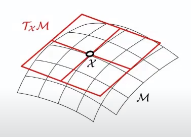

## Complex conjugate

The complex conjugate of a complex number is the number with an equal real part and an imaginary part equal in magnitude but opposite in sign, such as the complex conjugate of $a + b i$ is equal to $a − b i$.

## Unitary Matrix

A complex square matrix $U$ is unitary if its conjugate transpose $U^*$ is also its inverse, that is
$$
U^*U = UU^* = UU^{-1} = I
$$

## Isometry

An isometry (or congruence, or congruent transformation) is a distance-preserving transformation between metric spaces.

Geometrically speaking, it refers to rigid translation and rotation of geometrical figures.

### Isomorphism

In mathematics, an isomorphism is a structure-preserving mapping between two structures of the same type that can be reversed by an inverse mapping.

Rotation and translation are two typical isomorphic mapping.

## Similarity Transform And Diagonalizable Matrix

For $A$ and $B$ are said to be similar if there exists an invertible if there is an invertible $P \in \mathbb{C}^{r \times r}$ and satisfies

$$
B = P^{-1}A P
$$

If two matrices are similar, then they have the same rank, trace, determinant and eigenvalues.

### Diagonalizable Matrix

Define $A \in \mathbb{C}^{r \times r}$, that $A$ is diagonalizable if and only if it is similar to a diagonal matrix $D$.

$$
D = P^{-1}A P
$$

To compute/diagonalize a matrix $A$, first check $\text{rank}(A)=r$ if it is full rank, then solve $\text{det}(\lambda I - A)=0$.
The result $D$ is an eigenvalue-composed diagonal matrix, and $P$ is an eigenvector-composed matrix.

## Hermitian matrix

A Hermitian matrix (or self-adjoint matrix) is a complex square matrix that is equal to its own conjugate transpose.

For example,
$$
\begin{bmatrix}
      0 & a-ib & c-id \\
      a+ib & 1 & 0 \\
      c+id & 0 & 2
\end{bmatrix}
$$

## Conjugate transpose

The conjugate transpose (or Hermitian transpose) of $A_{n \times m}$ is 
1. take the transpose of $A_{n \times m}$
2. replace each entry $a_{i,j}$ with its complex conjugate

## Permutation matrix

A permutation matrix is a square binary matrix that has exactly one entry of 1 in each row and each column and 0s elsewhere.

## Jacobian

In vector calculus, the Jacobian matrix of a vector-valued function of several variables is the matrix of all its first-order partial derivatives. 

Given a mapping: $f : R_n \rightarrow R_m$ is a function such that each of its first-order partial derivatives exist on $R_n$, with input $x \in R^n$ ($n$ dimensions for input) and output $f(x) \in R^m$ ($m$ dimensions for output), define $J_{n \times m}$

$$
J_{n \times m} = \bigg[ \frac{\partial f}{\partial x_1} ... \frac{\partial f}{\partial x_n} \bigg] =
\begin{bmatrix}
\frac{\partial f_1}{\partial x_1} & ... & \frac{\partial f_1}{\partial x_n} 
\\
... & ... & ...
\\
\frac{\partial f_m}{\partial x_1} & ... & \frac{\partial f_m}{\partial x_n}
\end{bmatrix}
$$

### Determinant

When $m = n$, the Jacobian matrix is square, so its determinant is a well-defined function of $x$, known as the Jacobian determinant of $f$.

## Hessian

Hessian is a square matrix of second-order partial derivatives of a scalar-valued function, or scalar field. It describes the local curvature of a function of many variables.

Define $f:\mathbb{R}^n \rightarrow \mathbb{R}$ whose input is a vector $\bold{x} \in \mathbb{R}^n$ with a scalar output $f(\bold{x}) \in \mathbb{R}$. $\bold{H}$ of $f$ is an $n \times n$ matrix such as
$$
(\bold{H}_f)_{i,j}=\frac{\partial^2 f}{\partial x_i \partial x_j}
$$
or
$$
\bold{H}_f = 
\begin{bmatrix}
\frac{\partial^2 f}{\partial x_1^2} & \frac{\partial^2 f}{\partial x_1 \partial x_2} & ... & \frac{\partial^2 f}{\partial x_1 \partial x_n} 
\\
\frac{\partial^2 f}{\partial x_2 \partial x_1} & \frac{\partial^2 f}{\partial x_2^2} & ... & \frac{\partial^2 f}{\partial x_2 \partial x_n} 
\\
... & ... & ... & ...
\\
\frac{\partial^2 f}{\partial x_n \partial x_1}  & \frac{\partial^2 f}{\partial x_n \partial x_2}  & ... & \frac{\partial f}{\partial x_n^2}R
\end{bmatrix}
$$

## Tangent Space

Given a manifold $M$, a tangent space at $x$ on $M$ is $\Tau_x M$.

## Trace

The trace of a square matrix $A$, denoted $tr(A)$,is defined to be the sum of elements on the main diagonal (from the upper left to the lower right) of $A$. The trace is only defined for a square matrix ($n × n$).

For example, given $A$
$$
A = 
\begin{bmatrix}
a_{11} & a_{12} & a_{13} \\
a_{21} & a_{22} & a_{23} \\
a_{31} & a_{32} & a_{33}
\end{bmatrix}
$$

its trace is

$$
tr(A) = 
\sum^3_i a_{ii} =
a_{11} + a_{22} + a_{33}
$$

### Derivative

$$
\frac{
      \partial \space tr(ABC)
}{
      \partial \space B
} =
A^{\top} C^{\top}
$$

## Matrix Norms

### p-norm

Let $p \ge 1$ be a real number.
The p-norm (a.k.a. $\mathcal{L}^p$ norm) of a vector $\bold{x} \in \mathbb{R}^n$ is

$$
||\bold{x}||_p := \Bigg( \sum^n_{i=1} |x_i|^p \Bigg)^{{\frac{1}{p}}}
$$

### Matrix p-norm

Given a field $K$ of either real or complex numbers, and let $K^{m \times n}$ be the $K$'s vector space,
a matrix norm is a norm on $K^{m \times n}$ denoted as $||A||$ that leads to $|| \space \cdot \space || : K^{m \times n} \rightarrow \mathbb{R}^1$.

Suppose $A,B \in K^{m \times n}$, and vector norm $|| \space \cdot \space ||_{\alpha}$ on $K^n$ and $|| \space \cdot \space ||_{\beta}$ on $K^m$ are known.
Any $m \times n$ matrix $A$ induces a linear operator transforming $\bold{x} \in K^n$ from $K^n$ to $K^m$.

$$
\begin{align*}
    ||A||_{\alpha, \beta} &= 
    \sup \{ ||A\bold{x}||_{\beta} : \bold{x} \in K^n \text{ with } ||\bold{x}||_{\alpha} = 1 \}
\\ &=
    \sup \{ \frac{||A\bold{x}||_{\beta}}{||\bold{x}||_{\alpha}} : \bold{x} \in K^n \text{ with } \bold{x} \ne \bold{0} \}
\end{align*}
$$

where $\sup$ means supremum of the set. 

For matrix norms induced by vector *p-norms* ($1 \le p +\infty$) that sees $\alpha=\beta=p$, there is

$$
||A||_p = \sup_{\bold{x} \ne \bold{0}}  \frac{||A\bold{x}||_{p}}{||\bold{x}||_{p}}
$$

$||A||_p$ is interesting for it can be considered the "degree" of how much $\bold{x}$ is stretched by $A$.

* $||A||_p > 1$, the input vector $\bold{x}$ is increased in length
* $||A||_p < 1$, the input vector $\bold{x}$ is shrunken in length
* $||A||_p = 1$, the input vector $\bold{x}$ does not change in length

### p=0 Matrix Norm

The $\mathcal{L}_0$  measures how many zero-elements are in a tensor $\bold{x}$, or the element is either zero or one $x_i \in \{ 0, 1 \}$:

$$
||\bold{x}||_0 = |x_1|^0 + |x_2|^0 + ... + |x_n|^0
$$

It is useful in sparsity vs density for neural network:
the number of non-zero elements and sparsity's complement relationship is as below:

$$
\text{density} = 1 - \text{sparsity}
$$

### p=1 Matrix Norm

p=1 matrix norm is simply the maximum absolute column sum of the matrix.

$$
||A||_1 = \max_{1 \le j \le n} \sum^{m}_{i=1} |a_{ij}|
$$

### p=2 Matrix Norm (Spectral Radius)

In vectors, the $p=2$'s norm is named Euclidean norm ($\mathcal{l}_2$).
In matrix, $||A||_2$ is named spectral norm ($\mathcal{L}_2$).

The $p=2$'s matrix norm is coined *Frobenius norm* (equivalent of Euclidean norm $\mathcal{l}_2$ but for matrix)

$$
||A||_F = \sqrt{\sum_{i=1}^m \sum_{j=1}^n |a_{ij}|^2} =
\sqrt{\text{trace} (A^{\dagger} A) }
$$

where $A^{\dagger}$ is $A$'s conjugate transpose.

Let $\Sigma(\space \cdot \space)$ be the eigenvalue matrix of $\space \cdot \space$ (by diagnalization), and $\max (\space \cdot \space)$ takes the maximum out of the matrix/vector argument, there is

$$
||A||_2 = \sqrt{\max \Big( \Sigma\big( A^{\dagger} A \big) \Big)} =
\sigma_{max}(A) \le ||A||_F
$$

where $\sigma_{max}(A)$ represents the largest singular value of matrix $A$.

Equality of $\sigma_{max}(A) \le ||A||_F$ holds if and only if the matrix $A$ is a rank-one matrix or a zero matrix. 

This inequality can be derived from the fact that the trace of a matrix is equal to the sum of its eigenvalues $\text{trace}(A) = \sum_{i=1}^n \lambda_i$, where $\lambda_i$ is the eigenvalue of $A$.

$$
\begin{align*}
\text{det}(\underbrace{A-tI}_{W}) &=
\begin{vmatrix}
    (a_{11}-t) \text{det}(W_{2:n, 2:n}) &
    a_{12} \text{det}(W_{2:n, (1, 3:n)}) & &
    a_{1n} \text{det}(W_{2:n, 1:n-1}) \\
    a_{21} \text{det}(W_{(1, 3:n), 2:n}) &
    (a_{22}-t) \text{det}(W_{(1, 3:n), (1, 3:n)}) & &
    a_{2n} \text{det}(W_{(1, 3:n), 1:n-1}) \\
    & & \ddots & \\
    a_{n1} \text{det}(W_{1:n-1, 2:n}) &
    a_{n2} \text{det}(W_{1:n-1, (1, 3:n)}) & &
    (a_{nn}-t) \text{det}(W_{1:n-1, 1:n-1}) \\
\end{vmatrix} 
\\ &=
\begin{vmatrix}
    \underbrace{
    (a_{11}-t) \begin{vmatrix}
        (a_{22}-t)\text{det}(W_{3:n, 3:n}) &
        a_{23} \text{det}(W_{3:n, (2, 4:n)}) & ... \\
        (a_{23}-t)\text{det}(W_{3:n, (2, 4:n)}) &
        a_{33} \text{det}(W_{(2, 4:n), (2, 4:n)}) & ... \\
        & \vdots & \\
        (a_{2n}-t)\text{det}(W_{3:n, 3:n-1}) &
        a_{3n} \text{det}(W_{(2, 4:n), 3:n-1}) & ... 
    \end{vmatrix}}_{(a_{11}-t) \text{det}(W_{2:n, 2:n})}
    &
    a_{12} \text{det}(W_{2:n, (1, 3:n)}) & &
    a_{1n} \text{det}(W_{2:n, 1:n-1}) \\
    a_{21} \text{det}(W_{(1, 3:n), 2:n}) &
    (a_{22}-t) \text{det}(W_{(1, 3:n), (1, 3:n)}) & &
    a_{2n} \text{det}(W_{(1, 3:n), 1:n-1}) \\
    & & \ddots & \\
    a_{n1} \text{det}(W_{1:n-1, 2:n}) &
    a_{n2} \text{det}(W_{1:n-1, (1, 3:n)}) & &
    (a_{nn}-t) \text{det}(W_{1:n-1, 1:n-1}) \\
\end{vmatrix} 
\\ &=
(-1)^n \big(t^n - (t)^{n-1} \text{trace}(A) + ... + \text{det}(A) \big)
\end{align*}
$$

For any polynomial should see the solution in this format.

$$
\begin{align*}
(-1)^n (t-\lambda_1)(t-\lambda_2) ... (t-\lambda_n) &=
(-1)^n \big(t^2-(\lambda_1+\lambda_2)t + 2\lambda_1\lambda_2 \big)(t-\lambda_3) ... (t-\lambda_n)
\\ &=
(-1)^n \big(t^3-(\lambda_1+\lambda_2+\lambda_3)t^2 +2\lambda_1\lambda_2 t - 2\lambda_1\lambda_2\lambda_3 + (\lambda_1+\lambda_2)\lambda_3 t  \big)(t-\lambda_4) ... (t-\lambda_n)
\\ &=
(-1)^n \big(t^4-(\lambda_1+\lambda_2+\lambda_3+\lambda_4)t^3 -(\lambda_1+\lambda_2+\lambda_3)\lambda_4 t^2 + ...  \big)(t-\lambda_4) ... (t-\lambda_n)
\\ &=
(-1)^n \big(t^n + (t)^{n-1} \underbrace{\sum_{i=1}^n \lambda_i}_{\text{trace}(A)} + (t)^{n-2}\lambda_n \sum_{i=1}^{n-1} \lambda_i + ... \big)
\end{align*}
$$

By comparing against the above $\text{det}(A-tI)$, there is

$$
\text{trace}(A) = \sum_{i=1}^n \lambda_i
$$

Proof: https://math.stackexchange.com/questions/586663/why-does-the-spectral-norm-equal-the-largest-singular-value/586835#586835

Also,

$$
||A^{\dagger} A||_2 = ||A A^{\dagger}||_2 = ||A||^2_2
$$

The *spectral radius* of a square matrix $A$ of $\text{rank}(A)=r$ is the maximum of the absolute values of its eigenvalues $||A||_2 = \sigma_{max}(A)=\max \{ |\lambda_1|, |\lambda_2|, ..., |\lambda_r| \}$.

Spectral radius describes to what max length $\bold{x}$ can be stretched by a square matrix $A$, that the max length happens to be the max eigenvalue of $A$.

$$
||A\bold{x}|| \le \lambda_{max}||\bold{x}||
$$

Nuclear Norm $||A||_*$:

$||A||_*$ is defined as the sum of its singular values:

$$
||A||_* = \sum_{i} \sigma_i(A)
$$

where $\sigma_i(\space . \space)$ is the $i$-th singular value of $A$.

### $p=+\infty$ Max Norm

It is defined as when $p = q$ goes to infinity:

$$
||A||_{max} = \max_{i,j} |a_{ij}|
$$