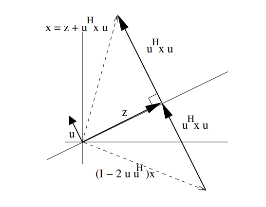

# Matrix Decomposition

## LU Decomposition/Factorization by Gaussian Elimination

Lower-upper (LU) decomposition or factorization factors a matrix as the product of a lower triangular matrix and an upper triangular matrix.

*Gaussian elimination* can be used for decomposition, since just some proper row and/or column orderings or permutations can achieve LU decomposition.

Let $A$ be a $3 \times 3$ square matrix, LU can be

$$
\begin{bmatrix}
      a_{1,1} & a_{1,2} & a_{1,3} \\\\
      a_{2,1} & a_{2,2} & a_{2,3} \\\\
      a_{3,1} & a_{3,2} & a_{3,3}
\end{bmatrix}=
\begin{bmatrix}
      l_{1,1} & 0 & 0 \\\\
      l_{2,1} & l_{2,2} & 0 \\\\
      l_{3,1} & l_{3,2} & l_{3,3}
\end{bmatrix}
\begin{bmatrix}
      u_{1,1} & u_{1,2} & u_{1,3} \\\\
      0 & u_{2,2} & u_{2,3} \\\\
      0 & 0 & u_{3,3}
\end{bmatrix}
$$

Define $P$ as a permutation matrix, there is

$$
PA=LU
$$

### Application

Given a system of linear equations in matrix form $A$ and we want to solve the linear system (find a solution for $\mathbf{x}$)
$$
A\mathbf{x}=\mathbf{b}
$$

By LU decomposition, there is 
$$
PA=LU
$$

So that
$$
LU\mathbf{x}=P\mathbf{b}
$$

Given the nature of triangular matrix, by forward and backward substitution, define a temp vector $\mathbf{y}$, there is
$$
L\mathbf{y}=P\mathbf{b}
$$

Then, solve $\mathbf{y}$, and use $\mathbf{y}$ to solve $\mathbf{x}$ by
$$
U\mathbf{x} = \mathbf{y}
$$

## Cholesky Decomposition/Factorization

Cholesky decomposition decomposes a Hermitian, positive-definite matrix $A$ into the product of a lower triangular matrix $L$ and its conjugate transpose $L^*$, such as $A=LL^*$ or in real number $A=LL^\text{T}$.

Every Hermitian positive-definite matrix (and thus also every real-valued symmetric positive-definite matrix) has a unique Cholesky decomposition.

It is useful to solve Linear least squares (LLS) approximation problems.

### Derivation Proof

Define a positive definite matrix $A \in \mathbb{R}^{n \times n}$. 
It is trivial when $n=1$, and then only consider $n>1$ cases. 
Partition $A$ as below, where $\~{A} \in \mathbb{R}^{(n-1) \times (n-1)}$, and $\mathbf{a} \in \mathbb{R}^{n-1}$ is a vector. 
$\alpha$ is a scalar number.

$$
A = 
\begin{bmatrix}
      \~{A} & \mathbf{a} \\\\
      \mathbf{a}^\text{T} & \alpha
\end{bmatrix}
$$

Since a principal submatrix of a positive definite matrix is positive definite, so that $\~{A}$ is positive definite as well, and $\~{A}$ has Cholesky factorization $\~{A}=\~{L}\~{L}^\text{T}$.

Define $L_1^{-1}:=\begin{bmatrix}      \~{L}^{-1} & 0 \\\\      0 & 1\end{bmatrix}$, then consider

$$
\begin{align*}
L_1^{-1} A L_1^{-\text{T}} &= 
\begin{bmatrix}
      \~{L}^{-1} & 0 \\\\
      0 & 1
\end{bmatrix}
\begin{bmatrix}
      \~{A} & \mathbf{a} \\\\
      \mathbf{a}^\text{T} & \alpha
\end{bmatrix}
\begin{bmatrix}
      \~{L}^{-\text{T}} & 0 \\\\
      0 & 1
\end{bmatrix}
\\\\ &=
\begin{bmatrix}
      I & \mathbf{b} \\\\
      \mathbf{b}^\text{T} & \alpha
\end{bmatrix}
\\\\ : &=
B
\end{align*}
$$

where $\mathbf{b}:=\~{L}^{-1}\mathbf{a}$.

Then, to eliminate $\mathbf{b}$, define $L_2^{-1}:=\begin{bmatrix}      I & 0 \\\\      -\mathbf{b}^\text{T} & 1\end{bmatrix}$, then consider

$$
\begin{align*}
L_2^{-1} B L_2^{-\text{T}} &= 
\begin{bmatrix}
      I & 0 \\\\
      -\mathbf{b}^\text{T} & 1
\end{bmatrix}
\begin{bmatrix}
      I & \mathbf{b} \\\\
      \mathbf{b}^\text{T} & \alpha
\end{bmatrix}
\begin{bmatrix}
      I & -\mathbf{b} \\\\
      0 & 1
\end{bmatrix}
\\\\ &=
\begin{bmatrix}
      I & 0 \\\\
      0 & \alpha-\mathbf{b}^\text{T}\mathbf{b}
\end{bmatrix}
\\\\ &=
\begin{bmatrix}
      I & 0 \\\\
      0 & \alpha-\mathbf{a}^\text{T} \~{L}_1^{-\text{T}}\~{L}_1^{-1} \mathbf{a}
\end{bmatrix}
\\\\ &=
\begin{bmatrix}
      I & 0 \\\\
      0 & \alpha-\mathbf{a}^\text{T} \~{A}^{-1} \mathbf{a}
\end{bmatrix}
\end{align*}
$$

Summarize the above equations, there is
$$
L_2^{-1} B L_2^{-\text{T}} =
(L_2^{-1}L_1^{-1}) A (L_1^{-\text{T}}L_2^{-\text{T}})
$$

This is a congruent transformation on a positive definite matrix $A$, so that the diagonal matrix has positive real entries including $\alpha-\mathbf{a}^\text{T} \~{A}^{-1} \mathbf{a} > 0$.

Define $\lambda^2 = \alpha-\mathbf{a}^\text{T} \~{A}^{-1} \mathbf{a}$, and $L_3:=\begin{bmatrix}      I & 0 \\\\     0 & \lambda\end{bmatrix}$, so that

$$
\begin{align*}
&&
(L_2^{-1}L_1^{-1}) A (L_1^{-\text{T}}L_2^{-\text{T}}) &=
L_3 L_3^\text{T} 
\\\\ \Rightarrow && 
A&=
\underbrace{L_1 L_2 L_3}\_{:= L} 
\underbrace{L_3^\text{T} L_2^\text{T} L_1^\text{T}}\_{:= L^\text{T}}
\\\\ && &=
L L^\text{T}
\end{align*}
$$

where

$$
\begin{align*}
L=L_1 L_2 L_3 &= 
\begin{bmatrix}
      \~{L} & 0 \\\\
      0 & 1
\end{bmatrix}
\begin{bmatrix}
      I & 0 \\\\
      -\mathbf{b}^\text{T} & 1
\end{bmatrix}
\begin{bmatrix}
      I & 0 \\\\
      0 & \lambda
\end{bmatrix}
\\\\ &=
\begin{bmatrix}
      \~{L} & 0 \\\\
      \mathbf{b}^\text{T} & \lambda
\end{bmatrix}
\\\\ &=
\begin{bmatrix}
      \~{L} & 0 \\\\
      \mathbf{a}^\text{T}\~{L}^{-\text{T}} & \lambda
\end{bmatrix}
\end{align*}
$$

Hence, $A=LL^\text{T}$ is Cholesky decomposition. Recall that $\~{A} \in \mathbb{R}^{(n-1) \times (n-1)}$, and $n=1$ is trivial proved for $A \in \mathbb{R}^{2 \times 2}$, then $\~{A} \in \mathbb{R}^{2 \times 2}$ can prove for ${A} \in \mathbb{R}^{3 \times 3}$, and recursively onwards so that $A \in \mathbb{R}^{n \times n}$ has Cholesky decomposition.

### Computation by LDLT

Given that $A$ is positive definite, $A$ can be decomposed as below

$$
\begin{align*}
A &= LD L^{-1} = LD L^{\text{T}}
\\\\ &=
\begin{bmatrix}
      1 & 0 & 0 \\\\
      L\_{21} & 1 & 0 \\\\
      L\_{31} & L\_{32} & 1
\end{bmatrix}
\begin{bmatrix}
      D_1 & 0 & 0 \\\\
      0 & D_2 & 0 \\\\
      0 & 0 & D_3
\end{bmatrix}
\begin{bmatrix}
      1 & L\_{21} & L\_{31} \\\\
      0 & 1 & L\_{32} \\\\
      0 & 0 & 1
\end{bmatrix}
\\\\ &=
\begin{bmatrix}
      D_1 &  & (\text{symmetric}) \\\\
      L\_{21}D_1 & L^2_{21}D_1+D_2 &  \\\\
      L\_{31}D_1 & L\_{31}L\_{21}D_1+L\_{32}D_2 & L^2_{31}D_1+L^2_{32}D_2+D_3
\end{bmatrix}
\end{align*}
$$

where

$$
\begin{align*}
D_j &= A_{jj} - \sum^{j-1}\_{k=1} L^2_{jk} D_k \\\\
L\_{ij} &= \frac{1}{D_j} \bigg( 
      A_{ij} - \sum^{j-1}\_{k=1} L\_{ik} L\_{jk} D_{k}
\bigg) \quad i>j 
\end{align*}
$$

From the perspective of $A=LU$ decomposition, since $A$ is positive definite, there is $A=(L\sqrt{D})(\sqrt{D}L)^\text{T}=LDL^\text{T}$. 
One can show that by Gaussian elimination, the $LU$ decomposition on positive definite matrix $A$ produces the lower triangular matrix $L$ being the conjugate transpose of the upper triangular matrix $U$.

### Application

Given a system of linear equations in matrix form $A$ ($A$ is symmetric and positive definite) and we want to solve the linear system (find solution for $\mathbf{x}$)
$$
A\mathbf{x}=\mathbf{b}
$$

Given the decomposition $A=LL^*$, define a temp vector $\mathbf{y}$, $\mathbf{x}$ can be solved by forward and backward substitution:

1. solve $\mathbf{y}$ for $L\mathbf{y}=\mathbf{b}$
2. solve $\mathbf{x}$ for $L\mathbf{x}=\mathbf{y}$

## QR Decomposition/Factorization

Define a decomposition of a matrix $A$ into a product $A = QR$ of an orthogonal matrix $Q$ and an upper triangular matrix $R$.

It is useful to solve Linear least squares (LLS) approximation problems.

### Gram–Schmidt Process

Define a square matrix $A=[\mathbf{a}_1, \mathbf{a}_2, ...,\mathbf{a}_n]$, where $\mathbf{a}_k$ represent a column vector of $A$.

Denote a projection operator from vector $\mathbf{a}$ onto $\mathbf{u}$:
$$
proj_{\mathbf{u}}(\mathbf{a})=
\frac{\langle \mathbf{u},\mathbf{a} \rangle}
{\langle \mathbf{u},\mathbf{u} \rangle}\mathbf{u}
$$

where $\langle\mathbf{u},\mathbf{a}\rangle=\mathbf{u}^\text{T}\mathbf{a}$ represents inner product operation.

$$
\begin{array}{cc}
    \mathbf{u}_1 = \mathbf{a}_1 & 
    \mathbf{e}_1=\frac{\mathbf{u}_1}{||\mathbf{u}_1||}
    \\\\
    \mathbf{u}_2 = \mathbf{a}_2 - proj_{\mathbf{u}_1}(\mathbf{a}_2) & 
    \mathbf{e}_2=\frac{\mathbf{u}_2}{||\mathbf{u}_2||}
    \\\\
    \mathbf{u}_3 = \mathbf{a}_3 - proj_{\mathbf{u}_1}(\mathbf{a}_3) - proj_{\mathbf{u}_2}(\mathbf{a}_3) & 
    \mathbf{e}_3=\frac{\mathbf{u}_3}{||\mathbf{u}_3||}
    \\\\
    \mathbf{u}_4 = \mathbf{a}_4 - proj_{\mathbf{u}_1}(\mathbf{a}_4) - proj_{\mathbf{u}_2}(\mathbf{a}_4) - proj_{\mathbf{u}_3}(\mathbf{a}_4) & 
    \mathbf{e}_4=\frac{\mathbf{u}_4}{||\mathbf{u}_4||}
    \\\\
    \space
    \\\\
    ... & ...
    \\\\
    \space
    \\\\
    \mathbf{u}_k = \mathbf{a}_k - \sum^{k-1}\_{j}proj_{\mathbf{u}_j}(\mathbf{a}_k) &
    \mathbf{e}_k=\frac{\mathbf{u}_k}{||\mathbf{u}_k||}
\end{array}
$$

The figure below describes the above projection with this notation substitution $\mathbf{a}_k=\mathbf{v}_k$ to $proj_{\mathbf{u}}(\mathbf{v})$.

      

 

Express $\mathbf{a}\_i$ over our newly computed orthonormal basis:
$$
\begin{align*}
      \mathbf{a}_1 &= \langle\mathbf{e}_1,\mathbf{a}_1\rangle \mathbf{e}_1
      \\\\
      \mathbf{a}_2 &= \langle\mathbf{e}_1,\mathbf{a}_2\rangle \mathbf{e}_1 + \langle\mathbf{e}_2,\mathbf{a}_2\rangle \mathbf{e}_2
      \\\\
      \mathbf{a}_3 &= \langle\mathbf{e}_1,\mathbf{a}_3\rangle \mathbf{e}_1 + \langle\mathbf{e}_2,\mathbf{a}_3\rangle \mathbf{e}_2 + \langle\mathbf{e}_3,\mathbf{a}_3\rangle \mathbf{e}_3
      \\\\
      & \vdots
      \\\\
      \mathbf{a}_n &= \sum^k_{j=1} \langle\mathbf{e}_j,\mathbf{a}_k\rangle \mathbf{e}_j
\end{align*}
$$

So that $A=QR$, where

$$
\begin{align*}
Q &= [\mathbf{e}_1, \mathbf{e}_2, ..., \mathbf{e}_n] \\\\
R &= \begin{bmatrix}
      \langle\mathbf{e}_1,\mathbf{a}_1\rangle & 
      \langle\mathbf{e}_1,\mathbf{a}_2\rangle &
      \langle\mathbf{e}_1,\mathbf{a}_3\rangle &
      ... &
      \langle\mathbf{e}_1,\mathbf{a}_n\rangle \\\\
      0 & 
      \langle\mathbf{e}_2,\mathbf{a}_2\rangle &
      \langle\mathbf{e}_2,\mathbf{a}_3\rangle &
      ... &
      \langle\mathbf{e}_2,\mathbf{a}_n\rangle \\\\
      0 & 
      0 &
      \langle\mathbf{e}_3,\mathbf{a}_3\rangle &
      ... &
      \langle\mathbf{e}_3,\mathbf{a}_n\rangle \\\\
      \vdots & \vdots & \vdots & \ddots & \vdots \\\\
      0 & 
      0 &
      0 &
      ... &
      \langle\mathbf{e}_k,\mathbf{a}_n\rangle \\\\
\end{bmatrix}
\end{align*}
$$

The Gram-Schmidt algorithms can inherently fall victim to this: column $\mathbf{u}_j$ is successively reduced in length as components in the directions of $\{ \mathbf{e}_1, \mathbf{e}_2, ..., \mathbf{e}\_{j-1} \}$ are subtracted,
leaving a small vector if $\mathbf{u}_j$ was almost in the span of the first $j$ columns of $A$. 
This is known as *catastrophic cancellation* (loss of precision when the number of projection subtraction grows for $\mathbf{u}_j$ computation).

### Householder Transformation

A Householder reflection $H$ (or Householder transformation) is a transformation that takes a vector and reflects (a.k.a, orthogonal transformation) it about some plane or hyperplane. 

Reflection takes into account "mirror" as the orthogonal basis change that does not decay as the number projection grows, thereby addressing the issue of catastrophic cancellation.

* Householder Transformation

Define a vector $\mathbf{z}$ (a.k.a. hyperplane) that is perpendicular to $\mathbf{u}$ (served as a normal vector to $\mathbf{z}$). 
Assume there is a vector $\mathbf{x}$, its projection on $\mathbf{u}$ is $\langle\mathbf{u},\mathbf{x}\rangle \mathbf{u}=\mathbf{u}^\text{H} \mathbf{x} \mathbf{u}$ (in real realm, there is $\mathbf{u}^\text{T} \mathbf{x} \mathbf{u}$). As a result, $\mathbf{x}$ can be expressed as $\mathbf{x}=\mathbf{z}+\mathbf{u}^\text{H} \mathbf{x} \mathbf{u}$.

The $\mathbf{x}$'s reflection based on the hyperplane $\mathbf{z}$ is $(I-2\mathbf{u}\mathbf{u}^\text{H})\mathbf{x}$, and this transformation $H=I-2\mathbf{u}\mathbf{u}^\text{H}$ is termed a reflector or Householder transformation.

      

 

Easy to observe that

Any vector $\mathbf{z}$ that is perpendicular to $\mathbf{u}$ is left unchanged:
$$
\begin{align*}
(I-2\mathbf{u}\mathbf{u}^\text{H})\mathbf{z} &=
\mathbf{z} - 2\mathbf{u} \underbrace{\mathbf{u}^\text{H}\mathbf{z}}\_{=0}
\\\\ &= \mathbf{z}
\end{align*}
$$

Any vector $\mathbf{x}$ can be written as $\mathbf{x}=\mathbf{z}+\mathbf{u}^\text{H} \mathbf{x} \mathbf{u}$, whose Householder transform/reflection can be computed as

$$
\begin{align*}
(I-2\mathbf{u}\mathbf{u}^\text{H})\mathbf{x} &=
(I-2\mathbf{u}\mathbf{u}^\text{H}) (\mathbf{z}+\mathbf{u}^\text{H} \mathbf{x} \mathbf{u})
\\\\ &=
\mathbf{z} + \mathbf{u}^\text{H} \mathbf{x} \mathbf{u} 
-2\mathbf{u} \underbrace{\mathbf{u}^\text{H}\mathbf{z}}\_{=0} -2\mathbf{u}\mathbf{u}^\text{H} \mathbf{u}^\text{H} \mathbf{x} \mathbf{u}
\\\\ &=
\mathbf{z} + \mathbf{u}^\text{H} \mathbf{x} \mathbf{u} - \underbrace{
      2\mathbf{u}\mathbf{u}^\text{H} \mathbf{u}^\text{H} \mathbf{x} \mathbf{u}}\_{= 2 \mathbf{u}^\text{H}\mathbf{x} \underbrace{
            \mathbf{u}^\text{H} \mathbf{u}}\_{=1} \mathbf{u}}
\\\\ &=
\mathbf{z} + \mathbf{u}^\text{H} \mathbf{x} \mathbf{u} 
-2\mathbf{u}^\text{H} \mathbf{x} \mathbf{u} 
\\\\ &=
\mathbf{z} - \mathbf{u}^\text{H} \mathbf{x} \mathbf{u} 
\end{align*}
$$

Householder transformation $H$ is an orthogonal symmetric matrix

$$
\begin{align*}
\\\\ H &=
I-2\mathbf{u}\mathbf{u}^\text{H}
\\\\ &=
I-2\mathbf{u}^\text{H}\mathbf{u}
\\\\ &=
(I-2\mathbf{u}\mathbf{u}^\text{H})^\text{H}
\\\\ &=
H^\text{H}
\\\\ \space \\\\
HH^\text{H} &= 
(I-2\mathbf{u}\mathbf{u}^\text{H})
(I-2\mathbf{u}\mathbf{u}^\text{H})^\text{H}
\\\\ &=
(I-2\mathbf{u}\mathbf{u}^\text{H})
(I-2\mathbf{u}^\text{H}\mathbf{u})
\\\\ &=
I - 2 \underbrace{\mathbf{u}^\text{H}\mathbf{u}}\_{=\mathbf{u}\mathbf{u}^\text{H}}
-2\mathbf{u}\mathbf{u}^\text{H}+4\mathbf{u}\mathbf{u}^\text{H} \underbrace{\mathbf{u}^\text{H}\mathbf{u}}\_{=1}
\\\\ &=
I
\end{align*}
$$

* Householder Decomposition Computation

Householder decomposition at the $i$-th step, multiplies an orthogonal matrix $Q_i$ to $A \in \mathbb{R}^{m \times n}$, so that the new matrix sees zeros located at $i+1$ to $m$ rows on the $i$-th column.

Householder transformation helps find this $Q_i$.

Define $A=[\mathbf{a}_1, \mathbf{a}_2, ..., \mathbf{a}_n]$. Start computation at $A$'s first column $\mathbf{a}_1$ with the first Householder reflection $H_1$

Since $H_1$ is orthogonal having $det(H_1)=\pm 1$, there is $||H_1\mathbf{a}_1||=||\mathbf{a}_1||$. Then define $\mathbf{e}_1=[1 \quad 0 \quad ... \quad 0]^\text{T} \in \mathbb{R}^n$ as a unit orthogonal vector such that $||\mathbf{e}_1||=1$. There is $H_1\mathbf{a}_1=\pm ||\mathbf{a}_1||\mathbf{e}_1$.

Recall Householder transformation:
$$
\left\{
      \begin{align*}
      H_1 &= I-2\mathbf{u}_1\mathbf{u}_1^\text{H}
      \\\\
      \mathbf{u}_1 &= \frac{\mathbf{x}_1}{||\mathbf{x}_1||}
      \end{align*}
\right.
$$

So that
$$
H_1 \mathbf{a}_1 =
( I-2\mathbf{u}_1\mathbf{u}_1^\text{H} ) \mathbf{a}_1 = 
\mathbf{a}_1 - 2 \frac{\mathbf{x}_1}{||\mathbf{x}_1||} (\mathbf{u}_1^\text{H} \mathbf{a}_1)
$$

Set $\mathbf{x}_1 = \beta\mathbf{a}_1 + \alpha\mathbf{e}_1$, there is

$$
\begin{align*}
H_1 \mathbf{a}_1 &=
\mathbf{a}_1 - 2 
\frac{(\beta\mathbf{a}_1 + \alpha\mathbf{e}_1)^\text{H} \mathbf{a}_1 }{(\beta\mathbf{a}_1 + \alpha\mathbf{e}_1)^2} (\beta\mathbf{a}_1 + \alpha\mathbf{e}_1) ∂\\\\ &=
\mathbf{a}_1 - 2 
\frac{(\beta\mathbf{a}_1 + \alpha\mathbf{e}_1)^\text{H} \mathbf{a}_1 }
{\beta^2\mathbf{a}^\text{H}_1\mathbf{a}_1 + \alpha^2\mathbf{e}^\text{H}_1\mathbf{e}_1+2\alpha\beta\mathbf{a}_1\mathbf{e}_1}
(\beta\mathbf{a}_1 + \alpha\mathbf{e}_1) \\\\ &=
\bigg(
  1- 2
  \frac{\beta(\beta\mathbf{a}_1 + \alpha\mathbf{e}_1)^\text{H} \mathbf{a}_1 }
  {\beta^2\mathbf{a}^\text{H}_1\mathbf{a}_1 + \alpha^2\mathbf{e}^\text{H}_1\mathbf{e}_1+2\alpha\beta\mathbf{a}_1\mathbf{e}_1} 
\bigg)\mathbf{a}_1 -
\bigg(2 
  \frac{\alpha(\beta\mathbf{a}_1 + \alpha\mathbf{e}_1)^\text{H} \mathbf{a}_1 }
  {\beta^2\mathbf{a}^\text{H}_1\mathbf{a}_1 + \alpha^2\mathbf{e}^\text{H}_1\mathbf{e}_1+2\alpha\beta\mathbf{a}_1\mathbf{e}_1}
\bigg) \mathbf{e}_1
\end{align*}
$$

For $\mathbf{e}_1$ and $\mathbf{a}_1$ are linearly independent (if not, just use $\mathbf{e}_1$ to represent $\mathbf{a}_1$, no need of $H_1$ computation), 
and $H_1\mathbf{a}_1=\pm ||\mathbf{a}_1||\mathbf{e}_1$, there are

$$
\begin{align*}
&\space
\left\{
\begin{align*}
1 - 2 
  \frac{\beta(\beta\mathbf{a}_1 + \alpha\mathbf{e}_1)^\text{H} \mathbf{a}_1 }
  {\beta^2\mathbf{a}^\text{H}_1\mathbf{a}_1 + \alpha^2\mathbf{e}^\text{H}_1\mathbf{e}_1+2\alpha\beta\mathbf{a}_1\mathbf{e}_1} &= 0
\\\\ - 2 
  \frac{\alpha(\beta\mathbf{a}_1 + \alpha\mathbf{e}_1)^\text{H} \mathbf{a}_1 }
  {\beta^2\mathbf{a}^\text{H}_1\mathbf{a}_1 + \alpha^2\mathbf{e}^\text{H}_1\mathbf{e}_1+2\alpha\beta\mathbf{a}_1\mathbf{e}_1} &= \pm ||\mathbf{a}_1||
\end{align*}
\right.
\\\\ \Rightarrow & \quad
\beta^2 \mathbf{a}^\text{H}_1 \mathbf{a} = \alpha^2
\end{align*}
$$

By taking $\beta=1$, there is $\alpha=\pm ||\mathbf{a}_1||$.

So that, $\mathbf{u}_1=\frac{\mathbf{a}_1 \pm ||\mathbf{a}_1||\mathbf{e}_1}{\big|\big| \mathbf{a}_1 \pm ||\mathbf{a}_1||\mathbf{e}_1 \big|\big|}$. Just to take the sign of $\mathbf{a}_1$ to replace $\pm$, then derive the final $\mathbf{u}_1$ such as

$$
\mathbf{u}_1=
\frac{\mathbf{a}_1 \space sgn(\mathbf{a}_1) ||\mathbf{a}_1||}
{\big|\big| \mathbf{a}_1 \space sgn(\mathbf{a}_1) ||\mathbf{a}_1||\mathbf{e}_1 \big|\big|}
\mathbf{e}_1
$$

Hence, the $H_1$ is

$$
\begin{align*}
H_1 &= I-2\mathbf{u}_1\mathbf{u}_1^\text{H} \\\\ &=
I - 2
\bigg(
  \frac{\mathbf{a}_1 \space sgn(\mathbf{a}_1) ||\mathbf{a}_1||}
  {\big|\big| \mathbf{a}_1 \space sgn(\mathbf{a}_1) ||\mathbf{a}_1||\mathbf{e}_1 \big|\big|}\mathbf{e}_1
\bigg)
\bigg(
  \frac{\mathbf{a}_1 \space sgn(\mathbf{a}_1) ||\mathbf{a}_1||}
  {\big|\big| \mathbf{a}_1 \space sgn(\mathbf{a}_1) ||\mathbf{a}_1||\mathbf{e}_1 \big|\big|} \mathbf{e}_1
\bigg)^\text{H}
\end{align*}
$$

The first Householder transformation can be written as

$$
H_1 A =
\big[ H_1 \mathbf{a}_1
\quad
H_1 A_1' \big]=
\begin{bmatrix}
      * & * \\\\
      0 & \~{A_2}
\end{bmatrix}
$$

where $A'_1$ represents the $2$-th to $n$-th columns of $A$, and $*$ represents some computed scalar numbers.

Repeat the above process (set $\~{\mathbf{e}}_2=[1 \quad 0 \quad ... \quad 0]^\text{T} \in \mathbb{R}^{n-1}$) to find the Householder transformation $\~{H}_2$ corresponding to $\~{A_2} \in \mathbb{R}^{(n-1) \times (n-1)}$, 
and mark $H_2=\begin{bmatrix}      1 & 0 \\\\      0 & \~{H_2}\end{bmatrix}$,
and define $\~{\mathbf{a}}_2 \in \mathbb{R}^{n-1}$ as the first column of $\~{A_2}$.
Then, the second Householder transformation result is

$$
H_2 H_1 A=
\begin{bmatrix}
      * & * & * \\\\
      0 & * & * \\\\
      0 & 0 & \~{A_3}
\end{bmatrix}
$$

The sequence of operations goes on, hence, the Householder QR decomposition is

$$
\begin{align*}
&&
\underbrace{H_n H_{n-1} ... H_2 H_1}\_{=Q^\text{H}} A &= R
\\\\ \Rightarrow && 
Q^\text{H}A &= R
\\\\ \Rightarrow &&
A &= QR
\end{align*}
$$

### Gram-Schmidt Process vs Householder

Given that Householder transformation $\~{H}\_i$ is orthogonal having $det(\~{H}\_i)=\pm 1$, and there is $\~{H}\_i \~{\mathbf{a}}\_i=\pm ||\~{\mathbf{a}}\_i||\~{\mathbf{e}}\_i$, Householder transformation $\~{H}\_i$ maintains the length of each $\~{\mathbf{a}}\_i$ at to each orthogonal basis vector $\~{\mathbf{e}}\_i$.

This is in stark contrast to the transformation by Gram-Schmidt process that $\mathbf{e}_k=\frac{\mathbf{u}_k}{||\mathbf{u}_k||}$ sees worsening loss of precision as dimensions grow for $\mathbf{u}_k$. As a result, $\langle\mathbf{e}_k,\mathbf{a}_n\rangle$ in $R$ might not retain full information.

### QR vs LU decomposition

For the full-rank case LU factorization is cheaper.  

QR is good for rank-deficient least-squares cases, since each QR step solves for one column, disregarding the number of rows. In least squares cases, often $\text{rowNum} \gg \text{colNum}$.