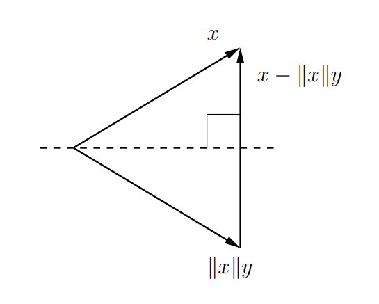

# Matrix Decomposition

## LU Decomposition/Factorization by Gaussian Elimination

Lower–upper (LU) decomposition or factorization factors a matrix as the product of a lower triangular matrix and an upper triangular matrix.

*Gaussian elimination* can be used for decomposition.

Let $A$ be a $3 \times 3$ square matrix, LU can be
$$
\begin{bmatrix}
      a_{1,1} & a_{1,2} & a_{1,3} \\
      a_{2,1} & a_{2,2} & a_{2,3} \\
      a_{3,1} & a_{3,2} & a_{3,3}
\end{bmatrix}
=
\begin{bmatrix}
      l_{1,1} & 0 & 0 \\
      l_{2,1} & l_{2,2} & 0 \\
      l_{3,1} & l_{3,2} & l_{3,3}
\end{bmatrix}
\begin{bmatrix}
      u_{1,1} & u_{1,2} & u_{1,3} \\
      0 & u_{2,2} & u_{2,3} \\
      0 & 0 & u_{3,3}
\end{bmatrix}
$$

Define $P$ as a permutation matrix, there is 
$$
PA=LU
$$

### Application

Given a system of linear equations in matrix form $A$ and we want to solve the linear system (find a solution for $\bold{x}$)
$$
A\bold{x}=\bold{b}
$$

By LU decomposition, there is 
$$
PA=LU
$$

So that
$$
LU\bold{x}=P\bold{b}
$$

Given the nature of triangular matrix, by forward and backward substitution, define a temp vector $\bold{y}$, there is
$$
L\bold{y}=P\bold{b}
$$
Then, solve $\bold{y}$, and use $\bold{y}$ to solve $\bold{x}$ by
$$
U\bold{x} = \bold{y}
$$

## Cholesky Decomposition/Factorization

Cholesky decomposition decomposes a Hermitian, positive-definite matrix $A$ into the product of a lower triangular matrix $L$ and its conjugate transpose $L^*$, such as $A=LL^*$ or in real number $A=LL^\text{T}$. 

Every Hermitian positive-definite matrix (and thus also every real-valued symmetric positive-definite matrix) has a unique Cholesky decomposition.

It is useful to solve Linear least squares (LLS) approximation problems.

### Derivation Proof

Define a positive definite matrix $A \in \mathbb{R}^{n \times n}$. It is trivial when $n=1$, and then only consider $n>1$ cases. Partition $A$ as below, where $\~{A} \in \mathbb{R}^{(n-1) \times (n-1)}$, and $\bold{a} \in \mathbb{R}^{n-1}$ is a vector. $\alpha$ is a scalar number.
$$
A = 
\begin{bmatrix}
      \~{A} & \bold{a} \\
      \bold{a}^\text{T} & \alpha
\end{bmatrix}
$$

Since a principal submatrix of a positive definite matrix is positive definite, so that $\~{A}$ is positive definite as well, and $\~{A}$ has Cholesky factorization $\~{A}=\~{L}\~{L}^\text{T}$.

Define $L_1^{-1}:=\begin{bmatrix}      \~{L}^{-1} & 0 \\      0 & 1\end{bmatrix}$, then consider

$$
\begin{align*}
L_1^{-1} A L_1^{-\text{T}} &= 
\begin{bmatrix}
      \~{L}^{-1} & 0 \\
      0 & 1
\end{bmatrix}
\begin{bmatrix}
      \~{A} & \bold{a} \\
      \bold{a}^\text{T} & \alpha
\end{bmatrix}
\begin{bmatrix}
      \~{L}^{-\text{T}} & 0 \\
      0 & 1
\end{bmatrix}
\\ &=
\begin{bmatrix}
      I & \bold{b} \\
      \bold{b}^\text{T} & \alpha
\end{bmatrix}
\\ : &=
B
\end{align*}
$$
where $\bold{b}:=\~{L}^{-1}\bold{a}$.

Then, to eliminate $\bold{b}$, define $L_2^{-1}:=\begin{bmatrix}      I & 0 \\      -\bold{b}^\text{T} & 1\end{bmatrix}$, then consider

$$
\begin{align*}
L_2^{-1} B L_2^{-\text{T}} &= 
\begin{bmatrix}
      I & 0 \\
      -\bold{b}^\text{T} & 1
\end{bmatrix}
\begin{bmatrix}
      I & \bold{b} \\
      \bold{b}^\text{T} & \alpha
\end{bmatrix}
\begin{bmatrix}
      I & -\bold{b} \\
      0 & 1
\end{bmatrix}
\\ &=
\begin{bmatrix}
      I & 0 \\
      0 & \alpha-\bold{b}^\text{T}\bold{b}
\end{bmatrix}
\\ &=
\begin{bmatrix}
      I & 0 \\
      0 & \alpha-\bold{a}^\text{T} \~{L}_1^{-\text{T}}\~{L}_1^{-1} \bold{a}
\end{bmatrix}
\\ &=
\begin{bmatrix}
      I & 0 \\
      0 & \alpha-\bold{a}^\text{T} \~{A}^{-1} \bold{a}
\end{bmatrix}
\end{align*}
$$

Summarize the above equations, there is
$$
L_2^{-1} B L_2^{-\text{T}} =
(L_2^{-1}L_1^{-1}) A (L_1^{-\text{T}}L_2^{-\text{T}})
$$

This is a congruent transformation on a positive definite matrix $A$, so that the diagonal matrix has positive real entries including $\alpha-\bold{a}^\text{T} \~{A}^{-1} \bold{a} > 0$.

Define $\lambda^2 = \alpha-\bold{a}^\text{T} \~{A}^{-1} \bold{a}$, and $L_3:=\begin{bmatrix}      I & 0 \\     0 & \lambda\end{bmatrix}$, so that

$$
\begin{align*}
&&
(L_2^{-1}L_1^{-1}) A (L_1^{-\text{T}}L_2^{-\text{T}}) 
&=
L_3 L_3^\text{T} 
\\ \Rightarrow && 
A
&=
\underbrace{L_1 L_2 L_3}_{:= L} 
\underbrace{L_3^\text{T} L_2^\text{T} L_1^\text{T}}_{:= L^\text{T}}
\\ && &=
L L^\text{T}
\end{align*}
$$
where
$$
\begin{align*}
L=L_1 L_2 L_3 &= 
\begin{bmatrix}
      \~{L} & 0 \\
      0 & 1
\end{bmatrix}
\begin{bmatrix}
      I & 0 \\
      -\bold{b}^\text{T} & 1
\end{bmatrix}
\begin{bmatrix}
      I & 0 \\
      0 & \lambda
\end{bmatrix}
\\ &=
\begin{bmatrix}
      \~{L} & 0 \\
      \bold{b}^\text{T} & \lambda
\end{bmatrix}
\\ &=
\begin{bmatrix}
      \~{L} & 0 \\
      \bold{a}^\text{T}\~{L}^{-\text{T}} & \lambda
\end{bmatrix}
\end{align*}
$$

Hence, $A=LL^\text{T}$ is Cholesky decomposition. Recall that $\~{A} \in \mathbb{R}^{(n-1) \times (n-1)}$, and $n=1$ is trivial proved for $A \in \mathbb{R}^{2 \times 2}$, then $\~{A} \in \mathbb{R}^{2 \times 2}$ can prove for ${A} \in \mathbb{R}^{3 \times 3}$, and recursively onwards.

### Computation by LDLT

Given that $A$ is positive definite, $A$ can be decomposed as below
$$
\begin{align*}
A &= LD L^{-1} = LD L^{\text{T}}
\\ &=
\begin{bmatrix}
      1 & 0 & 0 \\
      L_{21} & 1 & 0 \\
      L_{31} & L_{32} & 1
\end{bmatrix}
\begin{bmatrix}
      D_1 & 0 & 0 \\
      0 & D_2 & 0 \\
      0 & 0 & D_3
\end{bmatrix}
\begin{bmatrix}
      1 & L_{21} & L_{31} \\
      0 & 1 & L_{32} \\
      0 & 0 & 1
\end{bmatrix}
\\ &=
\begin{bmatrix}
      D_1 &  & (\text{symmetric}) \\
      L_{21}D_1 & L^2_{21}D_1+D_2 &  \\
      L_{31}D_1 & L_{31}L_{21}D_1+L_{32}D_2 & L^2_{31}D_1+L^2_{32}D_2+D_3
\end{bmatrix}
\end{align*}
$$
where
$$
\begin{align*}
D_j &= A_{jj} - \sum^{j-1}_{k=1} L^2_{jk} D_k
\\
L_{ij} &= \frac{1}{D_j} \bigg( 
      A_{ij} - \sum^{j-1}_{k=1} L_{ik} L_{jk} D_{k}
\bigg) \quad i>j 
\end{align*}
$$

### Application

Given a system of linear equations in matrix form $A$ ($A$ is symmetric and positive definite) and we want to solve the linear system (find solution for $\bold{x}$)
$$
A\bold{x}=\bold{b}
$$

Given the decomposition $A=LL^*$, define a temp vector $\bold{y}$, $\bold{x}$ can be solved by forward and backward substitution:

1. solve $\bold{y}$ for $L\bold{y}=\bold{b}$
2. solve $\bold{x}$ for $L\bold{x}=\bold{y}$

## QR Decomposition/Factorization

Define a decomposition of a matrix $A$ into a product $A = QR$ of an orthogonal matrix $Q$ and an upper triangular matrix $R$.

It is useful to solve Linear least squares (LLS) approximation problems.

### Gram–Schmidt Process

Define a square matrix $A=[\bold{a}_1, \bold{a}_2, ...,\bold{a}_n]$, where $\bold{a}_k$ represent a column vector of $A$.

Denote a projection operator from vector $\bold{a}$ onto $\bold{u}$:
$$
proj_{\bold{u}}(\bold{a})
=
\frac{\langle \bold{u},\bold{a} \rangle}
{\langle \bold{u},\bold{u} \rangle}\bold{u}
$$
where $\langle\bold{u},\bold{a}\rangle=\bold{u}^\text{T}\bold{a}$ represents inner product operation.

$$
\begin{array}{cc}
    \bold{u}_1 = \bold{a}_1 & 
    \bold{e}_1=\frac{\bold{u}_1}{||\bold{u}_1||}
    \\
    \bold{u}_2 = \bold{a}_2 - proj_{\bold{u}_1}(\bold{a}_2) & 
    \bold{e}_2=\frac{\bold{u}_2}{||\bold{u}_2||}
    \\
    \bold{u}_3 = \bold{a}_3 - proj_{\bold{u}_1}(\bold{a}_3) - proj_{\bold{u}_2}(\bold{a}_3) & 
    \bold{e}_3=\frac{\bold{u}_3}{||\bold{u}_3||}
    \\
    \bold{u}_4 = \bold{a}_4 - proj_{\bold{u}_1}(\bold{a}_4) - proj_{\bold{u}_2}(\bold{a}_4) - proj_{\bold{u}_3}(\bold{a}_4) & 
    \bold{e}_4=\frac{\bold{u}_4}{||\bold{u}_4||}
    \\
    \space
    \\
    ... & ...
    \\
    \space
    \\
    \bold{u}_k = \bold{a}_k - \sum^{k-1}_{j}proj_{\bold{u}_j}(\bold{a}_k) &
    \bold{e}_k=\frac{\bold{u}_k}{||\bold{u}_k||}
\end{array}
$$

The figure below describes the above projection with this notation substitution $\bold{a}_k=\bold{v}_k$ to $proj_{\bold{u}}(\bold{v})$.

      

 

Express $\bold{a}_i$ over our newly computed orthonormal basis:
$$
\begin{align*}
      \bold{a}_1 &= \langle\bold{e}_1,\bold{a}_1\rangle \bold{e}_1
      \\
      \bold{a}_2 &= \langle\bold{e}_1,\bold{a}_2\rangle \bold{e}_1 + \langle\bold{e}_2,\bold{a}_2\rangle \bold{e}_2
      \\
      \bold{a}_3 &= \langle\bold{e}_1,\bold{a}_3\rangle \bold{e}_1 + \langle\bold{e}_2,\bold{a}_3\rangle \bold{e}_2 + \langle\bold{e}_3,\bold{a}_3\rangle \bold{e}_3
      \\
      & \vdots
      \\
      \bold{a}_n &= \sum^k_{j=1} \langle\bold{e}_j,\bold{a}_k\rangle \bold{e}_j
\end{align*}
$$

So that $A=QR$, where
$$
\begin{align*}
Q &= [\bold{e}_1, \bold{e}_2, ..., \bold{e}_n]
\\
R &= \begin{bmatrix}
      \langle\bold{e}_1,\bold{a}_1\rangle & 
      \langle\bold{e}_1,\bold{a}_2\rangle &
      \langle\bold{e}_1,\bold{a}_3\rangle &
      ... &
      \langle\bold{e}_1,\bold{a}_n\rangle \\
      0 & 
      \langle\bold{e}_2,\bold{a}_2\rangle &
      \langle\bold{e}_2,\bold{a}_3\rangle &
      ... &
      \langle\bold{e}_2,\bold{a}_n\rangle \\
      0 & 
      0 &
      \langle\bold{e}_3,\bold{a}_3\rangle &
      ... &
      \langle\bold{e}_3,\bold{a}_n\rangle \\
      \vdots & \vdots & \vdots & \ddots & \vdots \\
      0 & 
      0 &
      0 &
      ... &
      \langle\bold{e}_k,\bold{a}_n\rangle \\
\end{bmatrix}
\end{align*}
$$

### Householder Transformation

A Householder reflection $H$ (or Householder transformation) is a transformation that takes a vector and reflects (a.k.a, orthogonal transformation) it about some plane or hyperplane. 

It aims to achieve $A = QR$ by performing  a sequence of Householder transformations introducing zeros to $A$ so that $A$ becomes an upper triangular matrix eventually.

Define Householder reflection $H$
$$
H=I-2vv^T
$$
where $v$ is a unit normal vector to a hyperplane.

Now suppose we are given a vector $x$ and we want to find a reflection that transforms $x$ into a direction parallel to some unit vector $y=\pm e$ ($y$ is the new basis).

we can construct by taking the hyperplane normal to $x − ||x||y$. That is, letting $u = x − ||x||y$ and $v = \frac{u}{||u||}$ ($v$ is the unit normal vector to a hyperplane (indicated by a dash line))

$$\begin{align*}
(I-2vv^T)x
&=
x-2\frac{(x − ||x||y)(x^Tx − ||x||x^Ty)}{(x − ||x||y)^2}
\\ &=
x-2\frac{(x − ||x||y)(x^Tx − ||x||x^Ty)}{||x||^2+2x^Ty||x||+||x||^2||y||^2}
\\ &=
x-(x-||x||y)
\\ &=
||x||y
\end{align*}$$

      

 

By $y = \pm e_1$, we can get a reflection that zeros out all but the first
element of the vector $x$. 

The first Householder transformation can be written as
$$
H_1 A = 
(H_1 a_1 
\space\space\space\space
H_1 A_1')
=
\begin{bmatrix}
      * & * \\
      0 & \hat{A_2}
\end{bmatrix}
$$

The second Householder transformation is
$$
H_2 H_1 A
=
\begin{bmatrix}
      * & * & * \\
      0 & * & * \\
      0 & 0 & \hat{A_3}
\end{bmatrix}
$$

The sequence of operations goes on, hence
$$
H_n H_{n-1} ... H_2 H_1 A
=
R
$$

In the end, QR decomposition is
$$
A=QR
$$
where $Q=H_n H_{n-1} ... H_2 H_1$

### QR vs LU decomposition

* QR uses more stable transoformation; LU factorization on the other hand requires some variant of Gaussian elimination the stability of which requires one to assume that pivot values do not decay too rapidly.

* For the full-rank case LU factorization is cheaper; QR is good for rank-deficient least-squares cases.