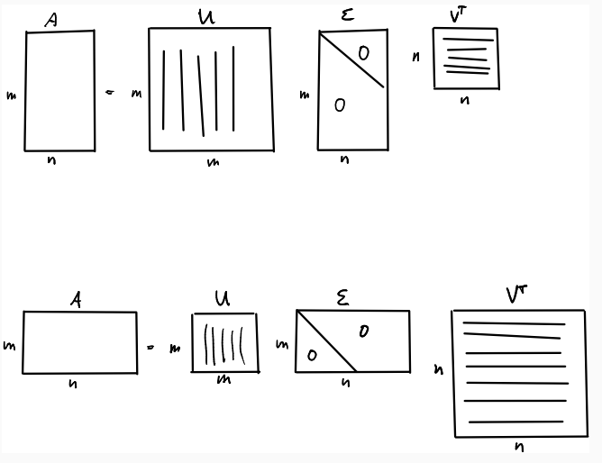

# Singular Value Decomposition (SVD)

SVD is a factorization that decompose an $m \times n$ matrix A into
$$
A=U \Sigma V^\text{T}
$$

SVD generalizes the eigen-decomposition of a square normal matrix with an orthonormal eigen basis to any $m \times n$ matrix. 

      

 

## SVD in Machine Learning

Typically, for a population of samples $A$, the covariance ${\Omega}$ of $A$ (typically use ${\Sigma}$ as covariance matrix notation, but here use ${\Omega}$ to avoid duplicate notations as ${\Sigma}$ means singular value matrix in this article) of the samples' features describes how rich information they are.
Larger the variance of a feature, likely richer the information. 

Take SVD on the covariance matrix such that ${\Omega}=U \Sigma V^\top$, and obtain singular value matrix ${\Sigma}$ and new orthogonal basis space $V$.
Intuitively speaking, ${\Sigma}$ describes how significant is for each corresponding orthogonal basis vector in $V$.

The transformed new orthogonal space $V$ can help recover the source sample data by $A=AV$.

### SVD for PCA

PCA (Principal Component Analysis) simply takes the first few most significant components out of the result of SVD (Singular Value Decomposition).

## SVD computation

Compute the eigenvalues and eigenvectors of $A^\text{T}A$
$$
A^\text{T}A \bold{v}_1 = \lambda_1 \bold{v}_1
\\
A^\text{T}A \bold{v}_2 = \lambda_2 \bold{v}_2
\\
...
\\
A^\text{T}A \bold{v}_n = \lambda_n \bold{v}_n
$$

* So that $V$ is
$$
V=
\begin{bmatrix}
    \vdots & & \vdots \\
    \bold{v}_1 & ... & \bold{v}_n \\
    \vdots & & \vdots
\end{bmatrix}
$$

* So that $\Sigma$ is
$$
\Sigma=
\begin{bmatrix}
    \sqrt{\lambda_1} & & & \\
     & \ddots & & \bold{0} \\
     & & \sqrt{\lambda_n} & \\
\end{bmatrix}
$$
or (depending on the relative matrix sizes of $m$ vs $n$)
$$
\Sigma=
\begin{bmatrix}
    \sqrt{\lambda_1} & & \\
     & \ddots & \\
     & & \sqrt{\lambda_n} \\
     & \bold{0} &
\end{bmatrix}
$$

* So that $U$ is 
$$
U=A V \Sigma^{-1}
$$
given
$$
A=U \Sigma V^\text{T}
\Leftrightarrow
U \Sigma = A V
$$

Remember, $U$ is orthogonal
$$
U^\text{T}U=
\Sigma^{-1} V^\text{T} A^\text{T} A V \Sigma^{-1}=
I
$$

## SVD for least squares problem

Given a least squares problem:
for a residual $\bold{r} = A \bold{x} - \bold{b}$, where $A \in \mathbb{R}^{m \times n}$ (assumed $A$ is full rank that $n = \text{rank}(A)$), and there is $m > n$, here attempts to minimize
$$
\space \underset{\bold{x}}{\text{min}} \space
||A \bold{x} - \bold{b}||^2=
r_1^2 + r_2^2 + ... + r^2_m
$$

Process:

$$
\begin{align*}
& ||A \bold{x} - \bold{b}||^2 \\ =& 
||U \Sigma V^\text{T} \bold{x} - \bold{b}||^2 \\ =&
||U^\text{T}(U \Sigma V^\text{T} \bold{x} - \bold{b})||^2 \\ =& 
||U^\text{T}U \Sigma V^\text{T} \bold{x} - U^\text{T}\bold{b}||^2
\quad U\text{ is orthoganal that } U^\text{T}U=I\\ =&
||\Sigma V^\text{T} \bold{x} - U^\text{T}\bold{b}||^2\\ =&
||\Sigma \bold{y} - U^\text{T}\bold{b}||^2
\quad \text{denote } \bold{y}=V^\top\bold{x}
\text{ and } \bold{z}=U^\top\bold{b} \\ =&
\Bigg|\Bigg|
\begin{bmatrix}
    \sigma_1 & & & \\
     & \ddots & & \\
    & & \sigma_n & \\
    & & & \bold{0}
\end{bmatrix}
\bold{y} - \bold{z}
\Bigg|\Bigg|^2\\ =&
\sum^{n}_{i=1} \big( \sigma_i {y}_i - \bold{u}^{\top}_i \bold{b} \big)^2+\sum^{m}_{i=n+1} \big( \bold{u}^{\top}_i \bold{b} \big)^2
\end{align*}
$$

$\bold{y}$ is determined as
$$
y_i=
\left\{
    \begin{array}{cc}
        \frac{\bold{u}^{\top}_i \bold{b}}{\sigma_i} &\quad \sigma_i \ne 0 \text{ same as } i \le n
        \\
        \text{any value} &\quad \sigma_i = 0 \text{ same as } i > n
    \end{array}
\right.
$$

Then, it is easy to find $\bold{x}$ by $\bold{x} = V\bold{y}$.

The residual is $\sum^{m}_{i=n+1} \big( \bold{u}^{\top}_i \bold{b} \big)^2$.

### Proof

## SVD vs Eigen Decomposition

* SVD generalizes the eigen decomposition of a square normal matrix with an orthonormal eigen basis to any $m \times n$ matrix.

* Eigen decomposition: not necessarily orthonormal vs SVD: orthonormal

Here defines a typical linear system $A\bold{x}=\bold{b}$.
Consider the eigen decomposition $A = P\Lambda P^{-1}$ and $A=U\Sigma V^\text{T}$.

Eigen decomposition only takes one basis $P$ in contrast to SVD using two bases $U$ and $V$. Besides, $P$ might not be orthogonal but $U$ and $V$ are orthonormal (orthogonal + unitary).

