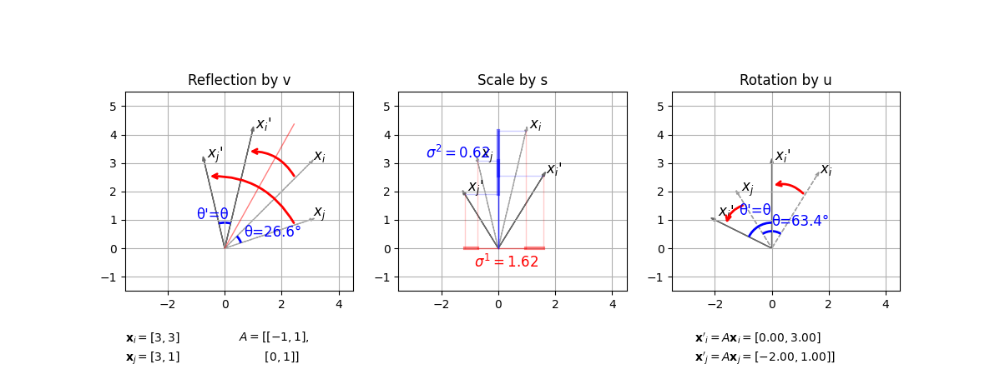

# Singular Value Decomposition (SVD)

SVD is a factorization that decompose an $m \times n$ matrix A into

$$
A=U \Sigma V^{\top}
$$

SVD generalizes the eigen-decomposition of a square normal matrix with an orthonormal eigen basis to any $n \times m$ matrix $A$.

## SVD Derivation

Compute the eigenvalues and eigenvectors of $A^{\top}A$

$$
A^{\top}A \mathbf{v}_1 = \sigma_1^2 \mathbf{v}_1 \\\\
A^{\top}A \mathbf{v}_2 = \sigma_2^2 \mathbf{v}_2 \\\\
... \\\\
A^{\top}A \mathbf{v}_n = \sigma_n^2 \mathbf{v}_n
$$

* So that $V$ is

$$
V=
\begin{bmatrix}
    \vdots & & \vdots \\\\
    \mathbf{v}_1 & ... & \mathbf{v}_n \\\\
    \vdots & & \vdots
\end{bmatrix}
$$

* So that $\Sigma$ is

$$
\Sigma=
\begin{bmatrix}
    \sigma_1 & & & \\\\
     & \ddots & & \mathbf{0} \\\\
     & & \sigma_n & \\\\
\end{bmatrix}
$$

or (depending on the relative matrix sizes of $m$ vs $n$)

$$
\Sigma=
\begin{bmatrix}
    \sigma_1 & & \\\\
     & \ddots & \\\\
     & & \sigma_n \\\\
     & \mathbf{0} &
\end{bmatrix}
$$

* So that $U$ is

$$
U=A V \Sigma^{-1}
$$

### Proof of Orthogonality

#### $A^{\top}A$ is Symmetric Hence $V$ Is Orthogonal

Define follows for $i\ne j$

$$
A^{\top}A\mathbf{v}\_i=\sigma_i^2\mathbf{v}\_i \qquad
A^{\top}A\mathbf{v}_j=\sigma_j^2\mathbf{v}_j
$$

then multiply by $\mathbf{v}_j^{\top}$, there is

$$
\begin{align*}
    && \mathbf{v}_j^{\top}A^{\top}A\mathbf{v}\_i &=
  \mathbf{v}_j^{\top}\sigma_i^2\mathbf{v}\_i \\\\
  \Rightarrow && (A^{\top}A\mathbf{v}_j)^{\top}\mathbf{v}\_i &=
  \mathbf{v}_j^{\top}\sigma_i^2\mathbf{v}\_i \qquad\text{ for symmetry } \big(A^{\top}A\big)^{\top}=A^{\top}A  \\\\
  \Rightarrow && \sigma_j^2\mathbf{v}_j^{\top}\mathbf{v}\_i &=
  \sigma_i^2\mathbf{v}_j^{\top}\mathbf{v}\_i \\\\
\end{align*}
$$

For by eigen-decomposition, there is $\sigma_i^2 \ne \sigma_j^2 \ne 0$, there could be only $\mathbf{v}_j^{\top}\mathbf{v}\_i=0$, hence orthogonal.

For $\{\mathbf{v}_1, \mathbf{v}_2, ..., \mathbf{v}_n\}$ are defined as eigenvectors of $A$ such that $V=\begin{bmatrix} \vdots & & \vdots \\\\ \mathbf{v}_1 & ... & \mathbf{v}_n \\\\ \vdots & & \vdots \end{bmatrix}$, $V$ is orthogonal.

#### $U$ Is Orthogonal For It Is Equivalent of $V$ For $AA^{\top}$

For $A^{\top}A=Q\Sigma Q^{\top}$ established by spectral theorem that for symmetric matrix eigen-decomposition, $Q$ is orthogonal.
The difference is that the spectral theorem only works for square matrix, while SVD works for non-square matrix as well.

The non-square matrix $A\in\mathbb{R}^{n\times m}$ has diff sizes for $A^{\top}A\in\mathbb{R}^{m\times m}$ vs $AA^{\top}\in\mathbb{R}^{n\times n}$, as a result, for $A^{\top}A=V\Sigma V^{\top}$, there is equivalent $AA^{\top}=U\Sigma U^{\top}$.

In conclusion, $U$ is orthogonal for it is equivalent of $V$ for $AA^{\top}$ and is of different size.

### Intuition of SVD by Geometry

In geometry intuition in $A=U \Sigma V^{\top}$, the $U$ and $V^{\top}$ are considered reflection/rotation, and $\Sigma$ is a scaling matrix.

#### $V$ and $U$ As Reflection/Rotation

* If $\text{det}(V)=-1$, it is a reflection.
* If $\text{det}(V)=1$, it is a rotation.

This is for that

1) For $|\text{det}(V)|=1$, there is no scaling.
2) For $\text{det}(V)>0$, orientation is preserved.
3) For $\text{det}(V)<0$, orientation is reversed.

* During reflection/rotation, the linear space angle is preserved.

Given two input vectors $\mathbf{x}\_i$ and $\mathbf{x}_j$, the angle between them satisfies $\cos(\theta)=\frac{\mathbf{x}\_i^{\top}\mathbf{x}_j}{||\mathbf{x}\_i||\space||\mathbf{x}\_i||}$. Apply the orthonormal matrix $V$, there is

$$
\cos(\theta')=\frac{(V\mathbf{x}\_i)^{\top}V\mathbf{x}_j}{||V\mathbf{x}\_i||\space||V\mathbf{x}\_i||}=
\frac{\mathbf{x}\_i^{\top}\mathbf{x}_j}{||\mathbf{x}\_i||\space||\mathbf{x}\_i||}=
\cos(\theta)
$$

Thus, $\theta'=\theta$, the angle is preserved.

This holds true for $U$ as well.

#### $\Sigma$ As Scaling

$\Sigma$ is a diagonal matrix, hence its non-zero entries act as pure scaling.

#### SVD Explanation by Geometry

Let $\mathbf{x}\_i=[3, 3]$ and $\mathbf{x}\_i=[3, 1]$ that are transformed by $A=\begin{bmatrix} -1 & 1 \\\\ 0 & 1 \end{bmatrix}$.
Below process shows how $A\mathbf{x}=U \Sigma V^{\top}\mathbf{x}$ is computed.

* For $\text{det}(V)=-1$, the $V^{\top}\mathbf{x}$ is a reflection operation.
* For $\Sigma$ is a diagonal matrix, the $\Sigma V^{\top}\mathbf{x}$ is a scaling operation.
* For $\text{det}(U)=1$, the $U\Sigma V^{\top}\mathbf{x}$ is a rotation operation.

      

 

where during reflection and rotation, the angle $\theta'=\theta$ is preserved.

## SVD in Machine Learning

Typically, for a population of samples $A$, the covariance ${\Omega}$ of $A$ (typically use ${\Sigma}$ as covariance matrix notation, but here use ${\Omega}$ to avoid duplicate notations as ${\Sigma}$ means singular value matrix in this article) of the samples' features describes how rich information they are.
Larger the variance of a feature, likely richer the information.

Take SVD on the covariance matrix such that ${\Omega}=U \Sigma V^\top$, and obtain singular value matrix ${\Sigma}$ and new orthogonal basis space $V$.
Intuitively speaking, ${\Sigma}$ describes how significant is for each corresponding orthogonal basis vector in $V$.

The transformed new orthogonal space $V$ can help recover the source sample data by $A=AV$.

### SVD for PCA

PCA (Principal Component Analysis) simply takes the first few most significant components out of the result of SVD (Singular Value Decomposition).

## SVD for Least Squares Problem

Given a least squares problem:
for a residual $\mathbf{r} = A \mathbf{x} - \mathbf{b}$, where $A \in \mathbb{R}^{m \times n}$ (assumed $A$ is full rank that $n = \text{rank}(A)$), and there is $m > n$, here attempts to minimize

$$
\space \underset{\mathbf{x}}{\text{min}} \space
||A \mathbf{x} - \mathbf{b}||^2=
r_1^2 + r_2^2 + ... + r^2_m
$$

Process:

$$
\begin{align*}
& ||A \mathbf{x} - \mathbf{b}||^2 \\\\ =& 
||U \Sigma V^{\top} \mathbf{x} - \mathbf{b}||^2 \\\\ =&
||U^{\top}(U \Sigma V^{\top} \mathbf{x} - \mathbf{b})||^2 \\\\ =& 
||U^{\top}U \Sigma V^{\top} \mathbf{x} - U^{\top}\mathbf{b}||^2
\quad U\text{ is orthoganal that } U^{\top}U=I\\\\ =&
||\Sigma V^{\top} \mathbf{x} - U^{\top}\mathbf{b}||^2\\\\ =&
||\Sigma \mathbf{y} - U^{\top}\mathbf{b}||^2
\quad \text{denote } \mathbf{y}=V^\top\mathbf{x}
\text{ and } \mathbf{z}=U^\top\mathbf{b} \\\\ =&
\Bigg|\Bigg|
\begin{bmatrix}
    \sigma_1 & & & \\\\
     & \ddots & & \\\\
    & & \sigma_n & \\\\
    & & & \mathbf{0}
\end{bmatrix}
\mathbf{y} - \mathbf{z}
\Bigg|\Bigg|^2\\\\ =&
\sum^{n}_{i=1} \big( \sigma_i {y}\_i - \mathbf{u}^{\top}\_i \mathbf{b} \big)^2+\sum^{m}_{i=n+1} \big( \mathbf{u}^{\top}\_i \mathbf{b} \big)^2
\end{align*}
$$

$\mathbf{y}$ is determined as

$$
y_i=
\left\{
    \begin{array}{cc}
        \frac{\mathbf{u}^{\top}\_i \mathbf{b}}{\sigma_i} &\quad \sigma_i \ne 0 \text{ same as } i \le n
        \\\\
        \text{any value} &\quad \sigma_i = 0 \text{ same as } i > n
    \end{array}
\right.
$$

Then, it is easy to find $\mathbf{x}$ by $\mathbf{x} = V\mathbf{y}$.

The residual is $\sum^{m}_{i=n+1} \big( \mathbf{u}^{\top}\_i \mathbf{b} \big)^2$.

### Proof of SVD as Solution for Least Squares Problem

In the above obtained $||A \mathbf{x} - \mathbf{b}||^2=\sum^{n}_{i=1} \big( \sigma_i {y}\_i - \mathbf{u}^{\top}\_i \mathbf{b} \big)^2+\sum^{m}_{i=n+1} \big( \mathbf{u}^{\top}\_i \mathbf{b} \big)^2$,
the second residual term $\sum^{m}_{i=n+1} \big( \mathbf{u}^{\top}\_i \mathbf{b} \big)^2$ does not depend on $\mathbf{y}$, so it is simply the irreducible residual.

The first sum reaches its minimum $0=\sum^{n}_{i=1} \big( \sigma_i {y}\_i - \mathbf{u}^{\top}\_i \mathbf{b} \big)^2$ with $y_i=\frac{\mathbf{u}^{\top}\_i \mathbf{b}}{\sigma_i}$.

## SVD vs Eigen Decomposition

* SVD generalizes the eigen decomposition of a square normal matrix with an orthonormal eigen basis to any $m \times n$ matrix.

* Eigen decomposition: not necessarily orthonormal vs SVD: orthonormal

Here defines a typical linear system $A\mathbf{x}=\mathbf{b}$.
Consider the eigen decomposition $A = P\Lambda P^{-1}$ and $A=U\Sigma V^{\top}$.

Eigen decomposition only takes one basis $P$ in contrast to SVD using two bases $U$ and $V$. Besides, $P$ might not be orthogonal but $U$ and $V$ are orthonormal (orthogonal + unitary).

### Real Symmetry and Eigenvector Orthogonality

A matrix is real symmetric if $A^{\top}=A\in\mathbb{R}^{n \times n}$.

By the *Spectral Theorem*, if $A$ is a real symmetric matrix, then:

* All eigenvalues of $A$ are **real**
* This means the eigenvectors of $A$ can be chosen to **be orthogonal and normalized**.
* $A$ can be can be orthogonally diagonalized $A=P\Lambda P^{\top}$, where 1) $\Lambda$ is a diagonal matrix containing the eigenvalues of $A$, 2) the columns of $P$ are the orthonormal eigenvectors of $A$.
