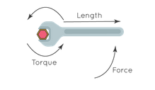

# Products: dot, cross and exterior

## Dot product: scalar product

$$
\mathbf{u} \cdot \mathbf{v} = |\mathbf{u}| |\mathbf{v}| \cos\theta = v_1u_1 + v_2u_2 + v_3u_3 + ... + v_nu_n
$$

Applications: $\mathbf{u}$ represents a 8 lb force applied pulling a wagon with an upward force direction, while $\mathbf{v}$ represents 50 ft distance. $\mathbf{u} \cdot \mathbf{v}$ expresses the *work* ($W = \overrightarrow{F} \cdot \overrightarrow{D}$) for this effort, where $\big|\overrightarrow{D}\big|=50 \text{ ft}$ is the distance, $\frac{\overrightarrow{D}}{\big|\overrightarrow{D}\big|}$ is the pulling direction, and $\overrightarrow{F}$ is the pulling force with angle of $55^{\circ}$ from the pulling direction.

$\mathbf{u} \cdot \mathbf{v}$ can be considered a projection of a vector on another vector from an angle $\theta$.

### Dot Product vs Inner Product

The generalization of the dot product to an arbitrary vector space is called an *inner product*: 
a function $\langle .\space, .\space \rangle : \mathbb{R}^n \times \mathbb{R}^n \rightarrow \mathbb{R}$ is an inner product on $\mathbb{R}^n$.

## cross product: vector quantity product

$$
\mathbf{u} \times \mathbf{v} = |\mathbf{u}| |\mathbf{v}| \space \mathbf{n} \space \sin\theta= \Bigg |
\begin{array}{ccc}
    \begin{array}{ccc}
      \overrightarrow{i} & \overrightarrow{j} & \overrightarrow{k} \\
      u_1 & u_2 & u_3 \\
      v_1 & v_2 & v_3
    \end{array}
\end{array}
\Bigg |
$$
where $\mathbf{n}$ is a unit vector perpendicular to the plane containing $\mathbf{u}$ and $\mathbf{v}$.

hence,
$$
\mathbf{u} \times \mathbf{v} =
\overrightarrow{i}|u_2v_3-u_3v_2| - \overrightarrow{j}|u_1v_3-u_3v1| + \overrightarrow{k}|u_1v_2-u_2v_1|
$$
where $\mathbf{u}$ and $\mathbf{v}$ are two vectors and $n=(\overrightarrow{i},\overrightarrow{j},\overrightarrow{k})$ is a unit vector (3-dimensional in this example) perpendicular to the plane containing $\mathbf{u}$ and $\mathbf{v}$. $\mathbf{u} \times \mathbf{v}$ itself represents the area of a parallelogram.

Applications: Twisting a bolt with a spanner, Torque is cross product of force multiplying length $\overrightarrow{T} = \overrightarrow{F} \times \overrightarrow{L}$, that means the resultant force either pulling up or pushing down the bolt.

Very interesting is that $\big|\mathbf{u} \times \mathbf{v}\big|$ happens to be the area of the parallelogram that the two vectors have enclosed.

      

 

## exterior product: wedge product

Wedge/exterior product of vectors is an algebraic construction used in geometry to study areas, volumes, and their higher-dimensional analogues, operator denoted as below:

$$\begin{align*}
\mathbf{u} \space ∧ \space \mathbf{v} \\
& = (a e_1 + b e_2)∧(c e_1 + d e_2) \\
& = ac (e_1 ∧ e1) + ad (e_1 ∧ e_2) + bc (e_2 ∧ e_1) + bd (e_2 ∧ e_2) \\
& = ad (e_1 ∧ e_2) - bc (e_1 ∧ e_2) \\
& = (ad-bc)(e_1 ∧ e_2)
\end{align*}
$$

where

$$
e_1=
\begin{array}{c}
    \bigg (
    \begin{array}{c}
      1 \\
      0
    \end{array}
    \bigg )
\end{array}
,
e_2=
\begin{array}{c}
    \bigg (
    \begin{array}{c}
      0 \\
      1
    \end{array}
    \bigg )
\end{array}
$$
that constructs a real Cartesian plane $R^2$.

Geometric definition is observed as in the examples below, indicating the area/volume of multi-dimensional vectors.

