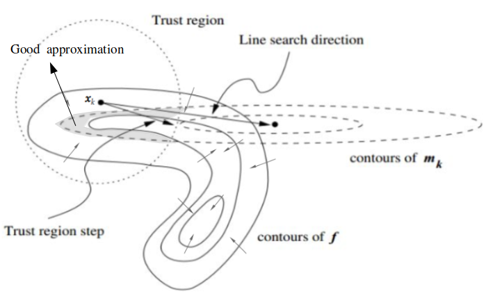
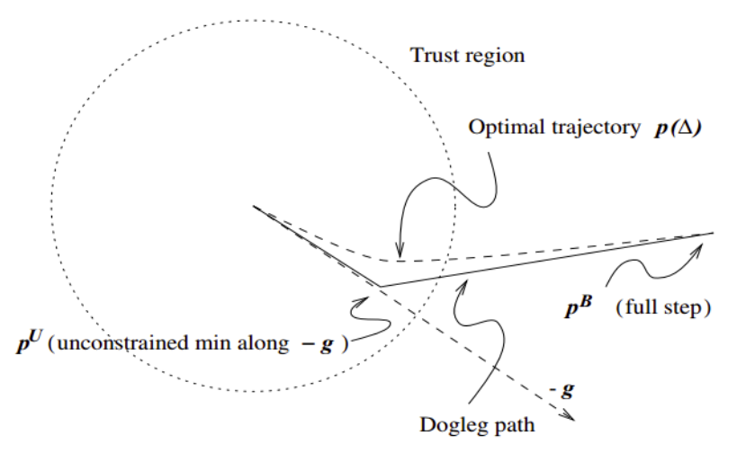

# Powell's Dogleg Method

## Trust Region

To find the minimum of an objective function $\bold{f}$, trust region method first sets up a trust region $\Delta_k$ (trust region radius $\Delta_k \in \mathbb{R}+$ is a positive scalar) at the $k$-th step iteration's position $\bold{x}_k$, within this region then computes local minimum of the second order approximation (by Hessian $H$). 

If such a local minimum sees sufficient decrease (good convergence) in objective function value, then enlarge the trust region in the next step search iteration $k+1$; 
otherwise (bad convergence), shrinks the trust region and re-compute the local minimum until observed good convergence.

      

 

Consider the step at $\bold{x}_k$ for the $k$-th convergence iteration. Take $\bold{x}_k$ as the centroid drawing a circle $\Delta_k$ regarded as the trust region. Compute the second-order approximation denoted as $\bold{m}_k$:
$$
\bold{m}_k(\bold{p})=
\bold{f}_k + \nabla \bold{f}_k^\text{T} \bold{p} + 
\frac{1}{2} \bold{p}^\text{T} H_k \bold{p}
$$
where $H_k$ is a Hessian matrix of the objective function $\bold{f}_k$, and $\bold{p}$ is the variable to $\bold{m}_k$. Intuitively speaking, $\bold{p}=\Delta\bold{x}_k; \quad \bold{x}_{k+1}=\bold{x}_k+\Delta\bold{x}_k$ describes the possible next step. 

The gray area shows good approximation by $\bold{m}_k$ (the smaller the gray area, the better the approximation), where within the trust region, the contours of $\bold{f}$ and $\bold{m}_k$ are similar to each other having similar contour curvatures. However, outside the trust region, the contours of $\bold{f}$ and $\bold{m}_k$ are quite different, rendering bad approximation of $\bold{f}$ by $\bold{m}_k$. The line search method such as Newton's method would perform badly in this scenario.

The computation of trust region radius is shown as below
$$
\bold{\rho}_k = \frac{\bold{f}(\bold{x}_k)-\bold{f}(\bold{x}_k+\bold{p}_k)}{\bold{m}_k(0)-\bold{m}_k(\bold{p}_k)}
$$
that $\bold{m}_k(0)=\bold{f}(\bold{x}_k)$ is simply the objective function value at $\bold{x}_k$. 
Hence, as $\bold{p}_k$ changes, there should be $\bold{\rho}_k \rightarrow 1$ that indicates $\bold{m}_k$ is a good approximation to $\bold{f}$ at the $\bold{x}_k$.

Recall that $\bold{m}_k$ is a quadratic function. 
This means, before $\bold{m}_k$ reaching its extremum at $\bold{p}_k^*$, $\bold{m}_k$ should have the same movement direction as around $\bold{f}_k$; 
then after crossing over $\bold{p}_k^*$, the quadratic approximation $\bold{m}_k$ should see an opposite movement direction against $\bold{f}_k$. 
As a result, within the trust region $\Delta_k$, choosing $\bold{p}_k^*$ as the optimization step is a good idea.

## Cauchy Point

Cauchy point is a simple implementation of trust region to find $\bold{p}_k^*$ within a trust region radius $\Delta_k$.

Cauchy point step $\bold{p}_k^C$ is computed by a scaled step following the direction $-\nabla \bold{f}_k$ within $\Delta_k$:
$$
\bold{p}_k^C = 
-\tau_k \frac{\Delta_k}{\big|\big| \nabla \bold{f}_k \big|\big|} \nabla \bold{f}_k
$$
where
$$
\tau_k = \left\{
      \begin{matrix}
            1 & \text{if } \nabla\bold{f}_k^\text{T} H_k \nabla\bold{f}_k \le 0
            \\
            \min \big(
                  \frac{|| \nabla \bold{f}_k ||^3}{
                       \Delta_k \cdot \nabla\bold{f}_k^\text{T} H_k \nabla\bold{f}_k
                  }, 
                  1 \big)
            & \text{otherwise}
      \end{matrix}
\right.
$$

The explanation of $\tau_k$ can be illustrated by replacing $\bold{p}_k^C$ with its expression with $\tau_k$ into the second order approximation $\bold{m}_k$:
$$
\begin{align*}
\bold{m}_k \big(
      \bold{p}_k^C 
\big) &=
\bold{m}_k \bigg(
      -\tau_k \frac{\Delta_k}{\big|\big| \nabla \bold{f}_k \big|\big|} \nabla \bold{f}_k
\bigg)
\\ &=
\bold{f}_k + 
\nabla \bold{f}_k^\text{T} \bigg(
      -\tau_k \frac{\Delta_k}{\big|\big| \nabla \bold{f}_k \big|\big|} \nabla \bold{f}_k
\bigg) + 
\frac{1}{2} \bigg(
      -\tau_k \frac{\Delta_k}{\big|\big| \nabla \bold{f}_k \big|\big|} \nabla \bold{f}_k
\bigg)^\text{T} 
H_k 
\bigg(
      -\tau_k \frac{\Delta_k}{\big|\big| \nabla \bold{f}_k \big|\big|} \nabla \bold{f}_k
\bigg)
\\ &=
\bold{f}_k 
\underbrace{- \tau_k \frac{\Delta_k}{\big|\big| \nabla \bold{f}_k \big|\big|} \nabla \bold{f}_k^\text{T} \nabla\bold{f}_k }_{
      :=M_1}
+
\underbrace{\frac{1}{2} \tau_k^2 \frac{\Delta_k^2}{\big|\big| \nabla \bold{f}_k \big|\big|^2} 
\nabla \bold{f}_k^\text{T} H_k \nabla\bold{f}_k }_{
      := M_2}
\end{align*}
$$

If $\nabla \bold{f}_k^\text{T} H_k \nabla\bold{f}_k \le 0$, both $M_1$ and $M_2$ are monotonically decreasing as $\tau_k$ increases. So that set $\tau_k=1$ that $\bold{p}_k^C$'s length is equal to the trust region radius $\Delta_k$.

If $\nabla \bold{f}_k^\text{T} H_k \nabla\bold{f}_k > 0$ ($H_k$ is positive-definite), $\bold{m}_k \big( \bold{p}_k^C \big)$ is a quadratic function whose extremum takes place when $\nabla \bold{m}_k \big( \bold{p}_k^C \big)=0$, by which $\tau_k$ is set.

* Disadvantage

Cauchy point method is non-convergence in the whole trust region. 
It simply tracks the direction of $\nabla \bold{f}_k$ with the scalar $\tau_k$ as the step length. 
The objective function $\bold{f}_k$ within a trust region $\Delta_k$ might be very curvy that one simple direction $\nabla \bold{f}_k$ does not represent how $\bold{f}_k$ moves, rendering a bad approximation.

## Dogleg

*Dogleg* provides two steps to better approximate the objective function $\bold{f}$.

The first step $\bold{p}^U$ is same as Cauchy point's method following the direction of $-\nabla\bold{f}_k$ (denoted as $-\bold{g}$ as in the figure below). 

If $H_k$ is positive-definite, the extremum $\bold{p}^{C*}_k$ exists inside the trust region. Starting from $\bold{p}^{C*}_k$, compute the second step $\bold{p}^B=-H_k\nabla\bold{f}_k$

      

 
