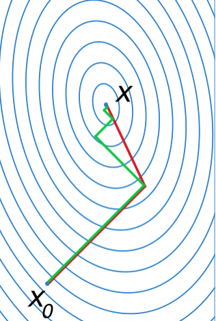

# Conjugate Gradient

Conjugate gradient finds out residual $\mathbf{r}$ 's orthogonality, descending along with each orthogonal vector direction.

It has only $O(n)$ for $n$-dimensional space, much faster than steepest descent.

## Definition

### Step $\lambda_k$ Formulation

Given an objective function ($A$ being positive definite, $f(\mathbf{x})$ must have at least first-order derivative):
$$
f(\mathbf{x})=
\frac{1}{2} \mathbf{x}^T A \mathbf{x} + \mathbf{b}^T \mathbf{x} + \mathbf{c}
$$

The first-order derivative is
$$
\frac{\partial f(\mathbf{x})}{\partial \mathbf{x}}=
A \mathbf{x} + \mathbf{b}
$$

Define $n$ mutually conjugate vectors $P$ with respect to $A$, such as $\mathbf{p}_j^\text{T} A \mathbf{p}\_i = 0, i \ne j$:
$$
P=\{ \mathbf{p}_1, \mathbf{p}_2, ..., \mathbf{p}_n \}
$$

Set $\mathbf{x}^*$ to denote the solution to $A \mathbf{x} + \mathbf{b} = 0$.

$$
\mathbf{x}^* = \sum_{i=1}^{n} \lambda_i \mathbf{p}\_i 
\Rightarrow
A \mathbf{x}^* = \sum_{i=1}^{n} \lambda_i A \mathbf{p}\_i
$$

Multiplying by $\mathbf{p}_k^\text{T}$ yields
$$
\begin{align*}
\mathbf{p}_k^\text{T} \mathbf{b}&=
\mathbf{p}_k^\text{T} A \mathbf{x}^*
\\ &=
\sum_{i=1}^{n} \lambda_i \mathbf{p}_k^\text{T} A \mathbf{p}\_i
\\ &=
\sum_{i=1}^{n} \lambda_i {\langle \mathbf{p}_k, \mathbf{p}\_i \rangle}_A
\\ &=
\lambda_i {\langle\mathbf{p}_k, \mathbf{p}_k\rangle}_A
\end{align*}
$$
where ${\langle\space\cdot\space\rangle}_A$ denotes inner product operation with or without respect to $A$: 

* ${\langle\mathbf{p}_j, \mathbf{p}\_i\rangle}_A=\mathbf{p}_j^\text{T} A \mathbf{p}\_i$

* ${\langle\mathbf{p}_j, \mathbf{p}\_i\rangle}=\mathbf{p}_j^\text{T} \mathbf{p}\_i$.

Finally,
$$
\lambda_k = 
\frac{ {\langle \mathbf{p}_k, \mathbf{b} \rangle} }{ {\langle \mathbf{p}_k, \mathbf{p}_k \rangle}_A}
$$

### Iterative approach

Let $\mathbf{r}_k$ be the residual at the $k$-th step:
$$
\mathbf{r}_k = \mathbf{b} - A \mathbf{x}_k
$$

Gram-Schmidt orthonormalization gives update for the $k$-th step conjugate vector $\mathbf{p}_k$:
$$
\mathbf{p}_k = 
\mathbf{r}_k - \sum_{i < k} \frac{{\langle\mathbf{p}\_i, \mathbf{r}_k\rangle}_A}{{\langle\mathbf{p}\_i, \mathbf{p}\_i\rangle}_A} \mathbf{p}\_i
$$

The $k$-th update is
$$
\mathbf{x}\_{k+1} = \mathbf{x}_k + \lambda_k \mathbf{p}_k
$$

## Intuition

For $f(\mathbf{x}), \mathbf{x} \in \mathbb{R}^n$, the minima can be found when its derivative is zero: $A\mathbf{x}+\mathbf{b}=0$.

To find $\mathbf{x}^*$ (optimal solution to $f(\mathbf{x})$), first find the $k$-th conjugate direction $\mathbf{p}_k$ then compute the descent distance $\lambda_k$.

$\mathbf{p}_k$ computation takes into consideration that, $\mathbf{x}^* - \mathbf{x}_k$ can be decomposed into a set of orthogonal vector additions.
$$
\mathbf{r}_k = \mathbf{p}_k + \sum_{i < k} \frac{{\langle\mathbf{p}\_i, \mathbf{r}_k\rangle}_A}{{\langle\mathbf{p}\_i, \mathbf{p}\_i\rangle}_A} \mathbf{p}\_i
$$

## Conjugate Gradient vs Steepest Descent

Green lines indicate steepest descent; red lines indicate conjugate descent.

The first steps for both steepest descent and conjugate descent are by steepest descent (descent perpendicular to tagent space).

Steepest descent continues descending along with $\frac{\mathbf{r}_k^T \mathbf{r}_k}{\mathbf{r}_k^T A \mathbf{r}_k} \triangledown f$, while conjugate descent uses orthogonality of residual $\mathbf{r}$ for descent route.

      

 
