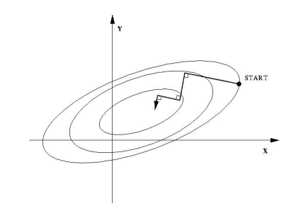

# Gradient Descent

Gradient descent (also often called steepest descent) is a first-order iterative optimization algorithm for finding a local minimum of a differentiable function. 

Define a multi-variable function ${f}(\mathbf{x})$ being differentiable in a neighbourhood of a point $\mathbf{x}_k$, then ${f}(\mathbf{x})$ decreases fastest updating $\mathbf{x}_k$ to its local minimum following

$$
\mathbf{x}_{k+1}=\mathbf{x}_k+\gamma \triangledown {f}(\mathbf{x})
$$

where $\gamma$ is learning rate.

Gradient descent refers to any class of algorithms that calculate the gradient $\triangledown {f}(\mathbf{x})$ of the objective function, then move "downhill" in the indicated direction;

## Steepest Descent

Steepest descent is a special case of gradient descent where the step length is chosen to minimize the objective function value. The iterative step $\Delta \mathbf{x} = \lambda \triangledown f(\mathbf{x}_k)$ is carefully chosen to give the route a fastest descent.

### Intuition

Steepest descent finds every step $\mathbf{x}_k$ 's gradient $A\mathbf{x}_k + \mathbf{b}$, and travels descending down along this gradient's direction by a distance of $\lambda = \frac{\mathbf{r}_k^T \mathbf{r}_k}{\mathbf{r}_k^T A \mathbf{r}_k}$.

$\mathbf{r}_k$ is the residual to optimal solution $\mathbf{x}^*$ given by $\mathbf{r}_k = \mathbf{b} - A \mathbf{x}_k$. Ideally, $A\mathbf{x}^* + \mathbf{b} = 0$.

The distance $\lambda = \frac{\mathbf{r}_k^T \mathbf{r}_k}{\mathbf{r}_k^T A \mathbf{r}_k}$ is computed by 

$$
\frac{d f(\mathbf{x_k})}{d\lambda} = 
\frac{d f(\mathbf{x_{k-1}+\Delta \mathbf{x}})}{d\lambda} =
\frac{d f(\mathbf{x_{k-1} + \lambda \triangledown f})}{d\lambda} =
0
$$

This means update step $\lambda$ is optimized (giving the longest descending distance). Shorter $\lambda$ might not travel far enough; Longer $\lambda$ might see gradient ascent.

* Example

Inner circle represents lower $f(\mathbf{x})$ value, where $\mathbf{x}=(x,y)$.

Every step $\lambda_k$ reaches the point $\mathbf{x}_k$ where $\lambda_k$ goes longer might see gradient ascent. Given this observation, next step $\lambda_{k+1}$ 's direction is perpendicular to the last step's.

### Formulation

Given an objective function ($A$ being positive definite, $f(\mathbf{x})$ must have at least first-order derivative):

$$
f(\mathbf{x})=
\frac{1}{2} \mathbf{x}^T A \mathbf{x} + \mathbf{b}^T \mathbf{x} + \mathbf{c}
$$

The first-order derivative is

$$
\frac{\partial f(\mathbf{x})}{\partial \mathbf{x}}=
A \mathbf{x} + \mathbf{b}
$$

Define an iterative step $\Delta \mathbf{x}$ for gradient descent updating $\mathbf{x}_k$, there is $\mathbf{x}_{k+1}=\mathbf{x}_k + \Delta \mathbf{x}_k = \mathbf{x}_k + \lambda \triangledown f(\mathbf{x}_k)$

$$
\begin{align*}
f(\mathbf{x}+\Delta{\mathbf{x}})&=
\frac{1}{2} (\mathbf{x}+\Delta{\mathbf{x}})^T A (\mathbf{x}+\Delta{\mathbf{x}}) + \mathbf{b}^T (\mathbf{x}+\Delta{\mathbf{x}}) + \mathbf{c}
\\\\ &=
\frac{1}{2} \mathbf{x}^T A \mathbf{x} + \mathbf{b}^T \mathbf{x} + \mathbf{c} + \frac{1}{2} \Delta{\mathbf{x}}^T A \Delta{\mathbf{x}}
\end{align*}
$$

Because $A$ is positive definit, there is $f(\mathbf{x}+\Delta{\mathbf{x}}) > f(\mathbf{x})$

Define residual $\mathbf{r}$ from the optimal solution $\mathbf{x}^*$ as $\mathbf{r}_k = \mathbf{b} - A \mathbf{x}_k$ 

Remember, $f(\mathbf{x})$ is a convex function and there must exist a solution that makes $\mathbf{b} - A \mathbf{x}$ approaching to zero, which is the point that holds the location of minima.

$$
\begin{align*}
\frac{d f(\mathbf{x_k})}{d\lambda}&=
f'(\mathbf{x}_k)\frac{d \mathbf{x}_k}{d \lambda}
\\\\ &=
f'(\mathbf{x}_k)\mathbf{r}_{k-1}
\\\\ &=
-\mathbf{r}^\text{T}_{k} \mathbf{r}_{k-1}
\\\\ &=
-(\mathbf{b}-A\mathbf{x}_k)^{\text{T}} \mathbf{r}_{k-1}
\\\\ &=
-(\mathbf{b}-A (\mathbf{x}_{k-1} + \lambda \mathbf{r}_{k-1}))^{\text{T}} \mathbf{r}_{k-1}
\\\\ &=
-(\mathbf{r}_{k-1}-\lambda A \mathbf{r}_{k-1})^{\text{T}} \mathbf{r}_{k-1}
\\\\ &=
0
\end{align*}
$$

So that we have

$$
\lambda = \frac{\mathbf{r}_k^T \mathbf{r}_k}{\mathbf{r}_k^T A \mathbf{r}_k}
$$

Back to the iteration, this loop keeps going on $\mathbf{x}_{k+1}=\mathbf{x}_k + \Delta \mathbf{x}_k = \mathbf{x}_k + \lambda \triangledown f(\mathbf{x}_k)$, until residual $\mathbf{r}$ is small.