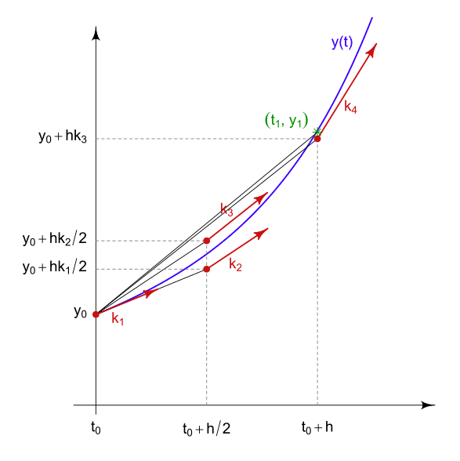

# Runge–Kutta

Runge–Kutta method can be used for nonlinear equation approximation and curve fitting.

The approximation is computed by
$$
\begin{align*}
    y_{n+1} &= y_n + \frac{h}{6} (k_1 + 2k_2 + 2k_3 + k_4) \\
    t_{n+1} &= t_n + h
\end{align*}
$$

where $y_{n}$ is the $n$-th discrete output and the $t_{n}$ is the corresponding input.
Since Runge–Kutta method is more often used in time-series system, the input notation $x_{n}$ is replaced with $t_{n}$.
$h$ can be thought of $\Delta x$ equivalent to represent the iterative step.

The step coefficients $k_i$ are computed by
$$
\begin{align*}
    k_1 &= f(t_n, y_n) \\
    k_2 &= f(t_n + \frac{h}{2}, y_n + h \frac{k_1}{2}) \\
    k_3 &= f(t_n + \frac{h}{2}, y_n + h \frac{k_2}{2}) \\
    k_4 &= f(t_n+h, y_n+h k_3) \\
\end{align*}
$$
where $f(t,y)=\frac{dy}{dt}$ is the first order derivative.

      

 
