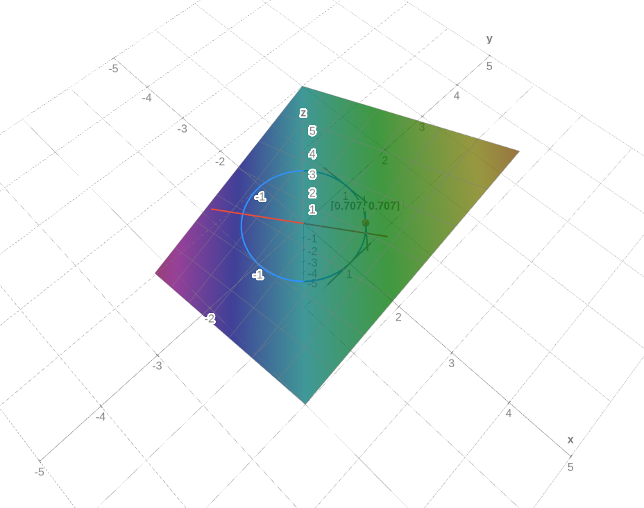
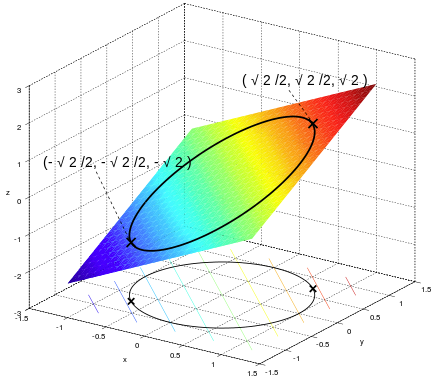

# Lagrangian Multiplier

In order to find the extreme values of a function $f:\mathbb{R}^n \rightarrow \mathbb{R}$, $f(\mathbf{x})$ subjected to an equality constraint function $g:\mathbb{R}^n \rightarrow \mathbb{R}^c$ with a constraint expression $g(\mathbf{x})=0$, given both $f, g \in C^1$ (indicating both having at least first-order derivative), here constructs Lagrangian function 
$$
L(\mathbf{x}, \lambda)=f(\mathbf{x})+\lambda g(\mathbf{x})
$$

Partial derivatives $\frac{\partial L}{\partial \mathbf{x}}$, $\frac{\partial L}{\partial \lambda}$ should be zero for stationary point discovery (local minima/maxima).

$\lambda$ is known as *Lagrangian multiplier*.

## Intuition

$f$ and $g$ are continuous and stationary points $\mathbf{x}_{stationary}$ (local maxima/minima) can be found when the tangents of stationary points $\mathbf{x}_{stationary}$ for both $f$ and $g$ are parallel, which can be described as
$$
\nabla f = \lambda \nabla g
$$

## Example

Define $f(x, y)=x+y$ subject to a constraint $x^2 + y^2 = 1$.
Find the extreme values of $f(x,y)$.

### By Analytic Geometry

It is easy to tell that $f(x, y)$ is a plane $z=x+y$ constrained on a circle $x^2+y^2=1, z\in \mathbb{R}$, 
and the extreme values are

$$
f(\frac{\sqrt{2}}{2}, \frac{\sqrt{2}}{2})=\sqrt{2},
\quad
f(-\frac{\sqrt{2}}{2}, -\frac{\sqrt{2}}{2})=-\sqrt{2}
$$

By Lagrangian multiplier intuition displayed in the figure below, the extreme values, the max value in this case, should be on where circle's tangent line parallel to the plane.
The red line is the normal to the plane, and the tangent line to the circle at the point $[\frac{\sqrt{2}}{2}\approx 0.707, \frac{\sqrt{2}}{2}\approx 0.707]$ is perpendicular to the red/normal line. Being perpendicular indicates parallelism of line vs plane.

      

 

The tangent line to the circle $x^2 + y^2 = 1$ at the point $[x_0, y_0, z=0]$ is $x_0 x - x_0^2 - y_0^2 = y_0 y$.
The next step is to locate at what points $[x_0, y_0]$, tangent lines are parallel to the plane $z=x+y$.

Recall that a line is parallel to a plane if the direction vector of the line is orthogonal to the normal vector of the plane.
Here defines the normal vector to the plane $z=x+y$ as $\mathbf{n}=[x_n, y_n, z_n]$.

Then randomly pick two points on the plane $z=x+y$: such as $[0,1,1]$ and $[1,0,1]$, and compute the $\mathbf{n}$ assumed starting at $[0,0,0]$ (warning: the randomly picked three points should not be on the same line).

$$
\mathbf{n} =
[1,0,1] \times [0,1,1] =
\begin{vmatrix}
    \overrightarrow{i} & \overrightarrow{j} & \overrightarrow{k} \\\\
    1 & 0 & 1 \\\\
    0 & 1 & 1
\end{vmatrix} =
-1 \overrightarrow{i} - 1 \overrightarrow{j} + 1 \overrightarrow{k}
$$

P.S., an alternative to compute the normal $\mathbf{n}=[-1,-1,1]$, that it'd be derived simply by the plane $z=x+y$ be rearranged to $0=-x-y+z$, where the coefficients $[-1,-1,1]$ exactly represents direction ratios of the normal to the plane.

Rewrite the tangent line to $x_0 x - y_0 y + 0 \cdot z - y_0^2 - x_0^2 = 0$, the coefficient $[x_0, y_0, 0]$ to $x$, $y$ and $z$ represent direction ratios of the tangent line, hence the plane's normal and the tangent vector should be orthogonal, the dot product is therefore zero.

$$
[-1,-1,1] \cdot [x_0, -y_0, 0] =- x_0 + y_0 + 0 = 0
$$

Remember, candidate $[x_0,y_0]$s are all confined on the circle $x^2+y^2=1$, so that

$$
\begin{align*}
&&&
    \left \{
        \begin{array}{c}
            x_0^2+y_0^2=1 \\\\
            x_0+y_0=0
        \end{array}
    \right. \\\\
\Rightarrow &&& 
    \left \{
        \begin{array}{c}
            2x_0^2=1 \\\\
            y_0=x_0
        \end{array}
    \right. \\\\
\Rightarrow &&& 
    \left \{
        \begin{array}{c}
            x_0 = \frac{\sqrt{2}}{2} \\\\
            y_0 = \frac{\sqrt{2}}{2}
        \end{array}
    \right.
&&& \text{and }
    \left \{
        \begin{array}{c}
            x_0 = -\frac{\sqrt{2}}{2} \\\\
            y_0 = -\frac{\sqrt{2}}{2}
        \end{array}
    \right. \\\\
\end{align*}
$$

      

 

### By Lagrangian Multiplier

Alternatively, solve it by Lagrangian multiplier, the above $f$ and its constraints can be defined as $g(x,y)=x^2+y^2-1=0$.

Lagrange function can be defined

$$
\begin{align*}
L(x,y,\lambda)&=
f(x,y)+\lambda g(x,y)
\\\\ &=
x+y+\lambda (x^2+y^2-1)
\end{align*}
$$

Gradient can be computed

$$
\begin{align*}
\triangledown L(x,y,\lambda)&=
(
    \frac{\partial L}{\partial x},
    \frac{\partial L}{\partial y},
    \frac{\partial L}{\partial \lambda}
)
\\\\ &=
(1+2\lambda x, 1+2\lambda y, x^2+y^2-1)
\end{align*}
$$

since $\triangledown L(x,y,\lambda)=0$, there is
$$
\left \{ \begin{array}{c}
    1+2\lambda x = 0 \\\\
    1+2\lambda y = 0 \\\\
    x^2+y^2-1 = 0
\end{array}
\right.
$$
whose solutions $(x,y,\lambda)$ are
$$
(\frac{\sqrt{2}}{2}, \frac{\sqrt{2}}{2}, -\frac{1}{\sqrt{2}}), 
\quad 
(-\frac{\sqrt{2}}{2}, -\frac{\sqrt{2}}{2}, \frac{1}{\sqrt{2}})
$$

The maxima and minima are
$$
f(\frac{\sqrt{2}}{2}, \frac{\sqrt{2}}{2})=\sqrt{2},
\quad
f(-\frac{\sqrt{2}}{2}, -\frac{\sqrt{2}}{2})=-\sqrt{2}
$$
