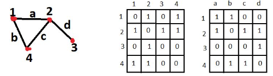
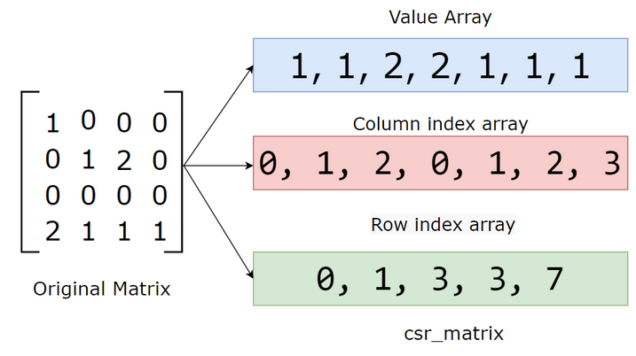

# Graph Optimization

## Graph-related matrices

The left hand side matrix (adjacency matrix) shows topologies of the graph; the right hand side matrix (incidence matrix) shows the edges/events between vertices.



### Adjacency Matrix

An adjacency matrix is a square matrix used to represent a finite graph.
The elements of the matrix indicate whether pairs of vertices are adjacent or not in the graph.

Let $G=(V,E)$ be a graph, there are

* $V=\{\mathbf{v}_1,\mathbf{v}_2,...\}$ is a set of vertices
* $E=\{(\mathbf{v}_1, \mathbf{v}_2), ...\}$ is a set of edges

The adjacency matrix $A$ is defined as

$$
A[i][j]\begin{cases}
    1 & \text{if edge } (\mathbf{v}_i, \mathbf{v}_j) \text{ exists} \\\\
    0 & \text{otherwise}
\end{cases}
$$

where the row index $i$ and col index $j$ are vertices.

#### Use Example

Given a sequence of input $\mathbf{x}=[\mathbf{x}_1,\mathbf{x}_2,\mathbf{x}_3, ...]\in\mathbb{R}^{n \times d}$, e.g., feature vectors $\mathbf{x}\in\mathbb{R}^{4 \times 2}$, assumed each vertex of graph has $d=2$ dimensions, to apply the input to a graph $A$:

$$
A = \begin{bmatrix}
    0 & 1 & 0 & 1 \\\\
    1 & 0 & 1 & 1 \\\\
    0 & 1 & 0 & 0 \\\\
    1 & 1 & 0 & 0
\end{bmatrix} \qquad
\mathbf{x} = \begin{bmatrix}
    1 & 0 \\\\
    0.5 & 0.5 \\\\
    0 & 1 \\\\
    0 & 1 \\\\
\end{bmatrix}
$$

there is $A\mathbf{x}$ that can be thought as aggregating all nodes' features.

$$
A\mathbf{x}=\begin{bmatrix}
    0.5 & 1.5 \\\\
    1 & 2 \\\\
    0.5 & 0.5 \\\\
    1.5 & 0.5 \\\\
\end{bmatrix}
$$

For $A_{ij}\in\{0,1\}$ only has two values either $0$ or $1$ indicating if an edge exists, there is an additional learnable weight matrix $W$ to control how "strong" an edge is, as well as to do linear projection to expand/shrink the output dimensions.

Finally, the output is

$$
\mathbf{y}=A\mathbf{x}W
$$

### Incidence matrix

An incidence matrix $M$ is a logical ($M_{ij}\in\{0,1\}$) matrix that shows the relationship between two classes of objects, usually called an *incidence relation*.
In other words, incidence means a vertex $\mathbf{v}_i$ is in edge $e_j$. As a result, each edge $e_j$ col only has two "$1$" elements (for non-hyper graph).

$$
M[i][j]\begin{cases}
    1 & \text{if vertex } \mathbf{v}_i \text{ is incident to edge } e_j\\\\
    0 & \text{otherwise}
\end{cases}
$$

where row index $i$ is for vertices while col index $j$ is for edges, e.g., $[a,b,c,d]$ in the figure above.

### Degree Matrix

A diagonal matrix $D$ is defined where $D_{ii}$ is the degree (number of neighbors) of node $i$.
Degree matrix can be used to show "importance" of a vertex, that if a node has many edges/neighbors, this node is likely highly important.

For example, given an adjacency matrix $A$:

$$
A = \begin{bmatrix}
    0 & 1 & 0 & 1 \\\\
    1 & 0 & 1 & 1 \\\\
    0 & 1 & 0 & 0 \\\\
    1 & 1 & 0 & 0
\end{bmatrix}
$$

The corresponding degree matrix $D$ is

$$
D = \begin{bmatrix}
    2 & 0 & 0 & 0 \\\\
    0 & 3 & 0 & 0 \\\\
    0 & 0 & 1 & 0 \\\\
    0 & 0 & 0 & 2
\end{bmatrix}
$$

where $D_{ii}$ is the num of neighbors of the node $i$.

## Sparse Matrix Optimization

Sparse matrix is a matrix with the majority of entries being zeros. This is an overhead when performing matrix multiplications that zero multiplying any value returns zero.

Given matrix zero entry distributions, there can be many sparse matrix compression methods. One most commonly used is using row's and column's index to represent non-zero entries. 

This method is coined *Compressed Sparse Row* (CSR).



Graph in representation by matrix often results in sparse matrices, since often is that not many graph topoloies see every node in connection to the rest of all nodes. 

This holds truth for many SLAM problems that given a robot's state $\mathbf{x}_k$ and its constraints $\mathbf{z}_k$ at the $k$-th timestamp, previous state $\mathbf{x}_{k-1}$ and earliers' does not necessarily account for future state $\mathbf{x}_{k+1}$.

## Hyper-Graph Optimization

A hyper-graph is an extension of a graph where an edge can connect multiple nodes and not only two.

Graph optimization in nature is a least squares minimization problem:

$$
\mathbf{F}_k(\mathbf{x})=
arg \space \underset{\mathbf{x}}{min}
\sum_{k \in C} \mathbf{e}_k(\mathbf{x}_k, \mathbf{z}_k)^\text{T} \Omega_k \mathbf{e}_k(\mathbf{x}_k, \mathbf{z}_k)
$$

where

* $\mathbf{x}$ is a vector of parameters, in which $\mathbf{x}_i$ represents a generic parameter block
* $\mathbf{x}_k$ represents the set of parameters given the $k$-th constraints, such as the state of a robot at the $k$-th time
* $\mathbf{z}_k$ is the measurements/observations.
* $\Omega_k$ is the information matrix relating to $\mathbf{x}_k$, usually defined as inversed covariance matrix about $\mathbf{x}$ (do not confuse with Fisher information, just some config/constraint parameters to $\mathbf{x}_k$)
* $\mathbf{e}_k(\mathbf{x}_k, \mathbf{z}_k)$ is a vector error function that measures how well the parameter block $\mathbf{x}_k$ satisfies the observation $\mathbf{z}_k$

Minimization can be done by Gauss-Newton, Levenber-Marquardt, or dogleg methods.

## Graph Laplacian

The Laplace operator, denoted by $\Delta$ or $\nabla^2$ , is a second-order differential operator.

For a scalar function $f(x)$ in Euclidean space, the Laplace operator is defined as the sum of second derivatives of $f$ with respect to each spatial dimension:

$$
\Delta f = \nabla^2 f =
\frac{\partial^2 f}{\partial x_1} +
\frac{\partial^2 f}{\partial x_2} +
\frac{\partial^2 f}{\partial x_3} + ...
$$

In graph terms, the Laplacian measures how much a node's feature differs from its neighbors' features.

### Intuition Behind the Graph Laplacian

Graph Laplacian describes the rate of how nodes change at a vertex $\mathbf{v}_i$

For example, a type of graph Laplacian is termed *combinatorial Laplacian*, defined as $L_{comb}=D-A$.

The adjacency matrix $A$ can be thought as first-order derivative for $A$ shows if $\mathbf{v}_i$ to $\mathbf{v}_j$ edge exists (rate of node change).

The degree matrix $D$ is the summarized info about node neighbors, hence $D-A$ can be thought as second-order derivative (change of edge).

For example, given

$$
A = \begin{bmatrix}
    0 & 1 & 0 & 1 \\\\
    1 & 0 & 1 & 1 \\\\
    0 & 1 & 0 & 0 \\\\
    1 & 1 & 0 & 0
\end{bmatrix} \qquad
D = \begin{bmatrix}
    2 & 0 & 0 & 0 \\\\
    0 & 3 & 0 & 0 \\\\
    0 & 0 & 1 & 0 \\\\
    0 & 0 & 0 & 2
\end{bmatrix}
$$

then $D-A$ is for a vertex $\mathbf{v}_i$, how many nodes flow/aggregate to this vertex, and what combination of neighbor nodes sees opposite flow (deduction from the $\mathbf{v}_i$).

$$
D-A=\begin{bmatrix}
    2 & -1 & 0 & 0 \\\\
    -1 & 3 & -1 & -1 \\\\
    0 & -1 & 1 & 0 \\\\
    -1 & -1 & 0 & 2
\end{bmatrix}
$$

### Types of Graph Laplacians

* Combinatorial Laplacian: $L_{comb}=D-A$

Not scale-invariant, meaning it depends on the degree of nodes.

* Normalized Laplacian: $L_{norm}=I-D^{-\frac{1}{2}}AD^{-\frac{1}{2}}$

This version is scale-invariant, meaning it adjusts for differences in node degrees.

#### Why normalization by $D^{-\frac{1}{2}}AD^{-\frac{1}{2}}$ instead of just $D^{-1}A$

$D^{-\frac{1}{2}}AD^{-\frac{1}{2}}$ is symmetric while $D^{-1}A$ is asymmetric.

* Symmetric matrices have real eigenvalues and orthogonal eigenvectors, which makes them easier to analyze and more stable during training.
* Symmetric normalization ensures that the aggregation process treats both incoming and outgoing connections equally, leading to fair propagation of features between nodes.

For example, given the aforementioned $A$ and $D$, there are

$$
D^{-1}A = \begin{bmatrix}
    \frac{1}{2} & 0 & 0 & 0 \\\\
    0 & \frac{1}{3} & 0 & 0 \\\\
    0 & 0 & \frac{1}{1} & 0 \\\\
    0 & 0 & 0 & \frac{1}{2}
\end{bmatrix} \begin{bmatrix}
    0 & 1 & 0 & 1 \\\\
    1 & 0 & 1 & 1 \\\\
    0 & 1 & 0 & 0 \\\\
    1 & 1 & 0 & 0
\end{bmatrix} =
\begin{bmatrix}
    0 & \frac{1}{2} & 0 & \frac{1}{2} \\\\
    \frac{1}{3} & 0 & \frac{1}{3} & \frac{1}{3} \\\\
    0 & 1 & 0 & 0 \\\\
    \frac{1}{2} & \frac{1}{2} & 0 & 0
\end{bmatrix}
$$

and

$$
D^{-{\frac{1}{2}}}AD^{-{\frac{1}{2}}} =
\begin{bmatrix}
    \frac{1}{\sqrt{2}} & 0 & 0 & 0 \\\\
    0 & \frac{1}{\sqrt{3}} & 0 & 0 \\\\
    0 & 0 & \frac{1}{1} & 0 \\\\
    0 & 0 & 0 & \frac{1}{\sqrt{2}}
\end{bmatrix} \begin{bmatrix}
    0 & 1 & 0 & 1 \\\\
    1 & 0 & 1 & 1 \\\\
    0 & 1 & 0 & 0 \\\\
    1 & 1 & 0 & 0
\end{bmatrix} \begin{bmatrix}
    \frac{1}{\sqrt{2}} & 0 & 0 & 0 \\\\
    0 & \frac{1}{\sqrt{3}} & 0 & 0 \\\\
    0 & 0 & \frac{1}{1} & 0 \\\\
    0 & 0 & 0 & \frac{1}{\sqrt{2}}
\end{bmatrix} =
\begin{bmatrix}
    0 & \frac{1}{\sqrt{6}} & 0 & \frac{1}{\sqrt{2}} \\\\
    \frac{1}{\sqrt{6}} & 0 & \frac{1}{\sqrt{3}} & \frac{1}{\sqrt{6}} \\\\
    0 & \frac{1}{\sqrt{3}} & 0 & 0 \\\\
    \frac{1}{\sqrt{2}} & \frac{1}{\sqrt{6}} & 0 & 0
\end{bmatrix}
$$

#### Proof of $D^{-\frac{1}{2}}AD^{-\frac{1}{2}}$ Symmetry

To prove $D^{-\frac{1}{2}}AD^{-\frac{1}{2}}$ is symmetric, it is equal to prove $D^{-\frac{1}{2}}AD^{-\frac{1}{2}}=\Big(D^{-\frac{1}{2}}AD^{-\frac{1}{2}}\Big)^{\top}$.

First,

$$
\Big(D^{-\frac{1}{2}}AD^{-\frac{1}{2}}\Big)^{\top}=
\big(D^{-\frac{1}{2}}\big)^{\top} A \big(D^{-\frac{1}{2}}\big)^{\top}
$$

For $D^{-\frac{1}{2}}$ is a diagonal matrix, it is easy to say $D^{-\frac{1}{2}}=\big(D^{-\frac{1}{2}}\big)^{\top}$.

If $A$ represents an undirected graph, $A$ is symmetric by its nature.

As a result,

$$
\big(D^{-\frac{1}{2}}\big)^{\top} A \big(D^{-\frac{1}{2}}\big)^{\top} =
D^{-\frac{1}{2}}AD^{-\frac{1}{2}}
$$

In conclusion, $D^{-\frac{1}{2}}AD^{-\frac{1}{2}}=\Big(D^{-\frac{1}{2}}AD^{-\frac{1}{2}}\Big)^{\top}$ holds true.

For matrix multiplication is NOT commutative, it is easy to say $D^{-1}A\ne AD^{-1}$.

#### Intuition of Adjacency Matrix Normalization by $D$

Recall the definition of Frobenius norm that $||A||_F=\sqrt{\sum_i \sum_j |A_{ij}|^2}$.
It is a way to measure the size (or magnitude) of the matrix.

However, in adjacency matrix normalization, the norm term is the degree matrix $D$ that measure the total num of edges associated with a vertex $\mathbf{v}_i$.
In other words, it is scaled relative to the node degrees.

## G2O implementation example

We want to find the optimal robot state $\mathbf{x}^s_t$ at the time $t$ given measurements of itself $\mathbf{z}^s_{t, t+1}$ (transformation measurement such as by odometry) and observation from a number of landmarks $\mathbf{z}^l_i, i=1,2,...,n$.

### Concepts

* Robot state at the $t$ time: 

$\mathbf{x}_t^s=(x_t^s, y_t^s, \theta_t^s) \in SE(2)$

* The $i$-th landmark position: 

$\mathbf{x}^l_i=(x_i^l, y_i^l) \in \mathbb{R}^2$

* Motion measurement between $\mathbf{x}_{t}^s$ and $\mathbf{x}_{t+1}^s$: 

$\mathbf{z}_{t,t+1}^s$ is sensor measured robot state, such as by IMU.

* Inverse covariance of motion measurements: $\Omega^s_{t,t+1} \in \mathbb{R}^{3 \times 3}$

* Motion prediction between $\mathbf{x}_{t}^s$ and $\mathbf{x}_{t+1}^s$: 

$$
\mathbf{h}^s_{t,t+1}(\mathbf{x}_{t}^s, \mathbf{x}_{t+1}^s)=
\mathbf{x}_{t+1}^s \ominus \mathbf{x}_{t}^s
$$

where $\ominus$ is defined for $SE(2)$ motion:

$$
\mathbf{x}_t^s \ominus \Delta\mathbf{ x}_{t-1,t}^s=
\bigg(\begin{array}{cc}
    x - \Delta x cos\theta + \Delta y sin\theta\\\\\
    y - \Delta x sin\theta - \Delta y cos\theta \\\\
    normAngle(\theta - \Delta\theta)
\end{array}
\bigg)
$$

$\mathbf{h}^s_{t,t+1}(\mathbf{x}_{t}^s, \mathbf{x}_{t+1}^s)$ shows an edge between the two robot states'/vertices.

* Error Function for $\mathbf{h}^s_{t,t+1}(\mathbf{x}_{t}^s, \mathbf{x}_{t+1}^s)$ is

$$
\mathbf{e}^s_{t,t+1}(\mathbf{x}_{t}^s, \mathbf{x}_{t+1}^s)=
\mathbf{z}_{t,t+1} \ominus \mathbf{h}^s_{t,t+1}(\mathbf{x}_{t}^s, \mathbf{x}_{t+1}^s)
$$

Intuition: we want to minimize the gap between self-sensored state and computed motion $\Delta \mathbf{x}$.

* Landmark position observed/expressed at $\mathbf{x}^s_t$ 

the sensor measured landmark position relative to the current robot state: $\mathbf{z}^l_{t,i} \in \mathbb{R}^2$

* Inverse covariance of landmark measurements: $\Omega^l_{t,i} \in \mathbb{R}^{2 \times 2}$

* Landmark measurement by motion 

landmark position relative to the current state of a robot, computed by last step motion: 

$$
\begin{align*}
\mathbf{x}_{i,t}^l &= 
\mathbf{x}_{i,t-1}^l + (\mathbf{x}_{t}^s \ominus \mathbf{x}_{t-1}^s) \\\\
\mathbf{h}^l_{t,i}(\mathbf{x}_{t}^s, \mathbf{x}_{i}^l)&=
\mathbf{x}_{i,t}^l - \mathbf{x}_{t}^s
\end{align*}
$$

$\mathbf{h}^l_{t,i}(\mathbf{x}_{t}^s, \mathbf{x}_{i}^l)$ shows an edge between a robot state and the $i$-th landmark.

* Error Function for $\mathbf{h}^l_{t,i}(\mathbf{x}_{t}^s, \mathbf{x}_{i}^l)$ is

$$
\mathbf{e}^l_{t,i}(\mathbf{x}_{t}^s, \mathbf{x}_{i}^l)=
\mathbf{z}_{t,i} - \mathbf{h}^l_{t,i}(\mathbf{x}_{t}^s, \mathbf{x}_{i}^l)
$$

Intuition: we want to minimize the error/gap between measured landmark distance and motion-based computed distance.

### G2O Builtin Functions

An error function takes two inputs: $\mathbf{e}_t(\mathbf{x}_t, \mathbf{z}_t)$ for estimation and measurement. 
They are defined in g2o internal classes `BaseVertex` and `BaseEdge`, respectively. Information $\mathbf{\Omega}_t$ (defined in `BaseEdge`) should be defined to take into consideration of covariances.

* `BaseVertex`

```cpp
virtual bool read(std::istream& is);
virtual bool write(std::ostream& os) const;
virtual void oplusImpl(const number_t* update);
virtual void setToOriginImpl();
```

`read` and `write`: for disk reading and writing, usually not used.

`setToOriginImpl`: to init `_estimate` served as the initial value for start.

`oplusImpl`: to do update $\mathbf{x}_{t+1}=\mathbf{x}_t \oplus \Delta\mathbf{x}_t$.

* `BaseBinaryEdge`

```cpp
virtual bool read(std::istream& is);
virtual bool write(std::ostream& os) const;
virtual void computeError();
virtual void linearizeOplus();

// important members
_measurement // observations
_error // err computed from computeError();
_vertices[]// info about vertex, for example, _vertices[] got size of 2，so that setVertex(int, vertex) has int 0 or 1
setId(int)// edges' index
setMeasurement(type) // set measurement
setVertex(int, vertex) // set vertex, int indicates index
setInformation() // the information/covariance matrix
```

`read` and `write`: for disk reading and writing, usually not used.

`computeError`: to compute error such as by `_error = _measurement - Something;`

`linearizeOplus`: the gradient/Jacobian

The **two most important functions** are `computeError` and `linearizeOplus` that defines how a graph would converge.

`_estimate`, `_measurement` and `_information` should be set by overridden virtual functions from their base classes.

* $\hat{\mathbf{x}}_k$ init guess/estimate
* $\mathbf{z}_k$: measurements/observations.
* $\Omega_k$: information matrix, defined as inversed covariance matrix about $\mathbf{x}$.
  
```cpp
// BaseVertex
void setEstimate(const EstimateType& et) {
  _estimate = et;
}

// BaseEdge
void setMeasurement(const VertexPointXY& m) {
  _measurement = m;
}

// BaseEdge
void setInformation(const InformationType& information) {
    _information = information;
}
```

For optimization, `OptimizableGraph::Edge` has a pure vurtual function `computeError` awaiting being overridden for how you want to customize error calculation. The return errors are stored in `ErrorVector _error;` inside `BaseEdge`.

```cpp
// class BaseVertex
protected:
  EstimateType _estimate;

// class BaseEdge
protected:
  Measurement _measurement;      ///< the measurement of the edge
  InformationType _information;  ///< information matrix of the edge.
                                 ///< Information = inv(covariance)
  ErrorVector _error;  ///< error vector, stores the result after computeError()
                       ///< is called

// class Edge
public:
  virtual void computeError() = 0;
```

### G2O Implementation of Robot State Estimation

* Vertex Type definition

Landmarks $\mathbf{x}^l_i=(x_i^l, y_i^l)$ is defined as `Eigen::Vector2d`. 

`SE2` is defined for $\mathbf{x}^s$. `operator`s are customized and used to compute errors, transoformations, etc.
```cpp
class SE2 {
 public:
  SE2() : _R(0), _t(0, 0) {}

  SE2 operator*(const SE2& tr2) const {
    SE2 result(*this);
    result._t += _R * tr2._t;
    result._R.angle() += tr2._R.angle();
    result._R.angle() = normalize_theta(result._R.angle());
    return result;
  }

  SE2& operator*=(const SE2& tr2) {
    _t += _R * tr2._t;
    _R.angle() += tr2._R.angle();
    _R.angle() = normalize_theta(_R.angle());
    return *this;
  }

  Eigen::Vector2d operator*(const Eigen::Vector2d& v) const {
    return _t + _R * v;
  }

  SE2 inverse() const {
    SE2 ret;
    ret._R = _R.inverse();
    ret._R.angle() = normalize_theta(ret._R.angle());
    ret._t = ret._R * (Eigen::Vector2d(-1 * _t));
    return ret;
  }

  Eigen::Vector3d toVector() const {
    Eigen::Vector3d ret;
    for (int i = 0; i < 3; i++) {
      ret(i) = (*this)[i];
    }
    return ret;
  }
};
```

* Vertex definitions

A robot state representation in graph can be defined in `VertexPointSE2`
```cpp
class VertexPointSE2
    : public BaseVertex<3, SE2> {
 public:
  VertexPointSE2(){};

  virtual void setToOriginImpl() { _estimate = SE2(); }

  virtual void oplusImpl(const double* update) {
    SE2 up(update[0], update[1], update[2]);
    _estimate *= up;
  }

  virtual bool read(std::istream& is);
  virtual bool write(std::ostream& os) const;
};
```

Similarly, obstacle/landmark position can be defined in `VertexPointXY`. `_estimate` is `Eigen::Vector2d`
```cpp
class VertexPointXY
    : public BaseVertex<2, Eigen::Vector2d> {
 public:
  VertexPointXY(){};

  virtual void setToOriginImpl() { _estimate.setZero(); }

  virtual void oplusImpl(const double* update) {
    _estimate[0] += update[0];
    _estimate[1] += update[1];
  }

  virtual bool read(std::istream& is);
  virtual bool write(std::ostream& os) const;
};
```

* Edge definitions

$\mathbf{e}^s_{t,t+1}(\mathbf{x}_{t}^s, \mathbf{x}_{t+1}^s)$ can be defined in `EdgeSE2PointSE2`
```cpp
class EdgeSE2PointSE2
    : public BaseBinaryEdge<3, SE2, VertexPointSE2, VertexPointSE2> {
 public:
  EdgeSE2PointSE2(): BaseBinaryEdge<3, SE2, VertexPointSE2, VertexPointSE2>(){};

  void computeError(){
      const VertesPointSE2* v1 = static_cast<const VertexPointSE2*>(_vertices[0]);
      const VertesPointSE2* v2 = static_cast<const VertexPointSE2*>(_vertices[1]);
      SE2 delta = _measurement.inverse() * v1->estimate().inverse() * v2->estimate();
      _error = delta.toVector();
    }
};
```

$\mathbf{e}^l_{t,i}(\mathbf{x}_{t}^s, \mathbf{x}_{i}^l)$ is defined `EdgeSE2PointXY`.
```cpp
class EdgeSE2PointXY
    : public BaseBinaryEdge<2, Eigen::Vector2d, VertexPointSE2, VertexPointXY> {
 public:
  EdgeSE2PointXY(): BaseBinaryEdge<2, Vector2d, VertexSE2, VertexPointXY>(){};

  void computeError(){
    const VertesPointSE2* v1 = static_cast<const VertexPointSE2*>(_vertices[0]);
    const VertexPointXY* l2 = static_cast<const VertexPointXY*>(_vertices[1]);
    _error = (v1->estimate().inverse() * l2->estimate()) - _measurement;
  }
};
```

* Simulation generating fake data

Measurements are under the assumption of white Gaussian noise, hence reasonable being expressed by covariances.

For example, for landmark observation simulation, the information matrix is defined with its diagonal entries filled with Gaussian noises.

```cpp
Matrix2d covariance;
covariance.fill(0.);
covariance(0, 0) = landmarkNoise[0] * landmarkNoise[0];
covariance(1, 1) = landmarkNoise[1] * landmarkNoise[1];
Matrix2d information = covariance.inverse();

for (int i = 0; i < poses.size(); i++){
  for (int j = 0; j < landmarks.size(); j++){
    const GridPose& p = poses[i];
    Landmark* l = p.landmarks[j];

    Vector2d trueObservation = (p.truePose * sensorOffset).inverse() * l->truePose;
    Vector2d observation = trueObservation;
    observation[0] += Sampler::gaussRand(0., landmarkNoise[0]);
    observation[1] += Sampler::gaussRand(0., landmarkNoise[1]);

    _landmarkObservations.push_back(LandmarkEdge());
    LandmarkEdge& le = _landmarkObservations.back();
    le.from = p.id;
    le.to = l->id;
    le.trueMeas = trueObservation;
    le.simulatorMeas = observation;
    le.information = information;
  }
}
```

* Setup and running for optimization

```cpp
// setup and choose a solver
SparseOptimizer optimizer;
auto linearSolver = g2o::make_unique<SlamLinearSolver>();
linearSolver->setBlockOrdering(false);
OptimizationAlgorithmGaussNewton* solver =
    new OptimizationAlgorithmGaussNewton(
        g2o::make_unique<SlamBlockSolver>(std::move(linearSolver)));
optimizer.setAlgorithm(solver);

// poses as vertices added to the graph
for (size_t i = 0; i < simulator.poses().size(); ++i) {
  const Simulator::GridPose& p = simulator.poses()[i];
  const SE2& t = p.simulatorPose;
  VertexSE2* robot = new VertexSE2;
  robot->setId(p.id);
  robot->setEstimate(t);
  optimizer.addVertex(robot);
}

// odom as edges added to the graph
for (size_t i = 0; i < simulator.odometry().size(); ++i) {
  const Simulator::GridEdge& simEdge = simulator.odometry()[i];

  EdgeSE2* odometry = new EdgeSE2;
  odometry->vertices()[0] = optimizer.vertex(simEdge.from);
  odometry->vertices()[1] = optimizer.vertex(simEdge.to);
  odometry->setMeasurement(simEdge.simulatorTransf);
  odometry->setInformation(simEdge.information);
  optimizer.addEdge(odometry);
}

// landmark as vertices added to the graph
for (size_t i = 0; i < simulator.landmarks().size(); ++i) {
  const Simulator::Landmark& l = simulator.landmarks()[i];
  VertexPointXY* landmark = new VertexPointXY;
  landmark->setId(l.id);
  landmark->setEstimate(l.simulatedPose);
  optimizer.addVertex(landmark);
}

// landmark observations (such as by lidar or vision) added to the graph
// simulator.landmarkObservations()[i].from is robot state
// simulator.landmarkObservations()[i].to is landmark position
for (size_t i = 0; i < simulator.landmarkObservations().size(); ++i) {
  const Simulator::LandmarkEdge& simEdge =
      simulator.landmarkObservations()[i];
  EdgeSE2PointXY* landmarkObservation = new EdgeSE2PointXY;
  landmarkObservation->vertices()[0] = optimizer.vertex(simEdge.from);
  landmarkObservation->vertices()[1] = optimizer.vertex(simEdge.to);
  landmarkObservation->setMeasurement(simEdge.simulatorMeas);
  landmarkObservation->setInformation(simEdge.information);
  landmarkObservation->setParameterId(0, sensorOffset->id());
  optimizer.addEdge(landmarkObservation);
}

// run the optimizer with 10 iterations
optimizer.initializeOptimization();
optimizer.optimize(10);

// free this optimizer
optimizer.clear();
```

### Other g2o Properties

* `EIGEN_MAKE_ALIGNED_OPERATOR_NEW`

If you define a structure having members of fixed-size vectorizable Eigen types, you must ensure that calling operator new on it allocates properly aligned buffers. c++17 and higher versions have taken care of the alignment.