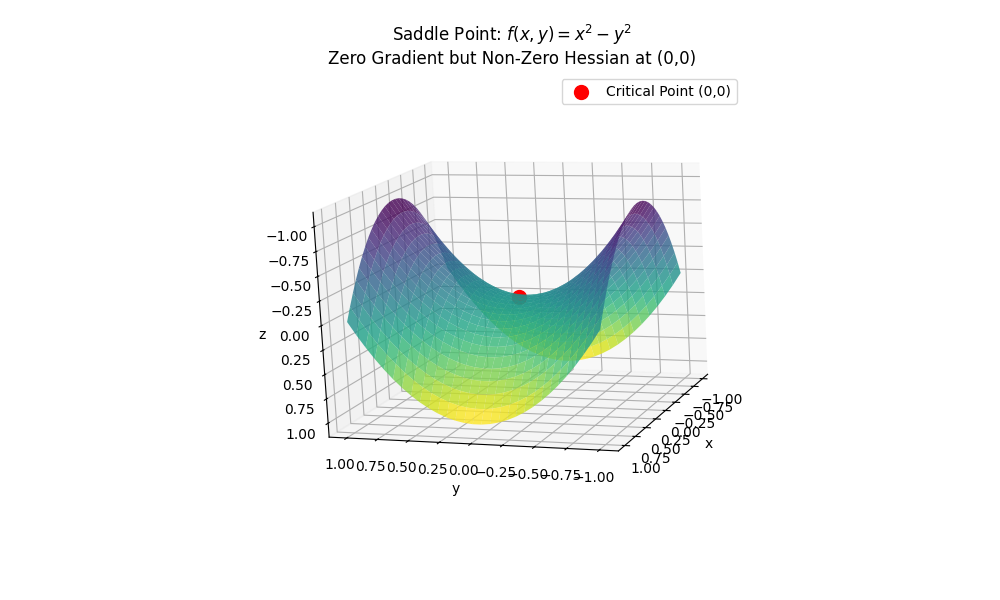

# Saddle Points and Hessian in Optimization

Saddle point is a critical point where the gradient (first derivatives) is zero, but it's neither a minimum nor a maximum.

Indefinite Hessian: The Hessian matrix (matrix of second-order partial derivatives) is indefinite at that point:

* Eigenvalues of the Hessian have mixed signs (at least one positive and one negative).
* Determinant of the Hessian is negative (e.g., for 2D functions: $f_{xx}f_{yy}−f_{xy}^2<0$)

A saddle-shaped surface with a "valley" in one direction and a "ridge" in another.

For example, given $f(x,y)=x^2-y^2$, there are

* Gradient $\nabla f=[2x, -2y]=[0,0]$ at the point $(0,0)$
* Hessian $H=\begin{bmatrix} \frac{\partial^2 f}{\partial x^2} & \frac{\partial^2 f}{\partial x \partial y} \\ \frac{\partial^2 f}{\partial y \partial x} & \frac{\partial^2 f}{\partial y^2} \end{bmatrix}=\begin{bmatrix} 2 & 0 \\ 0 & -2 \end{bmatrix}$

The Hessian sees eigenvalues: $2$ (positive) and $−2$ (negative).

Indefinite Hessian -> saddle point at $(0,0)$.
The Hessian at $(0,0)$ has eigenvalues $2$ and $-2$. So along the $x$-direction, it's a minimum, and along $y$-direction, a maximum. 

      

 

## The Role of the Hessian

The Hessian matrix encodes local curvature information at a critical point (where the gradient is zero).
Its definiteness determines the nature of the critical point:

|Hessian Type|Eigenvalues|Critical Point Type|
|-|-|-|
|Positive Definite|All > 0|Local Minimum|
|Negative Definite|All < 0|Local Maximum|
|Indefinite|Mixed signs|Saddle Point|
|Semi-Definite|Some zero + others ≥0 or ≤0|Test inconclusive|