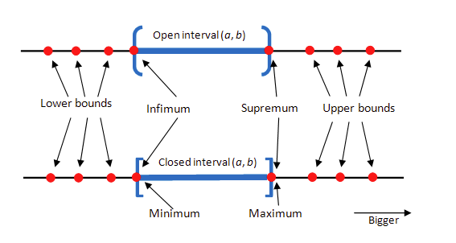
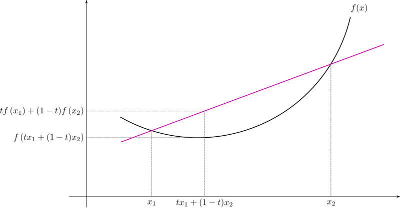

# Some Miscellaneous Algebra

## Set

Terminologies of a set are shown as below.

      

 

### Use the concept of set to prove $0.\dot{9}=1$

If $0.\dot{9} \ne 1$, there must be a number $n$ in the real axis $\mathbb{R}$ where $n \in (0.\dot{9}, 1)$, however, such $n$ does not exist.
Hence it can be said that $0.\dot{9}=1$.

### Hilbert Hotel Paradox

Hilbert Hotel Paradox is to explain infinite sets have counterintuitive properties through crafted mapping.
In particular, for an infinite set, it can have mappings to multiple/infinite infinite sets.

P.S., an infinite set is a set composed of infinite number of elements.

#### Room Setup Scenario

Hilbert's Hotel is an imaginary hotel with an infinite number of rooms, each numbered 1, 2, 3, 4, and so on.
Importantly, all the rooms are occupied—each room has a guest.

#### Through a new mapping, there will always be empty rooms

* For a new coming guest, hotel manager asks every guest move from $n$-th room to the $n+1$-th room (the mapping rule is $n+1$)
* If a bus arrives with an infinite number of guests, hotel manager ask every guests move to the $2n$-th hotel (the mapping rule is $2n$)
* For infinite number of bus arrivals with infinite number of guests, there still exists a mapping to accommodate all guests

-> Inputs:

* There are an infinite number of buses (Bus 1, Bus 2, Bus 3, …).
* Each bus has an infinite number of passengers (Seat 1, Seat 2, Seat 3, …).

-> Constraints:

* The hotel already has an infinite number of rooms, but all occupied (Room 1, Room 2, Room 3, …).

-> Outputs:

* A new mapping that maps the pair $(b, s)$ for (bus, seat) to $(r)$ for (room).

-> Solution by *Cantor Pairing Function* $CP(b, s)$

$$
r = CP(b, s) = \frac{(b+s-1)(b+s)}{2}+s
$$

The Cantor Pairing Function ensures that any countably infinite set (like the set of all possible pairs of bus and seat numbers) can be mapped to another countably infinite set (the set of room numbers) without missing or duplicating any guests.

### Find a mapping from $(0,1)$ to $[0,1]$

This question asks to establish a mapping that every element in $(0,1)$ has one or more mappings to elements in $[0,1]$.
There can be more than one mappings.

## Gamma Function

Gamma function is the generalization of factorial that is only applied to positive integers.

Recall the typical definition of factorial and it can be folded as recursive.

$$
\begin{align*}
    n! &= n \cdot (n-1) \cdot (n-2) \cdot ... \cdot 1 \\\\
    n! &= n \cdot (n-1)!
\end{align*}
$$

Generalize this concept to

$$
\Gamma(x+1)=x\cdot\Gamma(x)\qquad \mathcal{R}(x)>0
$$

Use exponential form to approximate this generalization form

$$
\Gamma(x)=\int_0^{\infty}t^{x-1}e^{-t} dt
$$

## Cauchy-Schwarz Inequality 柯西(-施瓦茨)不等式

In a naive algebra term, Cauchy-Schwarz inequality states that (equality holds when $ad=bc$)

$$
(a^2+b^2)(c^2+d^2)\ge (ac+bd)^2
$$

Proof: expand the expression, there are

$$
\begin{align*}
    \text{LHS}&=a^2c^2+a^2d^2+b^2c^2+b^2d^2 \\\\
    \text{RHS}&=a^2c^2+b^2d^2+2abcd
\end{align*}
$$

By $\text{LHS}-\text{RHS}$, there is

$$
a^2d^2+b^2c^2-2abcd=(ad-bc)^2\ge 0
$$

### Cauchy-Schwarz Inequality in Continuous Integration Form

In continuous integration, there is

$$
\int^b_a f^2(x) dx \cdot \int^b_a g^2(x) dx \ge
\bigg(\int^b_a f(x)g(x) dx\bigg)^2
$$

### Cauchy-Schwarz Inequality to Vector Space

#### Inner Product Space

The inner product space of two vectors $\mathbf{u}$ and $\mathbf{v}$ is defined as an operator that turns a space into a scalar, often denoted with angle brackets such as in $\langle \mathbf{u}, \mathbf{v} \rangle$.

The most typical example is Euclidean vector space that a function $\langle .\space, .\space \rangle : \mathbb{R}^n \times \mathbb{R}^n \rightarrow \mathbb{R}$ is an inner product on $\mathbb{R}^n$.

$$
\langle \mathbf{u}, \mathbf{v} \rangle =
\Bigg\langle \begin{bmatrix}
    u_1 \\\\ u_2 \\\\ \vdots \\\\ u_n
\end{bmatrix},
\begin{bmatrix}
    v_1 \\\\ v_2 \\\\ \vdots \\\\ v_n
\end{bmatrix} \Bigg\rangle =
\mathbf{u}^{\top} \mathbf{v} =
\sum^n_{i=1} u_1 v_1 + u_2 v_2 + ... u_n v_n
$$

The definition (Euclidean vector space) holds if and only if there exists a symmetric positive-definite matrix $M$ such that (set $n=2$ as an example for illustration).

$$
\langle \mathbf{u}, \mathbf{v} \rangle :=
\mathbf{u}^{\top} M \mathbf{v} =
\begin{bmatrix}
    u_1, u_2
\end{bmatrix} \begin{bmatrix}
    m_a, m_b \\\\ m_b, m_d
\end{bmatrix} \begin{bmatrix}
    v_1 \\\\ v_2
\end{bmatrix}
$$

where $m_a>0$ and $m_d>0$ that satisfy $m_a m_d > m_b^2$ (symmetric positive-definite).
This condition says $\text{det}(M)=m_a m_d - m_b^2 > 0$ that keeps the transform $\mathbf{u}^{\top} M \mathbf{v}$ always positive.

For example, if $M$ is an identity matrix, $\langle \mathbf{u}, \mathbf{v} \rangle$ is simply a dot product.

#### Cauchy-Schwarz Inequality Definition

For all vectors $\mathbf{u}$ and $\mathbf{v}$ of an inner product space, there is

$$
|\langle \mathbf{u}, \mathbf{v} \rangle|^2 \le
\langle \mathbf{u}, \mathbf{u} \rangle \cdot \langle \mathbf{v}, \mathbf{v} \rangle
$$

Given the definition $||\mathbf{u}||:=\sqrt{\langle \mathbf{u}, \mathbf{u} \rangle}$ and $||\mathbf{v}||:=\sqrt{\langle \mathbf{v}, \mathbf{v} \rangle}$, here derives

$$
|\langle \mathbf{u}, \mathbf{v} \rangle| \le
||\mathbf{u}||\space||\mathbf{v}||
$$

where the equality is established when $\mathbf{u}$ and $\mathbf{v}$ are linearly independent.

#### Cauchy-Schwarz Inequality Geometry Explanation

The inner product $\langle \mathbf{u}, \mathbf{v} \rangle$ can be thought of as the multiplication of the length of a vector $\mathbf{u}$'s projection on another vector $\mathbf{v}$'s length.
The projection over $\cos\theta_{\mathbf{u}\mathbf{v}} \le 1$ shows the inequality.

$$
\begin{align*}
&& \cos\theta_{\mathbf{u}\mathbf{v}} &=
\frac{\langle \mathbf{u}, \mathbf{v} \rangle}{||\mathbf{u}||\space||\mathbf{v}||} \\\\
\Rightarrow && \langle \mathbf{u}, \mathbf{v} \rangle &=
||\mathbf{u}||\space||\mathbf{v}|| \cos\theta_{\mathbf{u}\mathbf{v}} \\\\
\Rightarrow && \langle \mathbf{u}, \mathbf{v} \rangle &\le ||\mathbf{u}||\space||\mathbf{v}||
\end{align*}
$$

### Cauchy-Schwarz Inequality to Random Variables and Expectation

Let $X$ and $Y$ be two random variables, here proves that $X \cdot Y$ achieves its minimum when $X$, $Y$ are equally distributed.

The expectation is as below.

$$
E(X \cdot Y)=\sum_{x}\sum_{y}
p(X=x,Y=y) \cdot x \cdot y
$$

where $p(X=x,Y=y)$ is the probability of the event $X=x$ and $Y=y$.

By Cauchy-Schwarz inequality, there is

$$
\big(E(X \cdot Y)\big)^2\le E(X^2) \cdot E(Y^2)
$$

Equality holds when $X$ and $Y$ are **linearly dependent**/**symmetric**/**uniformly distributed**, and, by extension, the most balanced or "equal" distributions often achieve this state.

### Math Application Tricks by Cauchy-Schwarz Inequality

#### Given $x\sqrt{1-y^2}+y\sqrt{1-x^2}=1$, find solution of $x^2+y^2$

Reference $(a^2+b^2)(c^2+d^2)\ge (ac+bd)^2$, in which equality holds when $ad=bc$
Let $x=a, y=d$ there is

$$
x\underbrace{\sqrt{1-y^2}}_{=c}+y\underbrace{\sqrt{1-x^2}}_{=b}\ge
(x^2+1-x^2)(y^2+1-y^2)=1
$$

The equality holds only when $x^2y^2=(1-x^2)(1-y^2)$, then

$$
\begin{align*}
    x^2y^2&=(1-x^2)(1-y^2) \\\\
    x^2y^2&=1-x^2-y^2+x^2y^2 \\\\
    x^2+y^2&=1
\end{align*}
$$

#### Given $x+2y=1$ and $x,y>0$, find $\min \frac{1}{x}+\frac{8}{y}$

Reference $(a^2+b^2)(c^2+d^2)\ge (ac+bd)^2$, and for $x,y>0$, let $a^2=x, b^2=2y, c^2=\frac{1}{x}, d^2=\frac{8}{y}$, then

$$
(x+2y)(\frac{1}{x}+\frac{8}{y})=\frac{1}{x}+\frac{8}{y}\ge
(1+\sqrt{2}\cdot\sqrt{8})^2=25
$$

#### For $\theta\in\mathbb{R}$, find $\max y=3\sin\theta+2\cos\theta$

Reference $(a^2+b^2)(c^2+d^2)\ge (ac+bd)^2$, let $a=3, b=2, c=\sin\theta, d=\cos\theta$, then

$$
\begin{align*}
    (2^2+3^2)(\sin^2\theta+\cos^2\theta) &\ge(3\sin\theta+2\cos\theta)^2 \\\\
    3\sin\theta+2\cos\theta &\le\sqrt{13}
\end{align*}
$$

As a result, $\max y=\sqrt{13}$.

## Jensen's Inequality

Jensen's inequality generalizes the statement that a secant line of a convex function lies above its graph.

      

 

For $t\in[0,1]$ and $f(x)$ is a convex function, there is

$$
f(tx_1+(1-t)x_2) \le tf(x_1)+(1-t)f(x_2)
$$

In the context of probability theory, it is generally stated in the following form: if $X$ is a random variable and $\phi$ is a convex function, then

$$
\phi(\mathbb{E}[X]) \le \mathbb{E}\phi(X)
$$

## Power and Logarithm

Power and logarithm conversion:

$$
y = \log_b(x) \Leftrightarrow b^y = x
$$

Plus/Subtraction and multiplication/division:

$$
\log_b\left(\frac{m}{n}\right) = \log_b(m) - \log_b(n) \\\\
\log_b\left(mn\right) = \log_b(m) + \log_b(n)
$$

Power

$$
\log_b(m^p) = p \cdot \log_b(m)
$$

### Power and Logarithm in Matrix

A matrix has a logarithm if and only if it is invertible.

$$
e^B = A \Leftrightarrow B = \log(A)
$$

where $e^B$ is the matrix exponential, defined by the power series:

$$
e^B = \sum_{n=0}^{\infty} \frac{B^n}{n!} = I + B + \frac{B^2}{2!} + \frac{B^3}{3!} + \dots
$$

#### Property: Logarithm of a Matrix Product

If $X$ and $Y$ can **commute**, there is

$$
\log(XY) = \log(X) + \log(Y)
$$

If $X$ and $Y$ do not commute, the relationship is described by the more complex *Baker-Campbell-Hausdorff* formula.

## Notations

### Number Set Notations

* $\mathbb{N}$ (Natural Numbers):
  * $\mathbb{N} = \{1, 2, 3, ... \}$
* $\mathbb{Z}$ (Integers):
  * $\mathbb{Z} = \{..., -3, -2, -1, 0, 1, 2, 3, ... \}$
* $\mathbb{Q}$ (Rationals, numbers that can be expressed as a fraction of two integers, where the denominator is not zero):
  * $\mathbb{Q} = \{p/q \space|\space p \in \mathbb{Z}, q \in \mathbb{Z}, q \ne 0 \}$
  * For example, $1/2 \in \mathbb{Q}$
* $\mathbb{R}$ (Real Numbers):
  * $\mathbb{R} = \{x \space|\space x \text{ includes rational and irrational numbers} \}$
* $\mathbb{C}$ (Complex Numbers):
  * $\mathbb{C} = \{a+ib \space|\space a, b \in \mathbb{{R}}, i^2=-1 \}$
* $\mathbb{P}$ (Prime Numbers, natural numbers greater than 1 that have no positive divisors other than 1 and themselves):
  * $\mathbb{P} = \{2, 3, 5, 7, 13, 17, ... \}$

Upper symbols:

* $\mathbb{R}^+, \mathbb{N}^+$, etc., positive numbers
* $\mathbb{R}^*, \mathbb{N}^*$, etc., non-zero numbers

### Einstein Notation

Einstein notation (a.k.a Einstein summation convention or Einstein summation notation) is a notational convention that implies summation over a set of **indexed terms** in a formula, hence achieving brevity.

For example,

$$
\mathbf{v} = v^i e_i =
\begin{bmatrix}
    e_1 & e_2 & e_3 & ... & e_n
\end{bmatrix}
\begin{bmatrix}
    v_1 \\\\ v_2 \\\\ v_3 \\\\ \vdots \\\\ v_n
\end{bmatrix}
$$
