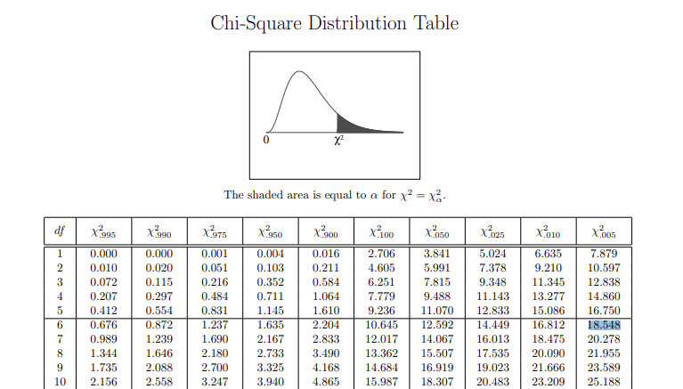

# Chi-Squared Distribution (卡方分布) and Tests

## Chi-Squared Distribution

### Chi-Squared Distribution Motivation

Chi-squared distribution (also chi-square or $\mathcal{X}^2$-distribution) with $k$ degrees of freedom is the distribution of a sum of the squares of $k$ independent standard normal random variables.

Assume samples drawn from a normal population $x_1,x_2, ..., x_n \sim \mathcal{N}(\mu, \sigma^2)$,

* Sample Mean: $\overline{x}\sim \mathcal{N}(\mu, \frac{\sigma^2}{n})$
* Sample Variance: $s^2=\frac{1}{n-1}\sum^n_{i=1}(x_i-\overline{x})^2$

Notice here that $s^2$ refers to sample variance , while $\sigma^2$ refers to the whole population variance.

Chi-squared distribution is defined as

$$
\frac{(n-1)s^2}{\sigma^2}\sim \mathcal{X}^2(k) \qquad
k=n-1\quad \text{degree of freedom}
$$

where $\frac{s^2(n-1)}{\sigma^2}=\frac{1}{\sigma^2}\sum^n_{i=1}(x_i-\overline{x})^2$.
Compared to variance $\frac{1}{n}\sum^n_{i=1}(x_i-\overline{x})^2$ that gives the average sample deviation from the $\overline{X}$, the normalization term $\frac{1}{\sigma^2}$ for $\mathcal{X}^2$ can be intuitively taken as the average effective sample size.

#### Central Limit Theorem (CLT) in Chi-Squared Distribution

If $\overline{x}_n$ is the sample mean, then $Z=\lim_{n \rightarrow \infty} \Big( \frac{\overline{x}_n - \mu}{\frac{1}{\sqrt{n}} \sigma} \Big)$ is a standard normal distribution (having $\mu_{Z}=0$).

In other words, it states that as $n$ gets larger, the distribution of the normalized mean ${\sqrt{n}}({\overline {\mathbf{x}}}_{n}-\mu )$, i.e. the difference between the sample average $\overline{\mathbf{x}}_n$ and its limit $\mu$ scaled by the factor ${\sqrt {n}}$, approaches the normal distribution with mean $0$ and variance $\sigma^{2}$.

$$
{\sqrt{n}}({\overline {\mathbf{x}}}_{n}-\mu ) \sim \mathcal{N}(0, \sigma^2)
$$

### Chi-Squared Distribution Definition

Define standard normal variable

$$
Z_i=\frac{\overline{X}_i-\mu}{\frac{1}{\sqrt{n}}\sigma}\sim N(0,1)
$$

In other words, if $Z_1, ..., Z_k$ are independent, standard normal random variables, then the sum of their squares,

$$
Q = \sum^k_{i=1} Z^2_i =
Z_i^2+Z_2^2+Z_3^3+...+Z_k^2
$$

It is often denoted as $Q \sim \mathcal{X}^2(k)$ or  $Q \sim \mathcal{X}^2_k$.

### Chi-Squared Distribution Example

In industry practice, for to survey a whole population is impractical, only a small fraction of population are surveyed.
Unless specified, assumed surveyed individuals are independent, Central limit theorem (CLT)

$$
\begin{align*}
    & Z=\frac{\overline{X}-\mu}{\frac{1}{\sqrt{n}}\sigma} \\\\
    \Rightarrow\quad & Z=\frac{|\text{observed}-\text{expected}|}{\sqrt{\text{expected}}}
\end{align*}
$$

For example, a survey was conducted in a city with 1 million population, in which a total of $650$ citizens in four districts ($A,B,C,D$) received interviews, found $349$ of which have white-collar jobs.

||$A$|$B$|$C$|$D$|Total|
|-|-|-|-|-|-|
|White collar|$90$|$60$|$104$|$95$|$349$|
|Total|$150$|$150$|$200$|$150$|$650$|

It can be said that

* $\mu$ is the mean of the whole 1 million population, however, impractical to survey the whole 1 million population, for each district there is $\overline{X}_i=\text{SampleSize}_i \times 349/650$ is the best estimate of the population $\mu$

||$A$|$B$|$C$|$D$|
|-|-|-|-|-|
|White collar (Observed)|$90$|$60$|$104$|$95$|
|White collar (Expected)|$80.53\approx 150\times\frac{349}{650}$|$80.53\approx 150\times\frac{349}{650}$|$107.38\approx 200\times\frac{349}{650}$|$80.53\approx 150\times\frac{349}{650}$|

### Probability Density Function (PDF)

For a positive $x$ and positive integer $k$, the value

$$
f_{\mathcal{X}^2}(x,v)=
\frac{x^{\frac{v}{2}-1}e^{\frac{v}{2}}}{2^{\frac{v}{2}}\Gamma(\frac{v}{2})}
$$

where Gamma function is $\Gamma(v)=\int_0^{\infty}t^{v-1}e^{-t} dt$.
In particular for $v\in\mathbb{Z}^{+}$, there is $\Gamma(v)=(v-1)!$.

#### Chi-Square PDF Derivation

Let $Z=\frac{\overline{X}-\mu}{\sigma/\sqrt{n}}\sim\mathcal{N}(0,1)$, and $Q=Z_i^2+Z_2^2+Z_3^3+...+Z_k^2$ follows Gamma distribution.

Each $Z_i^2\sim \Gamma(\frac{1}{2},2)$, and $Q \sim \Gamma(\frac{k}{2},2)$.

### Chi-Square Distribution Table

Below is a pre-computed Chi-square distribution table.
For example, the number $18.548$ represents that the integral (marked as the shaded grey area in the figure below) is $\int_{18.548}^{+\infty} f_{\mathcal{X}^2} = 0.005$, given the degree of freedom $k=6$.

## Chi-Squared Tests

Chi-squared test is used to determine whether there is a statistically significant difference between the expected frequencies and the observed frequencies in one or more categories of a contingency table.

### Example

A city has a population of $1,000,000$ living in four districts: $A,B,C,D$. $650$ citizens are surveyed for their occupations, labelled as "white collar", "blue collar", or "Others".

The surveyed results are shown as below.

||$A$|$B$|$C$|$D$|Total|
|-|-|-|-|-|-|
|White collar|$90$|$60$|$104$|$95$|$349$|
|Blue collar|$30$|$50$|$51$|$20$|$151$|
|Others|$30$|$40$|$45$|$35$|$150$|
|Total|$150$|$150$|$200$|$150$|$650$|

#### Intuition Explanation

Here, $X_i$ represents categorical counts (e.g., $90$ white-collar workers in District A).
These counts follow a multinomial distribution (not normal), but under the null hypothesis of independence, they approximate a Poisson distribution with:

* Mean (expected): $E(X_{ij})=\text{RowTotal}\times\frac{\text{ColTotal}}{\text{GrandTotal}}$
* Variance: $Var(X_{ij})=E(X_{ij})$ for Poisson distribution under null hypothesis of independence
* Residual $Z_{ij}^2$: $\frac{(\text{observed}-\text{expected})^2}{\text{expected}}$

#### Correlation Hypothesis Computation

For a total of $349$ out of $650$ people reported to have white collar jobs city-wise, and for district $A$ there are $90$ out of $150$ citizens, there is

$$
150 \times \frac{349}{650} \approx 80.54
$$

then

$$
\frac{(\text{observed}-\text{expected})^2}{\text{expected}} =
\frac{(90-80.54)^2}{80.54}
\approx 1.11
$$

This is one frequency for $A$ district people having white collar jobs. In total, there are $3 \times 4 = 12$ frequencies.

Chi-squared $\mathcal{X}^2$ sums up all frequencies, there is

$$
\begin{align*}
\mathcal{X}^2 &= \sum \frac{(\text{observed}-\text{expected})^2}{\text{\text{expected}}}
\\\\ &=
\frac{(90-150\times\frac{349}{650})^2}{150\times\frac{349}{650}}
+
\frac{(30-150\times\frac{151}{650})^2}{150\times\frac{151}{650}}
+
\frac{(30-150\times\frac{150}{650})^2}{150\times\frac{150}{650}} \\\\
& \quad +
\frac{(60-150\times\frac{349}{650})^2}{150\times\frac{349}{650}}
+
\frac{(50-150\times\frac{151}{650})^2}{150\times\frac{151}{650}}+...
\\\\ &\approx
1.11 + 0.672 + 0.672 + 5.23 + 6.59 + ...
\\\\ &\approx 24.57
\end{align*}
$$

The null hypothesis is that each person's neighborhood of residence is independent of the person's occupational classification.
Under the null hypothesis, this sum has approximately a chi-squared distribution whose number of degrees of freedom $k$ is

$$
(\text{NumberOfRows}-1) \times (\text{NumberOfCols}-1) =
(3-1)\times(4-1)=6
$$

Given the aforementioned Chi-square distribution table, $24.57 > 18.548$ represents the confidence is greater than $1-0.005=0.995$ for the belief that the null hypothesis is false. In other words, occupations and residential districts are correlated.