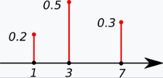
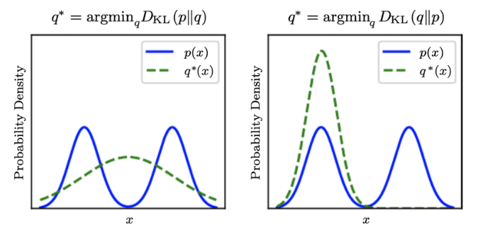
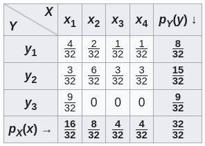

# Distribution

* Probability Density Function

A *probability density function* (PDF) $p(x)$ is used to specify the probability of the random variable $x \in X$ falling within a particular range of values.

* Probability Cumulative Function

A *probability cumulative function* is the probability that 
$x$ will take a value less than or equal to a threshold $x_{\text{threshold}}$, such that $p(x \le x_{\text{threshold}})$.
It can be computed by taking integral over all the "less than or equal to" scenarios $\int_{x_0}^{x_{\text{threshold}}} p(x)$.

* Probability Mass Function

*Probability mass function*, also known as the discrete probability density function, describes the probability of discrete random variables.

The value of the random variable having the largest probability mass is called the *mode* (intuitively, the most likely occurred event).

For example, $x=0.5$ is the mode of this discrete probability distribution.

      

 

Modes in more general terms refers to "peaks" of a distribution.
For example, the blue curves have two modes, the green curve has one.

      

 

* Probability Distribution

A *probability distribution* describes the probabilities of occurrence of different possible outcomes for an experiment.

## Joint Probability Distribution and Marginal Probability Distribution

The $p(x,y)$ is the joint probability distribution on two independent random variables $X$ and $Y$.

The $p_X(x)=\int p_{X,Y}(x,y)dy$ and $p_Y(y)=\int p_{X,Y}(x,y)dx$ are the marginal probability distributions.

If $X$ and $Y$ are co-dependent, there is $p(x,y)>p(x)p(y)$.

      

 

## Kullback-Leibler Divergence $D_{KL}$

KLD denoted as $D_{KL}(P || Q)$ is a measure of how a prediction probability distribution $Q$ is different from actual probability distribution $P$.
Smaller the value of $D_{KL} \ge 0$, the more similar are between $P$ and $Q$.

$$
D_{KL}(P || Q) =
\sum_{x \in X} P(x) \log \frac{P(x)}{Q(x)}
$$

For example, there are three events labelled $x \in \{0,1,2\}$ that are predicted each event at the same probability of occurrence (prediction probability distribution $Q(x)=\frac{1}{3}$ regardless of input $x$).
However, having conducted $25$ trials, here sees different observations: $9$ for event $x=0$, $12$ for event $x=1$ and $4$ for event $x=2$.

||$x=0$|$x=1$|$x=2$|
|-|-|-|-|
|$P(x)$|$\frac{9}{25}$|$\frac{12}{25}$|$\frac{4}{25}$|
|$Q(x)$|$\frac{1}{3}$|$\frac{1}{3}$|$\frac{1}{3}$|

$$
\begin{align*}
    D_{KL}(P || Q) &=
    \sum_{x \in X} P(x) \log \frac{P(x)}{Q(x)}
\\ &=
    \frac{9}{25}\ln \Big( \frac{9/25}{1/3} 
    \Big) +
    \frac{12}{25}\ln \Big( \frac{12/25}{1/3} \Big) +
    \frac{4}{25}\ln \Big( \frac{4/25}{1/3} \Big)
\\ &\approx
    0.085
\end{align*}
$$

### Proof of $D_{KL} \ge 0$

#### Prove $\ln x \le x - 1$:

$$
\begin{align*}
&& \ln x &\le x - 1 \\
\Rightarrow && e^{\ln x} &\le e^{x-1} \\
\Rightarrow && x &\le e^x e^{-1} \\
\Rightarrow && x &\le e^x e^{-1} \\
\Rightarrow && ex &\le e^x \\
\end{align*}
$$

where $ex \le e^x$ is obvious that equality holds true when $x=1$ such that $1 \cdot e = e^1$, and for $x \ne 1$, there is $ex < e^x$.

#### Prove *Gibbs' Inequality*:

$$
-\sum_{x \in X} P(x) \ln \frac{Q(x)}{P(x)} \ge -\sum_{x \in X} P(x) \Big( \frac{Q(x)}{P(x)} -1 \Big)
= -\sum_{x \in X} Q(x) + \sum_{x \in X} P(x) = -\sum_{x \in X} Q(x) + 1 \ge 0
$$

where $\sum_{x \in X} Q(x) \le 1$ does not necessarily sum up to $1$, because for some $x$ even there is $Q(x) \ne 0$, but $Q(x)$ is forced to zero when conditioned on $P(x) = 0$.

By $-\sum_{x \in X} P(x) \ln \frac{Q(x)}{P(x)} \ge 0$, Gibbs' inequality can be easily derived with a simple logarithm operation splitting $\ln \frac{P(x)}{Q(x)}$ such that

$$
-\sum_{x \in X} P(x) \ln Q(x) \ge -\sum_{x \in X} P(x) \ln P(x)
$$

#### Prove $D_{KL} \ge 0$

Simply rearrange the above Gibbs' inequality, there is

$$
\begin{align*}
&& -\sum_{x \in X} P(x) \ln Q(x) &\ge -\sum_{x \in X} P(x) \ln P(x) \\
\Rightarrow &&
\sum_{x \in X} P(x) \ln P(x) -\sum_{x \in X} P(x) \ln Q(x) &\ge 0 \\
\Rightarrow &&
\sum_{x \in X} P(x) \Big( \ln P(x) - \ln Q(X) \Big) &\ge 0 \\
\Rightarrow &&
\sum_{x \in X} P(x) \ln \frac{P(x)}{Q(x)} &\ge 0 \\
\end{align*}
$$

### Asymmetry of $D_{KL}$ and Related Optimization Problems

Asymmetry refers to the inequality $D_{KL}(P || Q) \ne D_{KL}(Q || P)$, where $D_{KL}(P || Q)$ is named *forward* $D_{KL}$, while $D_{KL}(Q || P)$ is named *reverse* $D_{KL}$.

In optimization to $\min_{\theta_Q} D_{KL}$, where $\theta_Q$ is the set of model parameters for the prediction model, forward $D_{KL}$ and reverse $D_{KL}$ have different convergence behaviors shown as below.

      

 

By this expression $\sum_{x \in X} P(x) \log \Big( \frac{P(x)}{Q(x)} \Big)$ (the forward $D_{KL}$ scenario), the $P(x)\big|_{x \in X}$ can be thought of as weights on $\log \frac{P(x)}{Q(x)}$.
As a result, the learned model's prediction $Q$ would spread out flat catching all $P$'s values. 

For example, in knowledge transfer/model distillation using a small model to learn from a large model such that $\text{rank}(\theta_Q) < \text{rank}(\theta_P)$, or in the figure above where $\theta_Q$ can only learn from one "peak" whereas $\theta_P$ produces two "peaks", the best learning result should be $\theta_Q$ learning from the highest peak of $\theta_P$, rather than spreading out flat having low probabilities predicting two peaks.

The spreading-flat distribution is used when the reference truth $P$ is noisy and $Q$ attempts to show the "average" of $P$.

In reverse $D_{KL}$ such that $\sum_{x \in X} Q(x) \log \Big( \frac{Q(x)}{P(x)} \Big)$, for a small $\text{rank}(\theta_Q)$ such as in the figure where $\theta_Q$ can only learn from one peak, $Q(x)$ would concentrate on/over-learn from the overlapping areas, since small peak areas of $P$ are be ignored $Q(x)\big|_{x \in X_{\text{SmallPeaksInP}}}=0$, or in other words, small peak weights of $P(x)$ are no longer in use that are observed in forward $D_{KL}$.

## Product of PDF

reference:
https://www.mariushobbhahn.com/2021-04-29-RV_vs_pdf/