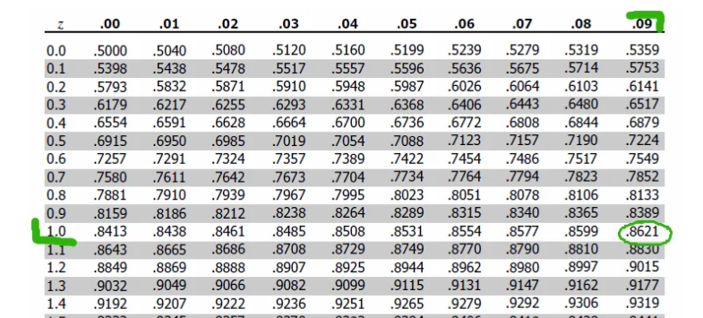
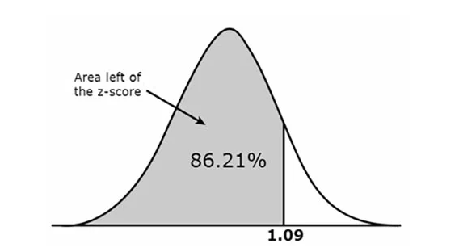

# Normal Distribution

Normal distribution $X \sim N(\mu, \sigma^2)$ has probability density function

$$
f(x) = \frac{1}{\sigma \sqrt{2\pi}} \exp \Big( -\frac{1}{2} \big( \frac{x-\mu}{\sigma} \big)^2 \Big)
$$

Consider a standard normal distribution ($\mu=0$ and $\sigma=1$):
$$
f(x) = \frac{1}{\sqrt{2\pi}} \exp \Big( -\frac{1}{2} x^2 \Big)
$$

Set $Z = \frac{X-\mu}{\sigma}$, so that a normal distribution can be transformed to a standard one.

After converting to a standard one, can use a table to find the corresponding cumulative area.
Notice that the whole area of a standard normal distribution is $1$, so that the cumulative area represents the probability.

For example, to find $Z=1.09$, can search in the table below by $1.09 = 1.0 + 0.09$

      

 

The corresponding area is 0.8621, 

      

 

## Common Normal Distribution Random Variable Operations

Given $X,Y\in\mathcal{N}(0,1)$, here shows the arithmetic result distribution of the two standard normal distribution random variables.

### Addition/Subtraction

For $Z=X+Y$, there are

* Mean: $E[Z]=E[X]+E[Y]=0+0=0$
* Variance: $\text{Var}(Z)=\text{Var}(X)+\text{Var}(Y)=1+1=2$
* $Z\sim\mathcal{N}(0,2)$

### Multiplication

For $Z=X\cdot Y$, there are

* Mean: $E[Z]=E[X]E[Y]=0\times 0=0$
* Variance: $\text{Var}(Z)=\text{Var}(X)\text{Var}(Y)=1\times 1=1$
* $Z\sim\mathcal{N}(0,1)$

## Derive Normal Approximation from Binomial Distribution

## Studentized Range Distribution (q-Distribution)

Studentized range distribution (q-distribution) selectively seeks extreme differences in sample data, rather than only sampling randomly.

Let $X_{ij}$ represent the $j$-th observation in the $i$-th population (there are a total of $k$ population groups) having a normal distribution with mean $\mu_i$ and variance $\sigma_i^2$ (by equal variance assumption, there is $\sigma^2=\sigma^2_1=\sigma^2_2=...=\sigma^2_i...=\sigma^2_k$). 
There is $X_{ij} \sim N (\mu_i, \sigma^2)$.

Rather than randomly selecting samples from populations, q-distribution find the largest sample mean $\overline{X}_{max}$ and smallest sample mean $\overline{X}_{min}$.
Set $s^2$ is the pooled sample variance from these samples.

$$
q = \frac{\overline{X}_{max}-\overline{X}_{min}}{\frac{s}{\sqrt{n}}}
$$

## Relationship between the Hessian and Covariance Matrix for Gaussian Random Variables

Consider a Gaussian random vector $\mathbf{\theta}$ with mean $\mu_{\mathbf{\theta}}$ and covariance matrix $\Sigma_\mathbf{\theta}$ so its joint probability density function (PDF) is given by
$$
p(\mathbf{\theta}) = 
\frac{1}{(\sqrt{2\pi})^{N_\theta} \cdot \sqrt{|\Sigma_\mathbf{\theta}|}}
e^{-\frac{1}{2} (\mathbf{\theta} - \mu_{\mathbf{\theta}})^\top \Sigma_\mathbf{\theta}^{-1} (\mathbf{\theta} - \mu_{\mathbf{\theta}})}
$$

Take negative logarithm of $p(\mathbf{\theta})$, 
there is
$$
J(\mathbf{\theta}) \equiv
-\ln p(\mathbf{\theta}) =
\frac{N_\mathbf{\theta}}{2} \ln 2\pi+\frac{1}{2} \ln |\Sigma_\mathbf{\theta}|+\frac{1}{2} (\mathbf{\theta}-\mu_{\mathbf{\theta}})^\top \Sigma_\mathbf{\theta}^{-1} (\mathbf{\theta}-\mu_{\mathbf{\theta}})
$$

The Jacobian over $\mathbf{\theta}$ is

$$
\begin{align*}
J'(\mathbf{\theta}) = \frac{\partial J}{\partial \mathbf{\theta}}&=
\frac{\partial \space \frac{1}{2} (\mathbf{\theta}-\mu_{\mathbf{\theta}})^\top \Sigma_\mathbf{\theta}^{-1} (\mathbf{\theta}-\mu_{\mathbf{\theta}})}{\partial \mathbf{\theta}}
\\\\ &=
\frac{1}{2} (\mathbf{\theta}-\mu_{\mathbf{\theta}})^\top
\Sigma_\mathbf{\theta}^{-1} 
\frac{\partial (\mathbf{\theta}-\mu_{\mathbf{\theta}})}{\partial \mathbf{\theta}}
\\\\ &=
(\mathbf{\theta}-\mu_{\mathbf{\theta}})^\top
\Sigma_\mathbf{\theta}^{-1} 
\end{align*}
$$

By taking partial differentiations with
respect to $\theta_l$ and $\theta_{l'}$,
the $(l, l')$ component of the Hessian matrix can be obtained:
$$
H^{(l, l')}(\mathbf{\theta}) =
\frac{\partial^2 J(\mathbf{\theta})}{\partial \theta_l \space \partial \theta_{l'}}
\bigg|_{\mathbf{\theta}=\mu_{\mathbf{\theta}}}=
(\Sigma_{\mathbf{\theta}}^{-1})^{(l,l')}
$$

### Discussions

Optimal $\mathbf{\theta}^*$ can be obtained via $J'(\mathbf{\theta}) = 0$ that asserts $\max J(\theta)$ from which deduce $\mathbf{\theta}^*=\mu_{\mathbf{\theta}}$.

The Hessian matrix of $J(\mathbf{\theta})$ is equal to the inverse of the covariance matrix:
$$
H(\mathbf{\theta}) = \Sigma_{\mathbf{\theta}}^{-1}
$$