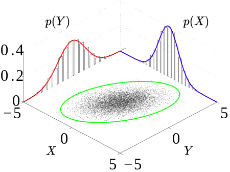

# Probability density function

A probability density function (PDF), or density of a continuous random variable, is a function whose value at any given sample (or point) in the sample space (the set of possible values taken by the random variable) can be interpreted as providing a relative likelihood that the value of the random variable would be close to that sample.

## Joint probability distribution

### Marginal probability distribution

$$
f_{X}(x) = \int f_{X,Y}(x,y)dy
\\
f_{Y}(x) = \int f_{X,Y}(x,y)dx
$$

## Relationship between the Hessian and Covariance Matrix for Gaussian Random Variables

Consider a Gaussian random vector $\bold{\theta}$ with mean $\mu_{\bold{\theta}}$ and covariance matrix $\Sigma_\bold{\theta}$ so its joint probability density function (PDF) is given by
$$
p(\bold{\theta}) = 
\frac{1}{(\sqrt{2\pi})^{N_\theta} \cdot \sqrt{|\Sigma_\bold{\theta}|}}
e^{-\frac{1}{2} (\bold{\theta} - \mu_{\bold{\theta}})^\top \Sigma_\bold{\theta}^{-1} (\bold{\theta} - \mu_{\bold{\theta}})}
$$

Take negative logarithm of $p(\bold{\theta})$, 
there is
$$
J(\bold{\theta}) \equiv
-\ln p(\bold{\theta}) =
\frac{N_\bold{\theta}}{2} \ln 2\pi
+ \frac{1}{2} \ln |\Sigma_\bold{\theta}|
+ \frac{1}{2} (\bold{\theta}-\mu_{\bold{\theta}})^\top \Sigma_\bold{\theta}^{-1} (\bold{\theta}-\mu_{\bold{\theta}})
$$

The Jacobian over $\bold{\theta}$ is
$$
\begin{align*}
J'(\bold{\theta}) = \frac{\partial J}{\partial \bold{\theta}}
&=
\frac{\partial \space \frac{1}{2} (\bold{\theta}-\mu_{\bold{\theta}})^\top \Sigma_\bold{\theta}^{-1} (\bold{\theta}-\mu_{\bold{\theta}})}{\partial \bold{\theta}}
\\ &=
\frac{1}{2} (\bold{\theta}-\mu_{\bold{\theta}})^\top
\Sigma_\bold{\theta}^{-1} 
\frac{\partial (\bold{\theta}-\mu_{\bold{\theta}})}{\partial \bold{\theta}}
\\ &=
(\bold{\theta}-\mu_{\bold{\theta}})^\top
\Sigma_\bold{\theta}^{-1} 
\end{align*}
$$

By taking partial differentiations with
respect to $\theta_l$ and $\theta_{l'}$,
the $(l, l')$ component of the Hessian matrix can be obtained:
$$
H^{(l, l')}(\bold{\theta}) =
\frac{\partial^2 J(\bold{\theta})}{\partial \theta_l \space \partial \theta_{l'}}
\bigg|_{\bold{\theta}=\mu_{\bold{\theta}}}
=
(\Sigma_{\bold{\theta}}^{-1})^{(l,l')}
$$

### Discussions

Optimal $\bold{\theta}^*$ can be obtained via $J'(\bold{\theta}) = 0$ that asserts $\max J(\theta)$ from which deduce $\bold{\theta}^*=\mu_{\bold{\theta}}$.

The Hessian matrix of $J(\bold{\theta})$ is equal to the inverse of the covariance matrix:
$$
H(\bold{\theta}) = \Sigma_{\bold{\theta}}^{-1}
$$

## Product of PDF

reference:
https://www.mariushobbhahn.com/2021-04-29-RV_vs_pdf/