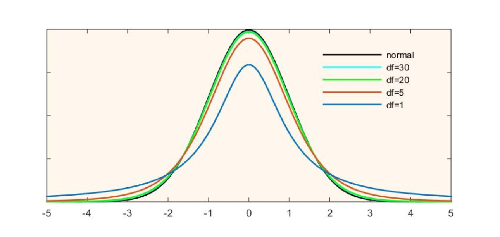

# T Distribution

Inspired from normal distribution as well as its $Z$ transform to a standard normal distribution given a sample number $n$, a T distribution adds *degree of freedom* (df) that takes into account uncertainty of estimation.

$$
\overline{X} \sim N \Big(\mu_0, \frac{\sigma^2}{n} \Big)
,\qquad
Z = \frac{\overline{X}-\mu_0}{\frac{s}{\sqrt{n}}}
\sim N (0, 1 )
$$

The degrees of freedom represents the number of values in a statistical calculation that are free to vary. 
In the case of the T distribution, the degrees of freedom are $n-1$ as one degree of freedom is reserved for estimating the mean, and $n-1$ degrees remain for estimating the variability.

When $n$ is small, T distribution is very much different from Z distribution; when $n$ is large, they are similar.

      

 