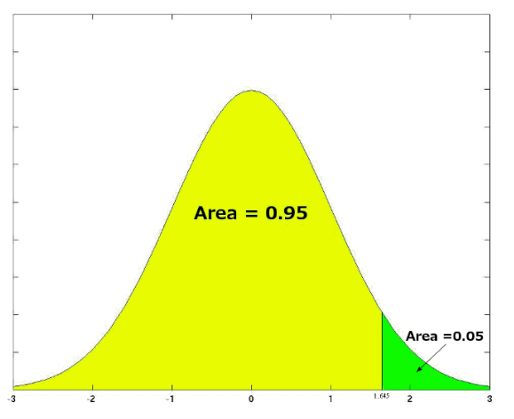
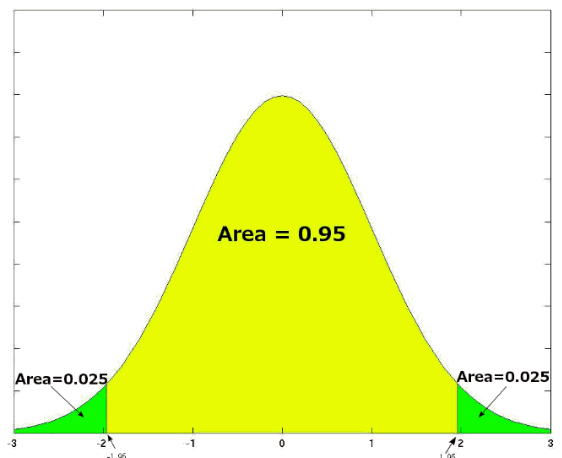
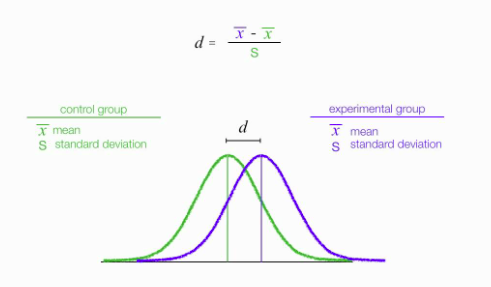
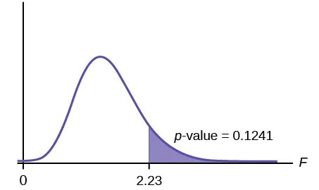
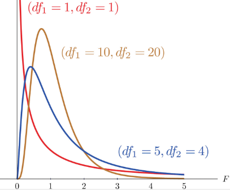

# Inferential Statistics

## Basics

### Population vs Samples

A population includes all possible individuals or elements that meet certain criteria for a statistical study.

A sample is a subset of the population that is selected for the purpose of statistical analysis.

### Mean

* Arithmetic Mean

$$
\mu_{arith} = \frac{1}{n}(x_1 + x_2 + ... + x_n )
$$

Used when data not skewed and are independent of each other.

* Geometric Mean

$$
\mu_{geome} = (x_1 \cdot x_2 \cdot ... \cdot x_n )^{\frac{1}{n}}
$$

Used in scenarios such as growth rate.

### Variability

Variability is the extent to which data points in a statistical distribution or data set diverge.

Variance is a measure of Variability.

Given variability of sample distribution, there are

* The value of the statistic varies from sample to sample.
* The values of the statistic may not be exactly equal to the value of the parameter.
* Larger random samples have smaller spreads/variability.
* The variability of the sampling distribution of the sample mean decreases as the sample size grows.
* The standard deviation of the sample mean decreases in proportion to the square root of the sample size.

#### Variance

Variance is a specific measure of variability.

* for a sample: $\sigma = {\frac{\sum_n (x\_i - \overline{x})^2}{n-1}}$
* for population: $\sigma = {\frac{\sum_n (x\_i - \overline{x})^2}{N}}$

where

* $n$: sample size ($n-1$: Bassel's correction)
* $N$: population size
* $\overline{x}$: sample's mean

#### Standard Deviation

It represents the average amount by which each data point differs from the mean.

Simply, there is $\text{Standard Deviation}=\sqrt{\text{Variance}}$.

#### Deviation

It represents the gap between a sample vs sample mean.
It can be either positive or negative.

Simply, there is $\text{Deviation}=x\_i - \overline{x}$.

## Tests in Inferential Statistics

Concepts:

* Treatment (实验组) vs Control (对照组)

Treatment means the effect to be positive.

Control means the effect to be negative.

For example, there are two groups of students, one group $G_1$ (treatment group) had undergone a study improvement program, another group $G_2$ (control group) not.
Study that wants to prove effectiveness of the improvement program should show academic scores of $G_1$ higher than $G_2$.

* Sample vs population:

Sample refers to a group of data points supporting a hypothesis, whereas population refers to all data points containing different hypotheses.

* Parameter vs Statistic

A parameter is a number describing a whole population (e.g., population mean), while a statistic is a number describing a sample (e.g., sample mean)

|Measures|Population Mean|Sample Mean|
|-|-|-|
|Mean|$\mu$|$\overline{X}$|
|Variance|$\sigma^2$|$s^2$|
|Correlation|$\rho$|$r$|
|Regression Coefficient|$\beta$|$b$|

* Measurements

|Scales|Description|Operators|Examples|
|-|-|-|-|
|Nominal|Mutually exclusive and exhaustive categories| $=, \ne$|Gender, Student IDs|
|Ordinal|Same as nominal, but the categories are ranked| $=, \ne, <, >$|Grade(e.g., S,A,B,C,D), rank|
|Interval|Regression, arbitrary zero point| $=, \ne, <, >, +, -$|IQ|
|Ratio|Regression where ratio is meaningful, absolute zero point| $=, \ne, <, >, +, -, \times, \div$|Salary (need to compare with colleagues to see salary is good)|

* Paired Test vs Independent Test

*Paired-samples t tests* compare scores on two different variables but for the same group of cases.

For example,
graduates had higher average salaries 10 years after graduation than they (same group of people) had 5 years after graduation($\overline{X}_{10-year-grad} > \overline{X}_{5-year-grad}$);
people will listen longer to a female telephone marketer than the very SAME people will listen to a male telephone marketer ($\overline{X}_{listen-to-female} > \overline{X}_{listen-to-male}$).

*Independent-samples t tests* compare scores on the same variable but for two different groups of cases

For example,
length of life, on average, is shorter for never-married persons than for ever-married persons ($\overline{X}_{not-married} > \overline{X}_{married}$);
the mean years of schooling of city students are different than the mean years of schooling of country students ($\overline{X}_{city-student} \ne \overline{X}_{country-student}$).

* T Test vs F Test

|T Test|F Test|
|-|-|
|Assume population variances are equal; to test if the population means are equal|to test whether two population variances are equal|

* P-Value vs Statistical Power

|P-Value|Statistical Power|
|-|-|
|the probability rejecting the null hypothesis while it is true|the probability of rejecting the null hypothesis while it is false|
|small value $p<0.05$ means high significance|large value $\text{Power}>0.8$ means high significance|

### T Test and Z Test Statistic

A statistical test that is used to compare the means of two groups. 

The test assumes data:

* all tests are independent
* all tests are normally distributed
* homogeneity of variance (each group of a hypothesis is of limited variance)

Evaluating the t-value requires testing a null hypothesis where the means of both test samples are equal.

$$
t=\frac{\overline{X}-\mu_0}{\frac{s}{\sqrt{n}}}
$$

where $\overline{X}$ is the sample mean and $\mu_0$ is the population mean. $s$ is the standard deviation of the sample and $n$ is the sample size.

The z-score is important for calculating the probability of a data value appearing within the normal distribution for a specific standard.

In other words, z-value is the one-sample-point scenario of t statistic.

$$
z=\frac{X-\mu}{\sigma}
$$

where $X$ is this sample value/score and $\mu$ is the population mean. $\sigma$ is the standard deviation for the population.

### Independent T-test

Consider two independent random samples selected from two normal distributions
with means $\mu_A$ and $\mu_B$ and unknown variances $\sigma^2_A$ and $\sigma^2_B$.
Given sample size $n_A$ and $n_B$, there is

$$
\overline{X}_A \sim N \Big( \mu_A, \frac{\sigma^2_A}{n_A} \Big)
,\qquad
\overline{X}_B \sim N \Big( \mu_A, \frac{\sigma^2_B}{n_B} \Big)
$$

If two samples are independent, there shoul be

$$
\overline{X}_A - \overline{X}_B
\sim N \Big( \mu_A - \mu_B, \frac{\sigma^2_A}{n_A} + \frac{\sigma^2_B}{n_B} \Big)
$$

Transform to a standard normal distribution, there is

$$
Z = \frac{\overline{X}_A - \overline{X}_B - (\mu_A - \mu_B)}
{\sqrt{\frac{\sigma^2_A}{n_A} + \frac{\sigma^2_B}{n_B}}}
\sim N(0, 1)
$$

The $Z \approx 0$ means the two samples $A$ and $B$ are picked in the same population indepedently.

Assume $\sigma_A^2 = \sigma_B^2$ (for example, academic tests done on the same group of students before and after a study improvement program being introduced, the before $B$ and after $A$ groups should have same $\sigma_A^2 = \sigma_B^2$.), the T distribution is

$$
T = \frac{\overline{X}_A - \overline{X}_B - (\mu_A - \mu_B)}
{s_p\sqrt{\frac{1}{n_A} + \frac{1}{n_B}}}
\sim t(n_A+n_B-2)
$$

where $s_p = \sqrt{\frac{(n_A-1)s_A^2+(n_B-1)s_B^2}{n_A+n_B-2}}$

### Paired T-test

Paired test assumes two samples' differences are meaningful for analysis.

For example, the table below shows students' score before and after a study improvement program being introduced.
The score gap $D$ indicates 9 out of 10 students seeing improvements (only student9 sees drop in score $ D_9=-4$ ), and the improvement program is likely effective.

Assume $\pi = 0.7$ for there was a priliminary study that concludes $70\%$ of students see improvement after this program.
The probability of 9 or all 10 students failing the program is $0.0001436$.

$$
P( N \ge 9) = 
C^{9}_{10}(0.3)^9(0.7)^1 + C^{10}_{10}(0.3)^{10}(0.7)^0 = 0.0001436
$$

||Student1|Student2|Student3|Student4|Student5|Student6|Student7|Student8|Student9|Student10|
|-|-|-|-|-|-|-|-|-|-|-|
|$B$: Before |18|21|16|22|19|24|17|21|23|18|
|$A$: After |22|25|17|24|20|29|20|23|19|20|
|$D_i=A_i-B_i$|4|4|1|2|1|5|3|2|-4|2|

Let sample $B$ represent before improvement and sample $A$ represent after improvement.

Consider $D_i=A_i-B_i$, the paired T-test is

$$
T=\frac{\overline{X}_D-\mu_D}{\frac{s_D}{\sqrt{n}}}
\sim t(n-1)
$$

where $t(n-1)$ is the T distribution.

### Bernoulli Trials and Confidence Interval

If $X$ is a binomial random variable with parameters $n$ and $p$, the expectation is $E(X)=np$ and variance is $V(X)=np(1-p)$.

By simple linear transformations there are $E(\frac{X}{n})=n$ and $V(\frac{X}{n})=\frac{p(1-p)}{n}$.

### Sample Size and Confidence Intervals

Required sample size satisfying confidence interval $z$ and accuracy $\epsilon$ can found by 
$$
n=\frac{z^2 \hat{p}(1-\hat{p})}{\epsilon^2}
$$

For example, given confidence level of $z=2.575$ for $99\%$ and accuracy level of $\epsilon=0.05$ (error tolerance), to attest a coin being a fair coin $p=0.5$, there is

$$
n=\frac{z^2 \hat{p}(1-\hat{p})}{\epsilon^2}= \frac{2.575^2 \times 0.5 \times 0.5}{0.05^2}= 663.0625 \approx 667
$$

A total of $667$ tests should be conducted.

### One-Tailed Tests vs Two-Tailed Tests

The main difference between one-tailed and two-tailed tests is that one-tailed tests will only have one critical region whereas two-tailed tests will have two critical regions.

      
 One-Tailed Tests: 
 
      
      
 Two-Tailed Tests: 
 
      

 

Two-tailed tests can be used in scenarios  

### Effect Size

Effect size is a measure that describes the magnitude of a treatment effect/ phenomenon.

It is quantitatively measured by *Cohen's d* such that $d=\frac{\text{mean difference}}{\text{standard deviation}(\sigma_X)}$ .

      

 

For example, the mean IQ for college students is 105; the mean IQ of the general population is 100. Given a $\sigma_X = 15$ for the general population's, there is

$$
d = \frac{105-100}{15} = 0.33
$$

Cohen's (1988) rule of thumb

|$d$|Evaluation of Effect Size|
|-|-|
|0.2|Small|
|0.5|Medium|
|0.8|Large|

### Type I and Type II Error

Significance Level: the probability level at which you will reject the null hypothesis $H_0$.

* Type I error $\alpha$ (false positive): reject $H_0$ (accepting $H_1$) when in fact $H_0$ is true
* Type II error $\beta$ (false negative): do not reject $H_0$ (accepting $H_0$) when in fact $H_1$ is true

Having said a significance level such as $\alpha = 0.01$, 

### Significance Level

Confidence intervals are usually calculated at $5\%$ or $1\%$ significance levels $\alpha$, such that out of $95\%$ or $99\%$ of samples, the estimates are correct.

### Critical Region

A *critical region*, also known as the rejection region, is a set of values for the test statistic for which the null hypothesis is rejected. 

### Statistical Power of a Test

The probability of rejecting a hypothesis $H_0$ when it is false is called *power*.
In other words, power describes the confidence of a hypothesis for a test.

$$
\text{power} = P(\text{reject }H_0 \space|\space H_1 \text{ is true})
$$

* higher the significance level $\alpha$, higher the power
* larger the effect size, higher the power
* larger the sample size and lower the variability, higher the power

### P-value

The p-value in a statistical test helps determine whether to reject or support the null hypothesis.

A smaller p-value suggests the rejection of the null hypothesis, whereas a higher p-value indicates stronger evidence for supporting the null hypothesis.

#### P-Value and Significance

The lower the p-value, the greater the statistical significance of the observed difference.
A large p-value indicates that a test is NOT significant.

#### P-Value Example and Computation

Let $X$ be the a sample value to see whether it should be rejected/accepted. There is $X \sim N(\mu, \sigma^2)$.

If the null hypothesis is true $H_0: \mu = \mu_0$, there is

$$
\overline{X} \sim N \Big(\mu_0, \frac{\sigma^2}{n} \Big)
,\qquad
Z = \frac{\overline{X}-\mu_0}{\frac{s}{\sqrt{n}}}
\sim N (0, 1 )
$$

Recall that $Z$ is used to transform $X$ distribution to a standard normal distribution.

Assumed some statistics: for example, the averange height of a total of 71 people is $168$, while the average male height is $173.7$.

$$
𝑧=\frac{173.7−168}{27/71}=1.7789
$$

The p-value is the probability that a standard Normal variable $Z$ takes a value at least $1.7789$ away from zero, which is

$$
P(Z \le -1.7789) + P(Z \ge 1.7789) = 2 \times  P(Z \ge 1.7789)
\approx 0.0753
$$

## Analysis of Variance (ANOVA) 

Let $X_{ij}$ represent the $j$-th observation in the $i$-th population (there are a total of $k$ population groups) having a normal distribution with mean $\overline{X}\_i$ and variance $\sigma_i^2$ (by equal variance (homogeneity of variance) assumption, there is $\sigma^2=\sigma^2_1=\sigma^2_2=...=\sigma^2_i...=\sigma^2_k$).

$$
X_{ij} \sim N (\overline{X}\_i, \sigma^2)
$$

One-Way ANOVA says

* $H_0$: $\overline{X}_1=\overline{X}_2=...=\mu_k=\mu$
* $H_1$: $\overline{X}\_i$ are not all equal 

### Assumptions

Only under these assumptions that T test and ANOVA hold true.

* Normality: sample drawn from normal distribution
* Equal Variance (homogeneity of variance) $\sigma^2=\sigma^2_1=\sigma^2_2=...=\sigma^2_i...=\sigma^2_k$: multiple samples drawn from the same population have the same variances
* Independence: observations in each group of sample are independent from others

### F Test

The F-test tests the null hypothesis $H_0$ that the samples have equal variances vs. the alternative hypothesis $H_1$ that the samples do not have equal variances.

Assume there are $k$ populations where each population has $n_i$ data points that sum up to a total of $n$ data points, F-test statistic is computed by

$$
\begin{align*}
  F(k-1, n-k) &= 
    \frac{\text{treatment effect} + \text{sampling error}}{\text{sampling error}}
    =\frac{\text{between-group variability}}{\text{in-group variability}}
    \\\\ &=
    \frac{\frac{1}{k-1}\sum^k_{i=1} n_i (\hat{X}\_i-\overline{X})^2}
        {\frac{1}{n-k}\sum^k_{i=1}\sum^{n_i}_{j=1} (X_{ij}-\hat{X}\_i)^2}
\end{align*}
$$

where $k-1$ and $n-k$ are degree of freedom reflecting Bessel's correction.

There is definition $\hat{X}\_i := \overline{X}\_i$ in the case of predicting $\overline{X}\_i$ comparing means of different groups.

Large $F$ means test is significant.
* $H_0$: $F \approx 1$
* $H_1$: $F \gg 1$

### F Distribution and P-Value

P-value of an F test can be said the probability of this test is negative (accept $H_0$, reject $H_1$).

      

 

F statistic takes two degree-of-freedom arguments: $k-1$ and $n-k$.
They have different shapes such as below.

      

 

### ANOVA Table

||Sum of Squares (SS)|Degree of Freedom (df)|Mean Squares (MS)|F statistic|p value|
|-|-|-|-|-|-|
|Treatment|$SSR$|$df_r$|$MSR$|$\frac{MSR}{MSE}$|probability of $F(df_r, df_e)$ is true|
|Error|$SSE$|$df_e$|$MSE$|||
|Total|$SST$|$df_t$||||

where

* $SSR$: regression sum of squares $\sum^k_{i=1} n_i (\overline{X}\_i-\overline{X})^2$
* $SSE$: error sum of squares $\sum^k_{i=1}\sum^{n_i}_{j=1} (X_{ij}-\overline{X}\_i)^2$
* $SST$: total sum of squares ($SST = SSR + SSE$)
* $df_r$: regression degrees of freedom ($df_r = k-1$)
* $df_e$: error degrees of freedom ($df_e = n-k$)
* $df_t$: total degrees of freedom ($df_t = n-1$)
* $MSR$: regression mean square ($MSR = SSR/df_r$)
* $MSE$: error mean square ($MSE = SSE/df_e$)
* $F$: The F test statistic ($F(df_r, df_e) = MSR/MSE$)
* $p$: The p-value that corresponds to $F_{df_r, df_e}$

### Post-Hoc Comparison and Tukey's HSD (Honestly Significant Difference) Test

Post hoc in Latin means "after this" (after source data finished collection, analysis ensues).

A post-hoc test is to identify which groups differ from each other. 
Therefore, such tests are also called *multiple comparison tests*.

Tukey's HSD test compares all possible pairs of means $\overline{X}\_i - \overline{X}_j$, and identifies any difference between two means that is greater than the expected standard error.  

### Linear Contrast

A linear contrast is a linear combination of variables whose coefficients add up to zero, allowing comparison of different treatments (a set of groups, not just one group).

Let $\mathbf{\theta}= \{ \theta_1, \theta_2, ..., \theta_k \}$ be a set of variables, either parameters or statistics, and $\mathbf{a} = \{ a_1, a_2, ..., a_k \}$ be known coefficients/constants.
It is called *contrast* if $\sum^k_{i=1} a_i = 0$.

A very typical use is test against means: $\theta_i := \overline{X}\_i$, and $a_i$ is used to control "weights" of each $\theta_i$.
There is a base reference that sees $a_t=1$ (treatment group), while others $a_{i \ne t} < 0$ (control groups).

Example:

* Group 1 vs. (Groups 2, 3, and 4): $\Psi = (1)\overline{X}_1 + (-\frac{1}{3})\overline{X}_2 + (-\frac{1}{3})\overline{X}_3 + (-\frac{1}{3})\overline{X}_4$

* Group 1 vs. (Groups 2, and 3): $\Psi = (1)\overline{X}_1 + (-\frac{1}{2})\overline{X}_2 + (-\frac{1}{2})\overline{X}_3$

* Group 2 vs Groups 3: $\Psi = (0)\overline{X}_1 + (1)\overline{X}_2 + (-1)\overline{X}_3 + (0)\overline{X}_4$

Semantics: in the case of Group 1 vs. (Groups 2, 3, and 4), if Group 1 (treatment group) exhibits no effect, it should have the same mean as as other control groups, such that $\overline{X}_1=\overline{X}_2=\overline{X}_3=\overline{X}_4$.
Here assigns $\frac{1}{3}$ as the equal weights to the control groups.

If research considers there is a linear relationship over the all control groups but with different weights, such as in clinical medicine experiment, define Group 1 (standard dose intake expected blood pressure reduction by $20\%$), Group 2 (half dose by $10\%$), Group 3 (one quarter dose by $5\%$), Group (4 no dose no effect), the null hypothesis is
$\Psi = (\frac{0.2}{0.2+0.1+0.05})\overline{X}_1 + (\frac{0.1}{0.2+0.1+0.05})\overline{X}_2 + (\frac{0.05}{0.2+0.1+0.05})\overline{X}_3 + (-1)\overline{X}_4$

Null hypothesis of linear contrast is
* $H_0: \Psi = 0$, where $\Psi = \sum^k_{i=1} a_i \theta_i = 0$.

Test statistic is (always take $df_r=1$)
$$
F = \frac{MSR_{contrast}}{MSE_{in-group}} 
    = \frac{{\hat{\Psi}^2}/ \big({\sum_i^{k}(a_i^2/n_i)}\big)}{\frac{1}{n-k}\sum^k_{i=1}\sum^{n_i}_{j=1} (X_{ij}-\overline{X}\_i)^2}
    \sim F(1, n-k)
$$

By t test, there is

$$
t = \sqrt{F} = \sqrt{\frac{MSR_{contrast}}{MSE_{in-group}} }
    = \frac{\hat{\Psi}}{\sqrt{\Big(\sum_i^{k}(a_i^2/n_i)\Big)\Big( \frac{1}{n-k}\sum^k_{i=1}\sum^{n_i}_{j=1} (X_{ij}-\overline{X}\_i)^2 \Big)}}
$$
