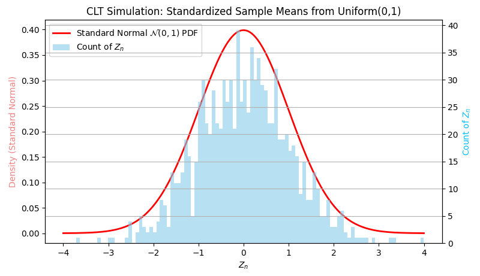

# Random/Stochastic Process

A stochastic process is defined as a collection of random variables used as mathematical models to simulate a system or a phenomenon.

## Law of large numbers 大数定律

The average of the results obtained from a large number of trials should be close to the expected value and tends to become closer to the expected value as more trials are performed.

In other words, more trials, more accurate the mean value.

### Wiener-khinchin law of large Numbers 辛钦大数定律

Let $X_1, X_2, \cdots, X_n$ be a sequence of independent random variables with the same distribution and $E(X_i) = \mu$.
Then, for a small amount $\epsilon > 0$,

$$
\lim_{n \to \infty} P\bigg\{\Big|\frac{1}{n}\sum_{i=1}^n X_i - \mu\Big| < \epsilon\bigg\} = 1
$$

Intuitively speaking, the mean of the sample is close to the expected value.
In other words, this law states that as more sampling is taken, the observed mean value will converge to the population truth mean value with a diminishing loss error of $\epsilon$.

## Bessel's Correction

Bessel's correction is the use of $n − 1$ as the sample number instead of $n$ in the formula for the sample variance and sample standard deviation.

A naive approach to variance is
$$
\sigma^2 = \overline{(x^2)} - (\overline{x})^2 =
\frac{
    \sum_{i=1}^n x\_i^2 - \frac{1}{n}\Big(\sum_{i=1}^n x\_i \Big)^2}{ n }
$$

By Bessel's correction, there is
$$
s^2 = \frac{n}{n-1} \Bigg( \frac{1}{n}\sum_{i=1}^n x\_i^2 - \Big( \frac{1}{n}\sum_{i=1}^n x\_i \Big)^2 \Bigg)
$$

One can understand Bessel's correction as the degrees of freedom in the residuals vector (residuals, not errors, because the population mean is unknown):
$$
\{ x_1-\overline{x}, x_2-\overline{x}, ..., x_n-\overline{x} \}
$$

where $\overline{x}$ is the sample mean.
For $n$ independent observations in the sample, there are only $n − 1$ independent residuals, as they sum to $0$. 

### Source of Inspiration and Bias

The reason why there are only $n − 1$ independent residuals is that, for example, there is only one sample point $\mathbf{x} = \{ x_1 \}$.
The mean is $\overline{x} = x_1$ and residual is always $x_1 - \overline{x} = 0$, that the residual is not independent when $n=1$.

As a result, residual is always has degree of freedom of $n-1$.

## Central Limit Theorem

The *central limit theorem* (CLT) establishes that, in many situations, for identically distributed independent samples, the standardized sample mean tends towards the standard normal distribution even if the original variables themselves are not normally distributed.

Let $X_1, X_2, \cdots, X_n$ be a sequence of independent random variables with the same distribution and $E(X_i)=\mu$ (considered truth mean) and variance of $\sigma^2$.

$$
\overline{X}_n=\frac{1}{n}\sum_{i=1}^n X_i
$$

Then, the normalized sample mean:

$$
Z_n=\frac{\overline{X}_n-\mu}{\sigma/\sqrt{n}}
$$

converges in distribution to a standard normal distribution as $n\rightarrow\infty$:

$$
Z_n\rightarrow\mathcal{N}(0,1)
$$

Or

$$
{\sqrt{n}}({\overline{X}}_{n}-\mu) \rightarrow \mathcal{N}(0, \sigma^2)
$$

### Example: Sampling From A Uniform Distribution

Let $X_i\sim\mathcal{U}(0,1)$ draw from a uniform distribution.
This uniform distribution has $\mu=0.5$ and $\sigma^2=\frac{1}{12}$.

Take samples of size $n=50$, compute sample means, and standardize them:

$$
Z_n=\frac{\overline{X}_n-0.5}{\sqrt{1/12n}}
$$

Conduct a number of $1000$ sampling activity that each sampling contains $50$ sample cases.
The $1000$ sampling result $Z_n\sim\mathcal{N}(0,1)$ should follow a standard normal distribution.

The figure below shows that out of the $1000$ sampling results, most of them are $Z_n\approx 0$ since $Z_n\sim\mathcal{N}(0,1)$.

      

 
