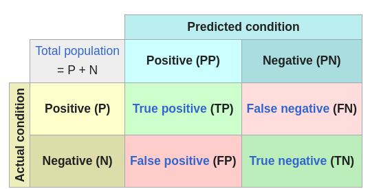
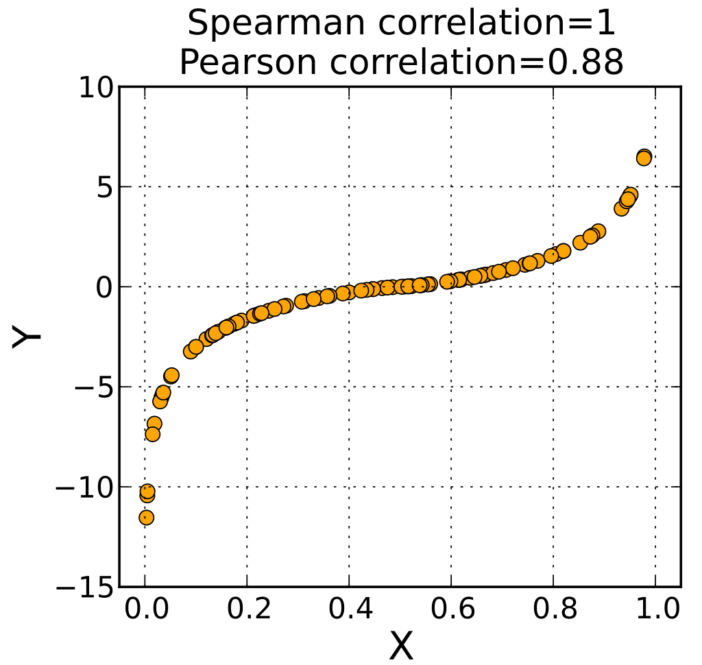
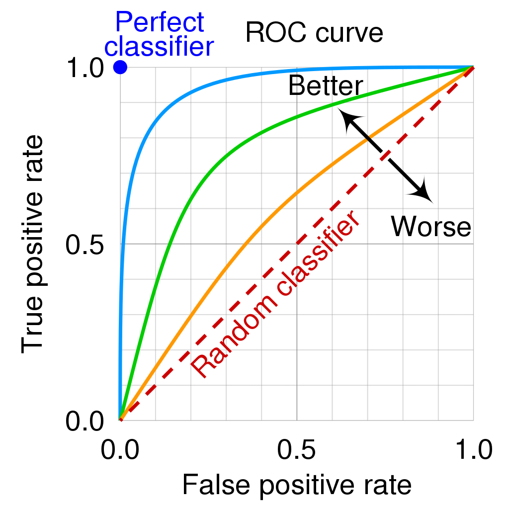

# Evaluation Metrics

## Confusion Matrix

<div style="display: flex; justify-content: center;">
      
</div>
</br>

* accuracy (ACC)

$$
ACC = \frac{TP+TN}{TP+TN+FP+FN}
$$

* sensitivity, recall, hit rate, or true positive rate (TPR)

$$
TPR = \frac{TP}{TP+FN}
$$

* fall-out or false positive rate (FPR)

$$
FPR = \frac{FP}{TP+TN}
$$

* precision or positive predictive value (PPV)

$$
PPV = \frac{TP}{TP+FP}
$$

* F1 score

$$
F_1 = 2 \times  \frac{PPV \times TPR}{PPV + TPR}
$$

* Matthews correlation coefficient (MCC)

$$
MCC= \frac{TP \times TN - FP \times FN}{\sqrt{(TP+FP)(TP+FN)(TN+FP)(TN+FN)}}
$$

### Practice and Code

Accuracy is straightforward simply by comparing exact match between truth labels vs prediction labels $\text{accuracy}=\frac{n_\text{matched}}{n_\text{total}}$.

#### Precision and Recall per Label

For TP, FP, TN, FN only take into account binary data that:

||Truth|Prediction|
|-|-|-|
|True Positive (TP)|1|1|
|False Positive (FP)|0|1|
|True Negative (TN)|0|0|
|False Negative (FN)|1|0|

However, in practice, data are often multi-labelled.
To compute the confusion matrix, iterate each truth label considered as "positive", for all corresponding position mismatched prediction label as "negative".

* For recall (from truth labels how many samples are correctly predicted): $\frac{TP}{TP+FN}$
* For precision (for predicted labels how many samples correctly hit truth labels): $\frac{TP}{TP+FP}$

For example for three labels `[0, 1, 2]`,

```py
y_true = [0,0,1,1,2,2,2]
y_pred = [0,1,1,1,0,0,2]
```

for label `0`, only consider truth pred pairs included `0`, such that

```py
y0_true = [0,0,2,2]
y0_pred = [0,1,0,0]
# for precision, check from preds
# how many of which hit truth labels
y0_true_for_precision = [0,2,2]
y0_pred_for_precision = [0,0,0]
y0_precision = 1/3
# for recall, check from truth labels
# how many of which are included in prediction labels
y0_true_for_recall = [0,0]
y0_pred_for_recall = [0,1]
y0_recall = 1/2
```

The same goes with label `1` and `2` to such that

```py
y1_true = [0,1,1]
y1_pred = [1,1,1]
y1_precision = 2/3
y1_recall = 1 = 2/2

y2_true = [2,2,2]
y2_pred = [0,0,2]
y2_precision = 1 = 1/1
y2_recall = 1/3
```

Finally, F1 score can be computed by the obtained by $F1=\frac{2\times TP}{2\times TP+FP+FN}=2 \times \frac{\text{precision} \times \text{recall}}{\text{precision}}+\text{recall}$ for each label.

All code shows as below.

```py
from sklearn.metrics import accuracy_score,precision_score, recall_score, f1_score

y_true = [0,0,1,1,2,2,2]
y_pred = [0,1,1,1,0,0,2]

# Compute accuracy
accuracy = accuracy_score(y_true, y_pred)
precision = precision_score(y_true, y_pred, average=None)
recall = recall_score(y_true, y_pred, average=None)
f1 = f1_score(y_true, y_pred, average=None)

print(f"""accuracy:  {accuracy}
precision: {precision}
recall   : {recall}
f1       : {f1}
""")
```

#### Aggregate by "average"

Having computed precision, recall and f1 for each label, they can be aggregate by "average" to yield a statistic over all labels.

Quotes from `sklearn.metrics`:

* `micro` : Calculate metrics globally by counting the total true positives, false negatives and false positives.

* `macro` : Calculate metrics for each label, and find their unweighted mean. This does not take label imbalance into account.

* `weighted` : Calculate metrics for each label, and find their average weighted by support (the number of true instances for each label). This takes into consideration of data imbalance.

In `sklearn.metrics`, for example to use `weighted`, simply pass `average="weighted"` as argument.

```py
from sklearn.metrics import accuracy_score,precision_score, recall_score, f1_score

accuracy = accuracy_score(y_true, y_pred)
precision = precision_score(y_true, y_pred, average="weighted")
recall = recall_score(y_true, y_pred, average="weighted")
f1 = f1_score(y_true, y_pred, average="weighted")
```

Detail about the `"weighted"`, that given 7 samples having the statistics,

```py
y_true = [0,0,1,1,2,2,2]
y_pred = [0,1,1,1,0,0,2]

y0_precision = 1/3
y1_precision = 2/3
y2_precision = 1/1

y0_recall = 1/2
y1_recall = 1
y2_recall = 1/3
```

the weighted averaged precision and recall are shown as below, where weights $[\frac{2}{7},\frac{2}{7},\frac{3}{7}]$ correspond to the number of truth labels: two `0`s, two `1`s and three `2`s in `y_true = [0,0,1,1,2,2,2]`.

$$
\begin{align*}
\text{precision}: 0.714\approx
\frac{2}{7}\cdot\frac{1}{3}+
\frac{2}{7}\cdot\frac{2}{3}+
\frac{3}{7}\cdot\frac{1}{1}\\
\text{recall}: 0.571\approx
\frac{2}{7}\cdot\frac{1}{2}+
\frac{2}{7}\cdot\frac{2}{2}+
\frac{3}{7}\cdot\frac{1}{3}
\end{align*}
$$

## Correlations

### Pearson Correlation

*Pearson correlation coefficient* measures linear correlation between two sets of data, defined as the ratio between the covariance of two variables and the product of their standard deviations.

$$
\rho_{X,Y} = 
\frac{\text{cov}(X,Y)}{\sigma_X \sigma_Y} =
\frac{E\big( (X - \overline{X}) \cdot (Y - \overline{Y}) \big)}{\sigma_X \sigma_Y}
$$

where $\cdot$ denotes element-wise multiplication that produces a vector of results that satisfies $\text{assert}\big(\text{len}(X) == \text{len}(Y) == \text{len} \big( (X - \overline{X}) \cdot (Y - \overline{Y}) \big) \big)$,
and $E(...)$ is the expectation.
$\sigma_X$ and $\sigma_Y$ are standard deviations.

|Correlation Value Range|Semantics|
|-|-|
|$[0, 0.3)$|No correlation|
|$[0.3, 0.5)$|Low correlation|
|$[0.5, 0.7)$|Moderately correlated|
|$[0.7, 0.9)$|Highly correlated|
|$[0.9, 1]$|Very highly correlated|

If values are negative, correlation is in a reverse order.

### Spearman Correlation

Pearson correlation assesses how strong the linear relationship is between samples, such that for $x_i \in X$ and $y_i \in Y$, Pearson correlation of $1$ should see equal value increase such that $x_i + \Delta x = y_i + \Delta x$.

Spearman's correlation $r_s \in [-1, 1]$ assesses monotonic (linear or non-linear) relationships that there is always  $x_{i+1} > x_i \in X$ and $y_{i+1} > y_i \in Y$.

For example, the non-linear monotonic increase sigmoid gives a Pearson correlation of $0.88$, but Spearman correlation of $1$, as each $\{ x_i, y_i \}$ pair sees for each $x_{i+1} > x_i$, the corresponding sample point should see $y_{i+1} > y_i$.

<div style="display: flex; justify-content: center;">
      
</div>
</br>

By definition, the Spearman correlation coefficient $r_s$ is defined as the Pearson correlation coefficient between the rank variables (rank variables refer to for variables with index $i=1,2,...$, there exists either $x_{i+1}>x_i$ or $x_{i+1}<x_i$ for all $i=1,2,...$).

For a sample of size $n$, the n$ $raw scores $X, Y$ are converted to ranks $R(X)$ and $R(Y)$, so that $r_s$ is

$$
r_s = \rho_{R(X), R(Y)} = 
\frac{\text{cov}\big( R(X), R(Y) \big)}{\sigma_{R(x)} \sigma_{R(Y)}}
$$

### Matthews Correlation (Phi Coefficient)

*Matthews correlation* (*Phi coefficient*) $r_{\phi}$ is a measure of association for two binary variables.

Define $n_{xy}$ as the count of binary records with respect to $X$ and $Y$ such that

||y=1|y=0|total|
|-|-|-|-|
|x=1|$n_{11}$|$n_{10}$|$n_{1y}$|
|x=0|$n_{01}$|$n_{00}$|$n_{0y}$|
|total|$n_{x1}$|$n_{x0}$|$n$|

So that $r_{\phi}$ is defined as

$$
r_{\phi}= \frac{n_{11} n_{00} - n_{10} n_{01}}{\sqrt{n_{1y}n_{0y}n_{x1}n_{x0}}}
$$

In machine learning, it can be used to measure confusion matrix

$$
MCC= \frac{TP \times TN - FP \times FN}{\sqrt{(TP+FP)(TP+FN)(TN+FP)(TN+FN)}}
$$

## Receiver operating characteristic (ROC)

The ROC curve is the plot of the true positive rate ($TPR=\frac{TP}{TP+FP}$) against the false positive rate ($FPR=\frac{FP}{FP+TN}$) at each threshold setting.

<div style="display: flex; justify-content: center;">
      
</div>
</br>