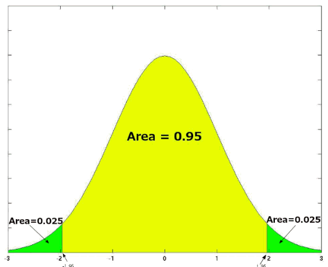

# Prediction Performance Evaluation

## Statistical Significance

### T Test

A t test is a statistical test that is used to compare the means of two groups. 

The t test assumes data:
* all tests are independent
* all tests are normally distributed
* homogeneity of variance (each group of a hypothesis is of limited variance)

### Bernoulli Trials and Confidence Interval

Denote observed probability of success as $\hat{p}$

### One-Tailed Tests vs Two-Tailed Tests

The main difference between one-tailed and two-tailed tests is that one-tailed tests will only have one critical region whereas two-tailed tests will have two critical regions.

      
 One-Tailed Tests: 
 
      
      
 Two-Tailed Tests: 
 
      

 

Two-tailed tests can be used in scenarios  

### Effect Size

Effect size is a measure that describes the magnitude of a treatment effect/ phenomenon.

It is quantitatively measured by *Cohen's d* such that $d=\frac{\text{mean difference}}{\text{standard deviation}(\sigma_X)}$ .

      

 

Cohen’s (1988) rule of thumb

|$d$|Evaluation of Effect Size|
|-|-|
|0.2|Small|
|0.5|Medium|
|0.8|Large|

### Type I and Type II Error

Significance Level: the probability level at which you will reject the null hypothesis.

* Type I error $\alpha$ (false positive)
* Type II error $\beta$ (false negative)

### Significance Level

Confidence intervals are usually calculated at $5\%$ or $1\%$ significance levels, such that out of $95\%$ or $99\%$ of samples, the estimates are correct.

### Critical Region

A *critical region*, also known as the rejection region, is a set of values for the test statistic for which the null hypothesis is rejected. 

### Statistical Power of a Test

The probability of rejecting a hypothesis $H_0$ when it is false is called *power*.
In other words, power describes the confidence of a hypothesis for a test.

* higher the significance level $\alpha$, higher the power
* larger the effect size, higher the power
* larger the sample size and lower the variability, higher the power

## Analysis of variance (ANOVA) 

### F Test

## Confusion Matrix 

### Precision

### Recall

## F1 Score

## Receiver operating characteristic (ROC)

## Pearson Correlation
