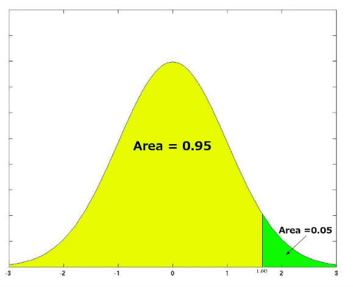

# Prediction Performance Evaluation

## Variability

Variability is the extent to which data points in a statistical distribution or data set diverge.

Variance is a measure of Variability.

Given variability of sample distribution, there are
* The value of the statistic varies from sample to sample.
* The values of the statistic may not be exactly equal to the value of the parameter.
* Larger random samples have smaller spreads/variability.
* The variability of the sampling distribution of the sample mean decreases as the sample size grows.
* The standard deviation of the sample mean decreases in proportion to the square root of the sample size.

## Inferential Statistics

Concepts:
* Sample vs population: 

Sample refers to a group of data points supporting a hypothesis, whereas population refers to all data points containing different hypotheses.

* Parameter vs Statistic

A parameter is a number describing a whole population (e.g., population mean), while a statistic is a number describing a sample (e.g., sample mean)

|Measures|Population Mean|Sample Mean|
|-|-|-|
|Mean|$\mu$|$\overline{X}$|
|Variance|$\sigma^2$|$s^2$|
|Correlation|$\rho$|$r$|
|Regression Coefficient|$\beta$|$b$|

* Measurements

|Scales|Description|Operators|Examples|
|-|-|-|-|
|Nominal|Mutually exclusive and exhaustive categories| $=, \ne$|Gender, Student IDs|
|Ordinal|Same as nominal, but the categories are ranked| $=, \ne, <, >$|Grade(e.g., S,A,B,C,D), rank|
|Interval|Regression, arbitrary zero point| $=, \ne, <, >, +, -$|IQ|
|Ratio|Regression where ratio is meaningful, absolute zero point| $=, \ne, <, >, +, -, \times, \div$|Salary (need to compare with colleagues to see salary is good)|

### T Test and Z Test Statistic

A statistical test that is used to compare the means of two groups. 

The test assumes data:
* all tests are independent
* all tests are normally distributed
* homogeneity of variance (each group of a hypothesis is of limited variance)

Evaluating the t-value requires testing a null hypothesis where the means of both test samples are equal.

$$
t=\frac{\overline{X}-\mu_0}{\frac{s}{\sqrt{n}}}
$$
where $\overline{X}$ is the sample mean and $\mu_0$ is the population mean. $s$ is the standard deviation of the sample and $n$ is the sample size.

The z-score is important for calculating the probability of a data value appearing within the normal distribution for a specific standard.

In other words, z-value is the one-sample-point scenario of t statistic.

$$
z=\frac{X-\mu}{\sigma}
$$
where $X$ is this sample value/score and $\mu$ is the population mean. $\sigma$ is the standard deviation for the population.

### Bernoulli Trials and Confidence Interval

If $X$ is a binomial random variable with parameters $n$ and $p$, the expectation is $E(X)=np$ and variance is $V(X)=np(1-p)$.

By simple linear transformations there are $E(\frac{X}{n})=n$ and $V(\frac{X}{n})=\frac{p(1-p)}{n}$.

### Sample Size and Confidence Intervals

Required sample size satisfying confidence interval $z$ and accuracy $\epsilon$ can found by 
$$
n=\frac{z^2 \hat{p}(1-\hat{p})}{\epsilon^2}
$$

For example, given confidence level of $z=2.575$ for $99\%$ and accuracy level of $\epsilon=0.05$ (error tolerance), to attest a coin being a fair coin $p=0.5$, there is 
$$
n=\frac{z^2 \hat{p}(1-\hat{p})}{\epsilon^2}
= \frac{2.575^2 \times 0.5 \times 0.5}{0.05^2}
= 663.0625 \approx 667
$$

A total of $667$ tests should be conducted.

### One-Tailed Tests vs Two-Tailed Tests

The main difference between one-tailed and two-tailed tests is that one-tailed tests will only have one critical region whereas two-tailed tests will have two critical regions.

      
 One-Tailed Tests: 
 
      
      
 Two-Tailed Tests: 
 
      

 

Two-tailed tests can be used in scenarios where 

### Effect Size

Effect size is a measure that describes the magnitude of a treatment effect/ phenomenon.

It is quantitatively measured by *Cohen's d* such that $d=\frac{\text{mean difference}}{\text{standard deviation}(\sigma_X)}$ 

      

 

For example, the mean IQ for college students is 105; the mean IQ of the general population is 100. Given a $\sigma_X = 15$ for the general population's, there is
$$
d = \frac{105-100}{15} = 0.33
$$

Cohen’s (1988) rule of thumb

|$d$|Evaluation of Effect Size|
|-|-|
|0.2|Small|
|0.5|Medium|
|0.8|Large|

### Type I and Type II Error

Significance Level: the probability level at which you will reject the null hypothesis $H_0$.

* Type I error $\alpha$ (false positive): reject $H_0$ (accepting $H_1$) when in fact $H_0$ is true
* Type II error $\beta$ (false negative): do not reject $H_0$ (accepting $H_0$) when in fact $H_1$ is true

Having said a significance level such as $\alpha = 0.01$, 

### Significance Level

Confidence intervals are usually calculated at $5\%$ or $1\%$ significance levels $\alpha$, such that out of $95\%$ or $99\%$ of samples, the estimates are correct.

### Critical Region

A *critical region*, also known as the rejection region, is a set of values for the test statistic for which the null hypothesis is rejected. 

### Statistical Power of a Test

The probability of rejecting a hypothesis $H_0$ when it is false is called *power*.
In other words, power describes the confidence of a hypothesis for a test.

* higher the significance level $\alpha$, higher the power
* larger the effect size, higher the power
* larger the sample size and lower the variability, higher the power

### P-value

The p-value in a statistical test helps determine whether to reject or support the null hypothesis.

A smaller p-value suggests the rejection of the null hypothesis, whereas a higher p-value indicates stronger evidence for supporting the null hypothesis.

#### P-Value and Significance

The lower the p-value, the greater the statistical significance of the observed difference.
A large p-value indicates that a test is NOT significant.

#### P-Value Example and Computation

Let $X$ be the a sample value to see whether it should be rejected/accepted. There is $X \sim N(\mu, \sigma^2)$.

If the null hypothesis is true $H_0: \mu = \mu_0$, there is
$$
\overline{X} \sim N \Big(\mu_0, \frac{\sigma^2}{n} \Big)
,\qquad
Z = \frac{\overline{X}-\mu_0}{\frac{s}{\sqrt{n}}}
\sim N (0, 1 )
$$

Recall that $Z$ is used to transform $X$ distribution to a standard normal distribution.

Assumed some statistics: for example, the averange height of a total of 71 people is $168$, while the average male height is $173.7$.
$$
𝑧=\frac{173.7−168}{27/71}=1.7789
$$

The p-value is the probability that a standard Normal variable $Z$ takes a value at least $1.7789$ away from zero, which is
$$
P(Z \le -1.7789) + P(Z \ge 1.7789) = 2 \times  P(Z \ge 1.7789)
\approx 0.0753
$$

## Analysis of variance (ANOVA) 

### F Test

## Confusion Matrix 

### Precision

### Recall

## F1 Score

## Receiver operating characteristic (ROC)

## Pearson Correlation
