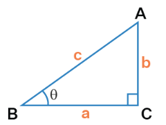
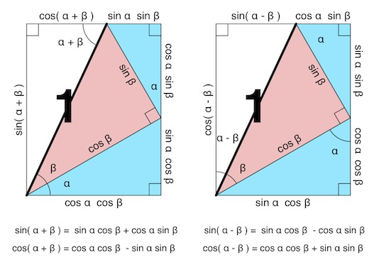
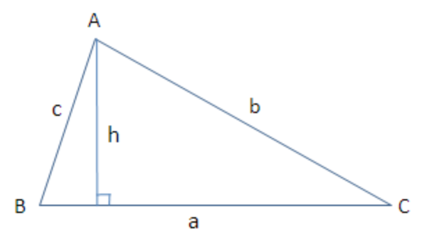
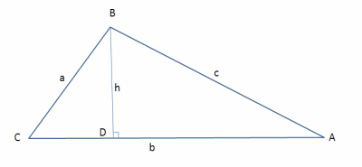

# Trigonometry

Given the three trigonometric functions (take $\angle B = \theta_B$ as example),

$$
\sin\theta_B = \frac{b}{c},\qquad
\cos\theta_B = \frac{a}{c},\qquad
\tan\theta_B = \frac{b}{a}\qquad
$$

also, the names in respects to $\angle B$ are

$$
c: \text{hypotenuse},\qquad
a: \text{adjacent},\qquad
b: \text{opposite},\qquad
$$

where by convention, the opposite side is denoted as lower case of the capital letter angle, such as the opposite side of $\angle A$ is $a$.

      

 

here defines the below reciprocals: *cosecant* (csc), *secant* (sec), and *cotangent* (cot).

$$
\begin{align*}
\csc\theta_B &= \frac{1}{\sin\theta_B} = \frac{c}{b} \\\\
\sec\theta_B &= \frac{1}{\cos\theta_B} = \frac{c}{a} \\\\
\cot\theta_B &= \frac{1}{\tan\theta_B} = \frac{a}{b} \\\\
\end{align*}
$$

Inverse trigonometric functions are defined by restricting input's realm.

|Notation|Definition|Domain of Input $x$ (for real number)|Domain of Output $y$ (by radians)|
|-|-|-|-|
|$y=\arcsin(x)$|$x=\sin(y)$|$-1 \le x \le 1$|$-\frac{\pi}{2} \le y \le \frac{\pi}{2}$|
|$y=\arccos(x)$|$x=\cos(y)$|$-1 \le x \le 1$|$0 \le y \le \pi$|
|$y=\arctan(x)$|$x=\tan(y)$|$x \in \mathbb{R}$|$-\frac{\pi}{2} \le y \le \frac{\pi}{2}$|

## Some Trigonometry Identities

### Pythagorean Identities

$$
\sin^2 \theta + \cos^2 \theta = 1
$$

Proof:
Applying the Pythagoras theorem to the triangle, there is

$$
\begin{align*}
&&& a^2+b^2=c^2 \\\\
\Rightarrow &&& \Big(\frac{a}{c}\Big)^2+ \Big(\frac{b}{c}\Big)^2=1 \\\\
\Rightarrow &&& \sin^2 \theta + \cos^2 \theta = 1
\end{align*}
$$

### Complementary Angle Identities

$$
\sin\theta = \cos\big(\frac{\pi}{2}-\theta\big)
$$

Proof:
provided the sum of interior angles of triangle $180^\circ$, and an already existing right angle $\theta_C=90^\circ$, there is $90^\circ=\theta_A + \theta_B$ (or in radian $\frac{\pi}{2}=\theta_A + \theta_B$), hence $\angle A$ and $\angle B$ are complementary.

### The Sum and Difference Angle Identities

$$
\begin{align*}
\sin(\alpha+\beta)=\cos\alpha\sin\beta+\sin\alpha\cos\beta \\\\
\sin(\alpha-\beta)=\sin\alpha\cos\beta-\cos\alpha\sin\beta \\\\
\cos(\alpha+\beta)=\cos\alpha\cos\beta-\sin\alpha\sin\beta \\\\
\cos(\alpha-\beta)=\cos\alpha\cos\beta+\sin\alpha\sin\beta
\end{align*}
$$

Proof:
given a hypotenuse of length $1$ for $\angle \beta$, the opposite and adjacent are $\sin\beta$ and $\cos\beta$, and take these as known values of hypotenuses for $\angle \alpha$, the adjacent $b_{\alpha}$ and opposite $a_{\alpha}$ of $\angle \alpha$ are

$$
\begin{align*}
&&& \sin\alpha=\frac{a_{\alpha}}{\cos\beta}, \qquad \cos\alpha=\frac{b_{\alpha}}{\cos\beta} \\\\
\Rightarrow &&& a_{\alpha} = \sin\alpha\cos\beta, \qquad b_{\alpha}=\cos\beta\cos\alpha
\end{align*}
$$

By geometry, the sum and difference angle identities can be derived.

      

 

### The Double Angle Identities

$$
\begin{align*}
\sin(2\theta) &= 2 \sin\theta \cos\theta  \\\\
\cos(2\theta) &= \cos^2\theta - \sin^2\theta
\end{align*}
$$

Proof:
by the sum and difference angle identities, set $\theta=\alpha=\beta$ there are

$$
\begin{align*}
&&& \sin(\alpha+\beta)&&=\cos\alpha\sin\beta+\sin\alpha\cos\beta \\\\
\Rightarrow &&& \sin(2\theta)&&=\cos\theta\sin\theta+\sin\theta\cos\theta \\\\
&&& &&=2 \sin\theta \cos\theta \\\\
\text{and} \\\\
&&& \cos(\alpha+\beta)&&=\cos\alpha\cos\beta-\sin\alpha\sin\beta \\\\
\Rightarrow &&& \cos(2\theta)&&=\cos\theta\cos\theta-\sin\theta\sin\theta \\\\
&&& &&=\cos^2\theta - \sin^2\theta \\\\
\end{align*}
$$

## Law of Sines and Cosines

### Law of Sines

$$
\frac{a}{\sin A} =
\frac{b}{\sin B} =
\frac{c}{\sin C}
$$

Proof:
for shared height $h$ between $\angle C$ and $\angle B$, there is

$$
\begin{align*}
&&& \frac{h}{b} = \sin C, \qquad
\frac{h}{c} = \sin B \\\\
\Rightarrow &&& b \sin C = c \sin B \\\\
\Rightarrow &&& \frac{c}{\sin C} =
\frac{b}{\sin B}
\end{align*}
$$

Similarly, the rule holds true for between $\angle A$ and $\angle B$, and between $\angle C$ and $\angle B$.

      

 

### Law of Cosines

$$
\begin{align*}
    & c^2 = a^2 + b^2 - 2ab \cos C \\\\
    & a^2 = c^2 + b^2 - 2bc \cos A \\\\
    & b^2 = a^2 + c^2 - 2ac \cos B \\\\
\end{align*}
$$

Proof:
for $\angle C$, there is

$$
\begin{align*}
\text{By geometry: } &&& CD &&= a \cos C \qquad\Rightarrow\qquad DA = b - \cos C \\\\
&&& BD &&= a \sin C \\\\
\text{By Pythagoras theorem: } &&& c^2 &&= BD^2 + DA^2 \\\\
&&& &&= (a \sin C)^2 + (b - \cos C)^2 \\\\
&&& &&= a^2 \sin^2 C + b^2 + \cos^2 C - 2b\cos C \\\\
&&& &&= a^2 (\underbrace{\sin^2 C + \cos^2 C}\_{=1}) + b^2 - 2b\cos C \\\\
&&& &&= a^2 + b^2 - 2ab\cos C
\end{align*}
$$

      

 