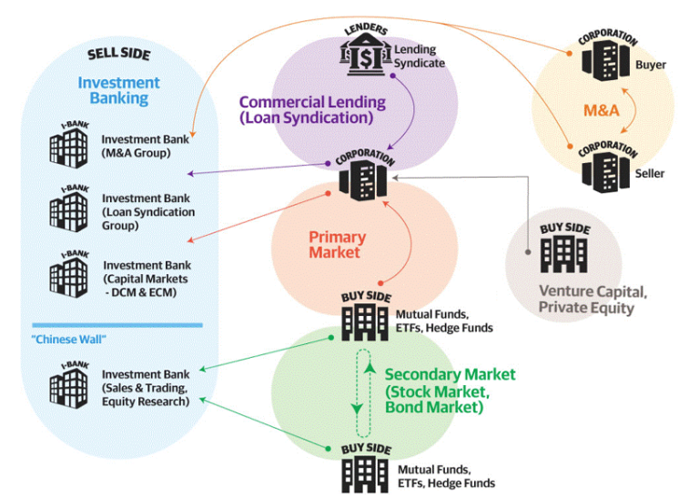

# Investment Banking

## Securities

### Equities

Refers to trading stock.  More specifically, equities are split up between:

* Cash equities: Trading ordinary shares of stock
* Equity derivatives: Trading derivatives of equities (stock options) and equity indices

### Fixed Income

Refers to bonds, and are often further split up in the following way:

* Rates: Government bonds and Interest Rate Derivatives
* Credit: Corporate Bonds (High Grade, High Yield, Loans), Credit Derivatives
* Securitized Products: Mortgage Backed Securities, Asset Backed Securities
* Municipals: Tax-exempt bonds (State, Municipality, Non-Profit)
* Currencies - Also referred to as FX - and Commodities rounds out FICC (Fixed Income, Currencies and Commodities).

## Participant Parties

* Sales
* Brokers
* Traders
* Clearing

## Trading

* Flow trading

Flow trading is where the bank acts as principal (thus often called principal transactions), making markets directly and not through an exchange.

* Agency trading

For heavily traded, liquid securities traded on an exchange (NASDAQ, NYSE, CME), you don't really need market markets (flow traders).

## Investment Firms

* pod Shop

A pod shop, also known as a multimanager hedge fund or platform, is a type of investment firm that employs multiple independent teams (or pods) to manage capital.

## Employee Classification

### Employee Hierarchy

* Managing Director
* Executive Director
* Vice President
* Associate
* Analyst

### Typical Employee Roles

* Sales

Sales "owns" the relationship with clients on behalf of the investment bank. 

Salespeople are split up by product (i.e. equities, fixed income, etc).

* Traders

Traders make a market and execute trades on behalf of investors.

* Structurers

Structurers develop expertise in complex products and are brought in to pitch their area of expertise to clients by the salespeople, who cover the broader day to day relationships. They work directly with the traders when it comes time to execute the trades.

* Research

Research exists to provide salespeople, traders as well as investors directly with insights and potential investment and trade ideas. 

* Quants

Quants (also called “strats”) maintain these electronic trading or algorithmic trading platforms.

## Capital Requirements

Capital requirements mandated to financial institutions set rules that how much money they must hold in reserve (minimum capital ratio standards) against the remaining money to utilize to participate in financial markets, e.g., providing loans and investments.

The requirements restrict money supply by financial institutions.

It has the below benefits:

* from a macro economic perspective, it prevents excessive asset growth;
* from a micro perspective, it allows institutions to absorb losses, thereby protecting customers as well as the institutions.

Conversely, by setting lower capital reserve ratio, economy sees more money supply, banks see more profits as well as higher risks.

### Money Supply

The money supply is the total amount of cash and cash equivalents such as savings accounts that is circulating in an economy at a given point in time.

The motivation of defining different supply scopes is to compute how much cash might be supplied to market.

||Description|Implications|
|-|-|-|
|M0|Notes and coins in circulation (outside Federal Reserve Banks and the vaults of depository institutions) (currency)|Indicative of this time economic activities|
|M1|M0 plus the amount of demand deposits, travelers checks and other checkable deposits + most savings accounts.|Indicative of near future (less than one year) consumption/investment|
|M2|M1 + money market accounts, retail money market mutual funds and certificates of deposit|Money reserve that central bank can influence to convert to M0/M1|
|M3+|M2 + repos, commercial papers|Wider definition of M2|

For $M2$ and wider scopes of money supply, securities as collaterals have such below money supply implications functioned as money lending.

For example, having $10\%$ of mandatory deposit giving $90\%$ money for lending, the lender after lending $90\%$ of money should receive collateral equivalent of the $90\%$, and this equivalent collateral can be again used to borrow $81\%=0.9 \times 0.9$ of the money.
As a result, the total theoretical money lending limit is (assumed total face value of $100$ at start)

$$
1000 \approx
100 \times 0.9 + 100 \times 0.9^2 + 100 \times 0.9^3 + ...
$$

### Basel Capital Requirements

* Basel Accords

The Basel Accords are a series of three sequential banking regulation agreements (Basel I, II, and III) set by the Basel Committee on Bank Supervision (BCBS).

In the wake of the Lehman Brothers collapse of 2008, Basel III was proposed to better regulate the banking industry, including methods such as requiring banks to have a minimum amount of common equity and a minimum liquidity ratio.

* Tier 1 Common Capital

Tier 1 common capital ratio is a measurement of a bank's core equity capital, compared with its total risk-weighted assets, and signifies a bank's financial strength.

It is composed of weighted components such as cash, credit lines, mortgages and personal loans.

* Tier 2 Common Capital

Tier 2 is designated as the second or supplementary layer of a bank's capital and is composed of items such as revaluation reserves, hybrid instruments, and subordinated term debt.

### Regulators

Regulators set rules of the capital requirements, often a member of BASEL committee.

* Federal Deposit Insurance Corporation (FDIC) is a United States government corporation supplying deposit insurance to depositors in American commercial banks and savings banks.

Since 2010, the FDIC insures deposits in member banks up to $250,000 per ownership category.

FDIC also examines and supervises certain financial institutions for safety and soundness by mandating leverage ratios of member banks.

### Capital Adequacy Ratio 资本充足率

reference: 
https://pdf.dfcfw.com/pdf/H3_AP202311211611741744_1.pdf?1700578316000.pdf
https://www.cbirc.gov.cn/cn/view/pages/rulesDetail.html?docId=1134197

Capital adequacy ratio regulation demands that commercial banks must have minimal reserve in case of facing bank rush or economic crisis.

In case of bank insolvency, bank must pay in accordance to this priority queue:

$$
\text{Deposit} \rightarrow
\begin{matrix}
    \text{Debt,} \\ \text{Convertibles}
\end{matrix} \rightarrow
\begin{matrix}
    \text{Sub-prime debt,} \\ \text{Tier 2 common capital}
\end{matrix} \rightarrow
\begin{matrix}
    \text{Priority stock} \\ \text{Evergreen debt}
\end{matrix} \rightarrow
\text{Ordinary stock}
$$

For example, in China, the National Financial Regulatory Administration mandates the below capital adequacy requirements active as of 2024.

$$
\text{Capital} > 10.5\%
\left\{ \begin{matrix}
    & \text{Tier 1 common capital} > 8.5\% & \left\{ \begin{matrix}
            \text{Tier 1 core capital} > 7.5\% & \text{Included Stocks and convertibles} \\
            \text{Others} & \text{Included Priority stocks and evergreen debt} 
        \end{matrix}
    \right.
\\
    & \text{Tier 2 common capital} &
\end{matrix}
\right.
$$

#### Risk Weighted Assets (RWA)

A more difficult question to ask is how to compute the capital and the corresponding risks.
Different assets have different risk weights, e.g, the risk of gold is much lower than mortgage loan.
There should be a discount on the capital depending on the asset types.

Risks are categorized and standardized by a sovereign financial administrator.
If a commercial bank insists on implementing its own risk weight table, this needs approval from its sovereign financial administrator.

* Counterparty Risks

|Counterparty|Risk|
|-|-|
|Central bank, policy banks and gov|0%|
|Commercial banks and local gov|20%|
|Asset Management Company|100%|
|Debt from companies|100%|

* Asset Risks

|Asset|Risk|
|-|-|
|Deposits, gold and cash|0%|
|Bonds of various ratings|20% - 1250%|

|Equity Investment|Risk|
|-|-|
|Public listed company|250%|
|Other financial institutions|250%|
|Companies supported by the central gov|250%|
|Companies received gov's substantial subsidy|250%|
|Others|1250%|

|Retailing|Risk|
|-|-|
|Qualified transactor, e.g., credit card holders who repay his/her debt in the last 12 months without defaults|45%|
|Individuals (mortgage)|50%|
