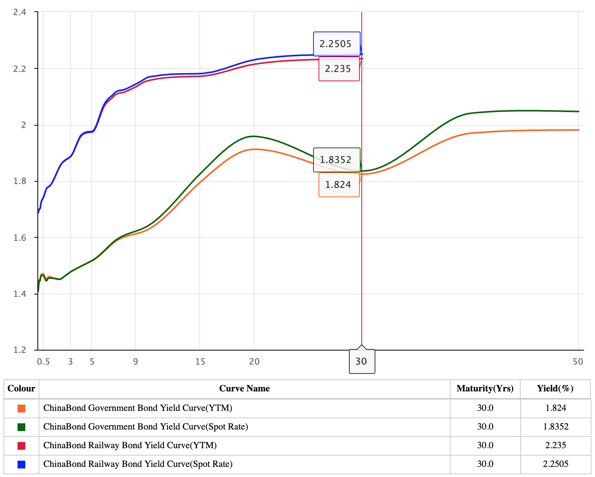
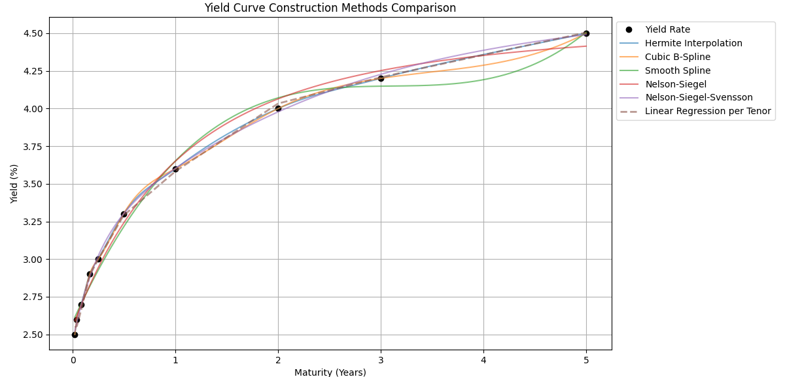
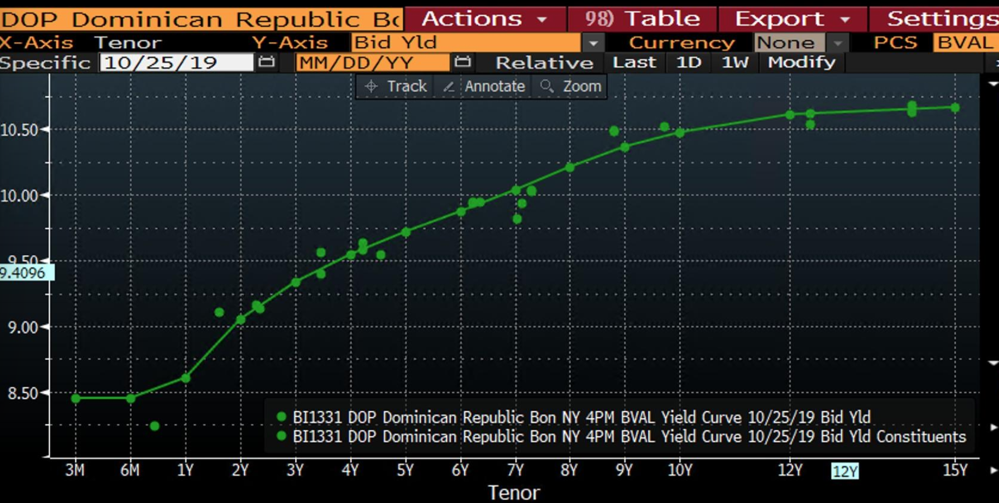
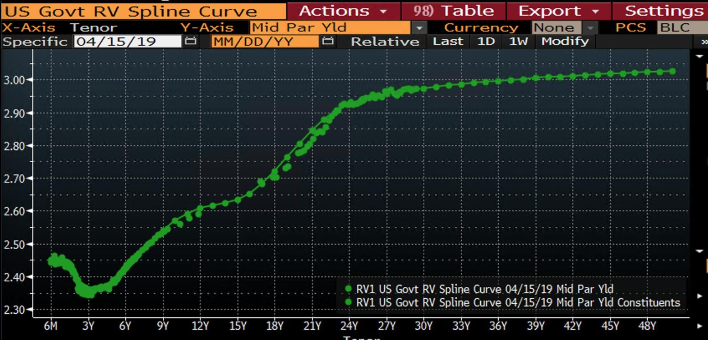
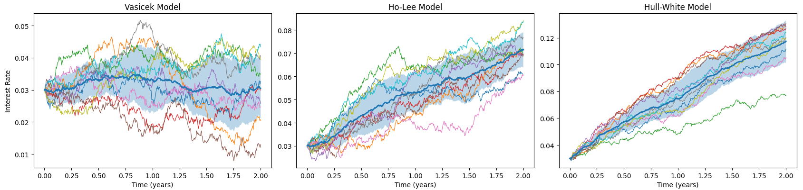

# bond Yield Modeling

## The Three Yield Curves

### Definition of The Three Yield Curves

#### Yield to Maturity (YTM) Curve (到期收益率曲线)

Yield to maturity (YTM) is the rate when bond is purchased on the secondary market, expected annualized return rate.

$$
\text{BondPrice}=\sum^n_{t=1}\frac{\text{CouponRate}}{(1+r)^t}+\frac{\text{FaceValue}}{(1+r)^n}
$$

For example, a two-year maturity, 6% coupon rate bond with a face value of 100 priced at 98 on the market, there is

$$
98=\frac{6}{1+r}+\frac{106}{(1+r)^2}, \qquad r\approx 7\%
$$

##### YTM Initial State Equivalent

At the time it is purchased, a bond's yield to maturity (YTM) and its coupon rate are the same.

#### Spot Rate Curve (即期收益率曲线)

Computed rate for zero coupon bond.

$$
PV=\frac{\text{FaceValue}}{(1+r_t)^t}
$$

For example, given that a zero-coupon bond is traded at 92.46, the equivalent yield rate can be computed as $92.46 \times (1+r)^2=100 \Rightarrow r\approx 4\%$.

For coupon payment bonds, it can be used to evaluate individual discounted cash flow to attest how time could affect the bond value.

For example, on market found same type bond spot rates of three different durations: 1y, 2y and 3y for $r_1=2\%,r_2=3\%,r_3=4\%$, discount each cash flow

$$
PV=\frac{5}{1.02^1}+\frac{5}{1.03^2}+\frac{105}{1.04^3}\approx 102.96
$$

#### Forward Rate Curve (远期收益率曲线)

Computed rate $f(t_1, t_2)$ for between future timestamps $t_1$ and $t_2$.

$$
\big(1+f(t_1, t_2)\big)^{t_2-t_1}=
\frac{\big(1+r(t_2)\big)^{t_2}}{\big(1+r(t_1)\big)^{t_1}}
$$

For example, again a two-year maturity bond of 100 face value is priced at 92.46 when issued.
Given that $92.46 \times (1+r)^2=100 \Rightarrow r\approx 4\%$, and trader found that the one year spot rate of this bond on the market is 3%, the forward rate is

$$
(1+0.04)^2 = (1+0.03)\times(1+r), \qquad r\approx 5\%
$$

##### Continuous Forward Rate Between Any Range

Given forward rate $\big(1+f(t_1, t_2)\big)^{t_2-t_1}=\frac{\big(1+r(t_2)\big)^{t_2}}{\big(1+r(t_1)\big)^{t_1}}$,
in continuous compound rate scenario, there is $e^{(t_2-t_1)f(t_1,t_2)}=\frac{e^{t_2 r(t_2)}}{e^{t_1 r(t_1)}}$, hence there is a simple linear formula:

$$
\begin{align*}
    && e^{(t_2-t_1)f(t_1,t_2)} &=\frac{e^{t_2 r(t_2)}}{e^{t_1 r(t_1)}} \\
    \Rightarrow && e^{(t_2-t_1)f(t_1,t_2)}&=e^{t_2 r(t_2)-t_1 r(t_1)} \\
    \text{take log } \Rightarrow && (t_2-t_1)f(t_1,t_2) &=t_2 r(t_2)-t_1 r(t_1) \\
    \Rightarrow && f(t_1,t_2) &=\frac{t_2 r(t_2)-t_1 r(t_1)}{t_2-t_1}
\end{align*}
$$

P.S., continuous form from discrete is given from an interest rate $r$ assumed the payment number $n$,
that $r/n$ means the interest is paid in $n$ times each time payment is $r/n$,
there is $\lim_{n\rightarrow\infty}(1+\frac{r}{n})^{nt}=e^{rt}$

### Relationship of Spot Rate vs Forward Rate

Instantaneous forward rate $f(t)$ can be defined as forward rate at the moment $t$.

$$
f(t)=\lim_{\Delta t \rightarrow 0} \frac{f(t, t+\Delta t)}{\Delta t}
$$

Consider $t_2 r(t_2)-t_1 r(t_1)=\int^{t_2}_{t_1} f(t)dt$,
then at the $t$ moment, the forward rate can be expressed as $r(t)t=\int^t_0 f(u)du$ which is the .

Continuous spot rate growth is

$$
\begin{align*}
    && e^{-r(t)t}&=\exp\Big(-\int^t_0 f(u)du \Big) \\
\text{and instantaneous spot rate is } && r(t) &=\frac{1}{t}\int^t_0 f(u)du
\end{align*}
$$

### Spot Rate vs YTM Rate in Bond Valuation

Since spot rate only accounts for zero-coupon bonds, it can be a good interpretation of "time" effect on bond valuation.

YTM is just a weighted average of the various spot rates applied to each cash flow.

#### Real Example China Bond Spot Rate vs YTM Rate

On 2025 May 5, China bond market observes below rate curves.

      

 

In the plot there are two types of bonds: a China corp bond and govt bond, and the corp bond sees higher yield rate than the govt's.

In early maturity days, YTM and spot rate almost overlap,
as market considers likely there is no recent black swan event and the bond will generate cash flow.

Also noticed that at the 30-year maturity point, the YTM and spot rate curves converge.
This is a result of 30 year usually picked up as a control point where market agrees as a unified yield.

##### Why YTM is below spot rate

In summary, upward-sloping spot curves make coupon bond yields (YTM) lower than the final spot rate.
Usually investors consider earlier cash flows are relatively more valuable now (long-term duration yields are distrust as investors expect inflation rise).

The heavy weighting of early coupons at lower spot rates depresses the overall YTM below the 30-year spot.

#### Calculation Example of Spot Rate vs YTM Rate, and Arbitrage-Free Price

Find YTM rate and spot rate of a 3-year 5% coupon face value \$1000 bond now traded at \$978.12.
On market observe that, benchmark (same risk and liquidity, e.g., same company issued bonds) one year annual pay bond at 5.0%, two year benchmark at 5.1% and three year benchmark at 5.5%.

##### For this bond YTM rate

$$
978.12=\frac{50}{1+r}+\frac{50}{(1+r)^2}+\frac{1050}{(1+r)^3},\qquad
\Rightarrow r\approx 5.816\%
$$

Regarding the market benchmark (under the same default and liquidity risk, the overall similar bond yield), it can say that

1. benchmark one year annual pay bond's YTM rate is 5%
2. benchmark two year annual pay bond's YTM rate is 5.1%
3. benchmark three year annual pay bond's YTM rate is 5.5%

##### For spot rate

Derive each year rate by bootstrapping:

1. For the 1st year: $r_1=5\%$
2. For the 2nd year: $\frac{5.1}{1.051}+\frac{105.1}{1.051^2}=\frac{5.1}{1.05}+\frac{105.1}{(1+r_2)^2}$, derive $r_2\approx 5.102\%$
3. For the 3rd year: $\frac{5.5}{1.055}+\frac{5.5}{1.055^2}+\frac{105.5}{1.055^3}=\frac{5.5}{1.05}+\frac{5.5}{1.05102^2}+\frac{105.5}{(1+r_3)^3}$, derive $r_3\approx 5.524\%$

##### For arbitrage-free price

$$
PV=\frac{5}{1.05}+\frac{5}{1.05102^2}+\frac{105}{1.05524^3}=986.46
$$

For the bond is priced at $978.12<986.46$, it can be said that the bond is underpriced.

##### Analysis on Spot Rate vs YTM Rate

YTM rate shows that coupon reinvestment at 5.816% yield (reinvestment yield is identical to YTM) is higher than spot rate between 5.0% - 5.524%.
This might be an indicator of default or liquidity risk.

Spot rate shows pure market's concern of the "time" effect on the bond.
The difference between benchmark YTM rate at 5.5% vs bond spot rate 5.524% is traced from market benchmark cash flow by market YTM vs by individual bond spot rates.

Put another way, YTM is just a weighted average of the various spot rates applied to each cash flow

## Long-Term Rate Formulation

Commonly, there are three categories of curve fitting methods given some spot rates (at fixed durations, e.g., 1y, 3y 5y, 10y) to interpolate rates in between to form a continuous yield curve.

|Method|Characteristics|Use Scenarios|
|-|-|-|
|Bootstrap|Recursively output next predicate based on previous one|Data has fixed discrete tenors to interpolate missing tenors|
|Parametric, e.g., Nelson-Siegel|Parameters have strong economic semantics|Typical use for data with semi-monotonic trends, and data points have different density levels in different ranges|
|Spline|Simply do curve fitting, flexible, but lack economic explanation|If data scatter patterns are likely contained sharp turning corners, while curve smoothness needs to preserve|

Given a set of spot rates, the interpolated curves are shown as below.

      

 

### Example Use Cases

#### Indication of Low Liquidity

Dominican Republic govt bonds have low liquidity hence parametric method is used for curve interpolation.
The large deviation is a sign of low liquidity.

      

 

#### Multi-Extreme Points of Spline

Rate distribution at diff timestamp could fluctuate by a lot, and spline can give a curve shape even if it is NOT monotonic.

Also, notice in this figure that for US Govt bonds have high-liquidity, many of the time slots are filled with actual market observations.

      

 

### Interpolation In Detail

The below explanations are under the notations/assumptions:

* Let $t$ be the to-be interpolated x-axis points and $t_i$ be the existing points that map the y-axis control points $P_i=f(t_i)$.

#### Bootstrap

Given dirty prices of different maturity bond from the same issuer,
to plot the yield curve,
one can use bootstrap to recursively output next maturity spot rate.

Let $C$ be coupon payment and $F$ be face value.

1. Compute $r_1$ for 1 year maturity spot rate

$$
\text{dirtyPrice}_1=\frac{C}{(1+r_1)}+\frac{F}{(1+r_1)}
$$

2. Having obtained $r_1$, then compute $r_2$ for 2 year maturity spot rate

$$
\text{dirtyPrice}_2=\frac{C}{(1+r_1)}+\frac{C+F}{(1+r_2)^2}
$$

3. Having obtained $r_2$, then compute $r_3$ for 3 year maturity spot rate

$$
\text{dirtyPrice}_3=\frac{C}{(1+r_1)}+\frac{C}{(1+r_2)^2}+\frac{C+F}{(1+r_3)^3}
$$

#### Hermite Interpolation

$H(t)$ is a polynomial that satisfies $H(t_i)=f(t_i)$ and $\frac{d}{d t_i}H(t_i)=\frac{d}{d t_i}f(t_i)$.
Let $t=\frac{t-t_i}{t_{i+1}-t_i}$ be a normalized local variable ($0<t<1$) between $(t_i, t_{i+1})$.

$$
H(t)=h_{00}(t)\cdot f(t_{i}) + h_{01}(t)\cdot f(t_{i+1}) + h_{10}(t)\cdot \frac{d}{d t_i}f(t_{i}) + h_{11}(t)\cdot \frac{d}{d t_{i+1}}f(t_{i+1})
$$

where

$$
\begin{align*}
    h_{00}(t)&=2t^3-3t^2+1 \\
    h_{01}(t)&=-2t^3+3t^2 \\
    h_{10}(t)&=t^3-2t^2+t \\
    h_{11}(t)&=t^3-t^2 \\
\end{align*}
$$

$H(t_{i+1})=f(t_i)$ mandates that the fitting curve must pass through the control points $P_i=f(t_i)$.

The gradient computation $\frac{d}{d t_i}H(t_i)=\frac{d}{d t_i}f(t_i)$ is at the discretion of user.
A common two-step differential method is (used by `numpy.gradient`)

$$
\nabla f_i=\begin{cases}
    \frac{f_{i+1}-f_i}{h} &\qquad i=0 \\
    \frac{f_{i}-f_{i-1}}{h} &\qquad i=n-1 \\
    \frac{f_{i+1}-f_{i-1}}{2h} &\qquad \text{otherwise} \\
\end{cases}
$$

where $h$ is the step span.

#### Fisher-Nychka-Zervos Cubic B-Spline (3B)

Given four control points $P_i,P_{i+1},P_{i+2},P_{i+3}$

$$
S(t)=\sum^n_{i=0} P_i \cdot N_{i,3}(t)
$$

where

$$
N_{i,k}(t) = \frac{x - t_i}{t_{i+k} - t_i} N_{i,k-1}(t) + \frac{t_{i+k+1} - x}{t_{i+k+1} - t_{i+1}} N_{i+1,k-1}(t), \qquad k=3
$$

In detail for $k=3$,

$$
\begin{align*}
N_{i-3,3}(t)&=\frac{1}{6}(1-t)^3 \\
N_{i-2,3}(t)&=\frac{1}{6}(3t^3+6t^2+1) \\
N_{i-1,3}(t)&=\frac{1}{6}(-3t^3+3t^2+3t+1) \\
N_{i,3}(t)&=\frac{1}{6}t^3 \\
\end{align*}
$$

#### Smooth Spline

Define *natural cubic spline*:

$$
f_i(t)=a_i+b_i(t-t_i)+c_i(t-t_i)^2+d_i(t-t_i)^3
$$

$$
\text{subject to }\qquad \frac{d^2}{dt^2}f_i(t_0)=\frac{d^2}{dt^2}f_i(t_n)=0
$$

that the constraint makes sure the second derivative is zero for the first and end control points.

Add $\lambda$ as smooth control hyper-parameter.

Optimize $f$ by

$$
\min_{f}\quad \underbrace{\sum^n_{i=1}\big(P_i-f(t_i)\big)^2}_{\text{deviation penalty}} +
\lambda \underbrace{\int\Big(\frac{d^2}{dx^2}f_i(t_n)\Big)^2 dx}_{\text{sharp penalty}}
$$

where the $\text{deviation penalty}$ encourages the trained $f(t)$ to be as much close as possible to the control point $P_i$ when passing through $f(t_i)$.
The $\text{sharp penalty}$ encourages smooth transition as the function $f(t)$ curves (penalize large 2nd order derivatives).

#### Nelson-Siegel (NS) and Nelson-Siegel-Svensson (NSS)

Assume instantaneous forward rate at a future moment is

$$
f(t)=\beta_0+\beta_1 e^{-t/\tau_1}+ \beta_2\frac{t}{\tau_1} e^{-t/\tau_1}
$$

where

* $\beta_0$ represents long-term convergence rate, encapsulated the overall market expectation for economy.
* $\beta_1$ represents short-term fluctuation how much it deviates from $\beta_0$; when $\tau_1\rightarrow 0$, forward rate collapses to $\beta_0+\beta_1$
* $\beta_2$ is used to control curvature that reaches its max when $t=\tau_1$
* $\tau_1$ is a mid-term factor, larger the value, the longer the mid-term impact lasting; some academics write $\lambda_1=1/\tau_1$ as a wavelength form

Integrate instantaneous rate $f(t)$, the result is

$$
\begin{align*}
    && r(t)&=\beta_0+(\beta_1+\beta_2)\frac{\tau_1}{t} (1-e^{-t/\tau_1})-
    \beta_2 e^{-t/\tau_1} \\
    \text{or}\quad &&
    &=\beta_0+\beta_1\Big(\frac{1-e^{\lambda_1 t}}{\lambda_1 t}\Big)+\beta_2\Big(\frac{1-e^{\lambda_1 t}}{\lambda_1 t}-e^{-\lambda_1 t}\Big)
\end{align*}
$$

Svensson in 1994 added a new set of parameters:

$$
r(t)=\beta_0+\beta_1\Big(\frac{1-e^{\lambda_1 t}}{\lambda_1 t}\Big)+\beta_2\Big(\frac{1-e^{\lambda_1 t}}{\lambda_1 t}-e^{-\lambda_1 t}\Big)+\beta_3\Big(\frac{1-e^{\lambda_2 t}}{\lambda_2 t}-e^{-\lambda_2 t}\Big)
$$

||NS|NSS|
|-|-|-|
|Parameters|$\beta_0,\beta_1,\beta_2,\lambda_1$|$\beta_0,\beta_1,\beta_2,\beta_3,\lambda_1,\lambda_2$|
|Curve shape|Max single peak|Max multiple Peaks|

## Short Rate (短期利率) Formulation

Short rate is used to estimate short-term price fluctuation.

      

 

### Visicek Model

The dynamics of short rate can be formulated as an Ornstein-Uhlenbeck (OU) process.

$$
d r_t=\theta(\mu-r_t)dt+\sigma dW_t
$$

where

* $W_t$ is Brownian motion
* $\sigma$ is a diffusion term
* $\mu$ is a drift term
* $\theta$ is the convergence speed $r_t$ approaches to $\mu$ as time goes by

The analytic solution is (integrate over time range $[0,t]$)

$$
r_t=\mu \big(1-e^{-\theta t}\big)+r_{0}e^{-\theta t}+
\sigma\int^{t}_{0}\big(e^{-\theta (t-u)}\big)dW_u
$$

### Ho-Lee Model

Ho-Lee model considers using $\theta_t=\frac{\partial f(0,t)}{\partial t}+\sigma^2 t$ as time-dependent drift.

$$
d r_t=\theta_t dt+\sigma dW_t
$$

where

* $W_t$ is Brownian motion
* $\sigma$ is a diffusion term
* $\theta_t=\frac{\partial f(0,t)}{\partial t}+\sigma^2 t$ is a function of $t$ to align with spot rate on the market, where $f(0,t)$ is the forward rate at the initial state

#### Deduction of $\theta_t$ by No Arbitrage Condition

This expression $\theta_t=\frac{\partial f(0,t)}{\partial t}+\sigma^2 t$ states that the drift term is determined by forward rate and fluctuation $\sigma^2 T$.
$f(0,t)$ is the forward rate at the initial state.

$$
\begin{align*}
\int_0^T r_u du &=
\int_0^T r_0 du + \int_0^T\int_0^t \theta_u du dt + \sigma\int_0^T\int_0^t dW_u dt \\
&= r_0 T + \int_0^T\int_0^t \theta_u du dt + \underbrace{\sigma\int_0^T (T-u) dt}_{\sim N(0, \sigma^2\int_0^T(T-u)^2 du)}
\end{align*}
$$

where $\sigma^2\int_0^T(T-u)^2 du=\frac{\sigma^2}{3}T^3$.

The valuation of a bond till $T$ maturity can be written as $P(0,T)=E\left[e^{-\int_0^T r_t dt}\right]$,
$\theta_t$ can be deduced as such

$$
\begin{align*}
&& P(0,T)&=E\left[e^{-\int_0^T r_t dt}\right] \\
&& &=\exp\bigg(E\left[-\int_0^T r_u du\right]+\frac{1}{2}Var\left[-\int_0^T r_u du\right]\bigg) \\
&& &= \exp\bigg(-r_0 T - \int_0^T\int_0^t \theta_u du dt + \frac{\sigma^2}{6}T^3\bigg) \\
\Rightarrow && \int_0^T\int_0^t \theta_u du dt &= \ln P(0,T)-r_0 T + \frac{\sigma^2}{6}T^3 \\
\Rightarrow && \int_0^T \theta_u du &= \frac{\partial}{\partial T}\bigg(\ln P(0,T)-r_0 T + \frac{\sigma^2}{6}T^3\bigg) \\
&& &= \frac{\partial}{\partial T}\bigg(\ln P(0,T)\bigg)-r_0 + \frac{\sigma^2}{2}T^2 \\
&& &= f(0,T)-r_0 + \frac{\sigma^2}{2}T^2 \\
\Rightarrow && \theta_T &=\frac{\partial}{\partial T}\bigg(f(0,T)-r_0 + \frac{\sigma^2}{2}T^2\bigg) \\
&& &=\frac{\partial f(0,T)}{\partial T}+\sigma^2 T
\end{align*}
$$

### Hull-White Model

Different from Ho-Lee model, Hull-White model added regression to mean value.

$$
dr_t = (\theta_t - a r_t) dt + \sigma dW_t
$$

where

* $W_t$ is Brownian motion
* $\sigma$ is a diffusion term
* $\theta$ is a function of $t$ to align with spot rate on the market
* $a$ mean value convergence speed to long-term rate

The analytic solution is (integrate over time range $[0,t]$)

$$
r_t=r_0 e^{-at}+
\int^{t}_{0}e^{-a (t-u)}\theta_u du+
\sigma\int^{t}_{0}\big(e^{-a (t-u)}\big)dW_u
$$
