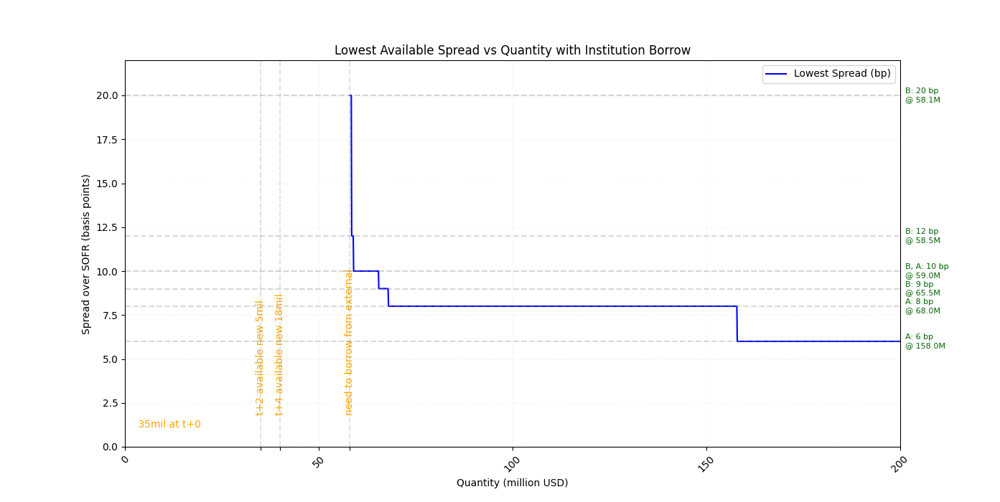

# Repurchase Agreement (REPO) Practices

* **Face Value, and Dirty Price vs Clean Price**

The Clean Price is the Mark-To-Market (MTM) price of the bond excluding any accrued interest.

The Dirty Price is the total price that the buyer pays: $\text{DirtyPrice}=\text{CleanPrice}+\text{AccruedInterest}$

$$
\text{AccruedInterest}=
\frac{\text{CouponPayment}\times\text{DaysSinceLastCouponPayment}}{\text{DaysInCouponPeriod}}
$$

For example, spotted a bond and a trader wants to buy this bond
-> Face Value: $\$1,000$ (i.e., issuer declared price at $\$1,000$ per $1,000$ units)
-> Annual Coupon Rate: $5\%$
-> Coupon Payment Frequency: Semi-annual (i.e., $180$ days per payment)
-> Clean Price: $\$980$ (i.e., Mark-To-Market (MTM) bond price excluded accrued interest)
-> Days Since Last Coupon Payment: $60$ days

To buy this bond, a trader needs to pay

$$
\text{DirtyPrice}=
980+\frac{1}{2}(5\% \times 1,000) \times \frac{60}{180}=988.33
$$

Face value explained: why clean price is lower than face value ?
Clean price should be equal to face value (bond issuer declared price) if market/economy/bond issuer are totally stable, but this scenario is too much of ideal.

For example, below factors affect clean price
-> Credit Quality of Issuer: If the creditworthiness of the bond issuer has deteriorated, the perceived risk of the bond increases.
-> Time to Maturity: As a bond approaches its maturity date, its price tends to move towards its face value.
-> Economy: If high-risk securities such as stocks are experiencing a black swan event, investors would sell-off stocks and bulk-buy bonds as a hedging solution; bond clean price rises as a consequence.

* **Initial margin (Haircut)**

Initial margin is the excess of cash over securities or securities over cash in a repo or securities at the market price when lending a transaction.

Haircut serves as a discount factor to reflect risk aversion consideration of the bond price fluctuations during the lent period. Hence, the actual lent money is slightly lower than the bond market value.

|Haircut method|Haircut formula|
|-|-|
|Divide|$\text{Haircut}=100\times \frac{\text{CollateralMktValue}}{\text{CashLent}}$|
|Multiply|$\text{Haircut}=100\times \frac{\text{CashLent}}{\text{CollateralMktValue}}$|

* **Repo vs Sell/Buy Back**

||Repo|Sell/Buy Back|
|-|-|-|
|title transfer|No title transfer, hence repo is often priced with dirty price that has included coupon accrued interests|Included title transfer|
|coupon yield ownership|Coupon yield belongs to seller as no coupon title transfer|Coupon yield belongs to buyer as coupon title is transferred to buyer|
|profit formula (assumed naive* linear accrual)|$\text{Profit}=\text{StartCash}\times\text{RepoRate}$|$\text{Profit}=\text{StartCash}\times(\text{RepoRate}-\text{CouponRate})$|

where "naive*" means $\text{RepoRate}$ and $\text{CouponRate}$ are assumed constant, in fact they may link to various benchmarks or at trader's discretion.
A real-world example see below *A REPO Trade End Cash Estimation Example*.

## REPO Rate Estimation

A trader earns profits from a REPO trade via *level* (a.k.a, REPO rate), which is the lending interest rate of a security.
Some traders may use *fee* but it is converted to $\text{level}=\frac{\text{fee}}{\text{lentCash}}$ as the benchmark for analysis.

### Naive Lending Interest Rate Estimation

The most accurate and easiest REPO rate estimation is to use the most recent (spot rate) same security dealing price and REPO rate.
The market reference price and rate are accurate unless market observed high volatility, e.g., black swan events.

The validity of last price/repo rate can be measured by benchmark fluctuation.
For example, if SOFR stayed within $\sigma^2<100 \text{ bp}$ over the last few days (had just fluctuated within 10 bp),
it can be said that the monetary market was stable and the last traded repo rate of a bond still holds.

If market price/rate reference is not available, the below formula can be used.

#### Floating REPO Rate

Floating rate refers to using a currency benchmark + spread (as profit) for REPO rate quote.
The benchmarks are often the interbank overnight rate per currency.

$$
\text{level}=\text{BenchmarkRate}+\text{spread}
$$

Popular currency benchmarks are

* EUR -> ESTER
* USD -> SOFR
* GBP -> SONIA
* CAD -> CORRA

#### Risk-Based REPO Rate Setup

A trader can reference below factors and give a conclusive REPO rate quote.

* Underlying security: whether it is corp ro govt bond, what are institutional ratings, e.g., Moody.
* FX risk
* Counterparty risk
* Macro economic conditions and movements, e.g., black swan event that drive hot money to bond markets

### Available Inventory for Lending

If in inventory there exists adequate inventory the above REPO rate formula can be used.
However, if client asks (borrowing securities) for more quantity than internal inventory (trader compony provision),
the trader can only suffice partial fill.

This trader will need to ask external inventory to borrow the client requested securities and re-lend to the client.
Under this external request scenario, there incurs extra borrow cost.

$$
\text{level}=\text{outboundLendingREPORate}+\text{inboundBorrowCostRate}
$$

#### Multi-Source Financing Quotes

External inventory refers to external financial institutions that have large and diverse security inventory.

External inventory financial institutions often would sign a prime financing agreement (a contract defined discount/low borrowing rate for long-term strategic financing partnership) with the trader affiliated company,
thereby this trader can borrow the security with low cost and re-lend the security to (usually small size) clients, while he/she can still make profit.

For example, trader's institution has signed prime borrowing/lending rate agreements with below large institutions.

|Institution|Prime Rate (bp)|Quantity (mil)|
|-|-|-|
|Institution A|SOFR+10|1-10|
|Institution A|SOFR+8|10-100|
|Institution A|SOFR+6|100+|
|Institution B|SOFR+20|0.1-0.5|
|Institution B|SOFR+12|0.5-1|
|Institution B|SOFR+10|1-7.5|
|Institution B|SOFR+9|7.5-20|
|Institution B|SOFR+8.5|20-110|
|Institution B|SOFR+6|110+|

The $\text{inboundBorrowCostRate}$ is exactly the prime rate.

There are other concerns such as if a bond is used as rehype, it is less preferential as others that the trader's institution has long-term ownership.

#### Multi-Settlement Date Inventory for Financing

In business practice when a client asks for financing, he/she does not necessarily need today settlement ($t+1$),
and for in large financial institutions everyday there are thousands of REPO trades mature and securities are returned available in internal inventory,
One can do dynamic programming to find the optimal $\text{inboundBorrowCostRate}$.

For example, assume a client can on agree any of the 6 available settlement days $t,t+1,t+2,t+3,t+4,t+7$ to borrow 100mil units of a security.
For the security to be borrowed by client, there are 2 related REPO trades soon matured: 5mil in 2 days, 18mil in 4 days.
At today spot the available internal inventory is 35mil.

Take into account the above institution A and institution B offers, by dynamic programming, there is this optimal combination.

    

 

### The Four Factors of REPO Rate Pricing

* Counterparty client credit
* Traded Currency and ISIN
* Auto-rolling from a previous trade
* Margin and volatility
* Benchmark (e.g., ester, sofr, libor) volatility

## A REPO Trade End Cash Estimation Example

There is a REPO trade:

* Booked on 30-Jun-2024 (lent money out, received pledged security), first leg, bought $70,000,000$ units
* Expected second/end leg ended on 31-Aug-2025
* The pledged underlying security is a bond with ACT/360 and coupon rate $6.07\%$
* The REPO rate is bound to SOFR + 60 bp
* The start (dirty) price of bond is $100.94$
* The haircut is $10\%$

Business Explained:

* The rate bound to SOFR + 60 bp means that, SOFR is the U.S. interbank rate that can be regarded as risk-free cash cost, and the added 60 bp is the profit
* The haircut of $10\%$ means the value of the underlying security is discounted to $\times 90\%$ as the start cash lent to cash borrower; the discount of $10\%$ is risk margin in case the security value fluctuates
* The coupon rate of $6.07\%$ does NOT go into calculation for REPO rate does not see title transfer, coupon yield not transferred

Assume today is 15-Jul-2024, to compute end cash:

* Start Cash: $63,592,200 = 100.94 \times 70000000/100 \times 0.9$
* Compute REPO rate till today by SOFR (from 01-Jul-2024 to 15-Jul-2024), a total of 14 days since trade start date

|Date|SOFR (%)|SOFR (decimal)|
|-|-|-|
|01-Jul-2024|5.4|0.054|
|02-Jul-2024|5.35|0.0535|
|03-Jul-2024|5.33|0.0533|
|05-Jul-2024|5.32|0.0532|
|08-Jul-2024|5.32|0.0532|
|09-Jul-2024|5.34|0.0534|
|10-Jul-2024|5.34|0.0534|
|11-Jul-2024|5.34|0.0534|
|12-Jul-2024|5.34|0.0534|
|15-Jul-2024|5.34|0.0534|

By 360-day basis, compound rate is

$$
\begin{align*}
\text{TodayCompoundRate}_{14} &=1.0023116439864934 \\
&= \underbrace{\big(1+(0.054+0.006)/360\big)}_{\text{01-Jul-2024}} \times \underbrace{\big(1+(0.0535+0.006)/360\big)}_{\text{02-Jul-2024}} \times \underbrace{\big(1+(0.0533+0.006)/360\big)^{2}}_{\text{03-Jul-2024 to 04-Jul-2024}} \\
&\qquad \times \underbrace{\big(1+(0.0532+0.006)/360\big)^4}_{\text{05-Jul-2024 to 08-Jul-2024}} \times \underbrace{\big(1+(0.0534+0.006)/360\big)^6}_{\text{09-Jul-2024 to 14-Jul-2024}}
\end{align*}
$$

Alternatively, if by linear rate, there is

$$
\begin{align*}
\text{TodayLinearRate}_{14} &=1.0023091666666668 \\
&= 1+ \underbrace{\big((0.054+0.006)/360\big)}_{\text{01-Jul-2024}} + \underbrace{\big((0.0535+0.006)/360\big)}_{\text{02-Jul-2024}} + \underbrace{\big((0.0533+0.006)/360 \times 2\big)}_{\text{03-Jul-2024 to 04-Jul-2024}} \\
&\qquad + \underbrace{\big((0.0532+0.006)/360 \times 4 \big)}_{\text{05-Jul-2024 to 08-Jul-2024}} + \underbrace{\big((0.0534+0.006)/360 \times 6\big)}_{\text{09-Jul-2024 to 14-Jul-2024}}
\end{align*}
$$

* Use 5.34 for the all remaining days (the inferred SOFR rate can be derived using complex extrapolation methods as well, here used end static 5.34 for future date rate extrapolation). There are 412 days between 15-Jul-2024 and 31-Aug-2025.

$$
\begin{align*}
\text{CompoundRate}_{14+412} =& 1.0728121393687096 \\
=& 1.0023116439864934 \times (1+(0.0534+0.006)/360)^{412} \\
\text{LinearRate}_{14+412} =& 1.0702891666666667 \\
=& 1.0023091666666668 + ((0.0534+0.006)/360 \times 412)
\end{align*}
$$

* Final estimated end cash

$$
\begin{align*}
\text{EndCash}_{\text{CompoundRate}} =& 68222484.12916285 \\
=& \text{StartCash} \times \text{CompoundRate}_{14+412} \\
=& 63592200 \times 1.0728121393687096 \\
\text{EndCash}_{\text{LinearRate}} =& 68062042.74450001 \\
=& \text{StartCash} \times \text{LinearRate}_{14+412} \\
=& 63592200 \times 1.0702891666666667
\end{align*}
$$

* Also, the annualized rate is

$$
\begin{align*}
\text{CompoundRate}_{360} =& 1.0611935517009894 \\
=& \text{CompoundRate}_{14+346} \\
=& 1.0023116439864934 \times (1+(0.0534+0.006)/360)^{346} \\
\text{LinearRate}_{360} =& 1.059399295774647906 \\
=& 1 + (\text{LinearRate}_{14+412}-1) \times 360 / (14+412) \\
\end{align*}
$$

## Benchmark: Interbank Rates

* Overnight (ON) Rate

Overnight rate is generally the interest rate that large banks use to borrow and lend from one another in the overnight market.

Implications:
Overnight rates are a measure of the liquidity prevailing in the economy. In tight liquidity conditions, overnight rates shoot up.
Central banks can stipulate overnight rate to control money supply.

There are many indecies/references of Overnight rates: LIBOR, EONIA, SOFR, SONIA, etc.

* LIBOR

The London Inter-Bank Offered Rate (LIBOR) is an interest-rate average calculated from estimates submitted by the leading banks in London.

* EONIA

Eonia (Euro Overnight Index Average) is computed as a weighted average of all overnight unsecured lending transactions in the interbank market, undertaken in the European Union and European Free Trade Association (EFTA) countries by the Panel Banks

* Secured Overnight Financing Rate (SOFR)

SOFR is published by the New York Federal Reserve every business day for the previous business day. 
SOFR is a reference rate (that is, a rate used by parties in commercial contracts that is outside their direct control) established as an alternative to LIBOR.

LIBOR is prone to error since it derives from calculations based on banks' survey, while SOFR reflects the real-time real world rates.

* Hong Kong Interbank Offered Rate (HIBOR)

the Hong Kong Interbank Offered Rate (HIBOR) is the benchmark interest rate that lenders and borrowers use for interbank lending in the Hong Kong market.

* China/Shanghai Interbank Interest Rate (Shibor)

Offered by (China/Shanghai) National Interbank Funding Center ((Shibor)).

* SONIA (Sterling Overnight Index Average)

SONIA is based on actual transactions and reflects the average of the interest rates that banks pay to borrow sterling overnight from other financial institutions and other institutional investors.

It is administered by Bank of England.

### Detailed Explanation of SHIBOR

1. The calculation of the SHIBOR rate involves a collaborative effort among 18 commercial banks, each playing a crucial role in determining this key benchmark.
    * ICBC
    * Agricultural Bank of China
    * Bank of China, China Construction Bank
    * Bank of Communications
    * China Merchants Bank
    * CITIC Bank Corporation
    * China Everbright Bank
    * Industrial Bank
    * Shanghai Pudong Development
    * Bank of Beijing
    * Bank of Shanghai
    * HSBC Bank
    * Hua Xia Bank
    * China Guangfa Bank
    * Postal Savings Bank of China
    * China Development Bank
    * China Minsheng Banking
2. The four highest and four lowest offered rates from the contributing banks are excluded from the list.
Subsequently, the remaining rates, now comprising 10 values, are subjected to a straightforward mathematical average.
3. The China Foreign Exchange Trade System (CFETS) publishes Shibor rates.

### The Underlying Motivation of Interbank Rates

Interbank rates are concluded by market: volume-weighted median of billions of dollars in actual Repo transactions.
Unless in a financial crisis, monetary policy has great impact on interbank rates.

Take SOFR, FFR and US Treasury as example.

* Federal Funds Rate (FFR)

When a depository institution has surplus balances in its reserve account, it lends to other banks in need of larger balances.
The rate that the borrowing institution pays to the lending institution is determined between the two banks; the weighted average rate for all of these types of negotiations is called the effective federal funds rate.

The Federal Open Market Committee (FOMC) meets eight times a year to determine the federal funds target range. The Fed's primary tool for influencing the federal funds rate is the interest the Fed pays on the funds that banks hold as reserve balances at their Federal Reserve Bank, which is the **Interest on Reserves Balances (IORB)** rate.
Because banks are unlikely to lend funds in the federal funds market for less than they get paid in their reserve balance account at the Federal Reserve, the Interest on Reserve Balances (IORB) is an effective tool for guiding the federal funds rate.

* US Treasury

When the US Treasury **issues** new bonds (e.g., selling $50 billion of 10-Year Notes), investors must pay for them.
The Action: Investors withdraw cash from the banking system to pay the Treasury.
The Impact: Suddenly, there is less cash in the system.
SOFR Effect: Cash becomes scarce. In the Repo market (where SOFR is set), borrowers have to pay a higher rate to get cash. SOFR goes UP.

Bond issuance has impact on SOFR, but not how bonds are traded on the secondary market.
