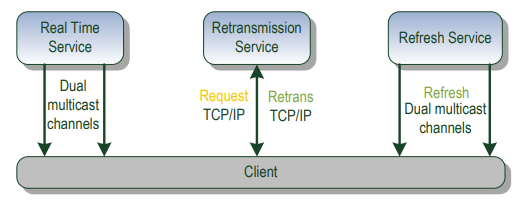
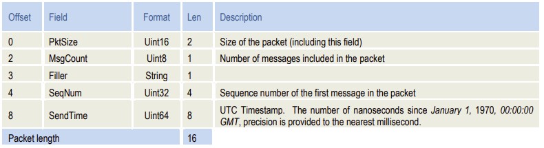
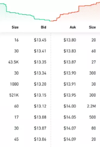
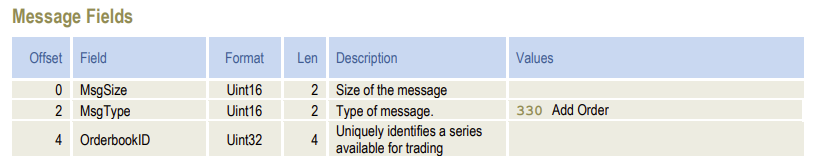
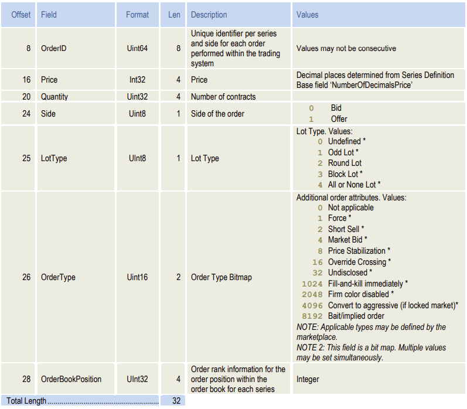
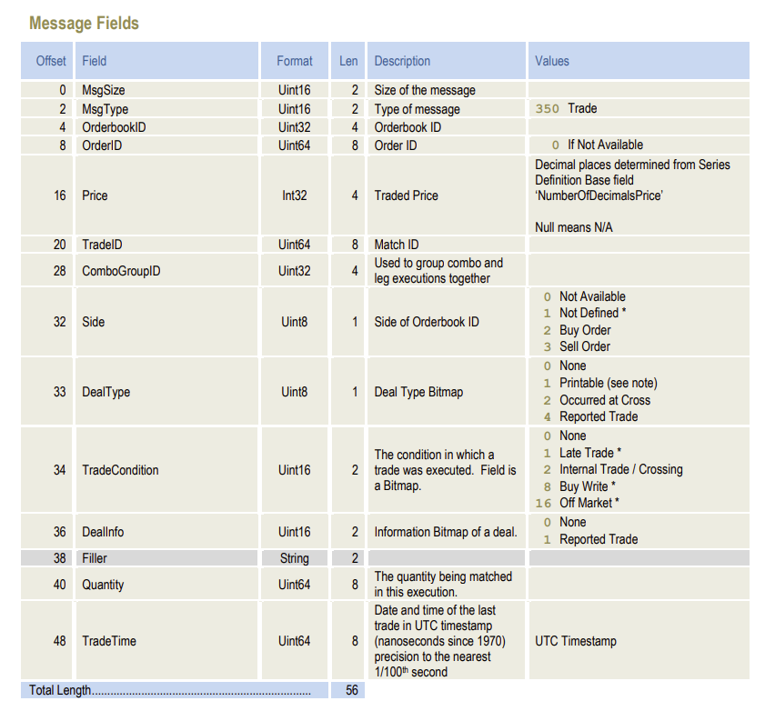
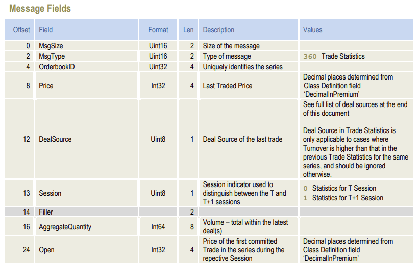
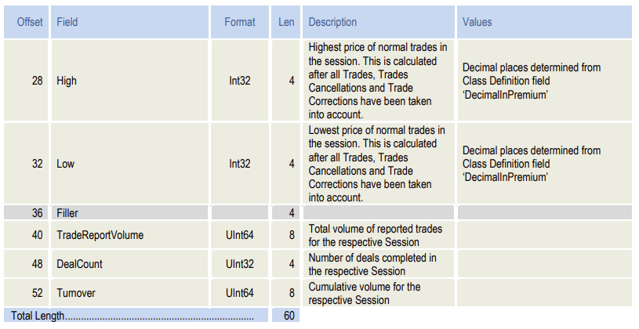
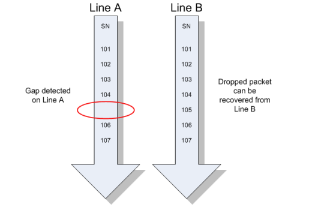

# HKEX Orion Market Data Platform for Derivatives (OMD-D)

Reference: https://www.hkex.com.hk/-/media/HKEX-Market/Services/Trading/Derivatives/Infrastructure/HKATS/MDD_Interface_Specifications.pdf?la=en

      

 

Orion Market Data (OMD) provides market data represented in an efficient binary message format for all instruments traded on the Derivatives Market.

* Dual Multicast Channels

Messages are published in a one-to-many fashion using the IP multicast and UDP transport protocols.

Messages are duplicated and sent over two separate multicast (UDP) channels.

* Recovery

Re-transmission happens via TCP/IP on request.

Snapshots of the market state are provided at regular intervals throughout the business day.

* Session

A session is limited to one business day. 
During this day the message sequence number is strictly increasing and therefore unique within the channel.

## Bond Trading Throughput Statistics

* Trading Hours: Morning 9:30 a.m. - 12:00 noon; Afternoon 1:00 p.m. - 4:00 p.m.

* In 2021, total new issuance of HKD bonds reached at around HK$4.3 trillion  (US$555.7 billion).

### One Typical HK Top Broker Business Throughput

* The number of daily bond tick prices (order book changes) reaches more than 10k, giving 1,800+ ticks per hour

* The number of daily bond deals/trades reaches more than 1k, giving 180+ trades per hour

* Nearly half of trades are settled in the opening/closing hour time, in particular, the peak hour trading duration of just 1 min, with some tail time extending to a few more mins, by which time market news can be consumed in trading.
So that, in one min, a system should be able to handle 5k+ ticks, giving 0.012 sec (12 ms) process time per tick.
To further narrow down the timing, most of the trades in peak hour are settled in the first few secs for the arrival of unexpected market news, giving nearly just 1 ms process time per tick.

## Data Structure

Multicast packets are structured into a common packet header followed by zero or more messages. Messages within a
packet are laid out sequentially.

|Packet Header|
|-|
|Message 1|
|Message 2|
|Message 3|
|...|

The maximum length of a packet is 1500 bytes which includes the multicast headers, packet header and messages.

All packets will begin with a common packet header as below.

      

 

### Order Book

An order book is the list of orders (manual or electronic) that a trading venue (in particular stock exchanges) uses to record the interest of buyers and sellers in a particular financial instrument. 
A matching engine uses the book to determine which orders can be fully or partially executed.

      

 

Aggregate Order Book Update (353) messages will be sent whenever there is a orderbook change within the top 5 price
levels.

Requesting for buy/sell a security is basically adding an order to the order book.

      

      

 

### Trade

The Trade message is generated each time a trade has been performed.

      

 

### Trade Stats

      

      

 

## UDP Gap Detection

Each packet provides the sequence number (SN) of the first message it contains. This sequence number starts at 1 and
increases with each subsequent message.

      

 

## Retransmission

The retransmission service is provided via the TCP/IP protocol and is designed to allow clients to recapture a small number of missed messages (identified by sequence number) already published on the real time channels.

Support the retransmission of the data covering the market activities for the last 15-30 seconds only.
For long outage scenarios, please download market snapshots. 

Clients must periodically send heartbeat signals to OMD server to maintain the TCP connection.