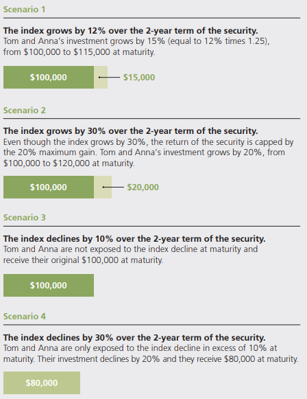
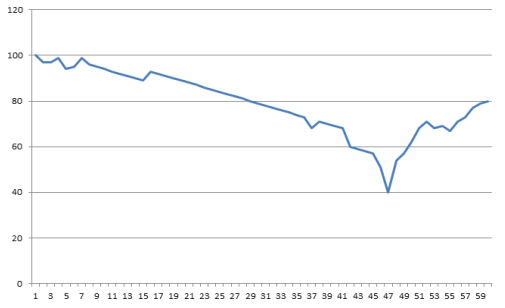

# Structured Products

Investments are designed to provide a return at set dates that are pre-determined with reference to the performance of one or more "underlying assets" and/or "referenced entities".

## Example and Intuition

For example, Tom and Anna decide to invest $100,000 in a Buffered Return Optimization Security linked to an international stock index.
This structured product is defined:

* 2-year maturity
* 1.25 times any positive return of the index at maturity up to a maximum gain of 20%
* No downside market exposure at maturity to the first 10% decline in the index, and downside exposure only to the extent the index decline exceeds 10%
* Any payment on the security, including any repayment of principal, is subject to the creditworthiness of the issuer

      

 

Intuition:

* If the underlying assets perform well -> make a higher profit than if
had invested directly in the assets themselves
* If the underlying assets perform slightly badly -> initial capital returned
* If the underlying assets perform extremly worst -> loss occured

## Prerequisite Knowledge - Options

### Call Option and Put Option

#### Call Option

A call option is an agreement that gives the option buyer the right, but not the obligation, to buy a financial instrument.

#### Put Option

This is the opposite of a call option.
It gives the option buyer the right, but not the obligation, to sell a financial instrument

### Barrier Options

Payoff depends on whether the underlying asset's price reaches or crosses a pre-determined "barrier" level during the option's life.

#### Knock-in Options

These options (Knock-in Options) only come into existence (become "active" or "live") if the underlying asset's price hits the barrier. Before that, they are effectively dormant.

* Down-and-in: Becomes active if the price falls to the barrier.
* Up-and-in: Becomes active if the price rises to the barrier.

#### Knock-out Options

These options (Knock-out Options) start active but cease to exist (become "worthless" or "knocked out") if the underlying asset's price hits the barrier.

* Down-and-out: Ceases to exist if the price falls to the barrier.
* Up-and-out: Ceases to exist if the price rises to the barrier.

#### Barrier Options in Structured Products

Structured product issuers often **embed a Down-and-In Put (DIP) option** that the investor effectively sells to the issuer.

* For a Down-and-Out Option (e.g., a Down-and-Out Call): Investors have a call option that will be knocked out (become worthless) if the underlying asset price drops below a certain barrier level.
* For a Down-and-In Option (e.g., a Down-and-In Put): Investors have a put option that only becomes active if the underlying asset price drops below a certain barrier level.

##### Knock-In Event

If the underlying asset's price touches or breaches this barrier (either continuously for an American-style barrier, or at maturity for a European-style barrier), the put option "knocks in" and becomes active.

##### Outcome if Knocked In

* If the put option is now active (knocked in) and, at maturity, the underlying asset is below the strike price of this put (which is often set at or near the initial level of the underlying), the investor will suffer a capital loss. They are essentially "put" the poorly performing asset (or its cash equivalent loss).
* The premium received from "selling" this DIP option helps the issuer fund other attractive features of the product, like higher coupons or participation rates.

#### European vs American Barrier

Typically these barriers can also vary, there are *European Style Option* and *American Style Option*.

Here compares European vs American Style Option by an example:
a reference asset used in structured product saw

* a starting level (Strike Price) of 100
* over a 60 month (5 year term) falls to 40 (60% drop from starting level)
* then recovers slightly to 80 (20% drop from starting level) on its final observation date.

      

 

* 50% European Barrier Scenario

The structured product is only measured on the start date (also known as the strike date or initial measurement period) at 100 and on the end date it is 80,
and the difference between the start and the end level is 20%, then this 50% European Barrier has not been breached.
Therefore the investor would receive all of their initial capital back

* 50% American Barrier Scenario

The structured product is measured on the start date (also known as the strike date or initial measurement period) and every business day throughout the term of the investment.
During the term the underlying fell 60%, which means the 50% American barrier was breached, and so the investor will lose 60% of their initial (notional) capital invested.

### In Structured Products, What Happens if the Reference Asset Value Drops Below a Threshold (Barrier)

## Prerequisite Knowledge - Glossary

* Autocall

If an investment meets the requirements of a product on a specified measurement date, it will "Autocall",
this is when it matures and the investor will receive a growth payment as defined by the conditions of the product, otherwise continue till maturity.

* Medium Term Note ("MTN")

A debt note that usually matures in 3–10 years

* Observation Date

These dates are points in time when the underlying asset(s) are observed, and their values are recorded.

* Strike Date

This is the date on which the opening level of the underlying asset(s) / referenced entities are recorded.

* Starting level (Strike)

This is the recorded level, or price of the underlying asset(s) within the structured product

* Tranche

Many structured products are ‘tranche’ products, meaning that they are only available for a limited period of time and/or amount implying they are closed ended.
Structured products which accept investments for an unlimited period are called *open-ended* products.

## Structured Product Definition

At their core, structured products are pre-packaged investment strategies. They typically combine:

* A Medium Term Note (MTN)/traditional investment: like a bond or a deposit
* An Over-The-Counter (OTC) Derivative Contracts, like options, swaps, or futures

Quotes from The International Organization of Securities Commissions (IOSCO):

> Structured products are compound financial instruments that have the characteristics of
> combining a base instrument (such as a note, fund, deposit or insurance contract) with an
> embedded derivative that provides economic exposure to reference assets, indices or
> portfolios. In this form, they provide investors, at predetermined times, with payoffs that are
> linked to the performance of reference assets, indices or other economic values.

### The main advantages of Structured Products

* Stipulated risk/return parameters in contract, easy to quantify performance results
* Hedge small downside risk
* Increased return by leverage

### The main disadvantages of Structured Products

* Comprised of derivatives, bonds, and other instruments which are all affected by market movements
* May have low or zero liquidity, meaning it may be difficult to sell them before the maturity date
* Due to low loquidity, it may have a wide bid/offer spread, impacting the amount of money you will get back if selling before maturity

## Types of structured products

*Growth* and *income* are two typical structured product variants.

### Growth Type Structured Product

Essentially these products are put together to provide **a fixed return** depending on how the underlying asset performs **over the term of the investment period** (from when the plan starts to maturity).

Besides, by "participation",  an investor could potentially receive **a gain equal to a multiple** of any given rise (or fall) in the underlying asset.
This multiple, is called the "**participation rate**", it could be set to any figure but is usually capped at a maximum return.

* Autocall: This product has the potential to ‘autocall’ every set number of months, or years during the term of the product. For this autocall to occur, the underlying asset(s) need to be at or above their start level on the strike date.
* Participation (Gearing) Autocall: This product has similar characteristics to the autocall product, but has been designed to **pay a multiple of the rise** in the underlying asset(s). Basically the investment return is calculated by the rise in the price of the underlying asset(s), but sometimes there may be a cap on the return.
* Defensive Autocall: This product has the potential to ‘autocall’ every set number of months, or years during the term of the product. For this autocall to occur, the underlying asset(s) need to be at or above a **reference level** that **decreases by a small amount** on each subsequent observation date

### Income Type Structured Product

It is designed to provide a steady stream of fixed income irrespective of
the underlying asset(s) performance (commonly known as a reverse convertible).

* Fixed Income (Reverse Convertible Product): This is when a fixed income is paid, every period (quarterly, semi-annually, or annually) irrespective of the underlying’s performance. At maturity, if the underlying asset has fallen below a pre-defined "barrier level" (often called a "strike" or "knock-in" barrier), the investor may not receive their full capital back.
* Conditional Income: Income is paid on the condition that the underlying asset(s) are at, or above a pre-agreed level, after each pre-agreed date(s) (observation points).
* Income Accrual: With most of our products, income accrued on a daily basis, according to how the underlying asset(s) perform.
* Contingent Income Auto-Call (Phoenix Product): This product combines growth and income as a pay-out to investors. Income is paid after each pre-agreed observation point if the underlying asset is at or above a pre-determined level, there is a potential to pay growth via an ‘autocall’ (discussed in the growth section) after a given number of months (predetermined)
* Digital Snowball Coupon: In this product, the coupon is only paid if the underlying is at or above a pre-agreed level. If it isn’t, then no coupon is paid but it is then rolled up, or ‘Snowballed’ to the next coupon payment date. If the underlying does get back to its pre-agreed level, or above it, then the coupon is paid along with the previously missed coupons.

#### Phoenix vs Snowball

* Phoenix: Conditional income + Autocall mechanism
* Snowball: Mechanism for remembering and paying missed coupons

##### Phoenix

* Multiple Chances: The product has multiple observation dates. If it doesn't pay a coupon or autocall on one date (a "minor setback" or "end of a cycle"), it's not necessarily over. It gets another chance to "rise again" on the next observation date to meet the conditions.
* Successful Autocall: When the product successfully autocalls, it's like the Phoenix completing its cycle successfully – it ends, returning capital and the final growth/coupon. It has "risen" to the occasion.

##### Snowball

Example: A product is supposed to pay a 2% coupon quarterly if the FTSE 100 is above 90% of its initial level.
* Q1: FTSE is at 85%. No coupon paid. (2% is "snowballed")
* Q2: FTSE is at 88%. No coupon paid. (Another 2% is "snowballed"; total remembered = 4%)
* Q3: FTSE is at 92%. Condition met! The product pays the Q3 coupon (2%) PLUS the missed Q1 and Q2 coupons (2% + 2%). Total payout = 6%.
