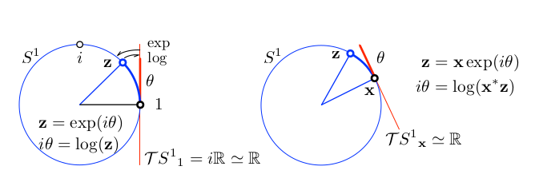

# Lie Algebra

Lie Group is a *smooth manifold* (derivative at every point on this manifold).

## Properties

For $X , Y, Z \in G$

* Closure: 

$X \circ Y \in G$

You can compose elements of the group

* Associativity: 

Parentheses don’t matter

$(X \circ Y) \circ Z = X \circ (Y \circ Z)$

* Identity: 

$EX=XE=X$

There’s a null operator that does nothing

* Inverse: 

$X^{-1}X = XX^{-1} = E$

The action of any element can be reversed

Rotation can be regarded as a Special Orthogonal Group $SO(n)$, which is a Lie Group.

## 2-D Lie Group

$S^1$ manifold is a unit circle (blue) in the plane $\mathbb{C}$

Define a complex number $z \in \mathbb{C}$, where $|z| = 1$, $z = cos θ + i \space sin θ$.

Vectors $\bold{x} = x + i \space y$ rotate in the plane by an angle $θ$, through complex multiplication, $\bold{x}' = \bold{z} \space \bold{x}$.

The unit complex circle is a 1-DoF (Depth of Field, Dimensionality) curve in 2-dimensional space.

