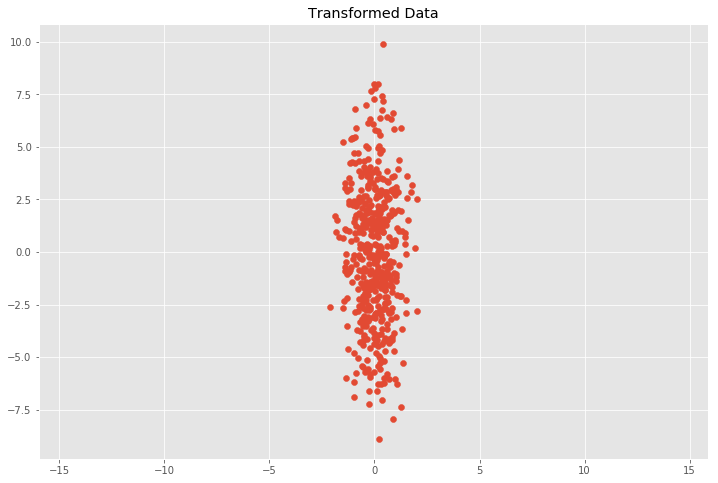
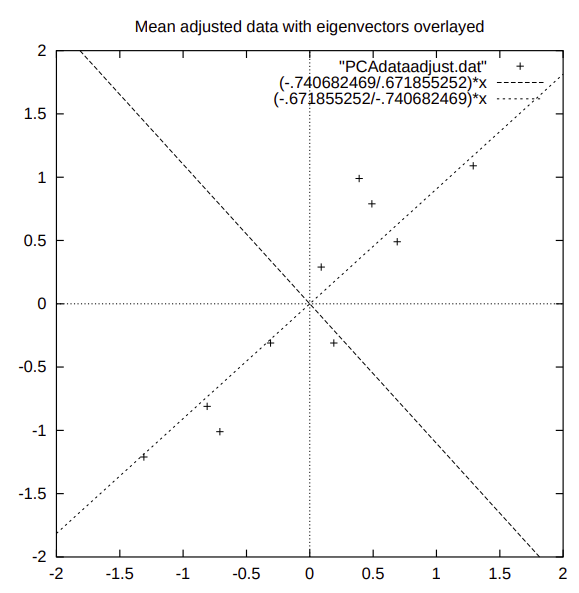

# Some Linear Algebra Concepts

1. Covariance Matrix

Define *&Chi;* = (&Chi;1, &Chi;2, ..., &Chi;n)T, where &Chi;i is a vector representing a feature/axis/dimension. A covariance matrix of *&Chi;* expressed as entries cov(&Chi;i, &Chi;j) with i, j &le; n can formulated as

cov(&Chi;i, &Chi;j) = 	&Epsilon;[(&Chi;i - &Epsilon;(&Chi;i)) (&Chi;j - &Epsilon;(&Chi;j))]

where &Epsilon; denotes the expected/mean value of its arguments.

The image below shows an example of 2-D point distribution with respects to x and y axis of a covariance of 

cov(x, y) = 

0.50558298, -0.09532611

-0.09532611, 10.43067155

that indicates high disparity on y-axis and small on x-axis. THe numbers on thee top-right to bottom-left diagnal says independence between x and y.

2. Eigen Decomposition of the Covariance Matrix

An eigenvector is a vector whose direction remains unchanged when a linear transformation is applied to it. It can be expressed as

Av = &lambda;v

where v is an eigenvector of A and &lambda; is the corresponding eigenvalue.

Put all eigenvectors into the columns of a Matrix V and all eigenvalues as the entries of a diagonal matrix L we can write for our covariance matrix C the following equation

CV = VL

then

C = VLV-1

The eigenvectors are unit vectors representing the direction of the largest variance of the data, while the eigenvalues represent the magnitude of this variance in the corresponding directions. This means V represents a rotation matrix and &radic;L&#x0304; represents a scaling matrix. 

3. Orthogonality

Two vectors, x and y, in an inner product space, V, are orthogonal if their inner product < x,y > is zero.  For matrix, a matrix A is orthogonal means that its transpose is its inverse. So an orthogonal matrix is necessarily invertible.

4. Principle Component Analysis

reference: http://www.cs.otago.ac.nz/cosc453/student_tutorials/principal_components.pdf

Given a set of data points/samples, calculate the covariance matrix, denoted as R. Then, calculate the eigenvectors V and eigenvalues &Lambda; of R. All vectors in V and &Lambda; are normalized to be unitary.

For example:
Given a covariance matrix:

CoV = 

0.616555, 0.615444

0.615444, 0.716555

The derived eigenvectors V are

-0.73517, -0.67787

0.67787, 0.73517

and the derived eigenvalues &Lambda; are

0.049083

1.284027

The visualization of the aforementioned calculations are described below. The two-dimension dataset can deliver a two-dimensioin eigen-space. The two eigenvectors (with extensions) walk across perceptually major directions of the provided dataset. Eigenvalues give information about relative information retention, that data samples with diverse distributions have high eigenvalues.

5. Inverse Matrix Transformation 

Define $A^{-1}A=I$, so that it means $A^{-1}$ transforms $A$ back to Identity Matrix. Given this into consideration, $A^{-1}$ exists only when $det(A)\neq0$, since $det(A)\neq0$ (*full rank*) indicates there is no transformation from higher *rank* to lower *rank*.
