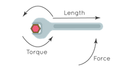

# Vector and matrix

## Determinant

Determinant is a scalar value that is a function of the entries of a square matrix.

Geometrically speaking, determinant is area of the $n \times n$ squared matrix, for example, for a $2 \times 2$ matrix, the area of parallellogram is
$$
|u||v|sin\theta = 
\begin{array}{c}
    \bigg (
    \begin{array}{c}
      -b \\
      a
    \end{array}
    \bigg )
\end{array}
\begin{array}{c}
    \bigg (
    \begin{array}{c}
      c \\
      d
    \end{array}
    \bigg )
\end{array}
=
ad-bc
$$

The following shows the calculation of a $3 \times 3$ matrix's determinant:
$$
\bigg |
\begin{array}{ccc}
    \begin{array}{ccc}
      a & b & c \\
      d & e & f \\
      g & h & i
    \end{array}
\end{array}
\bigg |
=
a
\big |
\begin{array}{cc}
    \begin{array}{cc}
      e & f \\
      h & i 
    \end{array}
\end{array}
\big |
-
d
\big |
\begin{array}{cc}
    \begin{array}{cc}
      b & c \\
      h & i 
    \end{array}
\end{array}
\big |
+
g
\big |
\begin{array}{cc}
    \begin{array}{cc}
      b & c \\
      e & f 
    \end{array}
\end{array}
\big |
$$

further,
$$
\bigg |
\begin{array}{ccc}
    \begin{array}{ccc}
      a & b & c \\
      d & e & f \\
      g & h & i
    \end{array}
\end{array}
\bigg |
=
a(ei-fh)-d(bi-hc)+g(bf-ec)
$$
which give the volume of a parallelotope.

## Adjugate Matrix

Adjugate, adjunct or classical adjoint of a square matrix $Adj(A)$ is the transpose of its cofactor matrix $C$.
$$
Adj(A) = C^T
$$
where 
$$
C = \big( (-1)^{i+j} M_{i,j} \big)_{1\leq i,j \leq n}
$$
where $M_{i,j}$ is the determinant of the $(i,j)$-th element of a square matrix $A$ .

For example, given
$$
A = 
\begin{bmatrix}
      a & b & c \\
      d & e & f \\
      g & h & i
\end{bmatrix}
$$
the $(1,2)$-th element is $b$, whose determinant can be expressed as
$$
M_{1,2} = 
-
\big |
\begin{array}{cc}
    \begin{array}{cc}
      d & f \\
      g & i
    \end{array}
\end{array}
\big |
= -(di-fg)
$$
Co-matirx $C$:
$$
C =
\begin{bmatrix}
      M_{1,1} & M_{1,2} & M_{1,3} \\
      M_{1,2} & M_{2,2} & M_{2,3} \\
      M_{1,3} & M_{3,2} & M_{3,3}
\end{bmatrix}
$$

## Inverse Matrix

A spare matrix $A$ has its inverse when its determiant is not zero.
$$
AA^{-1} - I
$$

and,
$$
A^{-1} = \frac{1}{|A|}Adj(A)
$$
where
$|A|$ is determiant of $A$ and $Adj(A)$ is an adjugate matrix of $A$.

Geometrically speaking, an inverse matrix $A^{-1}$ takes a transformation $A$ back to its origin (same as reseting basis vectors).

## Covariance Matrix

Define *&Chi;* = (&Chi;1, &Chi;2, ..., &Chi;n)T, where &Chi;i is a vector representing a feature/axis/dimension. A covariance matrix of *&Chi;* expressed as entries cov(&Chi;i, &Chi;j) with i, j &le; n can formulated as

cov(&Chi;i, &Chi;j) = 	&Epsilon;[(&Chi;i - &Epsilon;(&Chi;i)) (&Chi;j - &Epsilon;(&Chi;j))]

where &Epsilon; denotes the expected/mean value of its arguments.

The image below shows an example of 2-D point distribution with respects to x and y axis of a covariance of 

cov(x, y) = 

0.50558298, -0.09532611

-0.09532611, 10.43067155

that indicates high disparity on y-axis and small on x-axis. THe numbers on thee top-right to bottom-left diagnal says independence between x and y.

## product: dot, cross and exterior

### dot product: scalar product
$$
u * v = |u| |v| cos\theta 
= v_1u_1 + v_2u_2 + v_3u_3 + ... + v_nu_n
$$

Applications: $u$ represents a 8 lb force applied pulling a wagon with an upward force direction, while $v$ represents 50 ft distance. $u * v$ express the *work* ($W = \overrightarrow{F} * \overrightarrow{D}$) for this effort.

### cross product: vector quantity product
$$
u \times v = |u| |v| \space n \space sin\theta
= \bigg |
\begin{array}{ccc}
    \begin{array}{ccc}
      \overrightarrow{i} & \overrightarrow{j} & \overrightarrow{k} \\
      u_1 & u_2 & u_3 \\
      v_1 & v_2 & v_3
    \end{array}
\end{array}
\bigg |
$$
hence,
$$
u \times v =
\overrightarrow{i}|u_2v_3-u_3v_2| - \overrightarrow{j}|u_1v_3-u_3v1| + \overrightarrow{k}|u_1v_2-u_2v_1|
$$
where $u$ and $v$ are two vectors and $n=(\overrightarrow{i},\overrightarrow{j},\overrightarrow{k})$ is a unit vector (3-dimensional in this example) perpendicular to the plane containing $u$ and $v$. $u \times v$ itself represents the area of a parallelogram.

Applications: Twisting a bolt with a spanner, Torque is cross product of force multiplying length $\overrightarrow{T} = \overrightarrow{F} \times \overrightarrow{L}$, that means the resultant force either pulling up or pushing down the bolt.

### exterior product: wedge product

Wedge/exterior product of vectors is an algebraic construction used in geometry to study areas, volumes, and their higher-dimensional analogues, operator denoted as below:

$$\begin{align*}
u \space ∧ \space v \\
& = (a e_1 + b e_2)∧(c e_1 + d e_2) \\
& = ac (e_1 ∧ e1) + ad (e_1 ∧ e_2) + bc (e_2 ∧ e_1) + bd (e_2 ∧ e_2) \\
& = ad (e_1 ∧ e_2) - bc (e_1 ∧ e_2) \\
& = (ad-bc)(e_1 ∧ e_2)
\end{align*}
$$
where 
$$
e_1=
\begin{array}{c}
    \bigg (
    \begin{array}{c}
      1 \\
      0
    \end{array}
    \bigg )
\end{array}
,
e_2=
\begin{array}{c}
    \bigg (
    \begin{array}{c}
      0 \\
      1
    \end{array}
    \bigg )
\end{array}
$$
that constructs a real Cartesian plane $R^2$.

Geometric definition is observed as in the examples below, indicating the area/volume of multi-dimensional vectors.

