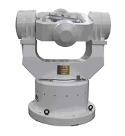

# IMU

An inertial measurement unit (IMU) is an electronic device that measures and reports a body's specific force, angular rate, and sometimes the orientation of the body, using a combination of **accelerometers**, **gyroscopes**, and sometimes magnetometers. 

Typically, it measures rotation $\bold{R}$, translation $\bold{p}$, angular velocity $\bold{\omega}$, linear velocity $\bold{v}$ and acceleration $\bold{a}$ in a 3D space.

## IMU Noise Formulation

* Zero Drift

Zero drift is zero offset stability (the standard deviation of direct measurement), which represents the degree of dispersion of accelerometers/gyroscope output around its zero mean value.

It can be measured by Wiener process.

* Measurement Noises

Readings from IMU has some deviations from its true values.

This can be measured by Gaussian noise.

### Formulations

Between two keyframes $K_i$ and $K_j$, define IMU measurement noises (Gaussian noise) $\bold{\eta}_{ij}$ and zero offset/drift biases (Wiener process) to angular and linear movements $\bold{b}_{ij} = \{ \bold{b}_{a, ij}, \bold{b}_{\omega, ij} \}$.

$$
\begin{align*}
\bold{\eta}_{ij} &= \frac{1}{\Delta t_{ij}} \int^{t_i+\Delta t_{ij}}_{t_i} \bold{n}(\tau) dt
\\
\bold{b}_{ij} &= \bold{b}_{i} + \int^{t_i+\Delta t_{ij}}_{t_i} \bold{n}(t) dt
\end{align*}
$$
where $\bold{n}(\tau)$ is Gaussian noise.
In the time interval $\Delta t_{ij}$, the Gaussian noise $\bold{n}(\tau)$ does not grow proportional to the length of time interval $\Delta t_{ij}$.
The argument $\tau$ means the noise does not relate to $\Delta t$, so that $\int^{t_i+\Delta t_{ij}}_{t_i} \bold{n}(\tau) dt = 0$ as $\Delta t_{ij} \rightarrow +\infty$.
This is different from Wiener process where noises accumulate as time extends $\int^{t_i+\Delta t_{ij}}_{t_i} \bold{n}(t) dt \propto \Delta t_{ij}$.

The covariances of the two types of errors are: 
$E(\bold{\eta}^2_{ij})$ is just the mean of the $\sigma_{\bold{\eta}}^2$ over the time interval $\Delta t_{ij}$;
$E(\bold{b}^2_{ij})$ is the Wiener process covariance scaled by $\sigma_{\bold{b}}^2$.

$$
\begin{align*}
E(\bold{\eta}^2_{ij}) &= \frac{\sigma_{\bold{\eta}}^2}{\Delta t_{ij}}
\\
E(\bold{b}^2_{ij}) &= {\sigma_{\bold{b}}^2}{\Delta t_{ij}}
\end{align*}
$$

## IMU Calibration

IMU calibrated output (for gyroscope as an example) $[W_x \quad W_y \quad W_z]^\top$ can be formulated as
$$
\begin{bmatrix}
    W_x \\
    W_y \\
    W_z
\end{bmatrix}
=
\begin{bmatrix}
    W_{x0} \\
    W_{y0} \\
    W_{z0}
\end{bmatrix}
+
\begin{bmatrix}
    K_{xx} & K_{xy} & K_{xz} \\
    K_{yx} & K_{yy} & K_{yz} \\
    K_{zx} & K_{zy} & K_{zz} \\
\end{bmatrix}
\begin{bmatrix}
    w_x \\
    w_y \\
    w_z
\end{bmatrix}
$$
where $\begin{bmatrix} W_{x0} \\ W_{y0} \\ W_{z0} \end{bmatrix}$ is zero offset, 
$\begin{bmatrix} K_{xx} & K_{xy} & K_{xz} \\ K_{yx} & K_{yy} & K_{yz} \\ K_{zx} & K_{zy} & K_{zz} \\ \end{bmatrix}$ is IMU coefficient matrix,
and $\begin{bmatrix} w_x \\ w_y \\ w_z \end{bmatrix}$ is the initial IMU sensor's reading.

Usually, before starting using an IMU, should calibrate this IMU by recording a number of sensor's readings and formulate a least squares problem, 
by which the zero offset and coefficient matrix can be computed.

Other calibration considerations include adjusting the aforementioned parameters by temperature and atmospheric pressure if ambient conditions change significantly.

### Orthogonal Calibration

There are six orthogonal axes, three for accelerator $a$ and three for gyroscope $g$, respectively.

For orthogonality, when IMU rotates along one axis, only this axis should have outputs, and the other two axes should not have output.
Model the orthogonality rotation error, there are $S_g$ and $S_a$ representing the accelerator and gyroscope errors
$$
S_g = \begin{bmatrix}
    0 & S_{gxy} & S_{gxz} \\
    S_{gyx} & 0 & S_{gyz} \\
    S_{gzx} & S_{gzy} & 0
\end{bmatrix}
\qquad
S_a = \begin{bmatrix}
    0 & S_{axy} & S_{axz} \\
    S_{ayx} & 0 & S_{ayz} \\
    S_{azx} & S_{azy} & 0
\end{bmatrix}
$$
where, for example, $S_{gxy}$ means for gyroscope, given input on $y$-th axis, the error output on the $x$-axis (if ideal, $y$-th output should see no output on the $x$-axis).

The errors on the axis itself such as $S_{gxx}$ are not accounted in orthogonal calibration.
They are labelled as zero offsets/drifts $W_{x0}$.

      

 

To summarize, the acceleration $\begin{bmatrix} A_x & A_y & A_z \end{bmatrix}^{\top}$ and gyroscope $\begin{bmatrix} W_x & W_y & W_z \end{bmatrix}^{\top}$ noise models can be expressed as below.

$$
\begin{align*}
\begin{bmatrix}
    W_x \\
    W_y \\
    W_z
\end{bmatrix}
&=
\begin{bmatrix}
    W_{x0} \\
    W_{y0} \\
    W_{z0}
\end{bmatrix}
+
\begin{bmatrix}
    K_{gxx} & S_{gxy} & S_{gxz} \\
    S_{gyx} & K_{gyy} & S_{gyz} \\
    S_{gzx} & S_{gzy} & K_{gzz}
\end{bmatrix}
\begin{bmatrix}
    w_x \\
    w_y \\
    w_z
\end{bmatrix}
\\
\begin{bmatrix}
    A_x \\
    A_y \\
    A_z
\end{bmatrix}
&=
\begin{bmatrix}
    A_{x0} \\
    A_{y0} \\
    A_{z0}
\end{bmatrix}
+
\begin{bmatrix}
    K_{axx} & S_{axy} & S_{axz} \\
    S_{ayx} & K_{ayy} & S_{ayz} \\
    S_{azx} & S_{azy} & K_{azz}
\end{bmatrix}
\begin{bmatrix}
    a_x \\
    a_y \\
    a_z
\end{bmatrix}
\end{align*}
$$

### Least Squares Solution for the Orthogonal Calibration Problem

Take the gyroscope for example, need to compute $\begin{bmatrix} W_{x0} \\ W_{y0} \\ W_{z0} \end{bmatrix}$
and $\begin{bmatrix} K_{gxx} & S_{gxy} & S_{gxz} \\ S_{gyx} & K_{gyy} & S_{gyz} \\ S_{gzx} & S_{gzy} & K_{gzz} \end{bmatrix}$, a total of $12$ configurable parameters.

First, flat the equations to a vector format:
$$
\underbrace{\begin{bmatrix}
    W_x \\
    W_y \\
    W_z
\end{bmatrix}}_{{W}}
=
\bold{x}_{\omega}
\underbrace{\begin{bmatrix}
    K_{gxx} \\ S_{gxy} \\ S_{gxz} \\
    S_{gyx} \\ K_{gyy} \\ S_{gyz} \\
    S_{gzx} \\ S_{gzy} \\ K_{gzz} \\
    W_{x0} \\
    W_{y0} \\
    W_{z0}
\end{bmatrix}}_{\bold{K}_g}
$$

$\bold{x}_{\omega}$ is 
$$
\bold{x}_{\omega} = \begin{bmatrix}
    {\omega}_x & {\omega}_x & {\omega}_x & 0 & 0 & 0 & 0 & 0 & 0 & 1 & 0 & 0 \\
    0 & 0 & 0 & {\omega}_y & {\omega}_y & {\omega}_y & 0 & 0 & 0 & 0 & 1 & 0 \\
    0 & 0 & 0 & 0 & 0 & 0 & {\omega}_z & {\omega}_z & {\omega}_z & 0 & 0 & 1 \\
\end{bmatrix}
$$

Place the IMU device on a high-precision rotation device such as below.
A typical high-precision calibration machine would give $\pm 0.3\%$ precision to acceleration and gyroscope.

      

 

Record many IMU positions $\bold{x}_{\omega, i}$.
Form the least squares problem:
$$
\begin{align*}
    \bold{W} &= \begin{bmatrix}
        W_1^{\top} & W_2^{\top} & ... & W_n^{\top}
    \end{bmatrix}^{\top}
\\
    \bold{X}_{\omega} &= \begin{bmatrix}
        \bold{x}_{\omega,1}^{\top} & \bold{x}_{\omega,2}^{\top} & ... & \bold{x}_{\omega,n}^{\top}
    \end{bmatrix}^{\top}
\end{align*}
$$

The $\bold{K}_g$ can be solved by
$$
\bold{K}_g = (\bold{X}_{\omega}^{\top} \bold{X}_{\omega})^{-1} \bold{X}_{\omega}^{\top} \bold{W}^{\top}
$$

Similarly, the configuration for acceleration $\bold{K}_a$ can be computed by 
$$
\bold{K}_a = (\bold{X}_{a}^{\top} \bold{X}_{a})^{-1} \bold{X}_{a}^{\top} \bold{A}^{\top}
$$

### Other Considerations

* Earth self rotation: should subtract $15^{\circ}/\text{hour}$
* The Rotation assistance device must placed horizontally to the ground, otherwise, there is earth gravity noise
